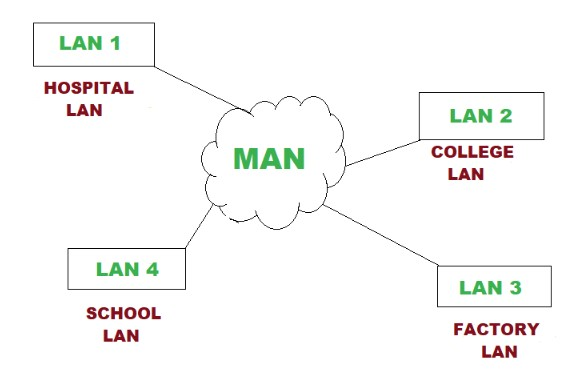
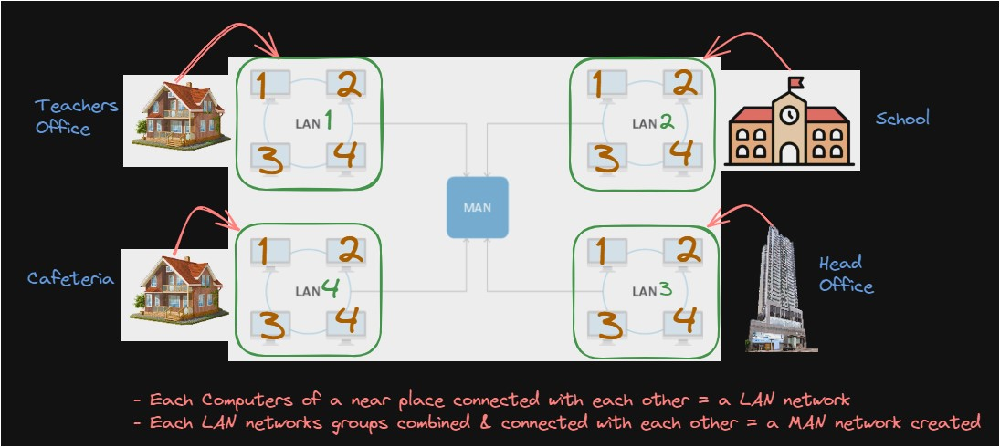
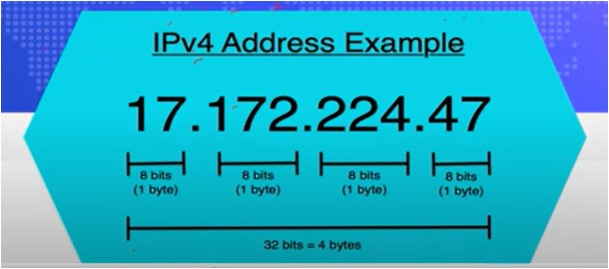

#WsCubeTech-CEH-notes 

---

### What we'll learn
> Lecture Name : Intro to Networking
> 1. Theory : what is network & networking 
> 2. Theory : Responsible factors in networking process 
> 3. Theory : Explanation : responsible factors in networking process 
> 4. Theory : Types of Networks in networking 
> 5. Theory : What is LAN 
> 6. Theory : What is MAN 
> 7. Theory : What is WAN 
> 8. Theory + Practical Work : What is IP Address

---

### What is Network ?
- when 2  or more than 2 systems connected/combined together & communicating with each other then a network will be created aka Network

### What is Networking ?
- when 2 or more than 2 systems start sharing resources like transferring files/data
- means when 2 or more than 2 systems communicating & starts sharing data/files then the process called Networking 

### Responsible factors in networking process ?
1. Communication
2. Sharing Software
3. Sharing File
4. Sharing Info
5. Information Preservation
6. Security
7. Sharing Hardware
8. Sharing Data

### Explanation : responsible factors in networking process ?
1. Communication + Sharing of (software + file + info) :
	- while in communication process , if sharing of (software + file + info + data) happening then it's called networking
	- Eg : b/w 2 systems , they are sharing of (software + file + info + data) each other then called networking
2. Information Preservation :
   - Eg 1 : (Me) System "A" is sending/sharing a PDF to System 'B" (Kate) ,  so Kate will download that PDF & she will save in her "D-Drive".  so preservation means Kate downloaded that PDF & saved in her "D-Drive"
   - Eg 2 : we're interacting in "Zoom" meeting class with sir then there's no preservation going on  & sir is not sharing video recording of the class then this class where it gets preserve  & if it's get preserve then how can i retrieve it. so retrieving related to "forensic stuff" ,  but here we didn't put any physical device to save the video. But Sir is preserving via OBS recording.  so for preservation , we need something. so means whatever things are sharing - those things get preserved
3. Sharing Software :
   - Eg : Zoom to attend these course Classes
4. Security : 
   - while sharing anything from (Me) System "A" to System 'B" (Kate) , security must there  
    cuz if (Me) System "A" sending/sharing a file to System 'B" (Kate) & the attacker/hacker interrupt in b/w while sharing  or that attacker took it or forward something else (like virus via MITM) to System "B" (Kate) 
   - so security of "Networking" v imp , so Security is also a part of Networking
5. Sharing of (Hardware + data)
   - Eg 1 : in Networking , sharing of hardware also involved & which u can touch & see (Eg : keyboard , mouse , SSD , etc.)
   - Eg 2 : u don't have data to use Wi-Fi , so u said to ur friend to turn On the "Hotspot" & u ON ur Wi-Fi  & both are connecting with each other with a frequency  but at the end , both (the Wi-Fi & the hotspot) are hardwares
   - Eg 3 : when u connect earphone with phone - that's also hardware ,  Bluetooth which makes u to connect with other device - that Bluetooth also a inbuilt hardware in ur phone's circuit
   - Eg 4 : via LAN cable , we can connect 2 systems with each other. So via LAN cable , data can be share.  So u can connect to wifi either via LAN cable or wireless connection.  So LAN cable (via which data is sent & received) is also a hardware - which considered as sharing of (hardware + data)

### Types of Networks in networking

> Overview : 
> - just like we learned about types of hackers (acc. to their work) 
> - same with types of networks are divided acc. to their work + range

1. LAN (local area network)
2. MAN (Metropolitan area Network) 
3. WAN (wide area network)

- there are many types of Networks but those are sub-types of these 3  & those are not useful to know cuz u'll feel confusion but these 3 are imp

### What is LAN network ?
- it's a small network 
- Eg : a router (is a medium to connect) is connected with 4-5 devices & these devices are communicating each other like in ur home 
- LAN port & LAN cable are 2 different things
- 2 types of LAN network : wireless LAN network , wired LAN network

### What is MAN network ?
- MAN is greater than LAN - in range wise
- Eg : in MAN , more devices gets connected like 100-200 devices connected each other or connecting with different  LAN networks each other = a MAN network (means combining different LAN networks each other = a MAN network) 
	- Pic 1 :   
	- Pic 2:   
- it has bigger network range than LAN network

### What is WAN network ?
- Eg : each countries are connected with internet i.e WWW ,  so we're able to access google server (which means might be it's server on USA)
- in WAN , unlimited devices can be connected 
- Eg of WAN network : global internet or WWW

### What is IP address ?
- IP - Internet Protocol Address
- it's a unique address
- it is a basic identity used in networking
- importance of it : 
	- let's say u want to send a gift to someone else home then which thing u need i.e address ,  if u don't have the address of that home then u can't send a gift there  same as , each system has it's own unique identity & address 
	- identity - means who is it , address - means पता
	- meaning of address in IP address
		- let's say u want to send a PDF to that system , but globally there are many systems with different addresses ,  even if u try to send then u can't cuz u don't have address of that system - so without the address of that system ,  u can't send that PDF or a packet , so u need a unique address i.e IP address of a system
		- without a IP address , communication can't happen , so everywhere IP address used
	- meaning of identity in IP address 
		- Q : how IP address considered as identity
		- Eg : in ur credit-card , numbers (which are inside the credit card) are not random ,  those each numbers contains ur identities  - if u want to separate each things in small parts in this Earth planet then on what bases u'll divided i.e each parts will be divided as different countries  - if u want to divide each countries into small parts i.e into different states of each country & each state will be divided as cities  - so u can see we're dividing the globe -> counties -> states -> cities
		- let's say ur credit card no. contain `8566 8566 8566 8566` 
			- 1st number - for country (cuz it's using in)
			- 2d number - for state
			- 3rd number - for city + which city branch of bank , Eg : Jasola - is a branch, so in one city , there will be only one Jasola
			- 4th number - for user details or details of account holder
		- so that credit card no. contain the identity , so same with a IP address no.
- understanding a IP address no.
	- IPv4 address = means v (version) & 4 (4th version)
	- earlier we have many version before IPv4 & those are not useful to know &  IPv4 is commonly IP address version used on the internet
	- IPv4 Pic : 
	- in a IP address no. ,  - total 4 pairs after each dot  - range of each pair of a IP address `0 to 255` , not more than 255 ✔
	- each pair can contain single or double or triple digits only , not more than triple digits ✔
	- Eg of IP address no. 
		- 1) https://www.spcdn.org/images/what-is-ip-address.gif
		- 2) https://bytesofgigabytes.com/IMAGES/Networking/ipaddress/IP%20address%20range.PNG
		- 3) https://global.discourse-cdn.com/elastic/original/3X/a/9/a9b72d9a9f50dc5f36c280ac6f271ff3665bb623.png
		- 4) https://global.discourse-cdn.com/elastic/original/3X/1/9/1932036f159cdd29d2724589cb3b6b1370e4edb5.png
	- Eg of wrong IP address no.   - 999.999.999.999 ❌ , cuz it's out of range/limit  - Note : IP address can't be starting with 0 like this 0.012.322.333 ❌ or 012.223.112.10 ❌, but initially or ending 0 can be like this 102.223.12.10 ✔ or 120.223.12.10 ✔
		- Mine searching 
			- Q : Can an IP address start with 0? ✔ Ans : No, an IP address cannot start with 0. An IP address is a series of numbers separated by periods,  and each number must be between 0 and 255. So, the first number in an IP address cannot be 0. cuz we said it must be b/w of them ✔ - we didn't said from 0 to 255
			- Any address that begins with a 0 is invalid (except as a default route). - Any address with a number above 255 in it is invalid.  - Any address that has more than 3 dots is invalid
			- Each number in each pair can range from **0 to 255**. So, the full IP addressing range goes from 0.0.0.0 to 255.255.255.255.
			- Q : is ip address can end with 0 ? Ans : an IP address ending with zero cannot be assigned to a specific device on a network  This is because an IP address ending with zero is reserved for special purposes, such as a default gateway or a network address.  > [Is it possible to have an IP address that ends with zero? - Networking](https://copyprogramming.com/howto/ip-address-ending-with-zero)  > [networking - Why can't IP addresses start with 0 or 255? - Super User](https://superuser.com/questions/665502/why-cant-ip-addresses-start-with-0-or-255)
	- how size works & understanding packets in an IP address ✔
		- in IPv4 , size of each pair is 8bits (1 byte) - means each pair of an IP address taking 8bits storage to hold the data/packet
		- Eg : so let's say System "A" & System "B" communicate each other via IP address  & to send+receive files/data  then without storage data/packets can't be transferred 
		- so that packets required storage capacity to send & receive the data 
		- Q : who is giving storage space to those data/packets ✔ Ans : i.e each pairs of an IP address , so data gets hold inside each pairs of an IP address & then transferred
		- Eg : let's say data's size is 1MB to send from System "A" to System "B" - so firstly 1MB gets broke into bytes  then for one time , only 32bits can be transferred , so 1st 32bits data will get transferred -> 2nd 32bits data will get transferred - so data-packets gets send/receive into chunks/parts within each pairs of an IP address ,  so this process will happen until data gets send/received completely 
    	- but all the packets get send/receive i.e in the form of IP address
	- Total size of a IPv4 address i.e 32bits = 4 bytes
	- meaning of each pair in IPv4 address `imp ⭐`
		- Q : where IP address used national or international  Ans : IP address used globally , so whatever information we want , IP address travel around the globe to get the information that's why it's used internationally 
		- 1st pair from left side : country (depends on which country u're living right now)
		- 2nd pair : contain the state of a country
		- 3rd pair : contain ISP details + city details 
			- Internet Service Provider - eg : JIO , airtel , etc  in phone , that SIM (of a specific company) which u're using i.e ISP  so let's say u're using JIO sim , so 3rd pair contain JIO ISP details
			- City details - means for which city , that IPS providing
		- 4th pair : contain everything about Device ID 
			- means identity of that device
			- in which device that IP address is being used & from where/which location it's being used
			- is that device is windows or macos , is it lapi or desktop , everything will be included 
	- Eg : many cyber criminals are being caught by Police via their IP address if their IP address leaked
		- firstly , investigating team will find out from which country that IP address is ?
		- then they will connect the country with 2nd pair i.e state 
		- then find out the ISP for that IP address via asking from ISP that which person's of that IP address is ?  cuz when u take a SIM of a company then they will ask for identity like aadhaar card ,  so that SIM u'll get is connected with ur aadhaar card - that's why an IP address contain 2 things i.e address + identity ✔
- Q : what u think that via an IP address of a system , that system can be hack or not? `imp ⭐`
	- Ans : if u think that the system can't be hacked via an IP address of that system then u're wrong
	- Practical Example : 
		- STEP 1 : open kali terminal
		- STEP 2 : check how many networks are connected in ur range - `netdiscover` (used to search range of IP addresses)
			- so `netdiscover` command will search the IP range
		- STEP 3 : to check range of ur IP address - `ifconfig`
			- Eg : `eth0 inet 192.168.224.130` - this is our system's IP address  - generally , mostly networks have same till 3 pairs - `192.168.224` but last pair will be different  - & here range of our IP address is `130` ✔
			- once got the Victim IP address then run the scan for checking vulnerabilities
		- STEP 4.0 : running scan on victim's system
			- command `nmap -v -p- -sT 192.168.224.128` & hit enter ✔
			- `nmap` : is a tool  `-v` : for checking stuff in frontend , not backend/background + doing checking manually  `-p-` : for scanning all the ports of that Victim's IP address  `-sT` : for specifying which type of scan u want to run , so we run `-sT`
			- output : we're just getting only Port numbers but we want details with each port numbers
		- STEP 4.1 : add `-sV` , run command `nmap -v -p- -sT 192.168.224.128 -sV -O`
			- `-sV` (capital V) : used to show details like whatever versions & services/softwares are running of each ports  `-O` (captial O) : used to show Operating System ✔
			- output : we'll able to scan all the ports , services of each ports , operating system
		- STEP 5 : now we need to see which port can be hacked easily & quick via small attack  in order to get remote access of victim's device ✔
			- so we got `1524/tcp open bindshell metaspolitable root shell` - which can be hack via nc(netcat) tool
			- run - `nc -v 192.168.224.128 1524`
			- about `nc` :  - so 1524 port will be attacked via small tool i.e netcat  - `-v` : used to show scanning process on terminal so that we can see  otherwise we wouldn't be able to see what stuff is going on background  - `192.168.224.128` : before running `ns` tool , first check whether u're targeting Victim's IP address or not  - `1524` : Now check the attack we're gonna do on which port i.e `1524` ✔
			- output : we hacked the Victim's IP address , now we entered inside the victim's system
			- Now if u do `ls` command then u can see all the files & folders
- Q : can we access files & folders of a website or not ? `imp ⭐`
	- Ans : generally , files & folders of a website can't be accessed by normal user except only admin of that website can access
	- a website made by a developer & that developer kept that complete files & folders of that website on a server
	- so what if we can access those files & folders or what if we get the vulnerability inside that website
	- Practical Example : 
		- STEP 1 : go to google search bar & search `indexof:websitename` 
			- Eg : `indexof:aiims` if a website not able to open then it means that website fixed now ✔
			- Eg : `indexof:facebook` - click first link then u'll see files & folders  means is there any vulnerability in any page of facebook due to which we can see files & folders of facebook ✔
			- `indexof:nameofwebsite` - it's a tiny vulnerability 
		- so seeing files & folders of a website are a vulnerability , but if u search a website only then no files & folders will be shown

### End of the lecture (doubts)
- in next class , we'll see types of IP address & how he choose the IP address while hacking the system via an IP address , these are the things we need to know then only we can do hacking the system via an IP address
- Q : in nmap , what `-sT` means  Ans : [about -sT](https://www.perplexity.ai/search/size-of-the-24nKpjvKQD6dTDAcE2l.uw) 
- Q : what happen if u hack someone else device without telling that person  Ans : timeline (34:54 - 35:59)  Advice : never do a attack if u don't have ur complete control in that attack
- Q : define MAC address  Ans : Hardware/H address OR physical address
- Doubts (mostly only direct solutions) : 
	- Q : timeline 1:16:17 - 1:17:12 - Lecture 4  when u did airplane mode ON , then IP address gets changed but what if i off the airplane mode before searching google.com  & again u ON then IP address will get changed 
		- Q : so the new IP address that we got , so is again a new request will go from this New IP address 
		- Ans : when u do airplane mode off then a packet will go first but with packet + more details also go  which will see in upcoming lectures  so once the packet reach to the google server , then google will see IP address got changed  so No new request will go again from the new IP address ✔  - any packet request will go when u do a request 📃
	- Q : once u learn the kali then u can use Parrot OS too  Kali & Parrot OS are both made on debian os based , so commands will be same but ubuntu  & other OS are different each other mostly & window OS are based on GUI mostly ,  So once u learned the Kali then other OS are easier to use & understand
	- Q : the practical demo u saw about How to hack a system via an IP address is just a tiny example , later on we'll see from scratch
		- if u type `ipconfig /all` command on cmd & on internet - search for my ip address then in both situation - IP address will be different why ?
		- cuz we need to understand types of IP address & we'll also understand why it's like that
	- Q : to become better EH , then u have to practice a lot & revise
	- Q : while doing that practical for hacking a system via an IP address , so here comes that we need to hide our actual IP address ,  so that no one can find us , otherwise our details also get revealed & mac address also contain details
	- Q : Advice : in order understand , u have to clear ur base or make ur fundamentals strong
	- Q : google has it's own server , so same as bank also has their own servers
	- Q : LAN port & LAN network = both are different each other 📃
	- Q : in that practical demo class of hacking a system via IP address that system , so we found the port also , so later on we'll learn about Ports in depth , cuz mostly attacks are depend on ports , also don't need to know every ports 📃
	- Q : why we can't access IP address of google instead of typing name of google ,  this we'll see in upcoming lecture that actually behind the scene , how "google" name gets converted into IP address 
	- Q : in Practical demo of IP address , when we access Port , a port was running a service i.e bindshell  - so shell means terminal & bind means joining/connecting 2 different terminals together ,  but port 443 used for transferring & receiving the data securely , so Port no. 443 will never give access to join with a terminal ,  so when we know working of each PORT then we'll able to hack each port & Port no. 3 is HTTPs with SSL certificate 
	- Q : we'll see about session hijacking
	- Q : in this course , we'll not see the direct way like hacking social media , but u'll get complete understanding of hacking process
	- Q : u can root the phone for kali via termux
	- Q : to explain a topic , first clear the base then tell about the topic to that person
	- Q : whenever u got a doubt , then first give 100% by urself but if u still not able to do after trying 2-3 times then ask ,  cuz due to this 2 things happen :  1) solving doubts gets much better  2) knowledge will increase , but directly going into doubt session & sir will clear ur doubt then u'll learn nothing 📃
	- Q : in practical demo of hacking a system via IP address , so in next class ,  we'll see how to identify is this ur IP address or not & that IP address is not of Victim 📃
	- Q : always make ur own notes instead of using or taking of someone's notes cuz when u write ur own notes  then u'll get doubts in ur mind which is helpful for u & making ur own notes will make ur base strong 📃
	- Q : phishing attack , credit card got hacked ? if u give details of ur credit card on unknown website + give all OTP then ur details  will get taken away & hacking server of a bank is not easy - cuz server of a bank contain different types of firewall  & 99.9% difficult to reach there 📃
		- if u think that bank's server gets slow down then u can enter ? but that's not ,  for eg : when a server of google gets slow down then google redirect it's users on different server 📃
		- but if any issue happen in bank's server then bank shut down it's server until it gets resolve ,  cuz if any hacker know about that server of a bank is in maintenance then the hacker will attack 📃
		- & mostly bank server gets open for updates & while updating a bank's server  then that bank's server gets connected with high speed internet for 2-4min for updating ,  so that much security the bank's servers kept
	- Q : anything possible to hack like bitcoin or mining in blockchain , technology is decentralized which means no body is controlling  but centralized technology eg : facebook - controlling by mark zuckerberg , but in blockchain technology - there's no owner to control it , so it's handled + manage + secure via people who are using them like u ,  but in blockchain - data is not stored in one system - data is divided into multiple devices & to hack  then u have to hack each system but to make a blockchain group , there's a "smart contract" being made  which is same for everyone , so if "smart contract' being hacked then each system gets hacked  & u can hack somebody's blockchain wallet but u have to do RND 📃
	- Q : mining in blockchain - required bunch of best GPU in order to hack a mining & for mining , different OS comes ,  PC for mining will be different than ur normal PC & u can't stop that PC - cuz it should be run continuously for mining
	- Q : importance of VMware , due to it - data can't be harmed cuz system of VMware is different than ur actual system - it's like using 2 different Laptops 📃
	- Q : changing location via IP address of different countries possible via VPNs & proxies & how hackers are able to change the location - it depends on VPN or Proxies cuz like VPN has time limit to change the IP address & location
		- How VPN works , like VPN give u an IP address & ur system has it's own IP address ,  so once ur system generate a packet request then that packet request goes to VPN & VPN will stop ur actual IP address  & VPN will use it's own IP address to send that packet request to the internet or that server  (which contain the resource of that packet request) & whatever reply comes , the VPN will send to ur actual IP address
		- but currently u're think that due to VPN u're secure but VPN which u're using i.e made by a company
		- & now rules are made for company who make VPN & proxies i.e will keep the record of the user  cuz if VPN's IP address goes to the internet & any illegal activities happen then investing will happen
		- & cyber Police will ask from the company that which person was using this IP address of VPN at assume current time is 10:24
	- Q : Advice : nothing is secure on the internet 100% 📃
	- Q : we'll make our on custom proxies not VPN - later on , cuz VPN is not secure but proxy is much secure to change the IP address - which we just saw in 22 📃
	- Q : how to be anonymous ? 
		- so by doing some settings , we can change our IP address & mac address
		- can anybody trace me if we're using VPN & if we're using proxy then nobody can trace ? 
		- but if we're using proxy then still chance that the hacker can trace but we'll see more better things which are not hackable
		- one thing remember that if u're doing any wrong activity then nothing is secure but if u're doing good things then everything is secure
	- Q : if u're learning something then in 2 ways can be used bad or good , but if u don't know whatever action/steps u're  gonna take towards that bad thing & how that action can impactful at what percentage  then don't take a action/steps towards that bad thing 📃
	- Q : never do bad things even if someone give u big chunk of money
	- Q : VPN & proxies are used for security purpose
	- Q : cyber police don't do investing each VPN , they only check if they found a crime
	- Q : u should know ur mistakes & limits , etc due to which u can fail ,  so never do that kindof work or make career in those stuff where u always fail
	- Q : a VPN's companies , give same IP address which u were using at that time
- Mine Doubts : 
    - timeline 47:38 - 1:10:27 Lecture 1 : two practical examples not done yet by myself ⭐
    	- but atleast write the tool & commands for references
    	- Those Steps are not explained in depth in order to implement practical so when u get the SSD then implement to check
    - Q : how to access root folder of Kali   Ans : sudo -i  for More : [open root terminal in kali](https://www.wikihow.com/Open-the-Root-Terminal-in-Kali-Linux)
    - Q : How Does the Internet Work?  Ans : [How Does the Internet Work? - Glad You Asked S1 - YouTube](https://www.youtube.com/watch?v=TNQsmPf24go&ab_channel=Vox)
    - Q : What happens if you don’t put your phone in airplane mode? - Lindsay DeMarchi  Ans : [What happens if you don’t put your phone in airplane mode? - Lindsay DeMarchi - YouTube](https://www.youtube.com/watch?v=iKYHf22qVdM&ab_channel=Vox&ab_channel=TEDEd)

