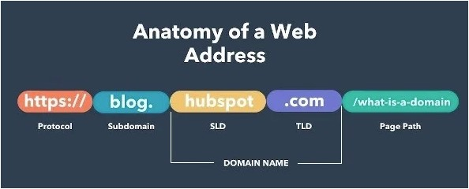
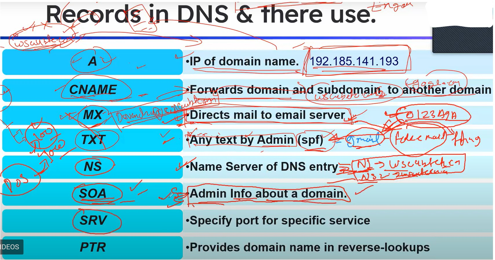
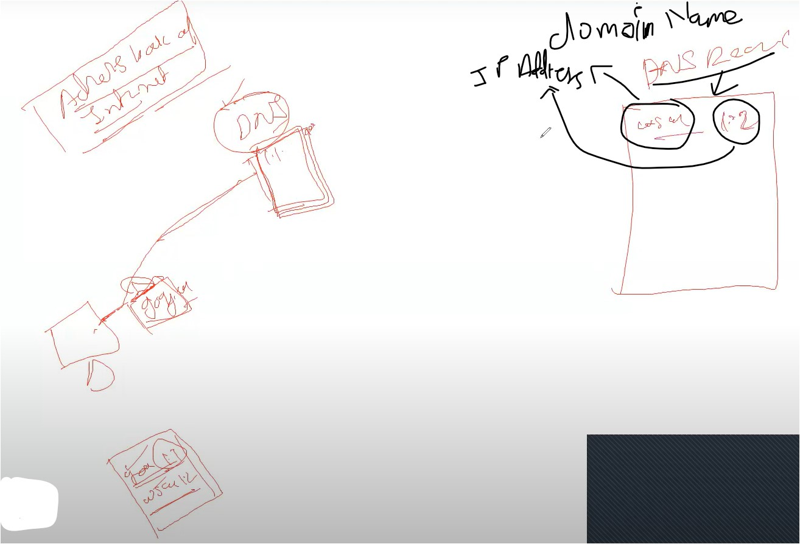
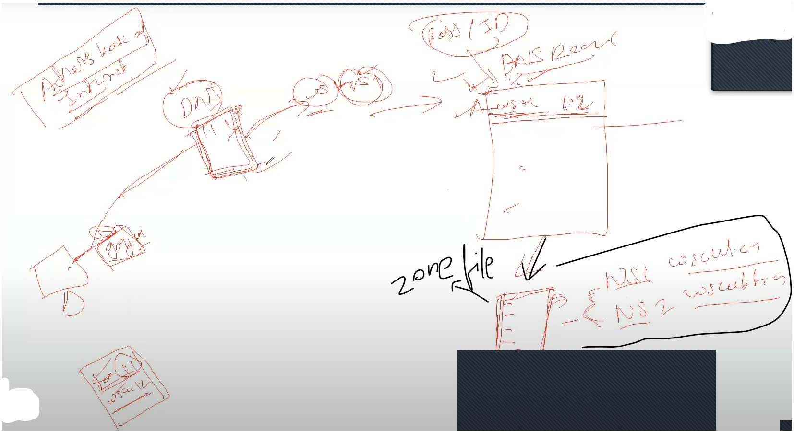
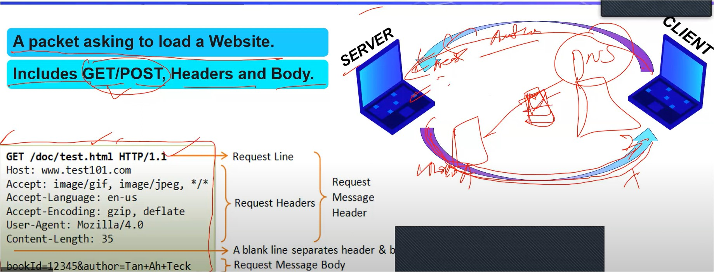

#WsCubeTech-CEH-notes 

---
### What we'll learn 
> Lecture Name : Domain & DNS Record
> 1) Theory : What is a Domain 
> 2) Theory : What is DNS
> 3) Theory : a Domain's Setting page info / DNS records
> 4) Theory : working of Zone file of DNS
> 5) Theory : HTML request - overview : what is request & response (packet)
- we'll see concepts related to ➙ how to change IP address

---
### Overview - anatomy of a web address

---
### What is a Domain
- Importance of having a "Domain" name of a website
	- Situation : of not having a Domain & having a Domain 
		- a developer - made a no. of web pages & due to no. of web pages - a website is created  & he compressed the website & he wants to give access of this website to everyone in this world  so let's say this developer extracted it in one of his friend's system  Q : what're the details of his friend's system  Ans : his friend's system is connected with a router  so details are : an Private IP address , a MAC address & a localhost
		- so his friend's system has a Private IP address  Q: so can u reach on his system - the website (which u created as a developer) - is now extracted by ur friend in his system  Ans : No, u can't reach on his system - cuz his friend's system has a Private IP address
		- so the developer deploy/installed his website on a different system - which has a Public Static IP address ✔ Q : now can u as a developer access that system  Ans : Yes , cuz that system has a Public Static IP address
		- Now that system extracted ur website on it's own storage & the developer got a Public static IP address  let's say 253.231.91.63 ✔ Q : Now u as a normal human being , can u remember this IP address  Ans : No , u can't & even no other person can remember this IP address  - cuz in this world , there are many different websites where u visit
		- So the developer was that on his website , very less people are coming on his website  so he got to know that people not able to remember ur website's Public Static IP address
		- so that developer went to companies like GODADDY , so these companies sell different Domain names  for IP addresses of different websites - like wscube.com : here "wscube.com" is a name  so WsCube Company purchased a Domain name i.e "wscube.com" from GODADDY
			- when that developer purchase this Domain name from GODADDY  then GoDaddy will give 2 things to that developer  1) with that Domain name , he also got a setting dashboard page of that Domain Name  settings like "how to connect that name with the Public Static IP address of a website" , etc..  2) & to login into this setting page , username & password also got
		- Q : Why that developer purchase a domain name ?  Ans : cuz so that he can attach/link that IP address (of his website) with that Domain name  so when anyone search "wscube.com" then that person will went to that IP address ✔
			- Eg : Q : in this world , there are many humans , so in daily life , do u call people by saying them  "u come here human" & some people face matches each other  Ans : No cuz u call them via their own name , so same with each IP address has their own domain name
			- Q : is that setting page of Domain name or that domain name connected with  that website's IP address (which is made by the developer) or not ? Ans : No , so 1st we need to connect  Q : what that developer need to do to connect the domain name with that Private static IP address (of that website)  Ans : so we need to fill the information of setting page - of that domain name which is purchased by that developer  - what info we need to fill - we'll see
			- Eg : in aadhar card , nobody can't remember aadhar card no. but that aadhar card contain ur name also  so name can be remember & ur aadhar card no. is linked with ur name , in portal - when u fill the aadhar card no.  then that name will come OR in portal, if u search the aadhar no. via ur name - then in portal it'll come  & only u can access (cuz u're a authorized person of ur aadhar card)
			- means we need to fill that setting page of that domain name in order to connect  the domain name with that Public Static IP address of the website ✔
- What is Domain name ?
	- is a name of an IP address
	- Easy to remember it  Q : Why a Domain Name gave to an IP address ?  Ans : so that anyone can access that website via it's name - cuz name is easier to remember  but people can't remember the IP address of that website
	-  Eg : google.com , facebook.com , etc

### What is DNS ?
1. it's a Domain Name System
2. Address book of internet
3. Translate a Domain to IP address  means : due to DNS , an IP address gets converted into a Domain name ✔
4. Store all data in form of records in Zone file

### A Domain's Setting Page info / DNS records
- Once the setting page info completely filled of that domain name , only then that IP address can connect  with the Domain name i.e wscube.com ⇋ 192.185.141.193
- Understanding : Domain's name setting page info (Records in DNS & there use)
	- domain's setting page info  
	- `A` record : means just give IP address to connect with a domain name
	- `CNAME` record : means sometimes what happen that if "wscube.com" domain has maintenance ON  & if clients come on it - then they should see that site is close or off  that's why the owner of the website forward his own clients to a other domain or sub-domain  so that clients time didn't get wasted & they can see other things - so this Process called "forwarding" ✔
		- so in CNAME , we'll give that domain or subdomain of a website where we want to forward clients
		- Eg : lets say u want to forward "wscube.com" to it's other domain or subdomain  like - let's say subdomain `2.wscube.com`
		- so if someone go to `wscube.com` then those clients will get forward to "2.wscube.com" subdomain
	- `MX` record  : eg - when a email comes from a bank then how that email looks like for u
		- Eg : email address from bank will be like `support@sbi.com` or `support@sbi.in`
		- & our normal email looks like `abc123@gmail.com`
		- Q : how SBI bank got this sbi.in or sbi.com  Ans : cuz whenever we'll purchase a domain name then with it , we'll get emailing facilities  not gmail facilities ✔
		- so this sbi.com or sbi.in - SBI got these from SBI domain name server  cuz emailing facilities also we'll get
		- this emailing facilities : for to tell that u're the actual/real person from wscubetech who is email to that person ✔
		- Eg : `devendra@wscube.com` - so this comes from mail server of that domain name or domain name extension  so if a person mail from "wscube.com" then this person will be considered as verified ✔
	- `TXT` record  : means any text - admin can write like comment , etc  but mostly owner/admin of that website won't do this , they write on their website what they do like  Eg : wscube - provide courses , etc. - so wscube admin will write everything about courses - so that website get ranking in SEO ✔
		- so these information will be visible to user/clients
		- Q : what is SPF record ?  Ans : u're sending a mail to someone , but a fake mail can be created of that real mail  Eg : what if i make ur fake aadhar card then how u'll verify - by using ur fingerprint - so that fingerprint is ur identity ✔ - so when someone get mail from a domain name , then a fingerprinting also get in text form - like 0123A9A  - so if any person do a fake mail then that fingerprinting will be match for checking  in order to identify whether that mail is fake or valid mail ✔ - & fingerprinting identity comes with every mail whether it's a gmail or mail of domain name - u can't see that fingerprinting's text identity of each gmail-id cuz verifying gmail-id done by google  but we can verify of mail of domain name we got ✔
	- `NS` record  : means name server
		- **Name-Servers form part of an online database known as the Domain Name System (DNS)**
		- Eg : when u make a website , then 2 name servers we'll get or maximum we need to keep 2 NameServers ✔ 1) NS1 - wscubetech.com  2) NS2 - wscubetech.com
		- Q : what's the usecase of NameServers ? ✔ Ans : in DOS attack , let's a website can handle 100 requests/traffic at a time  but DOS attack sends 1000 requests then that website will get down  so to protect from this attack , Name servers are created 
		- Q : How Name servers protect the server of a website from DOS attack ?  ✔ Ans : when a DOS Attack happen , then server got to know that one of the Name server  is getting more than 100 requests then the server will split all those requests  - so some requests will go to NS1 & some will go to NS2  - so due to this , that overall requests will be divided into 2 parts  & this way , very less impact will come to our website
	- `SOA` record : in a website , if u're seeing a issue or something missing , etc then how u'll connect from owner of this website
		- so in a website , "contact us" support form created - which u need to fill as a user
		- so all those contact numbers , address , etc details will be filled inside `SOA` record
	- `SRV` record : it contains all the details about which port is running on which services
		- like port no. 80 - running on http , 25 port no. - on SMTP , 21 port no. - FTP
		- & this is dangerous , if someone knows about which services on which port no. running  then that attacker can easily exploit the system/network ✔
	- `PTR` record : means pointer
		- what is pointer ?  Ans : means pointing towards a thing  eg : u made that mistake then devendra sir will point a finger towards u
		- Q : why PTR record ? importance of it ?  Ans : white hat hacker & hackers do scanning on a website , then real name or real domain name of a website  don't go to hackers or white hat hacker , so to save from this problem - a different domain name given  - Eg : let's a hacker wants to scan wscubetech , so we'll write "google.com" - so when a hacker do scanning  then the hacker will get google.com , not wscubetech domain name & due to this , the hacker will get confused  & whatever the intention of the hacker is will be stopped & on that moment - hacker will stop the scanning ✔
		- so in this situation , PTR record used ✔

### Working of Zone file of DNS 
- let's say "System A" search for a "google.com" , so when "System A" did a search for it then a packet is created 
	- & firstly that packet request will go to the DNS
	- so Q : what was the DNS ?  Ans : along with DNS , it is a address book of internet 
	- so now Q : why DNS called as a address book of internet  Ans : cuz it contains all the IP addresses & Domain Names of all the websites in this world are inside this DNS  Eg : google.com= domain name & 8.8.8.8 = IP address of google website  so both domain names & IP address of each websites in this world are inside this DNS ✔
	- so that packet request (of that system) will go to the DNS 
	- Q : now what DNS gonna do ?  Ans : DNS will check what's the IP address of google.com  Q : where will DNS go to check IP address of google.com ?  Ans : Now let's say , 1st time u create a website i.e "wscube" &  in DNS record - both (that IP address & the domain name of the website) is mentioned 
	- then "How DNS able to know - that IP address is of that website ? ✔  Q : can DNS directly access that website ?  Ans : No , cuz when u purchase that "wscube.com" domain name then we also got username & password  in order to access DNS record after login ✔ - if the DNS directly able to access that DNS record of that domain name then this is v big vulnerability  - & if the DNS have our username & password (of DNS record) then again v big vulnerability  cuz what if DNS got hacked then in the word - then each websites become vulnerable & will be hack✔
	- So DNS directly can't access that DNS record of a domain name  So DNS will send the request to the setting page or Name servers of that website  so DNS ask in the request i.e "can i access ur website" or "what ur website's IP address to access" , etc ✔
	- so DNS directly can't send the request to access the website cuz ✔ 1) neither DNS have login credentials of DNS record of that website  2) nor it has authority to access the DNS record , cuz only admin have login authority to access DNS records
	- so whatever information filled inside the DNS record of the website , after time gap all these records will be saved in a file aka Zone file ✔
	- Q : where this Zone file exist , who has this file ? ✔ Ans : so this file stored inside name servers of the website i.e NS1 = wscubetech.com & NS2 = wscubetech.com  so anyone out of these 2 name servers have that zone file  
	- so DNS will send the request to these name servers & any one out of these 2 name servers - have the zone file  then that "name server" will give access of it to the DNS & DNS will save the IP address of that website ✔
		- & DNS will request again & again to these name servers whenever DNS wants to access IP address of the website  cuz DNS don't have authority to access the website - that's why DNS will ask again & again  from name servers of the website for IP address in order to access it ✔
		- But let's say DNS asking a permission to access those things which are not allowed/unauthorized to access  eg : admin page then those "name servers" will not give the access of it to the DNS ✔
	- so once the DNS got the Zone file , then in reply we'll get  both (IP address + Domain name of that website) via which we can access/visit the website
	- so this is the complete working of DNS 
	- `Note ✅` : Q : how much time the Zone file will take to update when any info gets updated in DNS record by admin ?  Ans : let's say for hosting the website , atleast 3-5hrs will take zone file to update  so each info field in DNS-record setting will take time to update in zone file  - Eg : in DNS-record setting page , u changed the IP-address - then in zone file , the previous IP-address will get updated into  that new IP-address (which will take 3-5hrs time to update) , so with other fields of DNS-record setting page
	- there's a attack i.e DNS Zone transfer attack : means if u transfer that zone file then website might get hack

### HTML request - what is request & response
- Now we'll see what's inside that packet which is transfer to the DNS 
- that packet request known as request HTML packet ✔
- Q : what is request means ?  Ans : Eg : devendar sir asking for a pen , so it's all depends on whether u'll give or not  if u have a pen then u'll give otherwise u'll say u don't have it
- HTML request Pic  
- currently , u have to learn that what is request & response
	- 1st : client will request to the server to access the website ✔ 2nd : whether to give permission to access the website or not - this reply will be given by server to client
	- so the reply that the server is giving called response ✔
	- Eg : u want to access wscubetech & get the access of admin page  so a request packet will go from client but the sever will response in form of not allowing to access ✔
- now that packet details contain those information which is `GET /doc/text.html HTTP/1.1`  so understanding this packet we'll see in next lecture - currently just understand what's request & response
### End of the lecture (doubts)
- timeline 30:40 - 30-50 : without SSL - a website is not secure
- difference b/w forwarding vs redirecting  Ans :  > https://www.perplexity.ai/search/is-redirecting-or-pSK7KvhCQAiH8gaf1ISr1Q  > https://stackoverflow.com/questions/8646650/difference-between-forwarding-and-redirection ✔ > https://stackoverflow.com/questions/6068891/difference-between-jsp-forward-and-redirect
- Q : about DNS :  > https://blog.bytebytego.com/p/why-the-internet-is-both-robust-and  > https://www.perplexity.ai/search/what-is-DNS-IjDM0PvKRBWqhUwji9b3SQ ✔
- Q 1 : what is DNS means in cyber security . explain in short bullet points to 10yr old kid with a real life example  Q 2 : in kali OS , 8.8.8.8 created by nslookup tool  question 1 : is this IP address a DNS server or what's it  question 2 : if it's a DNS server then what's the difference between DNS & IP address  explain each question with bullet points to 10yr old kid with real life examples  Ans : https://www.perplexity.ai/search/what-is-DNS-LC_aBtPcQR.dZj_6Q6X0NQ ✔
- Q : what information are inside the zon-file DNS of a website ✔ Ans : https://ns1.com/resources/dns-zones-explained
- 1) about domain
	- domain is made in less letter to make it small 
	- & domain doesn't contain special characters & it's not made case sensitive  that's why in any way we want to search that website - we can
	- but domain name is made in that way so that it can be easily searchable
- 2) how pages are inside the IP address
	- this is not thing we need to understand , we just have to understand  how working is happening , how request , response is working
	- cuz if we go into too deep inside the website then we'll become programmer 
	- & mostly we scan websites in penetration testing field - so in this field we go in deep & details  in this course , we don't need to go in deep - cuz this is ethical hacking , not specific field 
- 3) How IP address is linked with pages of a website ?
	- Ans : a developer deploy/put on a server (which has Public static IP address)  & this IP Address gets connected a domain name
	- so actually that website are inside the server , we just access the website via it's IP address ✔
	- those pages of the website are not inside the IP address , we just access the website ✔ 
	- Eg : is home build on the address or that address is of that home , so that address of that home 
	- so that server is a home & IP address is a address ✔ 
- 4) can IP address of domain name change or not ?
	- eg : wscubetech's server is on AWS amazon & the ip is 4.4.4.4  so amazon is charges too much
	- so wscubetech moved on let's say microsoft server i.e azure  so wscubetech will get 2.2.2.2 IP from microsoft's server ✔
	- here the Public static IP address remain same of these servers but when wscubetech  change from a server to another server then wscubetech got a different IP address ✔
	- so wscubetech's team will go in domain's record setting , so in `A` record : put that 2.2.2.2 IP address  so this IP will get connect with wscubetech domain , 
	- but server's Public Static IP address will not change ,  but if u change the server then u'll get the new IP address from that server ✔
	- Eg : u currently live in parthapnagar but u moved to different place  but here parthapnagar will not change , parthapnagar will stay on it's place even if u change ur location  & if someone come in that parthapnagar then that person will purchase that home  so that home becomes of that person ✔
- 5) if website has a malware then website will get corrupt
- 6) advice : doing practical only possible when ur concepts are cleared  so devendra sir said , after information gathering , we'll start practicals  but before this , clear ur basics properly
- 7) with a domain name , hosting also needs to be purchase 
	- cuz a developer kept his website on his own system
	- but a developer can't by server (whose Public static IP address) cuz servers are very expensive  so that's why that developer purchase a hoisting for a server ✔
	- hoisting - means put that complete website on the server  means the zip file of a website deploy inside the server ✔
