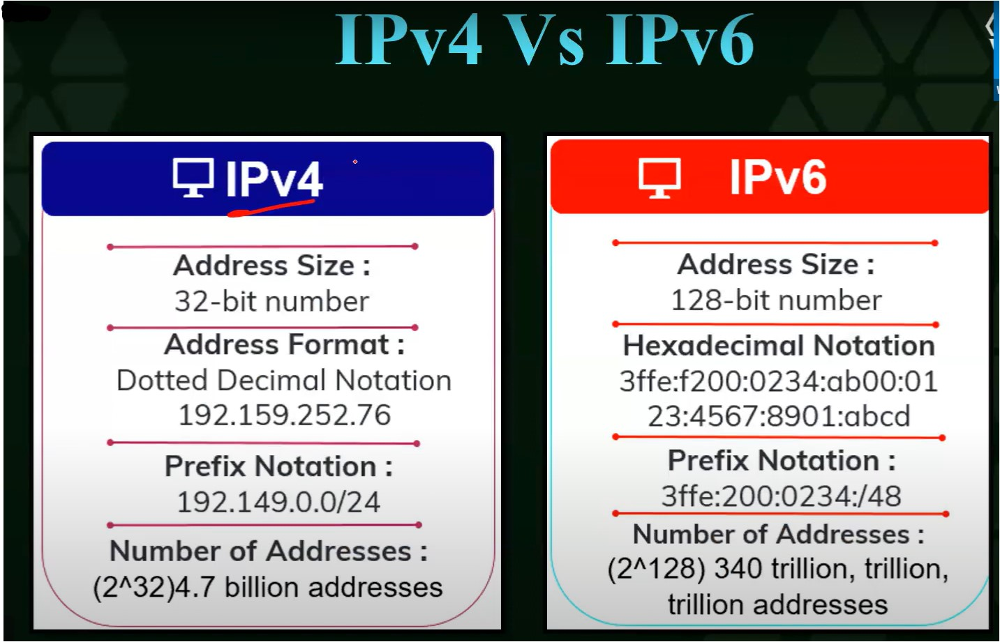

#WsCubeTech-CEH-notes 

---
### What we'll learn 
> Lecture Name : Type Of Networks
> 1. What is MAC address
> 2. versions of IP address : IPv4 VS IPv6
> 3. Types of IP address + why types of IP address invented + rules for only private vs public IP
> 4. all about MAC Address

---

### What is MAC address
- Importance of MAC address
	- for network address , we use IP address but with only using network address , communication can't happen , cuz in our system - attach with many things which should contain address of those things like wifi adapter
	- let's say what if someone connect ur "wifi adapter" with a network for crime & illegal things , then there's no identity left cuz "wifi adapter" is a hardware
	- that's why it's very imp , so MAC address is for every hardware devices  ✔
	- Eg : wifi router has it's own unique MAC address , but in network address -  IP address used cuz in network - communication happens via frequencies ✔
	- More Eg : bluetooth , etc
- About MAC address
	- MAC address aka hardware address
	- it's a unique address for every hardware devices like "wifi adapter"
	- this address can't change cuz it's for hardware devices - to identify particular hardware device , so if u want to change the MAC address of that hardware device permanently then u have to open that hardware device & do it manually ✔
		- but in Ethical Hacking , we'll change the MAC address of a hardware device - not completely permanent but kindof ✔
		- this we'll see in "anonymous" lecture
	- so a hardware has it's own address i.e a MAC address ✔

### versions of IP address : IPv4 VS IPv6
- difference b/w IPv4 VS IPv6  
- in pic , `v` means version , what version of that IP address ,  - so `v4` - 4th version of IP address & same with IPv6 ,  - & we'll not learn about older versions of IP cuz those are not in use in modern world , so no need to do scanning on them
- IPv4 - mostly used & IPv6 - currently not in use globally for a common user ,  - so currently IPv6 is in testing phase (for to check whether it's working fine or not)
- Explanation : difference b/w them ✅
	- Address size : IPv6 has more storage to send & receive heavy data than IPv4
	- Address format : 
		- in IPv4 , using dot to write/show a IPv4 address known as Dotted Decimal Notation  in IPv6 , using semi-colon/double quotes to show a IPv6 address known as hexadecimal notation
		- in IPv4 , total pairs are 4 only & in IPv6 - total 8 pairs 
		- so in IPv6 , first total 4 pairs are same as IPv4 acc. to information wise  but last total 4 pairs contains more information about a Device ✔
	- Prefix Notation : 
		- in IPv4 , let's say ur one of the router giving maximum limit for IP addresses  for connecting `24` devices  & u want to scan 24 IP addresses of each 24 devices  then we have 2 ways : 
			- 1) either scan all those 24 IP addresses manually one by one 
			- 2) using Kali's inbuilt tool , so let's say starting IP address is `192.149.0.0` ,  so if that router support maximum 24 devices then `192.149.0.0/24`  so let's say we're scanning 24 IP addresses , so due to this way - we can scan all 24 IP addresses quickly ✔
			- `192.149.0.0/24` : means we specify starting IP address & `/24` total IP addresses we're assigning to scan them
		- same in IPv6
	- Number of addresses : 
		- importance of why IPv6 came if we have IPv4) ✅
			- currently internet users are more than around 5 Billions ,  so via IPv4 address - only maximum IP addresses can be created 4.7 billion IP addresses around the globe 
			- so IPv4 only contain upto 4.7 billions IP addresses , so what if we give 4.7 billion IP addresses  to each internet users - then is it possible that each users can use internet properly ?   Ans : no can't possible cuz population rising & growing everyday & day by day internet users are increasing ✔
			- that's why IPv6 came , so IPv6 have total 340 trillion, trillion, trillion IP addresses
			- so more IP addresses can be created via IPv6 than via IPv4 
		- How is it possible to make 340 trillion, trillion, trillion IP addresses via IPv6 instead of via IPv4 ? ✅
			- cuz in IPv4 , IP addresses are created by only numbers  but in IPv6 , IP addresses are created by numbers & alphabets
		- how in IPv6 , IP addresses are created ✅
			-  IP addresses are created via taking numbers from `0 - 9`  & alphabets from `A - F OR a - f` 
			- so these are 2 ranges due to which IP addresses are created in IPv6
	- in that above Pic of IPv6 is wrong , actually IPv6 
		- looks like this  
		- so IPv6 , in one of the pair out of 5 - will contain double colon & rest pairs  will have single colon 
		- The IPv6 addressing architecture allows you use the two-colon (::) notation  to **represent contiguous 16-bit fields of zeros**
		- for more :  > [What is IPv6: Important Features and Uses](https://www.spiceworks.com/tech/networking/articles/what-is-ipv6/)  > [IPv6 Address Representation | NetworkAcademy.io](https://www.networkacademy.io/ccna/ipv6/ipv6-address-representation)
### Types of IP address + why types of IP address invented + rules for only private vs public IP
- Types of IP address
	1. Public
	2. private
	3. static
	4. dynamic
- explanation of each types of IP address
	- 1) Public IP vs Private IP ✅
		- Private IP :  - use in LAN network (where only 4-5 devices are connected) ✔ - Private IP is like a nick name of a person , means only close persons or family members call him  via his nick name but when that person goes outside then nobody knows his nick name ,  so same as with Private IP address , this IP address doesn't go outside  & nobody knows about a private IP address
		- Public IP :  - use in WAN network ✔, Eg : connected public IP addresses with internet  - Eg : public IP are real names like ur name in aadhar card , ur real name used in govt. documents , etc
	- 2) static vs dynamic IP ✅
		- static IP : it means fix - means never change or non-changeable IP address  dynamic IP : means changeable IP address
		- why static & dynamic IP address introduced : 
			- cuz IPv4 address not able to fulfill the demand of no. of internet users  cuz only maximum 4.7 billion IP address can be created & if each IP address (out of 4.7billion) give to each people  then till IPv4 not able to fulfill the demand for each no. of internet users
			- that's why static & dynamic IP address introduced
			- so static & dynamic IP address provide ways to utilize different IP addresses of IPv4
		- in Dynamic IP address 
			- let's say a phone/lapi is off right now or that phone is currently not using the internet  or router is off right now then the IP address which was given to that phone (when it was online)  will be given to the other device , cuz if that IP address will get wasted cuz that phone was in offline mode  so utilize that IP address , it'll get transferred to the other device which is online
				- so that IP address will get transferred/given to that user who need or just came online
				- how data stored of dynamic IP address : so let's say - `9am - 10am` that device had that IP address  & at `10:11pm` , that IP address is being transferred , so this much of details - IP address kept ✔
				- so here , Dynamic IP address utilizing the 4.7 IP address of IPv4
			- Dynamic IP addresses used by normal/local internet user like u ✔
		- in static IP address
			- who need static IP address ? Ans : those who wants fix IP address
			- Eg : google need static IP address cuz let's say google has dynamic address then today u're searching it   but what if google using dynamic IP address then next day u have too look up for it's new IP address  & in long term , u'll not able to search at google servers
			- Eg of static IP address : big brands like ecommerce , clothes , etc - they need a static IP address  so all the servers that we search like YouTube , etc - all they use fix IP address
			- Static IP addresses used by bigger companies like google servers that we search for every day
		- Eg : understanding Dynamic IP vs Static IP addresses ✅
			- 1st Situation : school's address is changing but 4 friends addresses is fixed
				- let's say a School address is "Sector A" & we have 4 friends/Systems i.e teen , Aditya , kate , tom  
				- & all these 3 friends goes to same school (which has address i.e Sector A) but what if in next day ,  the school address changed into "Sector B" & event next day becomes "Section C"
				- Ques : are those friends able to reach school easily ? No , cuz school's address is not fixed  but school is one of the place which as same fixed address 
			- 2nd situation : school's address is fixed but 4 friends addresses are changing
				- out of 4 friends , what if anyone's house address gets changed then is there any issue will come ? 
				- No , cuz at the end all those 4 friends will meet at school only , then no bothering issue will come  even if someone's address gets changed or remain fixed
			- so the school address should be fixed always & address of those 4 friends remain fixed or address gets change doesn't matter
			- so here school = static IP address & those students = dynamic IP address
	- 3) Examples of Static vs Dynamic IP address ✅
		- Eg of static IP address : server of a company (like google)
		- Practical Eg of Dynamic IP address : 
			- STEP 1 : don't use router network , on ur SIM internet data & in browser & search `whatsmyipv4` & enter
			- STEP 2 : click on first URL of a website & just focus on only IPv4
			- STEP 3 : remember - ur IPv4 address when u were online will be different  & Now keep ur phone in "airplane mode" & again off the "airplane mode" & connect with SIM data net  reload that website & again check ur IPv4 address will be different ✔
			- so this is our dynamic IP address
		- Practical Eg of static IP address 
			- when u follow the STEPS as above then IP address of router will not change cuz it's static IP address
- Rules in Types of IP addresses
	- so Rule is for only Public & private IP address , this rule is not for static & dynamic IP address  & why no rule for static & dynamic IP address - u'll understand later on
	- Rule for Public & Private IP address `imp ⭐`
		- Public IP address = never talk to Private IP address & same as vice versa  this rule is v imp to remember
		- Private IP address has different range cuz it's used in LAN network &  Public IP address has different range than Private IP , cuz Public IP used in WAN network ✔  so range of Public IP address has bigger & Private IP has smaller

### MAC address
- MAC : Media Access Control Address
- Rules of MAC address - means a MAC address made of combination i.e `0 - 9` & `A - F (only capital alphabets)` ✔
- understanding MAC address 
	- Pict of MAC address    
	- in a MAC address , total 6 pairs ✔
		- first 3 starting pairs is organizational Unique Identifier  & last 3 pairs is Network Interface Controller
		- 1st pair : country - in which country , for which hardware that MAC address given for  2nd Pair : state - which state of that country 
		- 3rd pair : Vendor details + city details (vendor means which country made & supply products)  - here ISP will come cuz it's MAC  Eg : if any crime happen via ur wifi which is made by "mercusys" then MAC address of this company router will go to Cyber Police
		- last all 3 pairs : contain only Device information/ID + little bit of billing info  (not that bill which u buy but the price which company bring into market)- same as IPv6
	- Ques : Eg in this Pic , is the MAC address correct or not ?  Ans : no , cuz combination is `0 - 9` & `A-F (only capital alphabets)` should be used to make a MAC address ✔
- How to check MAC address
	- winOS : cmd = getmac
	- linux & MacOS : Terminal = ifconfig
	- output :  
	- why have different MAC addresses , cuz our System have motherboard + bluetooth + etc - so all of these are MAC addresses ✔
	- Practical Eg : of getting details of an MAC address
		- STEP 1 : take out one of the MAC address , let's say we took `D0-39-5A-13-08`
		- STEP 2 : in browser , go to [MAC vendor + Address Lookup](https://maclookup.app/) & paste that MAC address ✔  u use alternative websites to see details of this MAC address , we're using this one  cuz it gives more details about the MAC address
		- STEP 3 : output : u'll get details like this  
		- here u can see first 3 starting pairs of that MAC Address shown as `OUI` & other details which contain by those first 3 pairs  like location , vendor name , address , assignment type & initial registration

### End of the lecture (Doubts) : 
- More about Public vs Private IP : [Public vs Private IP Address - PowerCertAnimatedVideos YT](https://www.youtube.com/watch?v=po8ZFG0Xc4Q&ab_channel=PowerCertAnimatedVideos) ✔
- Q : how to identify which IPv6 format correct & which one is wrong  Ans : [parameters to identify which IPv6 correct & which is not](https://www.perplexity.ai/search/examples-of-IPv6-LBMiUVz6QKOshCVRaCIYow) ✔ OR [Ans 2](https://www.perplexity.ai/search/parameters-to-identify-p8kS_P_nQU26L.6h87TeUg)
- 0) my doubt : in `whatsmyipv4` website ✔
	- but my IPv4 address is not changing when i try to do via connecting with router & disconnecting+connecting with router  even after offing the router & on the router again
	- but when i try to do it via SIM data network then it's working  that IP was Public Dynamic IP address ✔
	- Ques : why is it like that , is my ISP provided static IP address is it so ?  Ans : No , it's the Private IP address but it's dynamic
	- How Dynamic & why it's not changing when u did with the router  Ans : cuz in router situation , the private IP address of that system will change only when a new system gets connected with ur router  & when u connect again then u'll see a different IP address  but generally the private IP will not change cuz the router kept a large range of Private IP addresses 
- 1) Can we change the MAC address ?  yes , we'll change it for keep ourself anonymous but it's upcoming topic  we can't change MAC address permanent but we'll hide/change kindof like permanent
- 2) about Port & Port no. 80 , we'll understand in later stage of concepts  that Demo practical on "hack the system via it's IP address" - just shown for motivation to learn more
- 3) mostly hacking happens on wireless devices , not on wired devices  & hacking wired network are easier , so that's why we'll learn about wireless network ✔
- 4) don't see & learn out the course otherwise u'll get confuse , so do revision what u have learned yet
