#WsCubeTech-CEH-notes 

---
### What we'll learn 
- we'll connect all those knowledge what we have learned yet 
> Lecture Name : how internet works
> 1. Theory : How Internet Works  
> 	1.1) public vs private IP address & LAN vs WAN & localhost  
> 	1.2) source & destination  
> 	1.3) ways to give/assign IP address to give to the system & features of router i.e DHCP vs ARP
> 2. Theory : Example : how Internet works

---
### how internet works ?
- Q : who give us internet ?  Ans : ISP (Eg : jio)
- so when jio or any other ISP launch then they know that many internet gonna connect with us to use our internet
	- so they buy a range of IP addresses for Eg : let's say `Jio` 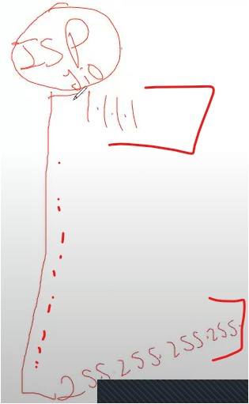
	- this is just an example but those ISP companies take a v large range of IP addresses  Q : now tell are these IP address Private or Public IP address (bought by ISP companies for their network users) ✔ Hint : when a ISP provide internet to u then where u connect that internet ? Ans : WWW  Ans : in WWW , which IP address is used - mean in WAN - i.e public IP address
	- so those are Public IP addresses which are bought by IPS like Jio ✔  so the IP address which is allotted via ISP - that IP address is public IP ✔
	- then u purchase a "router" , let's say a "Jio router"  & now our ISP - given one IP address to each internet users from that range (which they bought) for the router ✔  Eg : let's say , Jio ISP gave an `205.120.234.20` IP address to the Jio router  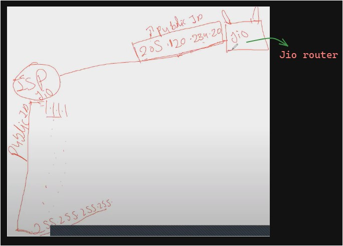
	- & this is a Public IP address which is given to ur Jio router ✔  Now at our home , a broadband installed (broadband means internet)
	- Conclusion : now our Jio ISP gave a Public IP address to ur router & now broadband is installed  Q : what u do after once broadband setup completely at ur home ?  (just skip the process of password) - just tell directly what would u do  Ans : u simply directly connect with different devices with the router 
	- so we'll also directly connect different devices with the router like phone , PC , lapi  now tell me that router also a device - means router also gonna talk with those different devices (which u connected) ✔ like this   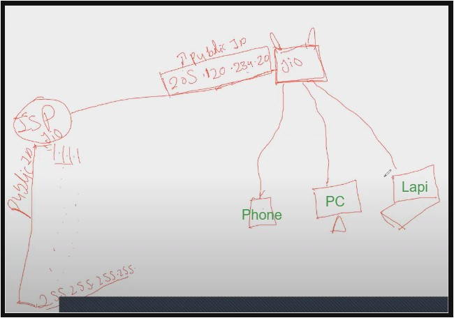
	- & even those devices will talk to the router ✔ , so these devices need their own IP address - so that router can talk  & router has it's Public IP (which is given by Jio ISP)
	- so the way "ISP jio" knows that many internet users gonna use their internet , so ISP Jio provided  a Public IP address to the router - that's why "ISP jio" kept a large range of different IP addresses for their internet users  so same way - the router also knows itself that atleast 15-20 devices will connect with me , so that's why - the router also  kept a range of IP address for those devices ✔ like this  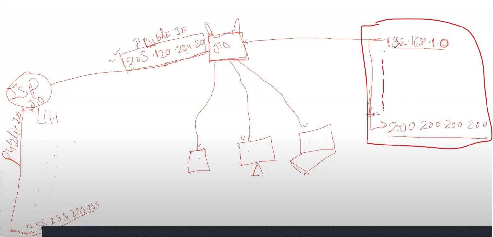
	- so here we're assuming a range of IP addresses of router - starting IP address is `192.168.1.0` till end `200.200.200.200`  & any router doesn't give any IP address which start or end only with 0 (zero) cuz these IP addresses are reserved by router for something else - but don't focus on the range of IP addresses of router - "just focus on understanding the concept" ✔  so that much range of IP addresses - the router kept with itself
	- Now when no. of devices connect with the router then the router will give unique IP addresses (out of those range) to each connected devices ✔  let's say a phone connected - so it'll get IP address & same process continue for connected devices like this  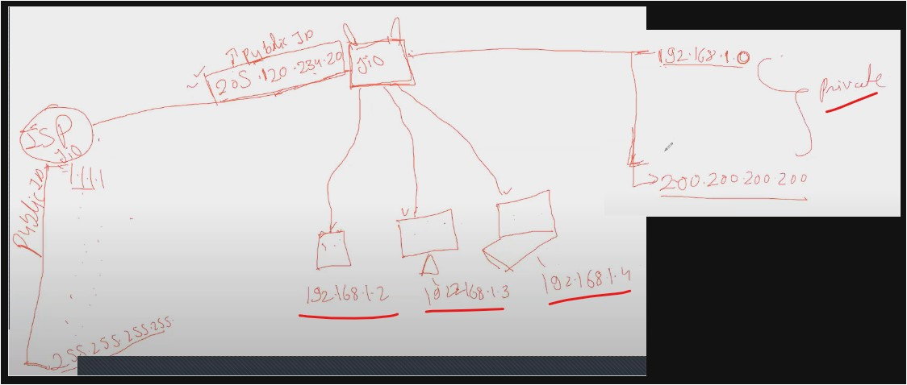
	- so these devices got the IP address , don't think about why IP address are in sequence which are given to them - these are assumption
	- Q : tell that the range of IP addresses - that router have are private or public IPs ? ✔ Ans : So those IP addresses are Private cuz router comes in LAN network
	- Now each IP addresses which is given to each devices are Private IP addresses  & the IP address that the router got from ISP i.e a Public IP address  so acc. to rule , Public IP can talk to Public IP only & Private IP can only talk to Private IP & the Private IP can't take to the Public IP & vice versa ✔
	- that's why , the Router will keep/take the first IP address from the range private IP addresses (whatever the range - a router have)  - so always the router kept the 1st IP address with itself from the range i.e `192.158.1.1`  for something else (instead of giving reserved Private IPs to different devices) ⭐ like this  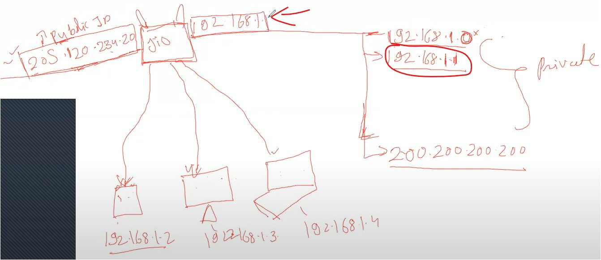
	- Now the Router have 2 different types of IP addresses i.e left one is Public IP & right one in Private IP ✔  Now acc. to rule , the Private IP address can't to the Public IP & vice versa 
	- so assume google's server IP address is `4.4.4.4` & the google server's has a public static IP address ✔ & the router have 2 different types of IP i.e a Public & a private IP
	- So Now , let's say a device who have `192.168.1.2` IP address want to talk with google server IP i.e `4.4.4.4` for resources  so firstly , this device will search like `google.com` & a packet will generate & the packet will go to the router  So acc. to rule , the Private IP can talk to only Private IP , so that packet will go the private IP of the router i.e `192.168.1.1` cuz the Private IP of that device i.e `192.168.1.2` can't directly talk to the Public IP of the router i.e `205.120.234.20` so the packet will go to the the router's Private IP of  i.e `192.168.1.1` & then the router will switch from it's own  a Private IP (`192.168.1.1`) into the Public IP (`205.120.234.20`) ✔
		- Cuz the router has a inbuild feature to switch/convert it's own - a Private IP into Public IP & vice versa - for communication  cuz a private IP can't directly talk to Public IP & vice versa - that's why ✔
		- so router is a intermediator , so it'll switch from a Private IP to a Public IP & vice versa   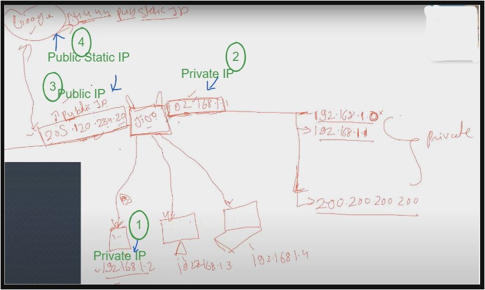
- Q : Now tell me how many identities that the router have ?  Ans : so a Public IP , a Private IP & the router is a hardware - so MAC address also a identity , so total 3 identities ✔ 
- Now the devices which are connected , let's say one of them is connected , so how many identities a device have ?  1) a Private IP address  2) a MAC address  3) a localhost
	- What is Localhost ?  Ans : just like we said a Public IP - is a real name of a person & a private IP is a nick of a person  so same way , a localhost - is like a brain of a person , so let's say - whatever u think/thoughts in ur brain,  so those thinking process or thoughts - remain inside ur brain - those stuff doesn't go outside  or nobody can't understand about ur thoughts or thinking process  - so we're doing self-routing or self-communication or self-talk ✔
	- in a device (like a lapi/phone) `imp ⭐`  - default IP of localhost : `127.0.0.1`  - the localhost's domain is `localhost` ✔
	- purpose of it : in ur device (like lapi, phone, PC) , the localhost used for self-testing - so the localhost is the 3rd identity ✔
	- so let's say - the monitor has 3rd identity i.e the localhost
	- by Default , IP address of the localhost for any device is same i.e `127.0.0.1` ✔
	- About localhost we'll learn further later on
- Source vs Destination
	- source : means starting point (means from where we're going) &  Destination : means ending point (means where we want to reach)
	- Q : if u want to go from Jodhpur to jaipur , so what's source & the destination  Ans : Jodhpur - is source & jaipur - is destination  if u want to come back from jaipur to Jodhpur , so jaipur - is source & Jodhpur - is destination ✔
	- Q : find out Source & destination  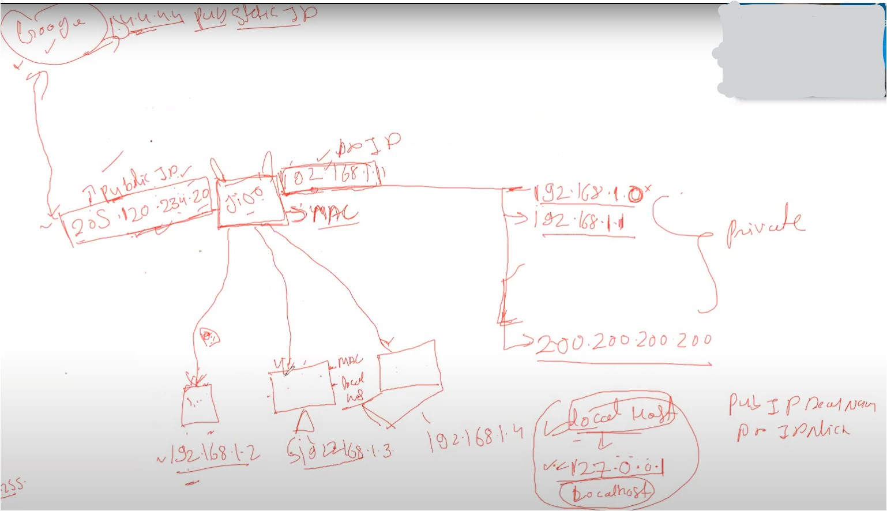
	- Eg : let's take - Monitor device , so let's say this device search for google & a packet gets generated & goes to the google  So now tell what is source & destination - step by step
	- situation 1 : a packet request from the monitor to the google public static IP 
		- STEP 1 : a packet going from the monitor to the router , tell what's the source & the destination  source - `192.168.1.3` Private IP of the device , destination - the router who has a private IP i.e `192.168.1.1`
		- STEP 2 : now the router send that packet request to the google public static IP  here Source - is the router's public IP address i.e `205.120.234.20`  (cuz the router will switch the IP address due to the "Private & Public IP communication rule") Destination - `4.4.4.4` public static IP of google (assume that IP)
	- situation 2 : now google got that packet request , now google will reply
		- STEP 1 : a response of that packet will go from google to the router  Source - `4.4.4.4` public static IP of google (assume that IP)  Destination - is the router's public IP address i.e `205.120.234.20` 
		- STEP 2 : a response of that packet will go from the router to that monitor device  here Source - is the router's public IP address i.e `102.168.1.1`  (cuz here the router will switch the IP address due to the "Private & Public IP communication rule" i.e  from the Public IP into the Private IP of the router) Destination - `192.168.1.3` Private IP of the device
- Repeating above stuff again for understanding new concepts :  Now understand the concept story again , we purchased a router & with the router - we got a Public IP address  that Public IP address given by the ISP & this Public IP address is dynamic (means when u close the router/sim of phone  then start the phone again then that Public IP address will get changed) ✔
	- when u purchase the router , then only one Public IP address we'll get - same with SIM for phone  & the router also want to talk to those devices , so the router also kept a range of IP addresses to connect with those devices  but that range of IP addresses are Private IP addresses
	- & in that range of Private IP addresses of the router , the router will keep a 1st Private IP address with itself (out of that range)  for communication with those devices - means the router will not give that 1st IP address to any devices  which want to connect with the router ✔
	- Now once everything connected then the router got 3 identities i.e  1) a private IP address (from the range of private IP addresses of the router)  2) a Public IP address (got from the ISP)  3) a MAC address of the router
	- & each of those devices have total 3 identities i.e  1) a Private IP address  2) a MAC address  3) a localhost
	- Now the range of network is created (around those devices) which is not bigger & each devices got a Private IP ✔
		- Q : which range of network is this - LAN or WAN ?  Ans : means this network range will come in LAN network , so these are devices are connected  & forming a LAN network where 5-10 devices are connected with the router
		- Q : the public IP of the router (which is got from the ISP) connected with google server  so the router's Public IP is connecting with the google (which is spread all over the world) - which network type is it  Ans : so the network is formed from the google to the router's Public IP i.e WAN network
		- acc. to that Private vs Public IP communication rule ,  in LAN network , only Private IP addresses used for communication & in WAN network , only Public IP addresses used for communication
		- Pic of which is creating WAN & LAN network :  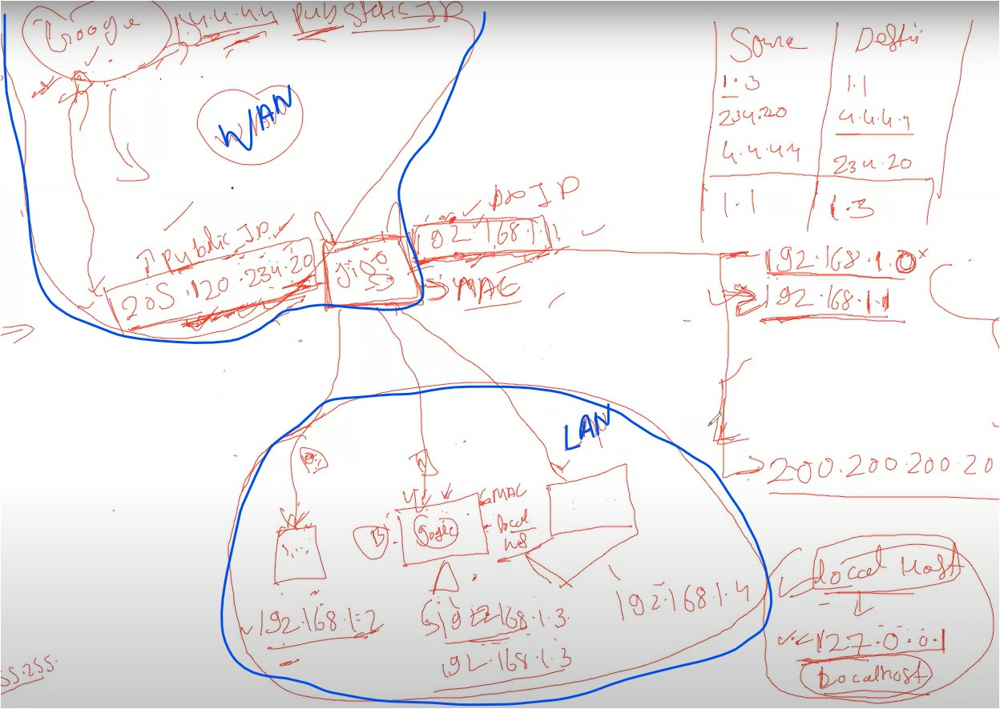
	- this is how Internet works 
	- so the router's Public IP address (which got from the ISP) will change when u off the wifi - which earlier we saw in practical 
		- so Public IP address (of the router) is changing cuz it's dynamic Public IP address ✔
		- & the router - which gave each Private IP address to each devices - will not change directly  means when someone's system connect/get that IP address (when ur system is offline)  then when u reconnect to the internet - then u'll get a different Private IP  `Note ✅` : but generally this doesn't happen cuz the router kept a large range of Private IP addresses  & there's no need to change also & it's also a Dynamic Private IP address
- 2 ways to give/assign IP address to the system & features of router i.e DHCP vs ARP
	- Q : when the router was giving the IP address to each devices then did we manually fill/define the IP address for each devices ?  Ans : No , then how each devices got their IP address ✔
	- So there're 2 ways to give/assign IP address to the system/device  1) Manual  2) automation
	1) in Manually , we define the IP address for that system & then we save  but cons of this way i.e what if that same IP address have already in a different device  then we couldn't able to use that IP address ✔
	2) in automation way , there's a `DHCP` which is a feature/friend of the router  DHCP (Dynamically Host Configuration Protocol) 
		- So Purpose of DHCP : 
			- when one by one devices/systems started connecting with the router  then the DHCP - one by one assign/give an IP address to each devices which are connected to the router ✔
			- Eg : let's say - that phone/device is connected with the router  & the device got a Private IP address via DHCP i.e `192.168.1.2` ✔  then after sometime that device got disconnected , so `192.168.1.2` IP address gets free  & if any other device will connect to the router then that IP address will be assign/given to that device/system ✔
			- So purpose/work of DHCP is to assign/give an IP address ✔
		- so we don't have to manually define/give an IP address to each devices which are getting connected with the router
	- ARP
		- How DHCP able to know that which IP address of which system of is free  whether that System is connected or not - but DHCP only do work related to assign IP only , not more than this ✔
		- Eg : in a company , we have a account team & sales team  so Sales team - only sale things - so sales is DHCP  but account team - keep only the data of "kisco kitney paise diya" , where money goes , how much to give to that person which person have to give money , which person gave the money , etc  so account - is ARP ✔
		- so the router has another feature i.e ARP (address resolution protocol)
		- Broadcast : Broadband (means router/internet) but broadcast - means sending a message  to everyone who is connected for that work , so ARP also same as broadcast ✔
		- Purpose of ARP : it ask a question from each system after small time gap  means it sends a packet to each system (which are connected to the router)  & let's say ARP will ask a question via sending a packet from that phone device  & that packet contain `Who has 192.168.1.2 IP address - tell to 192.168.1.1` ,  so that Packet of ARP = means any device who have that IP address - tell to the 1st IP address of the router i.e `192.168.1.1`  so that router of `192.168.1.1` IP able to know that "u're that device" ✔
			- so `1st Work of ARP` : send/broadcast a packet to each devices (which are connected to the router) ✔
			- `2nd work of ARP` : & if any device have that IP address then that device will tell  to the 1st IP address (which is a Private IP of the router) (out of the range of IP address) of the router Note : here that device will not broadcast itself (who have that IP address) that "i'm the one"  means the broadcast message will not send by that device (who have that IP address) to the router ✔
			- So ARP will broadcast the message i.e `Who has 192.168.1.2 | tell 192.168.1.1`   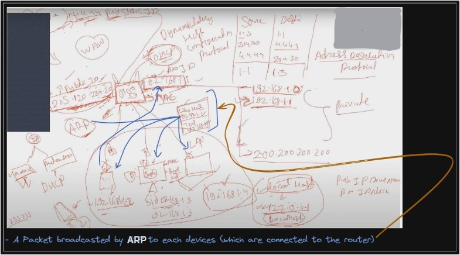
		- DHCP & ARP - are the inbuilt features of the router
		- so ARP - will send a packet to each devices who are connected to the router by broadcasting that packet ,  so that ARP able to know who have that IP address
		- so once ARP with broadcasting that packet to each devices  & then once that particular device/system (who have that IP) send a reply in a packet form  then that packet contain details of that device i.e MAC address + IP address ✔  & then that packet goes to the Router & the router save that packet within itself
		- Now let's say that Phone device disconnected & the router broadcast a packet request to each devices  & but now no reply will get to the router from that phone device (cuz it's disconnected) ,  so when no reply got from that phone device then the router will save a packet as `192.168.1.2` IP is empty ✔
			- now the router will tell to DHCP that `192.168.1.2` IP is not connected with any system - so this IP is empty  so DHCP will say when a new device will connect to the router then that IP address will be given to that new device ✔
		- so this is a working of ARP that ✔ 1) ARP will broadcast a packet to each system  2) & each system will reply but if that system is not connected (who have that IP address)  then no reply will get from that system to the router 
		- Now whatever explain we did yet for ARP - is for in LAN network  in WAN network , so when that device/system do google search for a packet/data  then the router knows that device of `192.168.1.2` IP did a packet/data search of google.com to access but when a reply/response come from the google then the router know the IP address only of that system  but the router doesn't know which system have that `192.168.1.2` IP - means the router not able to identify the device ✔
			- means : (router only known that device `192.168.1.2` IP did a packet search but the router doesn't know which system have that IP address) ✔
			- that's why with IP address + MAC address of that system transferred by ARP to the router  eg : with aadhar card , PAN card also used cuz both have different use case ✔
			- so in this case , the router will broadcast that packet response via ARP again  & ARP will get ON then ARP will send that packet request to each devices - in order to know  which device have that IP address , so that device will respond/say that "i have that IP" ✔
			- then the router - will send that Packet response/reply to that device ✔
		- this is complete functionality of a Public IP , Private IP , total identities of a device , localhost , where a public IP is getting used - WAN or LAN ?
		- for communication  - to connect with a world = Public IP used &  - within range = to connect devices (which are present in our range i.e LAN) - Private IP used ✔
		- `3rd work of ARP` : whatever the configuration need to be done for the router - like changing the password , any configuration related to the router 
			- so configuration of the router done on this IP address `http://192.168.1.1/` (which is default IP address of any router)
			- Practical Work : so when u open ur "router-login" page -> `DHCP` shows IP addresses  (which are assigned to each devices , etc..)
			- due to 2-3 reasons , the 1st IP address are by-default given to the router

### Example : how Internet works
lecture (30-oct-2023) - all about ports & protocols (timestamp 4:17 - 6:55)
- let's say Devendra Sir - is currently in Rajasthan & u're in delhi
- so Devendra sir's system IP is 192.168.1.20 (private IP of the router) &  his router's have 2 IP i.e 3.3.3.3 (public IP of the router) & 192.168.1.1 (Private IP of the router)
- & u'r  system's IP is 4.4.4.4
- Q : & u want to connect with sir then which IP will be shared 
	- Pic  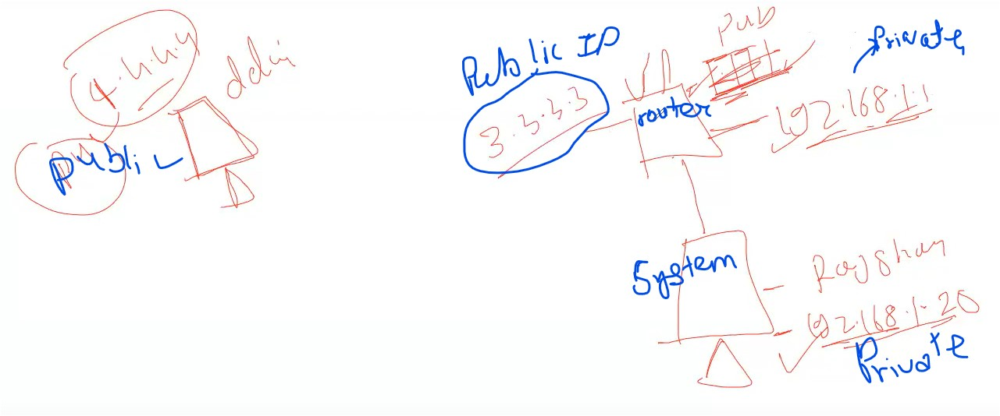
	- i.e 3.3.3.3
	- Reason : cuz `3.3.3.3` it's a Public IP address of the router which is used in WAN network  & `192.168.1.20` is Private IP of the system of sir & this Private IP address doesn't go outside of the LAN network (means this Private IP address limited around the router connection)

### End of the lecture
- Advice : timeline 7:01 - 7:38
	- don't go in doubt session until u don't have doubt cuz there , many weird doubts come & mostly people ask advance doubts  & u'll not understand + u'll also waste ur time too
	- first try to solve ur doubts my urself then come if still u have doubts
	- mine conclusion : don't do advance or extra stuff on something else , just clear & learn concepts that u taught till yet & ask doubts from what u have learned yet
- Q : in Phone , from where it gets the IP address (cuz it's not the router) ? 
	- so phone's SIM works as a router , so a SIM has Public IP address  & as a SIM is working as a single router - when it's only connected with ur phone
	- but when u give hotspot to someone then ur phone becomes/behave as a router  & same it also keep a range of Private IP addresses & those who're connected with ur hotspot  all those each devices take a private IP address  - so the phone give a IP address to each devices i.e Private IP & the SIM has a IP address i.e Public IP
	- so whenever someone google search then the packet request goes to ur phone's private IP address  & the phone will send that packet request to ur phone's SIM (means router)  then the SIM will use the Public IP address to send that packet request to the google server's IP address
	- if ur friend or someone did a crime then the Public IP address will go of SIM ✔
	- so our phone also behaves as a router
	- Imp ⭐ : SIM = router (Public IP address) & phone = private IP address  so both can't be Public or Private IP address cuz communication not able to happen & system will get confuse  like which IP need to use for accepting the packet response & which IP will be use to send the packet request ✔
- Q : can we change the Public Static IP address
	- in further lectures , we'll see how to change it
	- but static IP address are purchased by companies , so generally - for server , companies purchase these static IP address
- Q : what if we want to convert static IP into dynamic IP ? - for this do we need to purchase
	- Yes
- Q : IP address of localhost is same ? so why IP address is allotted ? ✔
	- for self-testing 
	- let's say a outside network is not connected , then if u want to do troubleshooting  then how u'll do it
	- so IP address of the localhost - do self-testing on the system
- Q : in settings of the phone ? 
	- the IP address u'll find in setting of the phone i.e Static IP address
	- & if u think this static IP address is changing but it'll not change  & public IP address will never be shown in ur system - so u need to change on the browser ✔
- Q : `Imp ⭐` :  the range of Private IP address - that the router have
	- so these range of private IP address used for communication in LAN network
	- but these Private IP address will not used in WAN network , in WAN network - Public IP address of the router will be used ✔
	- so these private IP addresses will not go outside - means will not go in WAN network
- Q : Once online exam complete after submit , then a IP shown - so who which IP is that ?
	- that IP is their sever - on which we were giving the exam
	- & the server has a Public Static IP address 
- Q : when 2 different devices - do same google search then what happen ?
	- Eg : on keyboard , when u press two different buttons at the same time  then at the same time , both input will not be taken , kuch agye pechye hoga ✔
	- so when 2 different packet request goes (via 2 different devices) to the router  then both packet goes at the same time but they both reach gye pechye
	- so each packet request of different devices will go to same Public IP address of the router 
- Q : via Public IP address of the router , we can access everything
	- we'll see later how to do that
	- cuz actually , big things hacked by Public IP address  but whatever the devices are in range of a Private IP address , those things only can be hacked ✔
	- but to hack those devices which are in range of Private IP address - we need connect & be in that range/area in order to hack private IP address - but to hack Public IP address , we can sit any where in the world ✔
	- that's why LAN & WAN network created ✔