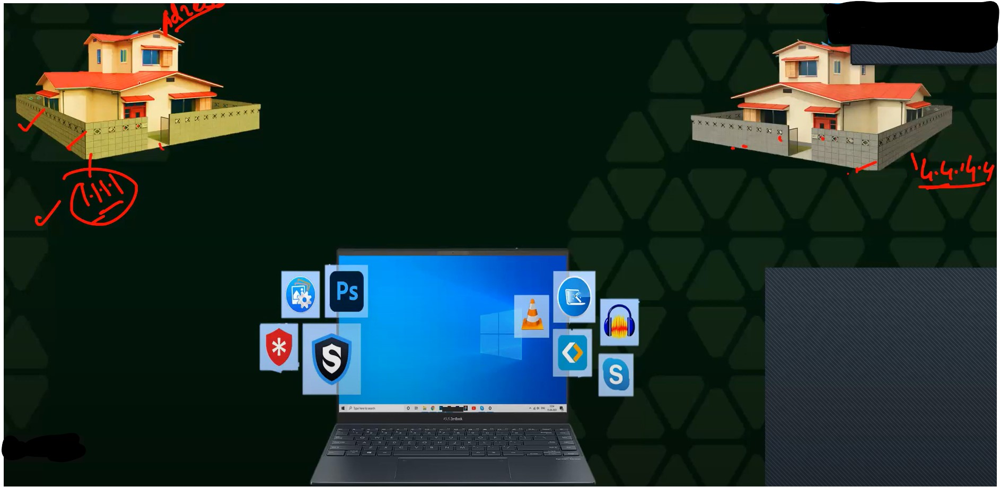
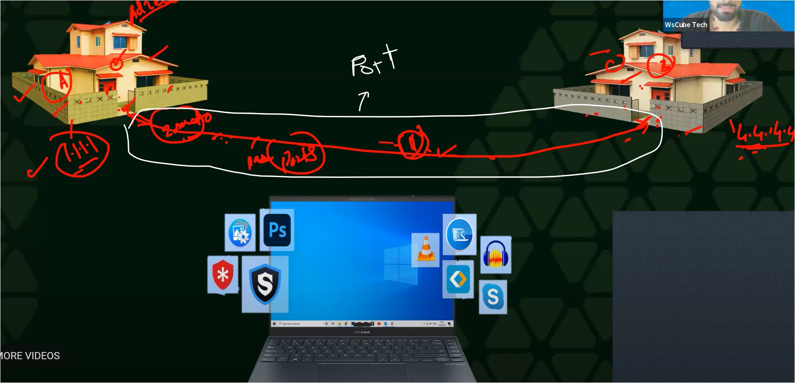
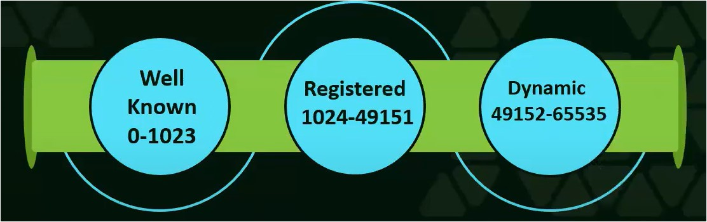
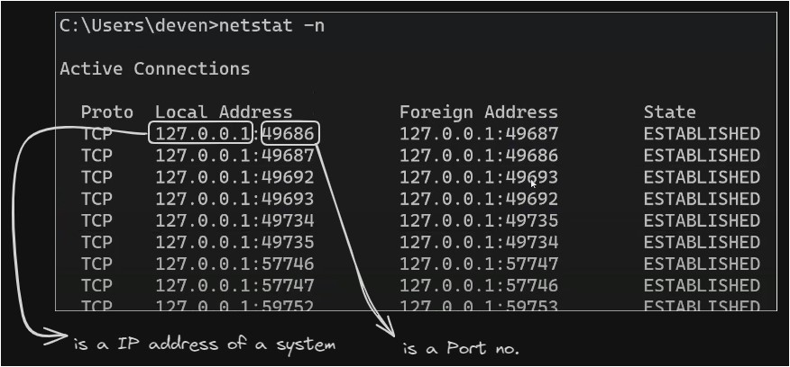
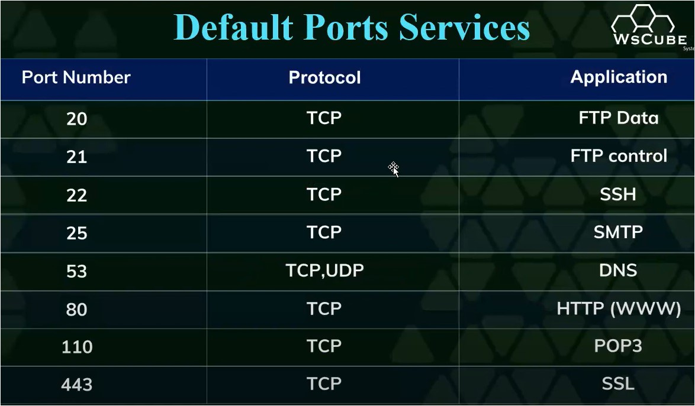
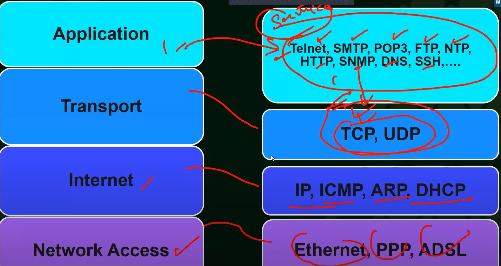
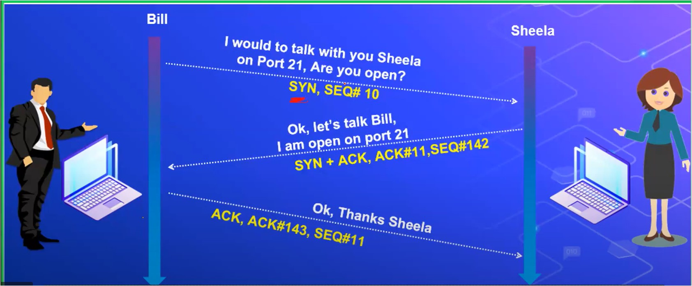

#WsCubeTech-CEH-notes 

---
### What we'll learn 
> Lecture Name : all about Ports & protocols
> 1) Theory : Ports in networking
> 2) Theory : Types of Ports
> 3) Theory : Protocols in Networking
>    - About TCP 
>    - How TCP works (types of TCP flags)
>    - TCP 3-way handshake & TCP session termination
>    - TCP vs UDP

---

### Ports in networking
- Q : what is a Port ?  Ans : Port means Path/way -> for communication + only an Open Ports + 1-65535 + One port at a time AND
- understanding what is Port : 
	- for communication , what're the stuff we need till yet what u have learned i.e IP-address/address
	- Q : but think about that can only just knowing IP address of that system , can we reach to that system ? Ans : No , cuz we also need to know the path/pathways  so u have to know via which pathway u're gonna use & how u're gonna use that pathway to reach to that system
  	- Eg : left Home (Nobita) = system A & right home (shizuka) = System B 
	- Now let's say , manually - Nobita wants to send a parcel/packet at Shizuka's Home
	- so "system B" gave the address i.e 4.4.4.4 to the "System A" & but "System A" doesn't know the pathways  to react at "System B" then how "System A" can reach there
	- so let's say , now Nobita send a parcel/packet at Shizuka's Home via zomato  then delivery-boy will take the parcel & delivery-boy will choose a pathway to reach at Shizuka's home ✔
	- so delivery-boy will go via any pathway - that pathway aka Port in Cyber Security Field ✔  
	- so in System , whenever a packet/data gets transferred from System A to System B - then goes via a Port ✔
	- Q : is that zomato delivery boy have only 1 pathway to reach at Shizuka's Home ?  Ans : No, there will be many different pathways to reach at there , so let's assume that zomato guy have  3 pathways to reach there
	- So same way , in networking - total ports 65535 & these ports are used to send/receive packets/requests  so if that system wants to send the packet/request - then the system needs 2 things  1) IP address  2) a pathway (which port going to be use to send the packet request / a tunnel)
	- Working of Ports
		- Q : when the Nobita hire that Zomato guy to send the packet at her home , so that Zomato guy going  via pathway no. 1 but she is standing/waiting at pathway no. 2 - is that parcel can be received by Shizuka or not ?  Ans : No , cuz Shizula was standing in a wrong Pathway , so not possible cuz that zomato boy will go at pathway no. 1 1) means via which pathway that parcel is going - we have to be on that pathway in order to receive the parcel  so same in networking , gis rastye pay "a packet" going - on that pathway , a person must be standing there  2) the gate should be open from receiver side - means if shizuka close the door then still that packet  couldn't be received by her
		- `imp ⭐` so both rules will be applied i.e : 1) Door should be open of that pathway from which the packet request is going/reaching - means that Port should be open  2) there should be someone on that pathway to receive the packet request  
	- now that pathway no. 1 - is very narrow/patla due to which only 1 bike can go at a time  but neither a car or 2 bikes can't go at a time cuz if 2 bikes try to go at the same time via this very narrow road  then no bike can't go
	- so only one person can use that particular pathway at a time ✔  so same way - in networking , a port can be used by either only 1 software or a service  otherwise if more services/softwares use a particular port then that port will get crash ✔  & if that port/pathway get too much traffic due to which that pathway/port will get jam  & none of the packet/services/software can move further  that's why - at a time , only one packet request can travel inside that particular port ✔ 
	- Eg : if a Zoom meeting software already running in ur PC at Port 80 & what if u open the skype at Port 80  so at the same time , 2 software are running on same Port - then what we'll happen ?  Ans : u'll get an error from Skype cuz like ur network will say that Port 80 is busy  so here only 1 way i.e close the ZOOM software completely & start the skype software  - so at the same time , either a software or a service can use a particular port ✔
	- Now that Zomato boy going with parcel via that pathway , then he must followed rules & regulation  it can't be like that Zomato boy without helmet driving , there will be traffic indicators which he followed etc.  otherwise his challan will be created by road police 
		- so same way , each packet request/receiver follow rules & regulation 
		- in networking , rules & regulation = aka protocols ✔
		- now rules & regulations are created to make the transfer/receiving packets secure  just like Zomato boy had the helmet , traffic indicators - so that accident shouldn't happen on the road
		- so when a system send a packet request then the packet request must go safely & properly reach to it's destination ✔ 
		- in networking , total 2 rules & regulation made for transferring packets request - 1) TCP & 2) UDP - these protocols ✔
		- TCP (Transmission Control Protocol) & UDP (User Datagram Protocol)

### Types of Ports
- in networking , total ports are 65535
- total 3 types of Ports  1) Well Known Ports = 0 - 1023  2) Registered ports = 1024 - 49151  3) Dynamic Ports = 49152 - 65535  
	- Well Known Ports 
		- Eg : of Well Known Ports : http works on port no. 80  Q : how do u know that http works on 80 Port no  Ans : cuz it's well known , so famous services use these sort of Ports
		- range of it :  0 - 1023 Ports
		- Eg : http , https , SMTP , FTP , SSH , etc = these are well known ports
	- Registered Ports 
		- Q : What are Registered Ports ?  Ans : The Port which is registered by someone like Kate registered a port on her name  means A registered port is like a special door in a building that is reserved for a specific person or purpose.
		- Range of it : 0-1023 Ports
	- Dynamic Ports
		- used for temporary or private ports 
		- means Dynamic ports are temporary network ports used by client applications to communicate with server applications.
		- range of it : 49152-65535
	- `imp note ⭐` : well known Ports & Registered Ports are used on servers , but Dynamic Ports are used on our PC/Phone ✔
- Practical Eg of Dynamic Port : 
	- STEP 1 : open CMD & run command `netstat -n`
	- Output :  
	- so this 49686 - is a port no. which is used in our PC/system/device & it's comes under the range of Dynamic Ports
	- So "Local Address" column : contain IP address with their Port no. & same with "Foreign Address" column  - so IP addresses with their Ports no. (of Local address) are those which are currently running on ur system  - & IP addresses with their Ports no. (of Foreign address) are those which are going as request to the server  so currently just understand that Dynamic Ports are used on our System/PC/Phone ✔
	- Advice 👂 : if anything doubt is coming in ur mind like "what if that port is not working then how a packet request will  go to the server" , etc.. So currently don't go in future - focus on what u have just learned otherwise u'll get confused  & waste ur time 
- These are Well Known Ports or u can say a category of registered Ports  Eg : here Port no. 20 = used by FTP data & FTP data service using TCP protocol ✔ so here application columns contain services names ✔  
- in case of Registered Ports , if that company already purchased a category of Ports then  that company will not change that port & if u try to change then u won't be able to connect with anyone 
	- Eg 1 : if that service is running on Port 80 & people are using port 80  - then if u change the Port no. then u'll not able to connect with anyone
	- Eg 2 : let's say ZOOM company running meeting on Port no. 80 & in that company  - everybody knows that service running on Port 80 , so everyone will connect on Port 80  - but someone change that Port no. 80 into Port no. 21 - then that person will go to a different pathway  & he'll not able to connect  - so everyone needs to connect at Port no. 80 ✔
	- & in further , we'll see about TCP & UDP cuz those services/application are using these protocols too much
- Q : How ZOOM company knows that ZOOM needs to be run on let's say Port no. 20  & when we join a meeting then everybody connects on Port no. 20  cuz we're not setting the Port no. by ourself in order to run ZOOM for meeting ✔
	- Q : is it every happen that u open the ZOOM + whatsapp at the same time & due to port  they both crash ?  Ans : did u ever see this issue to happen , NO , why - How ZOOM & whatsapp companies able to know ?
	- Ans : all the companies , in their own application , by-default they set a port no.  let's say ZOOM company set a by-default Port no. 21 in their application that ZOOM will run on port no. 21 ✔
	- let's say u download application from playstore , so assume that playstore application by-default set on Port no. 21
	- so in each application , by-default communication Port no. is already set  So no confusion come b/w 2 or more than 2 applications & different Ports don't crash each other ✔
- difference b/w HTTP & HTTPs ✔
	- both are protocols
	- HTTP : was not secure  - Eg : when u fill the form (like login form) & u fill the username & password to login  & password was written in star symbol - so as a user u'll think its safe  - but when these both details goes into URL then username & password was exposed  - so at the time of filling the details , password was safe but in URL - password was not safe - so HTTP is leaking the data
	- then solution came as HTTPs - which means SSL (which is a service) - SSL (Secure Socket Layer)  - so in HTTPs , when details goes via URL then it makes data/details secure & encrypted to send in URL ✔  so even if anybody see it then that person couldn't understand

### Protocols in networking
- Protocols : means Rules & regulations 
	- Eg : in real life , we wear helmet while riding a bike otherwise our challan will be issued from police  so same in network , if two or more systems are communication each other  so if these systems don't follow the rules then their challan will be created - means a packet will get hacked ✔
	- protocols are set of rules  Eg : in real life , in traffic signal , in red light = we stop , in yellow light = we drive slow , in green light = we drive fast carefully
	- Q : where Protocols are used ?  Ans : Protocols are used in data transmission (means sending & receiving the data)
	- Q : How data is transmitted ?  Ans : by following the protocols (means rules)
	- Q : Device Communication , what's the role of protocols in it ?  Ans : Protocols provide security in device communication
	- Types of Layers in networking :
		- Pic   
		- we can use interchangeably say "services" as protocols also
		1) in Application layer , all these protocols/services use TCP & UDP for communcation 
		2) in Transport layer , TCP & UDP 
		3) in Internet layer , in pic - all those protocols used
		4) in Network access layer , in pic - all those protocol used
		- Advice 👂 : but u don't need to keep this in mind otherwise u'll get confuse
- 2 types of protocols i.e TCP & UDP
- TCP flags | How TCP works :
	- it use it's own 6 signs/flags for communication ✔
	- Q : what is flag  Ans : means flags are sign/signal like different traffic signals for vehicles
	- total 6 Flags/signs of TCP
		- 1) URG (urgent)
		- 2) FIN (finish)
		- 3) RST (Reset)
		- 4) PSH (Push)
		- 5) ACK (Acknowledge)
		- 6) SYN (Synchronize)
	1) URG (urgent) : 
		- means the data which are inside the packet should be processed (receive or send) immediately
		- means any work which is in high priority or very imp  so TCP use this flag when the data needs to be send immediately ✔
	2) FIN (finish) : 
		- Eg : for file share , earlier we were using like "shareit" , etc  so here a person on his hotspot in phone & another person on his wifi & due to this connection created  & due to this process , file get transferred  - Q : so once the file get transferred 100% then did u still keep ur wifi on or hotspot on ?  Ans : No , cuz once the data got 100% then we both close the connection  cuz it'll be harmful to keep the connection ON even if not required ✔
		- so this flag used to break/close this connection ✔  so in communication , once the work or file sharing done then TCP send a FIN flag - to close the connection ✔
		- so when there's no further transmission going on - then close/disconnect the connection ✔
	3) RST (Reset)
		- RST = resets a connection
		- Eg : when a issue came in our system & that system is not working properly  so we restart the PC & 99% chance - that the problem will get solved ✔
		- so same way , in networking , during communication - a issue came  so sometimes we need to reset the connection  so like connection got a issue OR connection coming slow OR etc issues come  then TCP use this flag to reset the connection in order to resolve the issue (related to communication) ✔
	4) PSH (Push)
		- it used to sends all buffered data immediately
		- Eg : System A - sending the data to "System B" & 99% data is almost done  but when the data done 99% then System A - said to "System B" that "i got a important work"  so System A - started to break the connection , so System B - will say whatever 1% data left send it fast  - So when "System B" said fast - then data needs to transferred fast - then TCP use PSH flag
		- means when the data transferred 99% & small data left - & due to any reason (like any issue can come or is coming)  then TCP will use PSH flag to send that small remaining data to complete the data transfer 100% ✔
		- so any small data stuck in the middle - PSH flag used
	5) ACK (Acknowledge)
		- means Acknowledges the receipt of a packet
		- Eg : if Devendra Sir say "is my Voice audible to u everyone" ? then what u'll say ?  Ans : so we'll say Yes to sir - means sir got the acknowledgement - sir now know  that we're able to hear to sir
		- Eg : in whatsapp , when u send a message to Kate if single tick comes - means kate's system is offline but she got the message  Double Tick comes - means Kate's system is online but she didn't read the message  once that double tick becomes blue : means kate read the message ✔
		- so here whatever u're able to see - this is called acknowledgement  so if acknowledgement required for anything then in system , TCP sends a ACK flag ✔
	6) SYN (Synchronize)
		- means initiates/create a connection b/w hosts  means it helps to establish communication b/w 2 systems ✔
		- Examples
			- Situation 1) : let's say u don't know who is devendra sir  if he comes in at ur home directly & he's asking for ur phone then will u give ur phone ?  Ans : there will be less chance that u'll give ur it to him 
			- Situation 2) : but what he came at ur home & doing handshake with u  & he's telling something to u & he'll ask something from u  then he'll ask from u to give ur phone then there will be 99% chance that u'll give ✔
		- so this flag used when - like 2 systems wants to communication , then this flag will a request of System A  & send to System B for handshake then only the System B able to reply System A ✔
- `v imp ⭐` TCP three-way handshake & TCP session termination :
	- so when TCP create/initiate the connection b/w 2 or more systems - then TCP shake hands 3 times ✔ or u can say that during establishing/creating connection - TCP verify the connection (which is establish b/w 2 systems) 3 times 
	- Explanation of TCP 3-way handshake ✅
		- Pic :  
		- now consider Bill = System A & Sheela = System B
		- during creating/establishing a connection b/w 2 systems - this process will happen 
			1) Building a connection b/w 2 devices ✔
				- STEP 1 : Bill will send a SYN flag to sheela
				- STEP 2 : now Sheela will check that she got SYN flag  - so if she wants to establish a connection from her side then she'll also send a SYN flag including ACK flag  Q : why ACK flag she is sending ?  Ans : cuz we wants to tell/acknowledge Bill that she got his SYN flag  means she wants to tell that she got the request to establish a connection , so she also wants to build a connection  so she is also sending SYN flag to build a connection ✔  - But if she doesn't want to build a connection with him - then she will only send a ACK flag  & then connection will get lost from her side ✔  - so she wants to build a connection that's why she send both (SYN + ACK) flags at the same time ✔
				- STEP 3 : so now , Bill also send a request of ACK flag to build a connection  - so he wants to tell Sheela that a connection request got - that's why he used ACK flag only ✔
				- now a connection will be created/established b/w them
			2) communication process b/w 2 devices ✔
				- STEP 4 : Now Bill saying - he is open on Port 21 - to talk with sheela  so for a request , he send a SYN flag to Sheela
				- STEP 5 : so Sheela - said "let's talk Bill & i opened the Port 21 & i got that SYN flag request" 
				- STEP 6 : so bill - said "thanks sheela & i got ur connection request i.e SYN with ACK flag request"  so Now Bill - also send a ACK flag
			- here SEQ (means sequence like things going step by step with a number)  lets say somebody send a request to u - so its 1st sequence for u  & if that person send a request to someone - then that will be 2nd sequence  - here SEQ#10 - means previously bill send a sequence no. 9 to someone else  - & now he is sending sequence no. SEQ#10 to u ✔  
	- Now the connection is done b/w them then the connection needs to be stop  otherwise hacking attacks or issues will happen
	- Explanation of TCP session Termination (once connection is done then show connection gets stop) ✅
		- Pic :  
		- STEP 1 : Bill said "i am done with the data transfer" - means whatever Bill wants to send her  he finished sending the data - so for finished , he used a FIN flag  - now Bill saying to break/stop this connection
		- STEP 2.0 : once sheela got the request , so she replied "ok i received ur termination request"  via sending a ACK request to Bill 
		- STEP 2.1 : so before termination , she will check whether she got the complete data or not  so once she know that she got the complete data 100% , so she'll say "I have received all the data"  via sending a FIN flag
		- STEP 3.0 : Now Bill - got the FIN flag request for stopping the connection from Sheela
		- SETP 3.1 : so Bill will send a ACK flag packet request  - in order to tell sheela that "i got the ACK packet request - Ok, thanks sheela" & now Bill close the connection
		- Quiz Q : Bill send a file to Sheela & sheela got 99% data of the file but 1% left  then which flag going to be use to bring 1% data of the file  Ans : PSH flag used 
- TCP Vs UDP
	- Pic  
	- in TCP , TCP doing 3-way handshakes
		- 1st - SYN flag send : for creating a connection from Bill person  then SYN + ACK reply got : from Sheela  then ACK flag sent from Bill again : to close the connection
		- so 3 way handshakes done in TCP
		- TCP do verification of the sending & receiving the data
	- in UDP , it do request & response
		- so 1st request from Bill to sheela  then response from sheela to Bill  then Response from Bill to sheela : to stop the connection
		- so UDP is not verifying the data
	- that's why TCP is more secure than UDP  - but UDP is faster than TCP - cuz no verification done during sending/receiving the data  - but in TCP , 3 times verification done that's why TCP is slow ✔
	- so TCP is widely used & UDP use in specific place where verifying the data is not required ✔ Eg - DNS use TCP & UDP both
	- for more about TCP vs UDP : [TCP vs UDP | 12 Critical Difference | IPCisco](https://ipcisco.com/lesson/tcp-versus-udp/)

### End of the Lecture (Doubts) : 
- Q : List down important ports to know as a ethical hacker ✔ Ans :  > https://www.perplexity.ai/search/List-down-important-MOsfQc2xSzumEycOp_dgFw  > https://www.geeksforgeeks.org/50-common-ports-you-should-know/
- Mine Doubts : 
	- About ARP
		- Q : what is ARP in wifi-router  Q : in wifi-router , is ARP considered as a data packet or a protocol ?  Ans :  > [Ans 1](https://www.perplexity.ai/search/in-wifirouter-is-lLBms0eST8qOoPyZgmLS8Q?s=u) > [Ans 2](https://www.perplexity.ai/search/what-is-ARP-P4OXAwQ3TOmfciz9etE9zw?s=u)
		- Q : why wifi-router send ARP packet ? if wifi-router sends ARP packet then where that ARP packet goes ?  Ans : [why wifi-router send ARP packet ? if wifi-router sends ARP packet then where tha...](https://www.perplexity.ai/search/why-wifirouter-send-y_XMcDteQaCM3tfv.HGsFQ?s=u)
		- Q : what happens when a router receives an arp request  Ans : [Ans](https://www.perplexity.ai/search/why-wifirouter-send-y_XMcDteQaCM3tfv.HGsFQ?s=u)
	- Q : how does a router determine the mac address of a device  Ans : [Ans](https://www.perplexity.ai/search/why-wifirouter-send-y_XMcDteQaCM3tfv.HGsFQ?s=u)
- Q : Domain of a website - also connected with server of that website
- Q : if ur ISP providing internet to u then whatever searches u're doing - are they able to read my searches data ?  Ans : No , even if they try then can't cuz packets are encrypted form
- Advice : u don't have to read anything apart from these stuff whatever u're learning  & devendra sir making base strong , so u don't need to read anything extra 📃 - 1) make notes  - 2) practice  - 3) repeat the lecture again for more clarity on concepts cuz if u do this then no doubts left
- without Port , no data can be transferred , so Ports is everywhere
- when u search on the internet which is not allowed then ur IP address will be trace by govt.  but generally companies & govt. don't have time to read each person's search query  & packets sending/receive in encrypted form only - so only that person can see packets request  who can can encrypt & decrypt