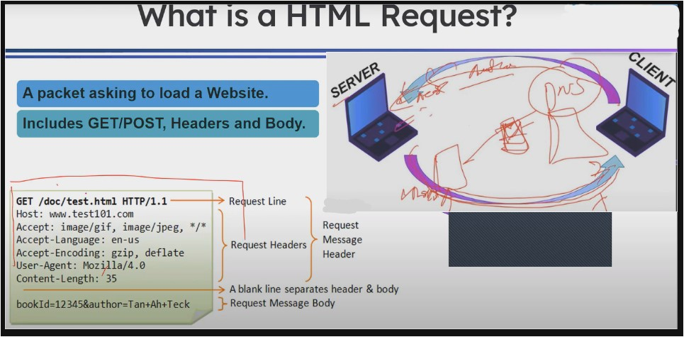
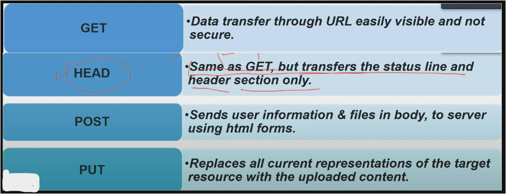
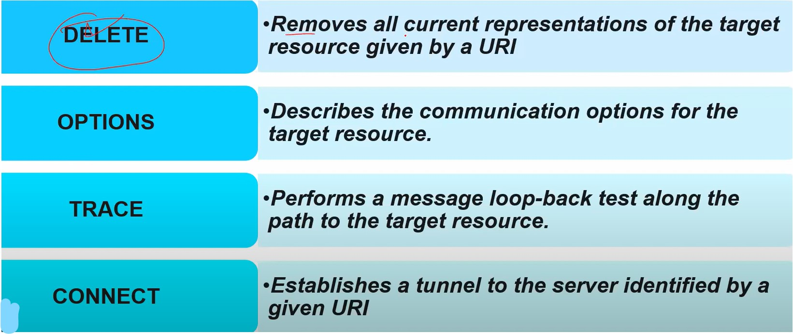

#WsCubeTech-CEH-notes 

---
### What we'll learn 
> Lecture Name : Request Headers
> 1) Theory : What is a HTML request ?
> 2) Theory : What is a HTML response ?
> 3) Theory : Types of HTTP Request methods/ways - to send the data
> 4) Overview of setting up Lab
---

### What is a HTML request ?
- Pic  
- Q : what this actually green box is ? where it is use ? for what purpose it's use
	- Ans : so in 5th lecture , we saw that when "System A" did a packet request i.e google.com  Q : then where that packet request will go first  Ans : to DNS  then that packet request will be forward to NS1 & NS2 - for zone file - cuz the Domain setting  which we saw  - that setting is of the domain name server's page & NS1 & NS2 stay in server  that's why - after the DNS , the packet request will go to the server (of that Domain Name)
	- so this green box is a packet request 
- understanding a packet request
	- Q : why system generate or send request packet to the server ? for what purpose it's use ? Ans : so that to load a website on our system , so in response - client got a complete code of a website & meta data  Advice : response are big topics which comes in penetration testing ,  so we'll not go in too deep in this course about response
	- GET & POST are methods to send/transfer the data  Eg : to send a parcel to someone there are different methods/ways to deliver that parcel
	- `Request line` : is a main line in a packet request
		- Eg : `GET /doc/test.html HTTP/1.1` : means in that website  there is a "doc" folder & inside this folder - there's a "test.html" file
		- `HTTP/1.1` : means which protocol/rules-&-regulation that file using to transfer i.e http  & 1.1 - means version of http protocol
	- `Host` : contain that website's URL on which we're sending the request
		- Eg : `Host : www.test101.com` - means the request is going on this website URL
	- so from `Host` to `Content-Length` : is called request Headers  & from request line to `Content-Length` : called request message header
	- Q : what is Header means ?  Ans : u can say "request line" is a hair - means firstly URL of the website come  then "request header" - here header means head of human body
	- `Accept` header : means Eg : `Accept : image/gif, image/jpeg, */*`
		- here means the request that we sent to the website , we told in the request  that our system which type of image format can understand  so gif & jpeg are format/extension of images
		- so our system can understand this 2 types of image format  so that when that website's server reply then send the image in any of the those 2 format only
		- `*/*` : means anything , means our system support all the image format so the website's server  can send any image format, that's why - at the end of the request it's used
	- `Accept-Language` header : means our system which language can understand
		- Eg : `Accept-Language : en-us` : means whenever the reply/response coming from the website's server  that reply should come in english language
		- but let's say a website on server is in urdu & by-default - we didn't set the language  then we'll get in urdu language
		- so `en-us` defined for like whenever response/reply come from any website's server  that should be sent in english language
	- `Accept-Encoding` header : 
		- Q : what is encoding ?  Ans : from internet , when u load a zip file (means compressed file) , so this zip called encoding  means when these file made in zip then those file stored in zip via encoding process  due to which become more secure , that's why called encoding
		- Eg : `Accept-Encoding : gzip, deflate` : means our system support encoding of gzip & deflate
	- `User-Agent` header : `v imp ⭐`
		- remember this header cuz it's imp in ethical hacking
		- means in a packet request , this header contains our system's browser name & browser version via  which we made the packet request & our OS details like name of OS & version of it & etc essential info about our system
		- & this header also dangerous cuz it's sharing 2 details related to browser & OS of the user
		- Conclusion : this header contain 2 details of a client's device i.e (Browser details + OS details of the device)
		- Eg : `User-Agent : Mozilla/4.0` - here 4.0 is a version of user's Mozilla browser
	- `Content-Length` : it tells total length/size of the packet & this size could be in bit or byte
		- Eg : "Content-Length : 35"
	- now after `Content-Length` header , a blank space comes - used to separate header & body 
	- in body section , all those things comes what we're asking from the server 
		- Eg : in facebook , for login - we tell username & password - so that username & password will go via in body
		- so inside the packet request , after a space - that's called body
		- Q : why these info goes in body Ans : cuz if those sensitive info are in header then anyone can see those details  Q : did u ever saw a URL address inside the browser  Ans : Yes  Q : but have u never saw a "body" section of a packet request  Ans : No , cuz body section is not visible & it's secure
		- so always sensitive stuff will be send/receive inside the body section of a packet request

### What is a HTML response ?
- when "system A" sends a packet request for google.com - then server will send a response in form of a packet  so that sending consider as response from the server
- A HTML response is a packet - which means providing Permission to access the website/content  Includes GET/POST , Headers & Body (complete program of that page)
- Q : A HTML response is a packet providing Permission to access the website/content ? - is this statement correct ?  Ans : this statement - means whenever a website reply then no permission asked to access it No cuz , whenever u ask sensitive page/info then the website will not allow & it'll stop u from access it  - so , response doesn't mean that in reply , always u'll get the website , sometimes website will not allow u to access those info  - so "not allowing to access" also kinda response from the website

### Types of HTTP Request Methods ?
- so we'll see about those methods/way during transferring/sending the data
- Method : means a way/तरीका to send something  Eg : to share info , u have 3 ways/methods : via call OR sms OR whatsapp message  - so we have 3 ways/methods - so any of them we can use to send the data
- HTTP Request Methods 
	- Pic 1 :  
	- Pic 2 :  
	- Advice : u can understand all the HTTP request methods via their name
- `GET` method : 
	- this method send all the info via URL
	- it's not secure , cuz sensitive data also going via URL - instead inside the body section
- `HEAD` method : 
	- it's same as `GET` but it doesn't share the sensitive info in URL  but it transfer the status line & those info including sensitive - in header section - via URL  which also not secure
	- due to this anyone can see this easily
	- Q : what is Status line in header section  Ans : it tells when the data reached + where the data reached + is everything safe or not 
- `POST` method : 
	- it sends all the info & files in body section - so this method is secure & anyone can't see details - except URL
	- that's why nowadays , mostly POST method used
- `PUT` method :
	- this method is dangerous cuz only admin has access of PUT method 
	- so it used to put something else on those stuff
	- so if someone has a access of PUT method then he/she can replace the stuff from something else
	- Eg : in that packet request , if a hacker has a access of PUT method  then the hacker can replace that file request i.e `test.html` to `malware.com`  that's why access of it has only with admin  & if the website is vulnerable then users also can access this method
- `DELETE` method :
	- URI & URL are both same
	- this method also more dangerous than `PUT` method
	- PUT method was replacing that thing by new one but DELETE method completely delete that thing 
	- so if someone got the permission of DELETE method then all the info might get delete from that place  if that person got the access of any location then he/she will delete the data of that location
- `OPTIONS` method :
	- it gives options for communication via which protocol + when to make + how to make, etc
	- Eg : this method let's say wants to make a communication.  so it'll decide which protocol + when to make the communication via which protocol + etc  like it'll ask from itself i.e "do i need TCP protocol or any other protocol to make the communication"  (Note : this is totally depends on situation)
	- so this method will give options to client/users for how to connect with the server  so whatever this method have ways/methods to connect with the system - all those options, this method will give
- `TRACE` method :
	- Eg : in windows PC , if any file u didn't get then u just go  Q : what u do without going in drive or folder  Ans : so u'll search the location of the file - due to this u got the complete location & in which drive that file exist
	- it used to give access/location of a thing which are in a website  Rule : on internet , until u don't have the location of file or folder or a website - then u can't access it  so same way , this method give us location of thing which are inside of any website
	- means it trace the file/folder/stuff (which are inside any website) location & then it tell us
- `CONNECT` method : 
	- `OPTIONS` method was giving options to us to make connection with another system/server
	- but in `CONNECT` method , we gave a URL to this method then it'll decide  when & how to make connection , when to break the connection , etc
	- Eg : let's say a connection is building via TCP , so this method helps TCP protocol  when to make a connection , when to break the connection , like when file sharing done  then when to break etc.
	- so this method decide when to make & when to break the connection
	- Conclusion of `CONNECT` method :
		- so `OPTIONS` method giving an option to a protocol to make connection
		- once `OPTIONS` method made the connection & Now `CONNECT` method saw that file sharing is done  then `CONNECT` method will say to that protocol who made the connection - let's say TCP  so `CONNECT` method will say to TCP protocol to break the connection
		- but if `CONNECT` method feel that file is not transferred properly then `CONNECT` method will  say to that protocol to make the connection again
		- so `CONNECT` method guide to that protocol (via which the connection is build) - for when to establish the connection  & when to break the connection

### Overview of setting up Lab
- 1) download Kali OS
	- STEP 1 : search "kali download"
	- STEP 2.0 : scroll down to the website & click on "Pre-built VMs" menu tab
	- STEP 2.1 : download VMware 64 bit
	- Note : download the pre built VMS only , cuz it's gets easily setup & no errors comes
	- link : [Get Kali | Kali Linux](https://www.kali.org/get-kali/#kali-virtual-machines)
- 2) Download VMware
	- Note : don't download VirtualBox cuz it's difficult to setup the machine & too much errors comes
	- STEP 1 : search : "VMware download"
	- STEP 2.0 : download VMware Workstation Pro  Note : don't download VMware Workstation player
	- STEP 2.1 : scroll down & u'll see Workstation 17/any-version pro for windows
	- link : [Download VMware Workstation Pro | IN](https://www.vmware.com/in/products/workstation-pro/workstation-pro-evaluation.html) 
	- Note : we'll download the actual software of it but it'll ask for key  so we'll use those activated key to use this software
	- Steps for key to activate this software :  STEP 1 : search "key 17 pro vmware download"  STEP 2 : click on above 2 links of github for license keys License Keys links : [Free VMware Workstation Pro 17 full license keys · GitHub](https://gist.github.com/PurpleVibe32/30a802c3c8ec902e1487024cdea26251)
- 3) download Metasploitable 2
	- STEP 1 : search "Metasploitable 2" & click on SourceForge link to download
	- STEP 2 : click on latest version & download it
	- link : [Metasploitable - Browse /Metasploitable2 at SourceForge.net](https://sourceforge.net/projects/metasploitable/files/Metasploitable2/)
- 4) to download any common multiple softwares at once 
	- link : [Ninite - Install or Update Multiple Apps at Once](https://ninite.com/)
	- STEP 1 : select those software's which u want to download 
	- STEP 2 : click on "Get ur Ninite" button
	- Ninite : is a good platform to download multiple softwares at once & less chance of virus to come
### End of the Lecture (Doubts) : 
- about HTTP Request Header Packet ✔  Ans : https://code.tutsplus.com/http-headers-for-dummies--net-8039t
- about OPTIONS method ✔  Ans : [what's the usecase of OPTIONS method in HTTP request methods](https://www.perplexity.ai/search/whats-the-usecase-iNvGx1wARkCLqgBQ.vLg1w)
- Q : someone did something via Kali Linux & he/she installed the kali in VMware in main system  so can we reach to his/her from VMware to main system
	- Ans : Yes , cuz VMware installed in ur actual System , so if any info goes from VMware to browser 
	- Q : browser is wide wide or LAN network ?  Ans : it's world wide , so here IP address will be Public
	- Q : so is VMware has that Public IP address ?  Ans : No , & even this Public IP address doesn't have in ur system too , ur system has a private IP address which is given by the router
	- Q : is IP address of System or router ? which one will go ?  Ans : Router , cuz while setting up the router , u gave aadhar card  so details of aadhar card is linked with the router 
- we'll see about onion link when we use tor browser
	- cuz onion sessions are different but all these HTML request methods will be applied
	- in onion , ports work differently , so we'll see in further lectures
- Mine Advice : I saw that in every lecture ,
	- devendra sir  1) always draw a rough sketch of each concept to make understandable + easily remember to me  2) then he ask questions around that concept also
	- cuz in this lecture , when sir ask what we learn yesterday , then my brain remember the picture  & my brain just explaining that picture to myself
	- so it's a advice that make a rough sketch of each concept when u learn  so that it becomes easily understood & remember  don't waste time in making perfect sketch
	- & revise the concepts if u feel/think that u're forgetting
- Advice : if u start directly practical then that will be waste of time 
	- cuz if u don't know what u're doing in practical & what result gonna come then no point of doing practical
	- so make ur base so strong then practical 
	- so don't get bore from base/basics/fundamentals cuz this is the thing which will make u better in this field
- Advice : understand those topics or stuff which are imp to u & which are gonna help u in ethical hacking
	- don't understand those topics in too deep which are related to penetration testing
	- otherwise it'll be waste of time & those topics not gonna help u that much in ethical hacking
- Advice : try to use kali linux as much as possible , so that u can get the good understanding  then u use other linux OS like Parrot OS
- we'll see how to make urself secure & safe - it's a part of anonymous