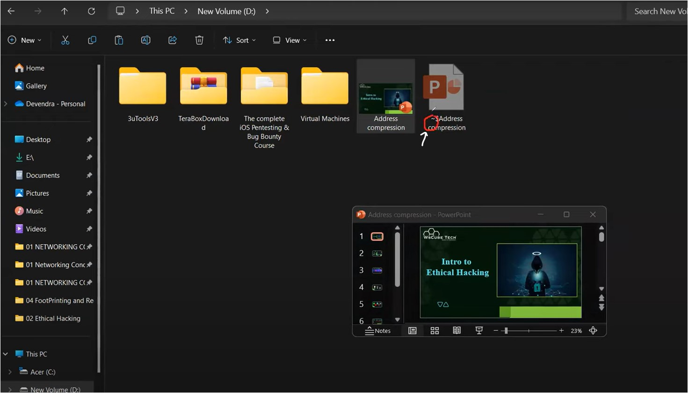

#WsCubeTech-CEH-notes 

---
### What we'll learn 
> Lecture Name : All About Linux
> 1) Theory : What is Linux
> 2) Theory : Cool features of Linux
> 3) Theory : Basic File System of Linux

---

### What is Linux
- it's a OS (like in phone - android is running , in lapi - windows OS running)
- free to use cuz - it's open source
	- situation 1 for windows OS : a developer came & he made a OS & he don't want to allow anyone to use  windows OS freely , so he sold with every system & he earned a lot
	- Situation 2 for linux OS : a developer came in world & he decided to make a OS which is free to for everyone  cuz there are many people who can't able to use the system - due to Windows OS is expensive
	- open source means anyone can use it freely - means the source code of it is free to everyone  but windows OS source code is paid , so if someone try to seen it then can't standard
- open source code to modify
- Linux OS is based on linux kernel
	- kernel : means it comes b/w software & hardware & it helps to build the insteraction/communication  b/w software & hardware
- made on sep-17-1991 & made by Linus Torvalds
- community
	- means Windows OS is controlled by Microsoft - but nobody owns the Linux OS
	- community - means a group of people or organization  if a same mindset people create a group i.e a community

### features of Linux
Q : what's the special thing about Linux which is used in ethical hacking
1. Multi-user capability
2. Multitasking
	- but this is not special feature cuz windows OS also do it
3. Portability
	- Linux OS is very much portable than window OS
	- Eg : it can be installed anywhere like "finger print scanner" - use linux  ATM machine also use Linux & those places used where heavy OS like Windows OS  can't be used then linux OS will be used
	- u can use in Live CD/USB - means u can make install Linux via live boot & it'll properly work  but in windows OS - u need to install then it'll work - but u don't need to install linux  directly plug & u can use & nobody can get any info that someone use a 2nd OS
4. Secure
5. GUI
	- Eg : ur android OS made with linux also , means android is a sub-part of android
	- so android OS owned by google 
6. Application support
	- cuz u'll get updates + community support for help & solve ur queries
7. file system
	- Eg : u installed VMware in windows OS but Window OS didn't ask permission to run or not for installation  but in linux , to install any software , we need to give permission to run , but if we don't give then it won't run
	- linux treat each file as same - like in windows OS , each file treated differently  Eg : photo files has different extension , software file , etc  but in linux OS , different files consider as same
8. open source

### Basic File System of Linux
- This is very imp to imp ⭐
- First : understanding "Windows OS" File System
	- Main Drive is C
	- Program Files 📁= contain 64bit applications  Program Files x86 📁= contain 32bit applications
	- Users 📁 = tells how many users are in  For Eg : inside of it , 3 folders are there i.e Default , deven , Public  Public 📁 = means Guest user  Deven 📁 = means admin/Owner user
	- admin vs guest user Eg : admin user - means like u're the owner of ur home = means which has more powers  & then guest user - which comes inside ur home i.e guest = means which can only see  - So admin can go on his/her private place  - but Guest can't go on admin's private places like where money kept ,  so they don't have permission to access or go there
	- Windows 📁 : contains files which are used to run Window OS that u installed
		- if any single file or folder gets deleted then the installed Window OS gets deleted
- Understanding - Basic File System of Linux
	- Pic  
	- `/bin` : means root location 
		- Eg : in windows OS - we have `C:` - means c drive &  in Linux OS , we have a backslash `/` = means root location (which doesn't mean that it's root folder)✔
		- Eg : in Windows OS , to go inside "program files" folder like this "C:/program files"  same - in Linux OS , to go inside "bin" folder like this "/bin"
		- bin folder - contains each code of basic commands/programs like ls , cd , mv , etc
	- `/sbin` : means in Window OS , we have a "Windows" folder
		Q : what is inside the "Windows" folder ? Ans : inside of it , there are windows supported files - which are used to run Windows OS
		- so same here , `/sbin` contain supported files for Linux in order to run Linux OS
	- `/etc` :  Eg : in windows OS , if u want to do changes then u go in settings
		- & in Linux , whatever applications are installed , etc stuff , so whatever the settings u want to do  of any software/application - then go inside `/etc` folder
		- `/etc` : means settings/configuration files
	- `/temp` : means temporary files
		- like temporary files created due to some reasons then eventually there work gets over
		Q : what's the special about temporary files  Ans : whenever temporary files created - then those file will have tilde sign `~`
		Q : how temporary files gets created actually  Ans : like take a PPT file & edit it then a temp file will be created 
			- like this  
			- & like when we do `CTRL + Z` to undo the changes & close the PPT file  then this temp file of PPT will be removed
			- so when u're editing a file then a temp file (means copy file) will be created  & let's say u made a mistake in actual file & when u do undo the changes then <Q : how u're able to do undo  Ans : that's due to the temp file of that actual file , that's why the temp file created
	- `/usr/bin` : contains applications which are installed by users  Q : explain the path ?  Ans : in root location , there is a user folder i.e `usr` & inside `usr` folder - there's a bin folder
	- `/usr/share` : contains Application support & data files  Q : Application support & data files - means ?  Ans : it means whatever the application are inside in a Linux OS , there are sometimes  of these applications which are not daily but sometimes those files required  so these files save in `/usr/share`
		- Eg : open ur chrome browser , there are many features & settings , so do u use them daily  but u use them when those features or settings are required
		- so same with applications contains files , so those files sometimes required for applications✔
	- `/home` : contains all the users - just like we saw "users" folder in windows OS
		- & all the files & folders of each guest users are inside of there own 
		- so `/home` folder contain files & folders of only each guest users , not Admin user
	- `/root` : means admin
		- Eg : in windows OS , there was C:/user/deven  so same here in linux OS , `/root` means admin user (means `/root`) at root location (means `/`)
		- so `/root` folder contain files & folders of only admin user  like desktop , document , download folders , etc are inside `/root` folder
		- in linux OS , admin called as `root` user

---
### End of the Lectures (Doubts) : 
- about "/etc" folder in kaliOS : https://www.perplexity.ai/search/in-kaliOS-etc-zw9g0USkSfGsFxbl_UgdTg 
- Q : can temp mails can be track  Ans : Yes , via SPF record can be track that temp mail &  via IP address also possible - if we got his/her actual IP address 
- Kali Linux VS Blackarch Linux: Which is Better for Ethical Hacking :  [Kali Linux VS Blackarch Linux: Which is Better for Ethical Hacking - YouTube](https://www.youtube.com/watch?v=puH_p924mCI&ab_channel=WsCubeTech)
- Install KALI LINUX Purple on Windows 10/11 | what's new in it :  [Install KALI OS Purple on Windows 10/11 - YouTube](https://www.youtube.com/watch?v=yM4neJ6Ne-k&ab_channel=WsCubeTech)