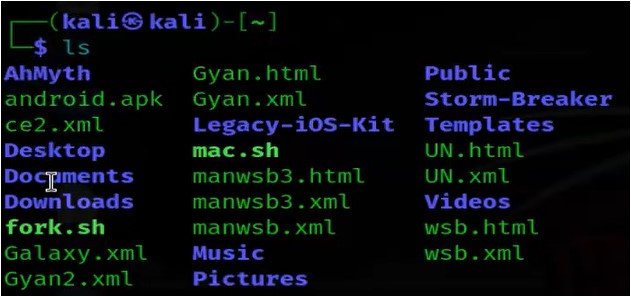
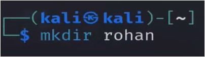

#WsCubeTech-CEH-notes 

---
### What we'll learn 
>Lecture Name :  Linux Commands
> 1) pwd
> 2) ls
> 3) cd
> 4) ls -l
> 5) ls --help
> 6) ls -a
> 7) ls -A
> 8) mkdir rohan
> 9) rmdir rohan
> 10) rm --help
> 11) rmdir -r rohan
> 12) rm -r rohan
> 13) cp aditya /home/kali/Documents
> 14) cp -r aditya /home/kali/Documents
> 15) mv aditya Desktop , mv kashif /home/kali/Documents
> 16) nano arvind.txt , gedit arvind.txt
> 17) cat arvind OR cat arvind.txt (in linux , we don't need to define file extension name)
> 18) 3 Permissions : `-r OR r` , `w` , `x`
> 19) clear
> 20) chmod : `chmod -x arvind` , `chmod -xwr arvind` OR  `chmod -777 arvind` , <br>`chmod +xwr arvind` OR `chmod 777 arvind` OR `chmod +777 arvind`
> 21) 2 ways to run a file via terminal : `./` , `bash` => Eg : `./arvind` OR `bash arvind`
> 22) ways to install softwares => Eg : `apt`
> 23) commands to remove the errors 
>     - Note: if u made changes in a file & then running the file - again error comes then run these commands<br>1) `apt update` <br>2) `apt upgrade` <br>3) `apt clean` <br>4) `apt update --fix-missing`<br>5) `rm -r /var/lib/lists*` <br>6) `dpkg --configure -a`
> 24) history
> 25) top

---

### Linux Commands
1. `pwd` : to show the current path that u're in right now
	- full form : Public Works Department
	- Eg : <br>
2. `ls` : means list
	- used to show the files & folders of the current path
	- Eg : <br> 
	- here dark green color are executable files which can run
- `cd` commands
	1. `cd` : means **change directory**
		- folder means "directory" - in terminal language
		- Eg : 
			- 
	2. `cd ..` : means to go 1 directory back
		- Eg : 
			- 
	3. `ls -l` : in GUI , we can check size of folders & files via right click on a folder/file -> click properties
		- but to check via terminal then `ls -l` command used 
		- This command will tell <br>1) what permissions those files & folders have <br>2) how much size those files & folders have <br>3) which user open those files & folders , etc
		- Eg : <br>
		- Q : the root & root , kali , kali - means Who made this ? <br>Ans : means <br>Eg : AhMyth folder made by root & those folders + files (which are made by kali user) are shown as a kali
		- & 4096 is a size of the folder & "Nov 2 09:56" - for when that folder made
		- & on left corner of "AhMyth" folder - `drwxr-xr-x` are permissions
- Advice : if u stuck in commands then u have 2 friends i.e help & man
	- Eg : let's say we don't know how to list hidden files & folders via `ls` command
	- so either `ls --help` or `man ls` : will give description about all commands related to `ls` <br>but mostly use `ls --help OR ls -h`
	- `--help` & `-h` : both means same
	- Eg : <br>
- hidden files & folders commands
	- `Note ✅`: `ls -a` - will show some hidden files but `ls -A` - will show all the hidden files ✔
	1. `ls -a` : to see hidden files 
		- in Linux OS , hidden files are those who have dotted before the name of the file or folder ✔
		- Eg : <br>
- make a folder 
	- in GUI , u'll go to that folder & u'll create a folder
	- `mkdir` : means make directory/folder
	- Eg : <br>
- delete a folder
	- `rmdir` : remove only a empty directory <br>(Note : a directory can't be deleted if that directory contains something inside itself) <br>Eg : <br>
	- Eg : a folder (which contain something inside itself) - then it can't be deleted via `rmdir` or `rmdir -r` <br>cuz here , "rohan" folder contains inside itself a folder
		1) 
		2) 
		- & if u don't know what `-r` does of `rmdir` command then see about it via `rmdir --help`
	- means `rmdir` can only remove/delete a empty folder , not that folder which's not empty ✔
	- `rm` : delete a folder which is not empty ✔ <br>Eg : `rm -r rohan` <br>
- copy & paste a folder inside the another folder
	- `cp` : to copy & paste a folder inside a other folder
		- Eg : `cp aditya /home/kali/Documents` <br>
		- Advice : whenever error comes - then read the error carefully - cuz mostly error also tells the solution to fix the error ✔
		- Eg : `cp -r aditya /home/kali/Documents` , so here `-r` doing forcefully <br>
		- Q : why system makes us to use `-r` <br>Ans : cuz when system think that folder is imp then the system says to use `-r` to do forcefully ✔
- move/cut & paste a folder from one place to the another place
	- `mv` : command to move a folder i.e "aditya" to desktop
	1) Eg : `mv aditya desktop` <br>
		- Note : currently "aditya" folder & desktop were on same path <br>that's why we didn't wrote the path to move the "aditya" folder to desktop
		- Output : when we did `ls` in desktop then no folder will be shown <br>cuz it's like we were move/cut the folder & u rename the folder <br>but actually we didn't move the folder cuz <br>- Note : cuz in linux , files & folders names are case sensitive <br>means in linux, Desktop folder "d" should be capital not small ✔
	2) Eg : moving a folder to another folder (which is far away from that folder which we want to move) <br>
- seeing files & folders of a different path/folder from sitting a different location without changing location
	- means we want to see inside Desktop folder - without changing current location <br>that we're in let's say Documents ✔
	1) Eg : `ls /home/kali/Desktop/desktop` <br>
	2) Eg : `ls /home/kali/Desktop/` <br>
- how to create or see a txt file 
	- in windows OS , we use tool like notepad , wordpad , etc
		- 1) Eg of Windows OS : `notepad vss.txt` <br>- so if vss.txt file exist in the system then it'll get open & if doesn't exist then vss.txt file will be created ✔<br>- inside the file - write anything & save it
		- 2) Eg of Windows OS : `notepad vss.txt` - run the command again <br>& now this file will get open cuz we have the file <br>
	- in kali Linux , we have different text editors like nano (bydefault) , gedit , etc <br>so let's use "nano" text editor
		- 1) Eg : `nano arvind` - nano text editor set the bydefault txt extension , so we don't need to define <br>- Now text Editor will open in ur terminal , so write anything <br>- & to save `Ctrl + S` & to exit out from text editor `Ctrl + X` ✔
		- Note : in kali OS<br>1) if u're creating a txt folder - then no need to define ".txt" <br>2) but if u're creating ".exe" file or any other file extension (except) - then u have to define that file extension
- `cat` command : how to see stuff written inside the txt or any file 
	- Eg : `cat arvind` & no need to define file extension in Kali Linux ✔ <br>
	- output : content which are inside the file will get printed on terminal only
- a file has 3 Permissions ✔
	1. `-r or r` (read)
	2. `w` (write)
	3. `x` (execute)
	- so a file has by-default 2 permissions i.e read & write & no file has execute permission by-default ✔
- writing more stuff like executable command in 'arvind' file 
	- 1) Eg : `nano arvind` then <br>remove all stuff & write these stuff in it i.e <br>
		```
		How are u ?
		echo "im good, how are u?"
		```
		- now `Ctrl + s` & `Ctrl + x` to exit
		- Now we want to check what permissions have in this particular file `ls -l arvind` ✔
- How to come at "home" folder of kali , doesn't matter how deep we're in which folder
	- just write `cd` & Eg : <br>
- `clear` command : clean the terminal completely OR u can do `Ctrl + L`
- `chmod` command : to give & remove single or multiple permissions to a folder/file
	- `chmod` : means change mod - means that file/folder going from normal mode or executable mode ✔
	- Eg : <br>
	- here "AhMyth" folder has `drwxr-xr-x`<br>d - means it's a directory , r - means read , w - means write , x - means execute <br>-xr : means execute & read , so on...
	- 1) Eg - to give/add the permission from the file/folder : <br>we want to give execute permission to "arvind" file -> `chmod +x arvind` <br>so `+`  means adding a mod to that folder/file & name of mode i.e `x` , so `+x` add executable mode <br>to "arvind" folder ✔ <br>Output : <br>
	- so color of "arvind" file changed from white or green cuz it got executable permission "-rwxr-xr-x"
	- 2) Eg - to remove a permission from the file/folder <br>`chmod -x arvind` : so executable permission will be removed from "arvind" file
	- 3) Eg : to remove multiple permissions from the file/folder <br>-> `chmod -xwr arvind` OR  `chmod -777 arvind` <br>Output : all permissions removed from "arvind" folder/file<br>
	- 4) Eg : to give read , write & execute permissions back to "arvind" folder/file <br>-> `chmod +xwr arvind` OR `chmod 777 arvind` OR `chmod +777 arvind`<br>Output : all permissions added in "arvind" folder/file <br>
- Ways to execute a file in terminal : Now let's execute a file i.e "arvind" - after giving it -> a execute permission
	- we have 2 ways to run a file via terminal ✔
		- 1) `./` : "dot blackslash" will run/execute all 99% maximum executable file ✔<br>if u directly do `./`
		- 2) `bash` : is also run many executable files ✔
	- Eg of `./` : run the "arvind" file only `./arvind` <br>
	- so in "arvind" file , "How are u" message was written - but terminal didn't understood <br>that's why "how: not found" printed & we got "im good ,How are you" properly printed
	- Eg of `./` : now let's remove the executable permission from "arvind" file -> `chmod -x arvind` <br>Output : now execute the file -> `./arvind` - then we'll get error 
	- & same with `bash` command - For Eg : <br>
- 4 ways to install a software 
	- like if u want to install chrome browser then 
		- 1st way : go to microsoft store & install it
		- 2nd way : via browser 
		- 3rd way : github
		- 4th way : apt 
	- apt : is like a playstore in linux - For Eg : `apt update` - then u'll get permission denied error <br> 
	- this error comes cuz currently we're on guest user i.e Kali of Kali OS , we're not in admin user <br>so we need admin permission then we'll able to run `apt`
	- Q : why we need admin/root permission <br>Ans : cuz before this , we were doing small things. Now doing advance stuff , we need admin permission ✔
	- to get the admin/root permission
		- `sudo su` : here `su` means super user ✔ <br>now it'll ask for password of Kali OS : i.e by-default password <br>
- using `apt`
	- so `apt` is a playstore to install softwares
	- if u don't know about `apt` then `apt --help` <br>
	- now install "gedit" text editor -> `apt install gedit`
	- `Note` : by-default `apt` will not allow sometimes to install softwares , <br>so by-default we need to do setting/configuration of `apt` ✔
	- Q : in which folder , setting/configuration exist <br>Ans : i.e "etc" folder
	- to do setting of `apt` - so do `etc/apt`& then do `ls` <br>Output : u'll see sources.list & "sources.list~" => means "sources.list~" file temp file <br>cuz sources.list file not saved <br>
	- write `nano` to open nano text editor , cuz "gedit" text editor is not installed by-default ✔ <br>so run this => `nano sources.list` <br>now write this <br>
	- Note : but don't add anything except these 2 lines otherwise error comes if u add extra lines<br>then do `Ctrl + S` & to exit `Ctrl + x` , now configuration completed , so u can install what u want
	- now might be errors comes , so run these commands to remove errors ✅<br>> STEP 1 : before doing anything , `apt update` : means it'll update the playstore & brings necessary files <br>which are related to playstore & applications/apps <br>> STEP 2 : `apt upgrade` - used to update/upgrade the apps/applications which are in playstore <br>if still error comes <br>> STEP 3 : `apt clean` - used to clean the files which are corrupted ✔ <br>> STEP 4 : `apt update --fix-missing` - used to bring stuff which are missing <br>like packet is not installed properly then u can use it to install that package properly<br>> STEP 5 : `rm -r /var/lib/lists*` - star means whatever the files & folders inside "lists" folder <br>delete them all completely ✔<br>> STEP 6 : `dpkg --configure -a` - use this command when above commands are not working <br>to remove the errors 

### Extra commands
- `history` command : to check which commands executed till yet , Eg : `history` ✔
- `top` : is a task manager , command : `top` 
- `reboot` : used to restart the kali , command : `sudo su` -> `reboot`
- `exit` : how to exit from super/root/admin user & come back to normal/guest user ✔
- Shortcut keys to do copy  & paste in Kali Linux : `Ctrl + Shift + c` , `Ctrl + shift + v`
- `thunar` : is a file manager name in kali - it's command to open the file manager OR make custom shortcut for it
- `service NetworkManager restart` : used to restart the wifi network of Kali - if Kali's network not working <br>`apt install realtek-rtl88xxau-dkms` : used to install network wifi drivers for kali OS
- `ping google.com` : to check whether in Kali OS , network is working or not

---
### End of the lecture (Doubts) : 
- Q : Folder vs File <br>Ans : File - is a program & <br>folder - is where we put all the programs inside of a folder
- Q : why hashtag removed from inside the `sources.list` <br>Ans : cuz `#` used for comment the line & by-default we need to do settings in Kali Linux <br>cuz it won't allow or give permission to download or install - that's why that hashtag removed ✔
- Extra Info : [40+ Basic Linux command - YouTube](https://www.youtube.com/watch?v=ZVT-BKNyaTg&ab_channel=HackerJohn)
- Q : How to Update and Upgrade Kali Linux Operating System? How to install Kali latest Version : <br>Ans : [Update & Upgrade Kali Linux OS? How to install Kali latest Version? - YouTube](https://www.youtube.com/watch?v=VPW61aWws_4&ab_channel=TechnicalHaroon)

