#WsCubeTech-CEH-notes 

---
### What we'll learn 
> Lecture Name : I.G (information gathering) using Search Engines & Google Dorks
> 1) What we do in Information Gathering ?
> 2) Types of Information Gathering (I.G) ? 
> - HomeWork

---

### What we do in Information Gathering ?
- Few Concepts + Practical Work related to Information Gathering are on [10_lecture-M2](10_lecture-M2.md)
- stuff done in information gathering :
	1. Personal Details
	2. Company Details
	3. System Information
	4. Gathering all Information about target/Victim  (Victim - means that person/system on which we're going to attack)
	5. Entities Belong to target  (Entities - means name , no. , etc)
	6. Technology  (means taking out information about technologies that Victim were/is using)

### Types of I.G ?
- 1st : Active & 2nd : Passive  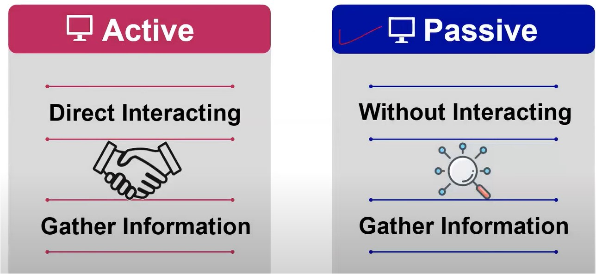
- in Active I.G , for Eg : 
	- u're asking from Kate about ally for information like where she live , her address , etc.
	- so here Kate also knowing or getting information that u're asking from her about ally
	- so either u're asking from Kate physically or via whatsapp message  - both will be consider as Active I.G
	- so when Victim knows that u're asking about Victim himself/herself , it'll be consider as Active I.G  cuz here u're doing Direct Interacting with someone about Victim ✔
- in Passive I.G , For Eg : 
	- gathering information without interacting - means Victim didn't know that u're collecting Information  about her/him - like going social media of Victim , etc websites - to know about the victim
- Q : u're getting information about that person from his/her Linkedin profile , so is it Active or Passive I.G Ans : that's Active I.G , cuz when u view that person's Linkedin profile then Linkedin will  send the notification to that person about "This is a person who viewed ur profile"  - `imp Note ⭐` :  any information which make Victim aler/aware or Victim now knows about it  then it'll be Active I.G , not passive ✔
- Q : Information Gathering Practical did on WsCubeTech , is it Active or Passive I.G  Ans : that was Passive I.G 99%  - Mine thought - for 1% was Active cuz u visited on linkedin & linkedin will notify to Victim who visited
### use/pros of Information Gathering
> What're advantages when we do Information Gathering
> ➞ Importance of Information Gathering Example : [10_lecture-M2](10_lecture-M2.md)
1. Time Saving  - then we can do direct attack
2. Easy Processing
3. Accurate Attacking  - cuz we done the main thing i.e Information Gathering - due to which system got hacked

### Ways to do Information Gathering
- in [10_lecture-M2](10_lecture-M2.md) , we did information gathering about Victim (WsCubeTech) via 1st way/source i.e using Search Engines 
- here we'll see 2nd source i.e Google Dorks/operators (means Google Hacking Advance Techniques)
	- STEPS - to do Google Advance Search
		- STEP 1 : search "advance search" on google search engine
		- STEP 2 : click on "Advanced Search" link 
			- Pic 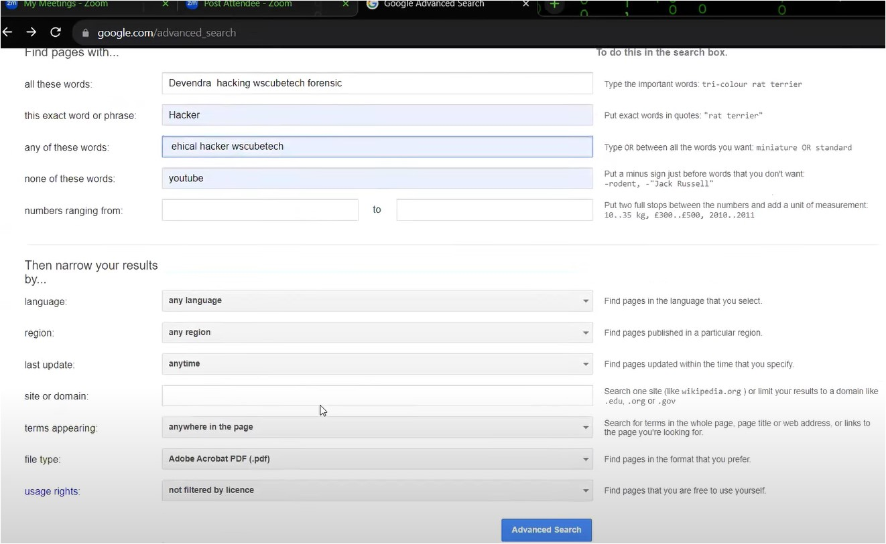
			- `all these words` : means let's say we wrote -> Devendra hacking wscubetech forensic , so total 4 words in one sentence , `all these words` means all these 4 words should come in search results
			- `this exact word or phrase` : means let's say we wrote -> Hacker , so `this exact word or phrase` means -> "Hacker" word should be there in search results
			- `any of these words` : means let's say we wrote -> ethical hacker wscubetech ,  so if any word out of these 4 should come then show in search results
			- `none of these words` : means let's say we wrote -> youtube , so `none of these words` means we don't want "youtube" word on output  Eg : if u put "Hello world" in `none of these words` input field - then  output : `-hello -world` : so both words will get minus sign
			- `number ranging from` : means it's for when u're doing buying something , so input fields empty of this
			- `language` : don't select any language cuz if u select specific language like Hindi  then if that website is in English then output will not come 
			- `any region` : don't select any region cuz what if information which we need it's server on different country that's why ✔
			- `last update` : keep "anytime" , cuz we can get data which is vital & what if that data is old
			- `site or domain` : we'll not define domain or site name , cuz what if data is on different domain  Eg : if we write -> wscubetech , then search results will come only of wscubetech , not others
			- Advice : touching/modifying too much then output might come bad 🧠
			- `terms appearing` : means the output which will come , so where do u want that output to come  Eg : do u want that output on "in the title of the page" , etc . so "keep anywhere in the page"
			- `file type` : means in which form - u want that output  Eg : do u want that output in PDF , etc . so select it as "Adobe Acrobat PDF (.pdf)"
			- `usage rights` : do u want output in which filter form , so select "not filtered by licence"
		- STEP 3 : click on "Advanced search" button
		- Output :  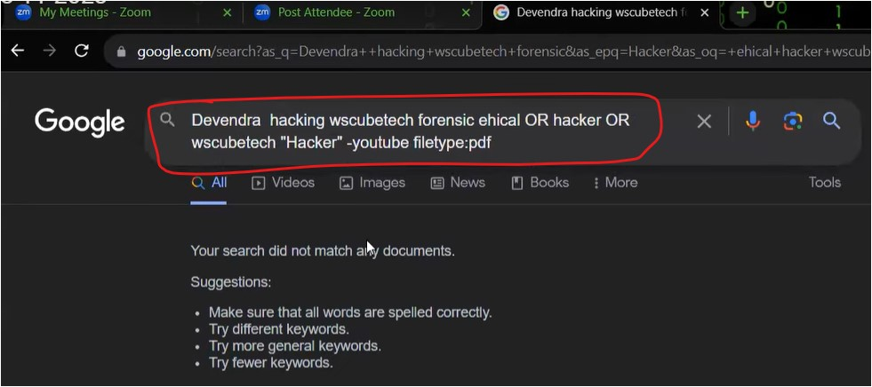
		- see how google did the search behind the scene ,  - 1st : Devendra hacking wscubetech forensic -> comes as `all these words`  - 2nd : ethical OR hacker OR wscubetech -> comes as `any of these words`  - 3rd : "Hacker" -> comes as in double-quotes which means `Hacker` word must be shown in search result  - 4th : -youtube -> comes as firstly a hyphen sign added with "youtube" word  which means don't show youtube word in search result  - 5th : filetype:pdf -> means only pdf file must be shown in search result , not others file format
		- Eg : directly go in google search or google dorks , write `song song OR india "Arjit Singh" -youtube`  output : arjit singh related stuff will come but youtube stuff related to him will not come
	- in 2nd source - Advance techniques which is used for I.G i.e `Google Dorks/operators` are : 
		1. `cache:`
		2. `filetype:`
		3. `intext:` & `allintext:` 
		4. `inurl:` & `allinurl:`
		5. `intitle:` & `allintitle:`
		6. `inanchor:` - it's not useful for CEH
		7. `site:`
		8. `|` - we'll learn this in password cracking Topic
		9. `*`
		10. `-`
		11. `indexof:`
	- these are Google Dorks or google operators
	- in `cache:` operator : cache - means temporary files 
		- Eg 1 : whenever u open a application then a temp file will be created for that application ✔ Q : why temp file being created  Ans : so that application will get load fast  - like in Kali Linux , `~` sign temp file created for that PPT application  so either u can say that file as a temp file or cache file  - & if we don't save the changes which we made in the file then that temp file will not remove itself
		- Eg 2 : let's say we're on Phone & when we visit first time on a specific website ✔ then that website will open slowly cuz resources which are required for that website to load fast  those resources are not in ur System , so at first time visit - those resources (like settings , etc) will be loaded & saved  in ur device. So when u open 2nd time - then the website will get load fast due to those resources aka temp/cache files 
		- usecase/importance of `cache:` operator in Ethical Hacking ⭐ :  - if a developer made a website & he wants to do changes with time on his website again then might be previous version is not saved properly or not deleted properly  - so cache file of that previous version of his website - can be used to know what's the changes being made  & if we found any vulnerabilities - then the issue can be used to catch the hacker or hack him ✔  - that's why one of the usecase/importance of cache file is used
		- there is a difference b/w cookies & cache  - cookies takes all the system's information , system's configuration & details cuz  if u do any wrong activity then u'll be caught by cyber police  - in cookies , u'll see in upcoming lectures - session hyjacking
		- Eg 1 : in one tab - write `cache:wscubetech.com` & 2nd tab open wscubetech website
			- Pic  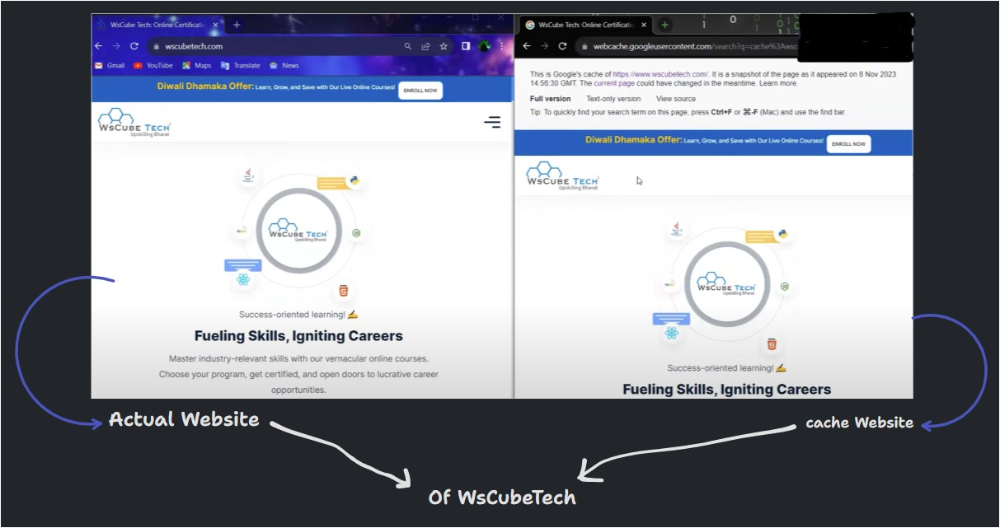
			- now u can see above stuff written in cache wscubetech website
			- Practical Work : Finding the difference b/w actual website & cache website of wscubetech ✔  > STEP 1 : open any text compare website like https://text-compare.com  > STEP 2 : view the source code of actual wscubetech website & copy the source code completely & paste in on left side input field of "text-compare.com" website  > STEP 3 : view the source of of cache website & copy the source code completely & paste  on right side input field of "text-compare.com" website  > STEP 4 : click on "compare" button & whatever the things which are highlighted - that's the difference  but that  difference is not vital one  - & even in cache website of it - which u viewed - there's a time coming 14:56:30 GMT  that time is coming due to that difference
	- in `filetype:` , Eg : let's say we searched on search bar of google i.e `hacking book filetype:pdf`  output : we'll get only pdf file format related to hacking book , no other file format will come in search results
	- in `allintext:` & `intext:` : 
		- `intext:` : means in text form
			- it takes only single word ✔
			- Eg : search `intext:wscubetech` & anywhere in search results "wscubetech" written in text form  those results will be shown  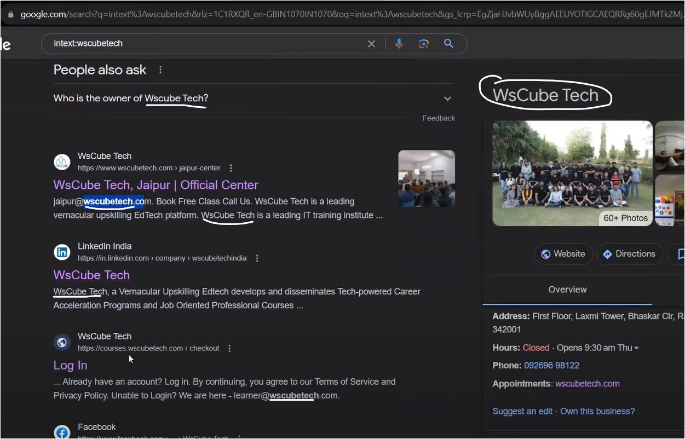
		- `allintext:` : means all in text form
			- it can take single or multiple words & if any one out of those multiple words found in search results  those results will be shown ✔ 
			- Eg : search `allintext:wscubetech devendra hacker`  
			- in output , hacking word also coming cuz hacker word used
	- in `allinurl:` & `inurl:`
		- `inurl:` : it takes only single word
			- Eg : `inurl:wscubetech` - so those search results will be shown whose have "wscubetech"  in their URL  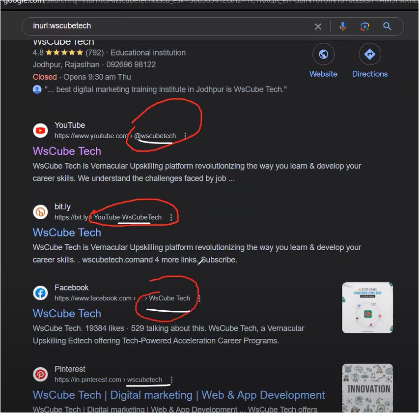
		- `allinurl:` : it can single or multiple words
			- Eg : `allinurl:wscubetech youtube facebook` , those results will be shown whose have  if any one or all these 3 words come in URL  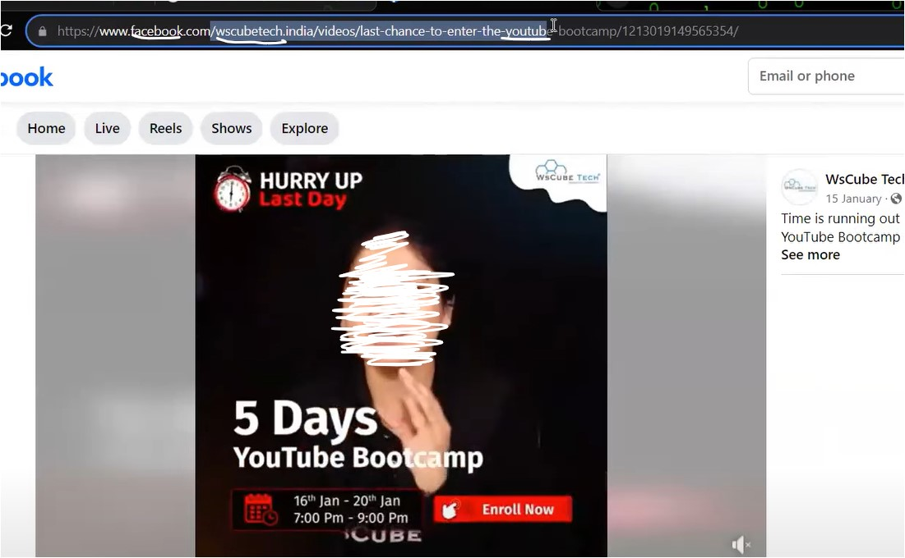
	-  in `intitle:` & `allintitle:`
		- `intitle:` : means showing a word in title (means the tab name (of the browser))
			- it takes only one word
			- Eg : `intitle:facebook`  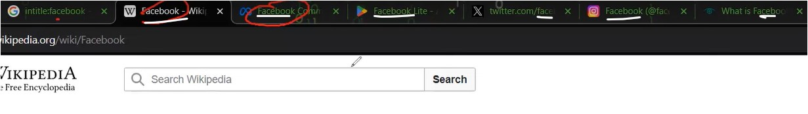
			- means we'll get only those results which contain "facebook" word as title ✔
		- `allintitle:` : means - same as `intitle:`
			- it takes one or multiple words 
			- Eg 1 : `allintitle:facebook wscubetech instagram` : means those results will be shown  whose have either any one or all these words inside the tab (of a browser) as title/s ✔
			- Eg 2 : `allintitle:facebook wscubetech youtube`
	- in `site:` : 
		- means Eg : `site:wscubetech.com` - only those results will be shown which are only related to wscubetech.com , no other websites links will come as outputs ✔ 
	- `-` : means minus sign
		- used to remove/don't show a word/s which we don't want in search results
		- Eg 1 : `mindset books love -romance filetype:pdf`  Eg 2 : `mindset books -love -romance filetype:pdf`
	- `*` operator :
		- used to show all the results which are related that thing - which u defined ✔
		- Eg 1 : `wscubetech` - let's say we don't know whether wscubetech has `.com` or `.in`  so put `wscubetech*` - it'll show all the results which are only related to wscubetech ✔
		- usecase of it - let's say u know half word of that complete word - but u forgot half word of it  Eg 2 : `devendra` - but u don't know sir name of the name , so put star sign - `devendra*`  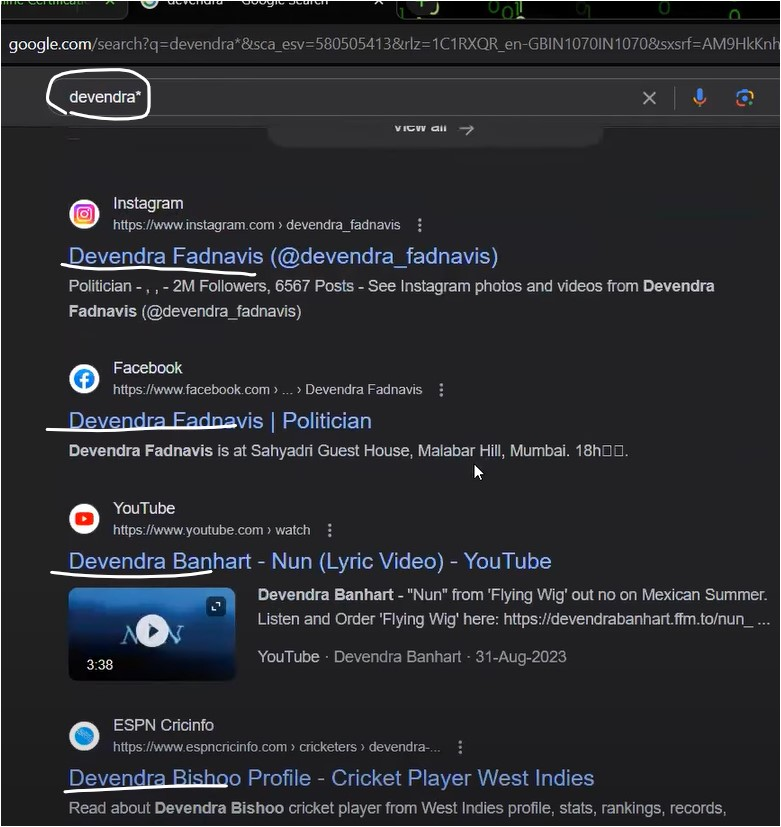
	- `indexof:`
		- Story
			- Q : can we access files & folders from a computer of any client  Ans : No , any client can access their own computer not others
			- so a developer when make a website then that website contain files & folders  & they extract that website & kept files + folders on a server  Q : can we access/see files & folders of a website of a developer  Ans : no , cuz they are private
			- only in one case possible via which we can access/see those files & folders  if that server has a problem in itself & that might be `Directory/path Traversal` ✔
			- so if any server has issue of `Director Traversal` - then files & folders of that server  we can see clearly & sometime `Director Traversal` aka `indexof:` ✔
			- so we can't access/see files & folders of a server until we hack or has any vulnerabilities like `indexof:` ✔
			- so any website has vulnerabilities issue of `indexof:` - then we can access/see files & folders 
			- this issue is little dangerous & special way also
		- Examples 
			- Eg 1 : `indexof:facebook.com`  - so anything which is running via connectivity of facebook but their server has vulnerability of `Directory Traversal` ✔  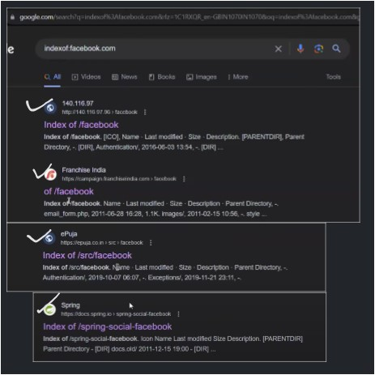  - files & folders  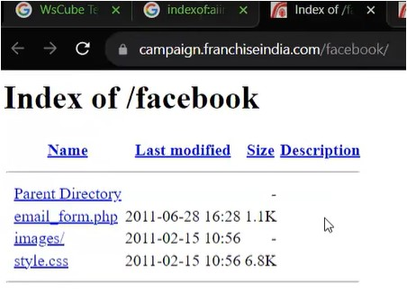
			- so due to `Directory Traversal` vulnerability in their server - that's why we can see files & folders
			- Eg 2 : `indexof:aiims` 
		- via this issue , we can find out more vulnerabilities in a website & can hack  cuz what if in those files & folders - there is imp files - then due to this a website become more vulnerable ✔

---
### Homework
1. see these Google Dorks Operators for I.G
2. so make a deep report on wscubetech for I.G 

---
### End of the Lectures (Doubts) : 
- More on : Google Dorks/Operators :  > https://www.youtube.com/watch?v=u_gOnwWEXiA&ab_channel=NullByte  > https://www.youtube.com/watch?v=lESeJ3EViCo&ab_channel=Hak5  > https://www.youtube.com/watch?v=hrVa_dhD-iA&ab_channel=NetworkChuck  > https://www.youtube.com/watch?v=xpzvlC6WNPU&ab_channel=An0nAli  > https://www.youtube.com/watch?v=QLhUYxgalKI&ab_channel=CyberStudies  > https://www.youtube.com/watch?v=GlIG37uZSjQ&ab_channel=Afshan-AFSHackersAcademy
- Advice : clear ur doubts during lecture, cuz taking ur doubts at home is like baggage  if u're getting any doubt in ur mind during lecture then clear it right now  otherwise if u're not getting doubt during lecture then it's fine ✔
- Advice - Q : can i get the PPT via which Sir Explain  Ans : those PPT are not useful cuz only points are written in those PPT  so make ur own self-notes , so these PPT are useless & in future , u'll get many books to read