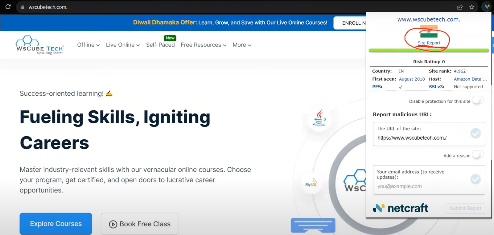
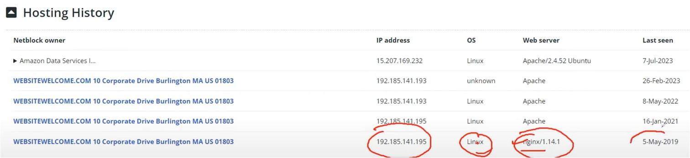

#WsCubeTech-CEH-notes

---
### What we'll learn 
> Lecture Name : I.G using 3rd party Tools & Services
> 1) till how many sources we saw in I.G
> 2) 3rd source for I.G : 
> 	1) using Third Party services/Tools for I.G
> 	2) using websites for I.G
> 	3) 3rd source : gathering "subdomain" for I.G

---

### till how many sources we saw in I.G
1. 1st source : search engines
2. 2nd source : google dorks / google Advance Operators
3. 3rd source : now we'll use - Third Party Services/Tools

### 3rd source : using Third Party services/Tools for I.G
- Tools :
	- wappalyzer - technology profile : [Wappalyzer - Technology profiler](https://chromewebstore.google.com/detail/wappalyzer-technology-pro/gppongmhjkpfnbhagpmjfkannfbllamg)
	- Netcraft Extension : [Netcraft Extension](https://chromewebstore.google.com/detail/netcraft-extension/bmejphbfclcpmpohkggcjeibfilpamia)
1. Doing I.G via Wappalyzer tool
	- STEP 1 : go wscubetech.com website & then open the Wappalyzer on this website   
	- it's showing version of technologies 
	- Importance of knowing about version of a technology is being used on website :  - let's say u're using ZOOM & it's version is 2.4 currently  - so it gets updated from 2.3 - which means there was vulnerability in 2.3 that's why it gets updated to 2.4  & then we can exploit that vulnerability  - that's why , company say that update ur phone
	- `imp Note ⭐` : on this website "Apache HTTP Server" is running - which means
		- in Linux OS , whenever a Port `80` gets open  Q : who open this Port 80 ✔ Ans : so in Linux OS , this Port 80 - opened by a inbuilt Linux server i.e Apache
		- & in Windows OS , `IIS (Internet Information Service)` server open the Port 80
		- so when a Linux OS open the Port 80 , then a location contain a file - let's say location is `var/www/html`  so the file which is on that location - will get online - in localhost (127.0.0.1) of Port no. 80 ✔  & u can see the website 
		- so ultimately , conclusion  - in Linux OS , Port no. 80 - ON/open by Apache - aka service/Linux-server  - Apache aka `nginx` , so if u see either Apache or Nginx server - then that means Linux is running ✔  
	- Practical Eg - to understand service of the Apache  server `imp⭐` : 
		- STEP 1 : on terminal , `sudo su` & give the permission to enter in root location  cuz advance stuff can be done only by super-user , normal-user can't do
		- STEP 2 : run `service apache2 start` & hit enter   
		- & now Port no. 80 gets open/run
		- STEP 3 : but let's stop the server - in order to know whether Port no. 80 started or not  `service apache2 stop`
		- STEP 4 : to check IP address
			- `ipconfig`   
			- `eth0` - means wifi-interface ✔ Q : what're the stuff connected with this interface ?  Ans : inet `192.168.224.138` => inet - means IPv4 - inet6 `fe80::7a9e::456e:3d4f:a2ae` => inet6 - means IPv6  - ether `00:0c:29:2c:de:c1` => ether - means MAC address
			- in Kali Linux , once Apache server start/run Port no. 80  then this Port No. 80 will start based on 3 things i.e  1) on localhost IP `127.0.0.1`  2) on the domain name of localhost i.e `localhost` 3) on the Private IP address of a system `192.168.244.138` ✔
			- so Port no. 80 of each of these 3 things , page will be visible  Q : which page  Ans : the page which is inside `var/www/html`   
		- STEP 5 : Now we'll check whether Port no. 80 is running or not on these 3 things  i.e IP address of localhost , domain of localhost & on Private IP address
			- STEP 5.1 : open browser
			- STEP 5.2 : put localhost of system for checking whether Port mo. 80 is running or not  `127.0.0.1:80` - means after the localhost - one colon then port no. 80  - let's check on Private IP `129.168.224.138:80`  - let's check on localhost's Domain `localhost:80`  - Output : in all 3 of them , no page is showing
			- which means nothing is started cuz we didn't started the services
		- STEP 6 : let's start the service `service apache2 start`  - this command will open the port no. 80 , so when apache service gets started then  that port will get open
		- STEP 7 : Q : which file get online when the service gets started  Ans :  - STEP 7.0 : run `/var/www`  - STEP 7.1 : do `ls` - u'll get html folder  - STEP 7.2 : do `cd html` - u'll get 2 html files , so that service will run "index.html" file
		- STEP 8 : now let's check is anything coming after running apache service ✔ - STEP 8.1 : let's start with localhost `127.0.0.1:80`  - STEP 8.2 : checking on localhost's Domain `localhost:80`  - STEP 8.2 : checking on the System's Private IP address `129.168.224.138:80`
			- Note ✅ : we're running the page locally in our system , so if running via IP address  & no output comes then remove https to `http://129.168.224.138:80`  - cuz SSL certificate is of https , not http  - so we're running the page locally , not on server  - means our localhost doesn't have SSL certificate that's why with `https` - not working
			- output : on 3 of them , u'll get index.html page online   
			- so all networks gets ON , so port no. 80 is opened by apache
		- by-default apache will run that "index.html" file on Port no. 80 , but we can change Port no. ✔
		- STEP 9 : to check whether that page is the one (which is running or not)  - STEP 9.1 : run `gedit index.html`  - STEP 9.2 : & then change the heading from "Apache2 hAcking" to "Apache2 Debian Default Page"  - STEP 9.3 : then run any one of them out of 3 , let's say IP `192.168.224.138:80`  output : now page heading will get changed & local page i.e "index.html" will get online
2. Doing I.G via NetCraft-Extension tool
	- STEP 1 : open wscubetech.com & click Netcraft-Extension tool   
	- STEP 2 : click on "Site Report" btn of Netcraft-Extension tool 
		- output : all the information we'll get which we learned in DNS Topic   
	- information which are useful in output of STEP 2 
		- Background - is not useful info 
		- in Network section :  - Nameserver : which we talked in lecture 5 - in DNS topic i.e NS1 & NS2  ,  - "Netblock Owner - Amazon Data Services India" - means this site using AWS server ,  - IPv4 address - of wscubetech  - IPv6 address - is not present cuz IPv4 already running for a site   - organisation - which is a address ,  - DNS admin : we're getting email id of DNS Admin  Q : so in further , we'll see from where this DNS admin email leaked ✔ - Reserver DNS : telling AWS server's name i.e south-1.compute.amazonaws.com
		- in IP delegation section : contains information related to server & where server being changed
		- in SSL/TLS section : contains basic information - Cipher : means telling algorithm - means on server , which encryption algorithm is used  we'll see this information in upcoming lectures
		- in Certificate Transparency : contains information which algorithm is used
		- in Hosting History : contains server information  -Pic :   - this Pic , telling information about when wscubetech changed/updated the server  including IP address & web server but OS remain same  - currently IP address u can see in pic & web server : is Apache/2.4.52 Ubuntu - means  apache - is a server & it's version 2.4.52 & OS is Ubuntu ✔
		- & rest below details are not useful

### 3rd source : gathering "DNS record" for I.G
- STEP 1 : go in different websites for DNS record
- STEP 2 : search `DNS lookup` & open websites like https://nslookup.io & https://digitalocean.com
- STEP 3 : in "nslookup.io" website , search "wscubetech.com"
	- Pic : 
	- A records - one time "A" means IPv4 IP address 
	- AAAA records - 4 times "A" means IPv6
	- CNAME record - means like forwarding to a different domain or sub-domain
	- TXT records - means admin can write any text as per his/her thoughts
	- SPR records - means for mailing services
	- Pic : 
	- NS records - means Name server , so wscubetech has 2 name servers  - `imp Note ⭐` :  in each website must have 2 name servers for security ✔ - & if there's no name server or just have 1 name server then that website is vulnerable ✔
	- MX records - means mail servers , so wscubetech using google servers for mailing ✔ - but when wscubetech do mail then mail comes from wscubetech , not from google ✔
	- Pic : 
	- SOA data - means SOA (information about admin)  - so `email dashrath.wscubetech@gmail.com` - this information is getting leaked from  admin records i.e SOA records ✔ - so from `ns1529.websitewelcome.com` this server - SOA records getting leaked ✔
	- select dropdown of "other records" & change SOA to PTR (Pointer record) - output : nothing will come , which means the website is secure  - These further vulnerabilities will be shown on those website which have vulnerabilities
	- `imp Note ⭐` : DNS SRV record didn't shown by this website , if SRV record shown  then it's a big vulnerability in a website cuz SRV record contains all the services names ✔
- STEP 4 : let's do I.G on testphp.vulnweb.com/guestbook.php
	- STEP 4.1 : use Netcraft-extension on this website & click "site report" button
	- STEP 4.2 : & in "nslookup.io" website - copy & paste testphp.vulnweb.com/guestbook.php
	- output : u'll not see much information about this website , so this website is secure
- so we gathered information via seeing major records like DNS , NS , MX records but subdomains records left ✔

### 3rd source : gathering "subdomain" for I.G
- STEP 1 : search subdomain finder & click on https://subdomainfinder.c99.nl  - this website works properly , but use other websites also by urself 
- STEP 2 : in this website , write "wscubetech.com" & click "start scan"
	- Pic : 
	- these are sub-domains of wscubetech , some are active - which are running & some are non-active
- now let's say u want to see each records separately like MX then search `MX record finder` ✔ 

### 3rd source : gathering information via "dnsenum" inbuilt tool
- so we gathered information via websites , now let's use a inbuilt tool i.e `dnsenum` ✔
- STEP 1 : if u don't know about dnsenum then run `dnsenum -h`
- STEP 2 : run `dnsenum wscubetech.com` , 
	- u'll get output like Name servers (NS) , MX servers , etc   
	- `Imp Note ⭐` : earlier , in Lecture 5 - we learned about Zone file  - so that "zone file" is with NS1 & NS2 , so a attack can be done in that "zone file"  - & that attack called Zone Transfer Attack  - so if we as a Hacker got that "Zone file" , then we can see many information like PTR records , SRV record , etc ✔  - so if that attack possible in a website then it's a vulnerability  - so "dnsenum" trying to get that "Zone file" via Brute Force Attack
	- so `dnsenum` also do same thing , if there's a vulnerability of Zone file then this tool will bring it like this   
	- here `dnsenum` tried to that "Zone file" from both NS , wscubetech refused to give that  cuz there's not a vulnerability of Zone File  - & `dnsenum` will also do brute Force attack to get that "Zone File" aka Handshaking request✔  - so here in Brute Force Attack - `dnsenum` will find sub-domains again
	- we aren't doing on different website cuz not have permission to do on them  for Testing purpose u can do on testphp.vulnweb.com/guestbook.php  - or search websites on google for information gathering vulnerabilities
	- Brute Force attack used in password & in many other situations also ✔

---

### Homework
1. use different websites for subdomain information for I.G
2. use `dnsenum` tool in ur system to scan wscubetech for I.G

---

### End of the lecture (Doubts) :
- Q : what does eth0 means in kaliOS :  Ans : https://www.perplexity.ai/search/what-is-eth0-UNspIzinTgWuKYsx17xqRw
- Q : define enumeration :  Ans : https://www.perplexity.ai/search/what-is-enumeration-aQCZTIiwSHWmPZzfxz1wGA
- Q : define footprinting :  Ans : it's aka I.G  https://www.techtarget.com/searchsecurity/definition/footprinting
- Q : is both Enumeration , footprinting means same as I.G  Ans : Yes
- Q : about DNS Enumeration :  Ans :  > https://www.youtube.com/watch?v=rQ-dc5kwRtU&ab_channel=HackerSploit  > https://www.youtube.com/watch?v=EpfHhEGz35I&ab_channel=HackerSploit  > https://www.youtube.com/watch?v=c3Ts6F2OcWk&ab_channel=NetSecNow  > https://www.youtube.com/watch?v=ZUAOuXJQ0ao&ab_channel=TheAB  > https://www.youtube.com/watch?v=VyGTVrR0Mio&ab_channel=SpinTheHack  > https://www.youtube.com/watch?v=9f1AW2it2WY&ab_channel=ITkFunde  > https://www.youtube.com/watch?v=mCbz92LdEfY&ab_channel=CyberJunkie  > https://medium.com/@danielwebimprints/dns-enumeration-f9cd0d60b67b  > https://medium.com/@ssalssa.1.12.2.1.2.1/dnsenum-154cc0f3691c  > https://ankisinha.medium.com/dnsenum-a-command-line-information-gathering-tool-a535078207a6  > https://www.knowledgehut.com/blog/security/enumeration-in-ethical-hacking  > https://www.techtarget.com/searchsecurity/definition/footprinting
- Q : DNS zone transfer  Ans : https://www.youtube.com/watch?v=kdYnSfzb3UA&ab_channel=HackerSploit
- Q : meaning of "mapping one domain to another domain"  Ans : https://www.perplexity.ai/search/maping-one-domain-PmuGNqyJS62xJURQ1j3CZQ
- Q : if we do footprinting via 3rd party then if any information will go to that main host of the website  Ans : somewhat Yes & somewhat No  - cuz when u do something & then a packet will go that server , connection not made properly  - that's why whenever we do penetration on a website - then ask for a permission from that person  - but if u do without telling then u'll be caught by that company + cyber police  - & our information goes - cuz we're using a 3rd party tool/website  - cuz we saw how to behind the scene , connection gets established  so when we do Information gathering - then that server will go our system's packet  cuz without sending a Packet Request - information gathering can't possible  - it's like if u want to Kate indirectly then either u have to search her on internet or talk to someone who knows her
- Q : is any Dorks have for Social Medias like for Google Dorks is for google  Ans : No , cuz u have to visit to their Social Media Profile & gather Information from their profile  - for Social Media : we have Recon-ng & Nmap or find alternatives 
