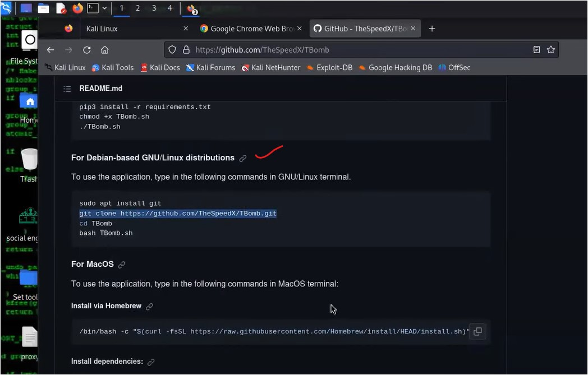
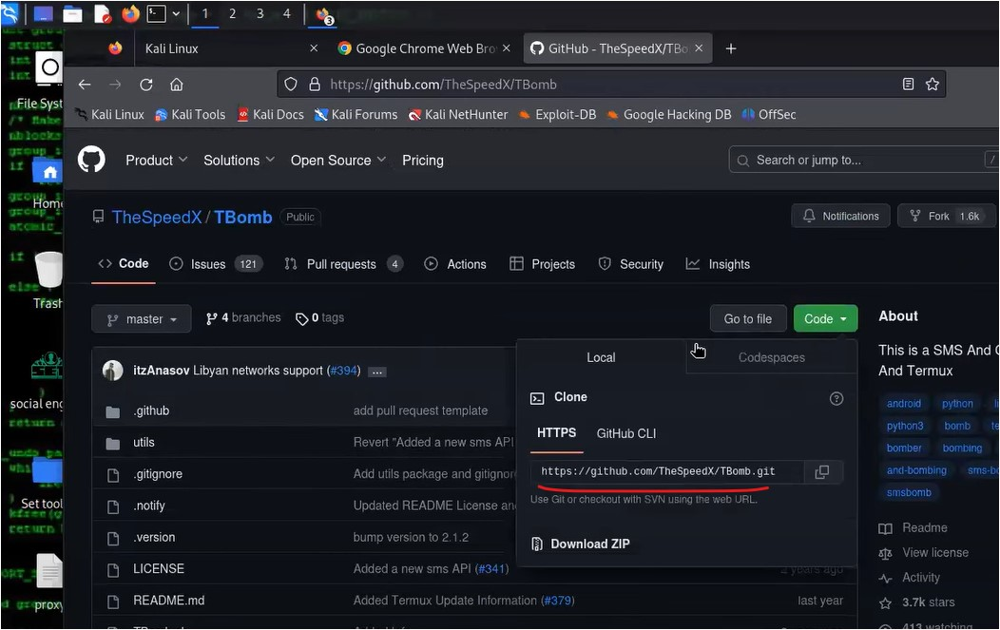
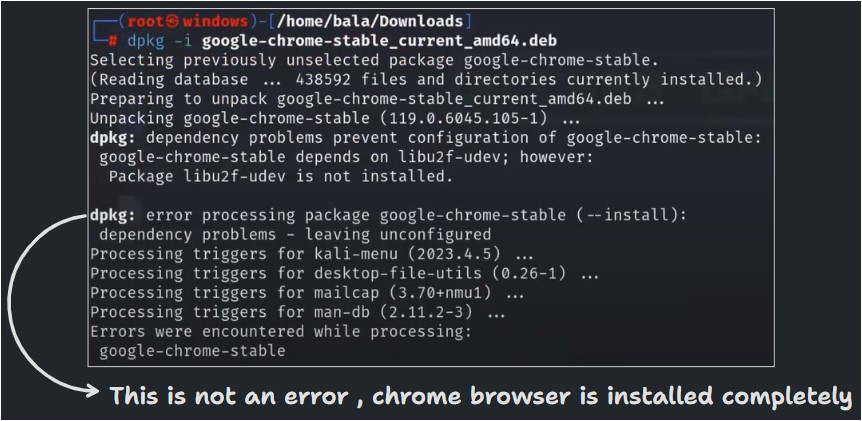
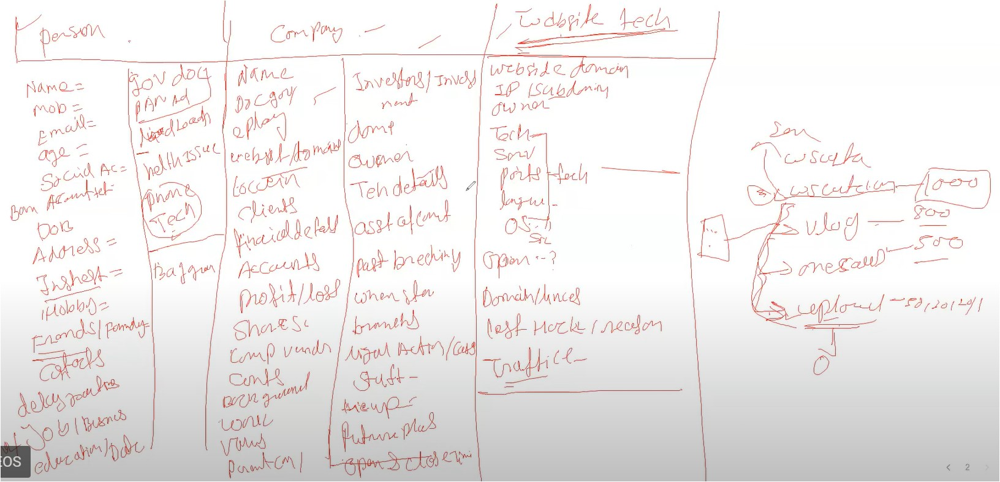
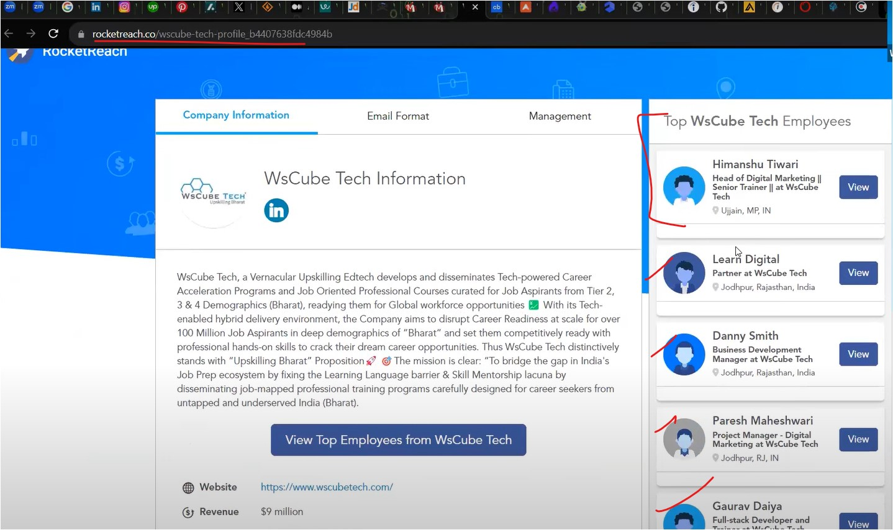
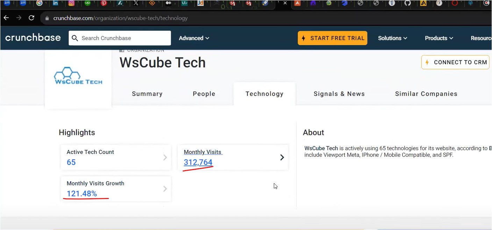

#WsCubeTech-CEH-notes 

---
### What we'll learn 
> Lecture Name : More Linux Commands & Information Gathering
> 1) More Linux Commands (these commands to remove errors)
>    - apt update --fix-missing
>    - apt install --fix-broken
>    - 3 playstore in Kali Linux to install apps
> - Homework

---
### More Linux Commands
> Commands to remove errors
1) `apt update --fix-missing` : [09_lecture-M2](09_lecture-M2.md)
2) `apt install --fix-broken` : broken command mostly used with install , it'll not work with "update" Eg : `apt update --fix-broken`
	- so if running `apt install gedit` & during installation error is coming  means if u're installing any application/package then during installation if any error comes  then add `--fix-broken` otherwise don't use `--fix-broken`
	- For Eg : `apt install gedit --fix-broken`
- so whatever commands we did till yet - are going to use in daily life & these are basic commands 😊
- 3 playstore in Kali Linux  1) apt  2) browser / website of it  3) github
	- Q : How to download apps or chrome via browser in Kali linux
		- STEP 1 : in kali , open firefox
		- STEP 2 : search chrome download & click on link
		- Q : now how chrome knows that we need chrome for linux - Which Header told to Chrome that client wants a chrome Linux version   Ans : Header name is "Request Header" which told to Chrome website that client wants Linux version  & we learned about "Request Headers" Topic , so there we learned request packet  so "user agent" take our OS & brown details , that's why Chrome got to know that this person  installing chrome in linux
		- In Linux , only `.deb (Debian/Ubuntu)` packet supported by-default
	- How to download software/apps via github like "TBomb"
		- STEP 1 : search "tbomb github"
		- STEP 2 : go to it's github page & scroll down for download debian/linux based   
		- OR u can click on "code" button > Note - no need to install Python & PIP - cuz in linux u'll get by-default 
		- STEP 3 : giving root/super user permission -> `sudo su`
		- STEP 4 : git clone https://github.com/TheSpeedX/TBomb.git & hit enter
		- STEP 5 : go inside "TBomb" folder where u installed it => `cd TBomb` then do `ls`  Now see which file can be run i.e `bomber.py` , `TBomb.sh`  so we'll run TBomb.sh cuz bomber.py will via python
		- so by-default `TBomb.sh` file has executable permission but if u still want to give - then u can `chmod +x TBomb.sh`
		- STEP 6 : now to run/execute the file -> `./TBomb.sh`
		- now to run that python file - u can use `./` but mostly python required to run ".py" extension file . To run  the "bomber.py" python file -> `python bomber.py`
		- & to run again either use dot backslash `./` OR `python bomber.py`
	- installing .deb package/applications
		- STEP 1 : to go in downloads folder -> `cd ..`
		- STEP 2 : to install google chrome (which is in .deb) -> `dpkg -i google-chrome-stable_current_amd64.deb`  Output :  

### Information Gathering / Footprinting & Reconnaissance
> This is a 1st step into Ethical Hacking
- Information Gathering aka Footprinting & Reconnaissance
- Q : what's Information Gathering ? Ans : whenever we're attacking to someone or to hack someone  , 1st process is Information gathering  Q : what we do in information gathering ?  Ans ; we try to take out A to Z or all complete information about a Victim
- Q : importance of information Gathering Ans : Story
	- let's a MNC company hired a Black Hat Hacker & company said him to hack a system  so that "black hat hacker" did all combinations of attack (which are related to Windows OS) whatever possible  But he didn't able to hack the system , so again company hired a "Ethical Hacker"  so this "Ethical Hacker" guy - his 1st step of hacking process - he gathered information  > For Eg : identify IP address running , which OS using , what are applications running on it with their versions ,  Owner of the website , etc . So he did complete scanning  > so during scanning process , he got to know - that linux OS is running & in application - vftpd software  & it's version is 2.3.4  > Now he did a search that - in this version of that application - what's the vulnerabilities . Then he got  a vulnerability in vftpd software & he exploited the system   > then in few min/secs - he hacked the system - cuz he got to know which OS running on the system i.e linux
	-  Conclusion :  - "Black Hat Hacker" : neither gather any information nor run any task & he was running windows OS related attacks  & the system was Linux . So he never able to hack that system  - That's why - before hacking , Information Gathering is v imp  
1. Q : on which stuff we do information gathering
	1. person 
	2. company
	3. website/technology
	- so these are 3 major stuff including "System" on which we do information gathering
2. Q : what are the information which can help us to hack a Victim in "information Gathering" process
	- Ans : information gathering of a person
		- Eg : Name , mobile no. , email , age , social accounts (images , etc) ,  DOB ,  address (Country , state , etc) , hobby + interest , friends/family , contacts ,  Gender (it can be fake) , daily routines , Job/Business , education/Date , govt. docs (PAN , Aadhar, etc) ,  bank accounts details (everything , loan - it use in social engineering) health issues ,  person's background , phone + 		every technology gadgets
		- So these are the patterns related to the Victim
		- so these details help to hack a person , How ?  Ans : we'll try each details to find out matching password
	- information gathering of a company
		- Eg : name , docs (internal + external) + govt. docs + etc docs , employee + staff details ,  website (domains details , etc) , location , clients , financial details , accounts details , profit/loss ,  company shares , company vendors , contacts , company's background , type of work ,  investors/investment , CEO of company , tech details (everything including what phone ,  lapi , servers , etc they're using) , asset of companies ,  data breach earlier (means is this company hacked by earlier or not) + past data breaching ,  company's basic details (like when it started , etc) + company's branches + parent company ,  legal actions (like what cases are going on OR any legal case happen in this company or not)  company's tie-up , future plans , opening & Closing timing of the company , etc
	- information gathering of a website/app or company's technology (if company is tech based)
		- Eg : website domain , Public Static IP address of the website (host , etc), Sub-Domains , owner ,  technologies (which TechStack used to build it, SSL) , server details , How many Ports are open ,  which OS is running on the server , on which date it gets opened , when domain license will over ,  when this website hacked last time + with reasons , 
		- Q : why knowing traffic of a website / Importance of traffic (in a wbesite)  Ans : cuz For Eg : WsCubeTech has 15000 subs , so WsCubeTech has 3 sub-domains  i.e Vlog , courses , upload . So 800 coming on Vlog , 500 on courses , 200 on upload  so at the end , traffic of each sub-domain will be connected via only one server  so Generally , company keep that sub-domain more secure (which is getting more traffic)  > so attacker/hacker will find out that Sub-domain (which is getting less traffic)  & attacker will find out vulnerability , so if any one vulnerability got from that sub-domain  then via that single Sub-domain (which is getting less traffic) , all other Sub-domains will be affected + will be hacked
	- conclusion Pic :  
	- so these are stuff we try to find out in Information Gathering Process
3. Q : How to find out those details stuff in information Gathering
	- we have 3 sources to do Information Gathering : 
		1. search engines 
			- Eg : Q : what's a difference b/w search engines & browsers  Ans : Google , Yahoo , duckduckgo , etc are a search engine & chrome is a browser
			- Note : duckduckgo , Censys , Shodan , notevil  , etc - are related to Hackers search engines  u'll get many info on them  For More :  > [10 Best Hackers Search Engines in 2023 - GBHackers](https://gbhackers.com/10-best-hacker-friendly-search-engines-of-2023/)  > https://www.perplexity.ai/search/list-down-Top-6nx7lt5XR_.b71lZ4uUuLw
    	- for other 2 sources - in 11th lecture
	- firstly , we'll do information gathering via normal search engines - For Example : 
		- STEP 1 : 1st , we'll find info from the website  - search only "wscubetech" on google (not wscubetech.com)  - so acc. to our search , we'll get google map location of it , we can go to website  - STEP 1.1 : go to More > About Us page & scroll down - so mostly details are in "Contact Us" page  - in "Contact Us" page , address + mobile no. + email address are given  so these are the details which the company wants to tell/show
		- `Advice ⭐` : in ethical hacking , never just look for info from just seeing above stuff (like  this company just show it's courses website cuz they want to show their website above in "search results" via SEO)  so always dig into deep for information gathering  - cuz I.G is a 1st vital step - so do it properly before doing any other steps (like scanning)
		- STEP 2 : digging into deep of the website  - open it's linkedin , insta , upwork , interest , medium , twitter , etc websites related that website - so open those websites which are not ranked & related to wscubetech &  try to get information gathering related to the website  - from Linkedin social , u'll see many info about like how many employees currently working , etc
		- STEP 3 : & if a website asking for login - then don't login & u can close the website  if that website doesn't contain much info about the Victim's website  - if u do information gathering process on justdial about the website - then u'll get GST no.  - in rocketreach.co website , employees info showing of wscubetech  
		- in crunchbase.com website related to victim's website , in technology tab - monthly visit showing  
		- in zaubacorp.com , u'll get CIN no. , registration no. about that website
		- so these details we found via normal google search engine

### Homework
- STEP 4 : Homework for u  Now try to find out details about the website via using different search engines  & save those info in word file
- so currently u need to use "search engines" way to do information gathering about a Victim  in upcoming lecture , we'll see other ways
 
### End of the Lectures (Doubts) : 
- Advice : No need to install anything , when time comes for that concept then we'll install 🧠
- Advice : a person asked that we saw `.py` file , so why these programming languages file made  Don't distract urself & it'll go out of topic if we go deep into it ,  > In this course , Programming languages didn't use , python will be used in Penetration testing
- Advice : don't understand what was TBomb , in Lecture 9 : we were just understanding  how to install a package/software via Linux command , don't try to understand "what TBomb do"  - avoid it otherwise u'll waste ur time
