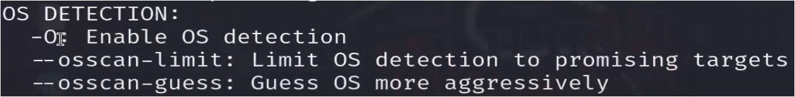

#WsCubeTech-CEH-notes 

---
### What we'll learn 
> Lecture Name : Intro to Network Scanning
> 1) Theory : what is Network Scanning
> 2) Theory : 5 Goals to achieve in the process of Network Scanning
> 3) Practical Work : Network Scanning - Nmap tool
> 4) Theory : Types of scan
> 5) Practical Work : network scanning with nmap tool 

---
### what is Network Scanning
- it's a 2nd imp step towards CEH after Information Gathering ✔
- it's a process that whatever systems are online (means connected to the internet)  & those systems are around in ur System's network range then getting details about those online systems ✔
	- 
	- "checking misconfigurations" : means by-default things left in a system   like a person brought a new router & a router comes with a by-default password  & by-default password of that router didn't changed by a person - then it considered as "misconfigurations" ✔

### 5 Goals to achieve in the process of Network Scanning
- in the process of Network scanning , we achieve our 5 goals  - let's say in ur System's range - a device is online & it's IP is 102.168.224.128  - so we'll scan this device ✔
- overview Picture of 5 goals OR network scanning methodology
	- Pic 1 : 
	- Pic 2 :   - we'll learn "Bypassing IDS" later but `-Pn` used to bypass a system's firewall
- 1st Goal/STEP : Host is online or not ✔
	- means that target Victim we're making - we'll check whether his/her that specific device  - 1st thing : is online or not  - 2nd thing : if the device/IP-address is online then whether it's in our System's IP address's range or not
	- Host = means IP address of the device
- 2nd Goal/STEP : Ports Open ✔
	- in that IP address or in that device - which Ports are open
	- Ports = means which roads are open 
- 3rd Goal/STEP : services ✔
	- including Open Ports , finding which services are running inside that System/IP-address
	- Eg : services like http or https or SMTP  which services is running on that IP address of that device or in that device
- 4th Goal/STEP : softwares + their versions ✔
	- means inside that services , finding which softwares + which versions of each software are running 
	- `imp note⭐` : difference b/w service & protocol
		- Eg : http & https = are services & TCP = is a protocol  - http & https are sometimes called protocol but actually they are services  - & let's take http only , so http has a version - assume http/1.1  let's say http is running on Port no. 80
		- Q : so who is using this "http" service ?  Ans : so chrome/browser is using this "http" service & let's say chrome's version is 19.2
		- so TCP = protocol  http = service  chrome/browser = software  
	- means which software (& it's version) is using that service (i.e 3rd Goal/STEP) ✔
- 5th Goal/STEP : OS banner grabbing ✔
	- Eg : when u open whatsapp or any other apps - then a banner/animation comes & it's version also shows  
	- so here grabbing the details related to OS which are running in that IP address or in that System

### Practical Work : Network Scanning - Nmap tool
- all the Network Scanning Process will be done via `nmap` tool
- `nmap` : means network mapper & it's the tool which helps in network scanning ✔
- STEP 1 : login in Kali linux + we need metasploitable also
	- so metasploitable = it's login & password is "msfadmin" & it's CLI based
- STEP 2 : in Kali linux , to use any tool - we need super user (cuz without it we can't work properly  & mostly of the stuff doesn't work without it)
	- STEP 2.1 : `sudo su`
		- STEP 2.2 : in Kali , we don't know about nmap , so `nmap -help` OR `nmap --help`  OR `nmap -h` 
	- in this pic , in usage section , how to use nmap & `[options]` are below things which have hyphen sign
- before starting scanning , we need to understand stuff like types of scan & why we always use those types of scan , etc  so let's understand those

### Types of scan
- Types of scan - means how many ways of scan - can be run
- Q : why we need these types of scan ✔ Ans : via these different types of scan , we can find/get those 5 Goals of an IP-address/system
- Pic of Types of Network Scans 
	- Pic 1 : 
	- Pic 2 : 
	- Advice : u can learn further Types of network scans in "nmap" tool ✔
- Types of scan are : 
	- 1st scan that we run : TCP i.e `-sT`
		- command of TCP scan is `-sT`
		- Q : how TCP will find/scan which Ports are open & which are not of an IP-address/system ✔ Ans : Q : how many ways that TCP do handshake/communication ?  - in lecture 4 , we learned about 3-way handshake communication by TCP
			- so let's say TCP - wants to do scan on Port no. 80  1st : TCP will send SYN packet from "A" System to "B" system  then 2nd : B will send ACK packet or B replied to A then 3rd : A will send ACK packet or reply to B  - so we're getting reply from B to A (when A send a SYN Packet or a message to B)  which means Port no. 80 is open of System B ✔
			- so total ports are `1 - 65535` ✔ , so TCP do process/scan on each Port &  if any port/s is/are replying - then TCP will tell u that - let's say Port no. 1 open , Port no. 2 open , etc.. ✔
			- Q : but how many minimum ports are required for communication ? ✔ Ans : 1 or 2 , but mostly only one Port required for communication
			- so if TCP continuously sending packet from `1 - 65535 ports`  but we need only one Port to make connection/communication  but TCP sending packet from a system to each port from `1 - 65535` for establishing communication
			- Q : is it good if TCP sending packet from a system to each port from `1 - 65535` for establishing communication ?  Ans : Q : who will decide the activity (i.e continuously sending packet to each port) is good or bad ?  - so each system has a firewall (is a security software) & a firewall already contain rules & regulations  related to system's security , so a firewall protect the system  - means whatever abnormal/weird activities happening are seen & handle by firewall
			- Eg : let's a malicious file (which transfer the data from system "A" to other system  & bring data from other system to "A" system & giving access automatically of system "A")  - so firewall got to know that these activities comes in malicious activity , so firewall will stop it  - so any activities which are malicious or  against of firewall's rules - & there're firewall's rules like how many ports gonna use for establishing connection , etc.. ✔
			- Q : if TCP send packet to all those ports to build connection with "A" system  & when "A" system's firewall do scanning - then what firewall will do ?  Ans : firewall always be in active mode (until we don't stop it manually)  - so if from "A" system - continuously a request going via port no. "65535" to establish connection  - then the firewall got to know that something weird activity is happening  cuz to establish a connection - only one Port 	is required  - & firewall will see if via same IP , a request (on Port no. "65535") going outside to unknown system continuously  then firewall will block the IP address of "A" system itself ✔
			- so "TCP" - can be scanned easily on 1 or 2 Ports , if TCP makes scanning on Port no. `65535`  then "A" system's firewall will block the IP address ✔
		- Q : how to write TCP in nmap tool  Ans : `-sT` : a hyphen sign then small "s" then capital "T"  
	- 2nd scan : SYN scan i.e `-sS`
		- command of SYC scan is `-sS`
		- so if firewall stop the connection then we can't do scanning  so people used their brain i.e TCP do 3-way handshake to establish a connection  - on in 3-way handshake ,  > TCP send a request i.e SYN packet from "A" system to "B" system  > then "B" system will reply i.e SYN + ACK to "A" system  - so the moment we got the reply i.e SYN + ACK from "B" to "A" system  - then we'll stop the connection : means we'll not give reply to "B" system from "A" system  - means to establish connection : the last ACK flag will be given to "B" system to establish connection  so that last ACK flag (we'll not send to "System B") - due to this , rule of firewall didn't break ✔
		- means firewall was saying that with an IP address only one or two ports will be used to build connection  - & connection can be established b/w 2 systems only in one case i.e when all the 3 handshake files get captured  - but in nmap ,  > "A" system sending SYN packet to "B system  > then now "B" system sending SYN + ACK packets to "A" system  - so due to this , neither a connection established b/w both systems nor firewall rules got break  & our work also got done ✔
		- means let's say "A" system send the request to port no. 80 (of System "B") then we got the reply from port no. 80 i.e Port no. 80 is open ,  so same thing we did with other ports till 65535 - so we scanned all the ports ✔
		- so the scan which we run from "A" to "B" system & "B" to "A" system = aka SYN scan/ half open scan/ stealth scan  i.e in nmap = `-sS` ✔  
		- so here 2-way handshake is happening instead of TCP usually do 3-way handshake ✔
	- `imp Note ⭐` : Q : why we use SYC scan instead of TCP scan ?  
		- majorly these two type of Scans (i.e TCP , SYC scans) used but there are many
		- we use less "TCP scan" cuz it break the rules of firewall & "SYN scan" is much more effective  - cuz it gives the best result & it doesn't get block by firewall  - mostly we use SYN scan ✔
		- means if we use "TCP scan" then TCP will send the request one by one to all port no. from 1 to 65535 for connection  then due to this firewall's rules get break & then firewall will block the IP address of that system itself  cuz at one time - only one port can be connected that's why we don't use "TCP scan" - so that's why we use "SYN scan" ✔

### Practical Work : network scanning with nmap tool
- few starting steps written in - "How we're gonna do Network Scanning - Nmap tool"
- Nmap's options are :-
	- `-v` : means increase verbosity level & for to increase more verbosity level `-vv`  > verbosity : means whenever a tool is working then to showing working output of what that tool is doing  means don't run things behind the scene , just show the process step by step about what that tool is doing✔  > so `-vv` : using double "v" will show more details of the working process of the tool
- Practical Example of Nmap
	- 1 STEP/goal : finding IP-address/Host of the device
		- so "Nmap" tool will do network scanning via IP address  so first step i.e we need to see the IP address of a system  if we don't know IP address of a system then we couldn't able to scan
		- STEP 1.1 : Q : how to find out IP addresses of each system which are in range + which are online ✔ Ans : so we use a inbuilt tool i.e `netdiscover`
		- `netdiscover` : command will scan all the IP addresses which are in range  
		- `imp Note ⭐` : in above Pic of `netdiscover` , starting 2 or 3 pairs will remain same & only last pair will change ✔
		- Q : How to know which IP addresses are in range of our System's IP address ✔ Ans : to check IP address of ur system : `ifconfig` & `inet 192.168.224.138`  - so here range is 3rd pair i.e `224` is a range  - so if starting 3 pairs of all those IP addresses are same = of our starting 3 pairs of IP address `192.168.224`  then those IP addresses are in our IP address range & last pair will be different of those each IP address ✔
		- in `netdiscover` command , when those different IP addresses comes in `224` of our IP address's range  then `netdiscover` will starting scanning those different IP addresses like this ✔  
		- so these networks/IP-addresses are shown which are in range of our IP address ✔
		- Q : what is virtual & virtual machine ? Ans : virtual machines are VMware , etc & kali linux installed inside of it called virtual OS
			- 1st , u have main system - which is running Window OS  - 2nd , second system which is running inside vmware
			- so just like in main system , we have RAM , ROM , processor , etc in hardware form so same way , in virtual machine - RAM , ROM , processor , etc all are in virtual  means vmware makes these virtually
			- vmware also makes virtual router also for installed OS like u installed virtual Kali linux , metasploit  so vmware makes virtual router for these OS
			- in ur main system - router is connected as a hardware - but in vmware , vmware makes  a router virtually for those OS which are installed inside of vmware ✔  - & there's no connection b/w ur main system & virtual system  so ur real router hardware - didn't connected with vmware's virtual router ✔  - so ur main router of main system is different than vmware's virtual router in ur main system ✔
			- in vmware , `netdiscover` will not scan those IP addresses which are outside of vmware  > means IP addresses will not be scanned of ur actual router's range  > cuz vmware's net is different - so vmware's range is different than ur actual router's IP address range   means vmware taking a IP address from ur main router but vmware's range is different ✔ > in vmware , those systems/IP-addresses will be shown which are installed in this vmware  > so we can't scan outside networks (means different systems/IP-addresses which  are in ur main router's IP address range) - but we'll see in upcoming lecture how to connect outside network✔  `imp note ⭐`  : in vmware & in main system , both will have different network's range ✔  > Conclusion : u can say both these are different systems & both systems are connected with different routers ✔  Eg : ur router is different than ur neighbour's router  
		- Q : Now tell which IP address for who ✔ 
			- Pic : 
			- Q : is 1st IP address is of Victim , If not then why  Ans : we also learned in lecture 3 , `192.168.224.1` > this is our 1st IP address of our IP address's range of vmware's virtual router  > & this is 1st IP address of `router` , not of victim ✔
			- 2nd IP address - is for supportive related for router itself ✔  `Note ⭐` : so if u see two IP addresses & last pair of them have `1` & `2` , those IP addresses are for router ✔
			- a last IP address - who has `254` as last pair in a IP address  then that IP address is for last-host/netmask  - when u find `254` in last pair in a IP address , then it's a last IP address  - means maximum limit or range of IP addresses can be provided to a system - so `255` is a last range , so last limit/range will be "254" - cuz "255" can't be - which we learned in Lecture-1
			- so `192.168.224.128` IP address - is of Victim's IP address  `Note ⭐` : `netdiscover` command will never show ur system's IP address ,   only those IP addresses will be shown which are in ur IP address's range ✔
		- STEP 2 : now stop the scanning cuz we got all the IP addresses which are in our IP address's range - so `Ctrl + C`
	- 2 STEP/Goal : now we got victim's IP address , now check open ports
		- STEP 2.1 : `nmap 192.168.224.128` , output :  
		- here showing "Host is up" - means Host is online  if Host is offline then we'll get "Host is down"
		- in pic , in "state" column - open or close status showing , so the pic - showing which Ports are open
	- 3 STEP/goal : services
		- in pic :  
		- in service column , each services shown like which service is running on each port
		- `Note ✅` : u can't remember all these services , so just google it & learn  & don't try to make notes on it also = waste of time
		- STEP 3.1 : in last - a "unknown service is showing  
		- Q : how many ports are in network ? ✔  Ans : total ports are `65535` ,  > so in above Pic - in "Not shown" section , nmap got "977" ports got closed  > so Ques come i.e if we add 977 closed ports & ports which are open  then those total ports will not be = 65535  > which means nmap didn't scanned all the ports
		- STEP 3.2 : now we'll do deep scanning via nmap's options i.e `-v` , run `nmap -v 192.168.224.128`
			- output : earlier we were not getting details in STEP 3.1 - but we'll get extra details    
			- like it runs "SYN Stealth Scan" , it scans 1000 ports & at the end - it also tell  - how many packets are sent i.e 1001 & received 1001
			- Q : what & why are these packets which were sent & received by nmap  Ans : these packets were sent & received in order to build connection ✔  - those packets when we were doing two-way or three-way handshake ✔
		- now when "nmap" by-default "997" port is bringing then let's take help of nmap
		- STEP 3.3 : run `nmap --help` : in order to find whether nmap has a specific option of scanning ports only
			- so output : 
			- so `-p` is a option for scanning only port related stuff & examples also mentioned  for scanning specific port no. & scanning range of ports 
		- STEP 3.4 : from STEP 3.3 , scanning all the ports - run `nmap -v -p1-65535 192.168.224.128`  but if u want to scan all the ports & don't want to define range then  run `nmap -v -p- 192.168.224.128` ✔
			- output :  
			- now it's scanning total ports 
			- Q : what was the main moto for scanning all the ports ?  Ans : in order to know how many open ports - we'll get after this command ✔
			- output : scroll down till end & so we got 5 unknown open ports 
			- to scan specific port no. : `nmap -v -p25 192.168.224.128` ✔ output : we'll get details about port no. 25 only  
	- 4 STEP/goal : software + it's versions
		- STEP 4.1 : run `nmap --help` => in order to know options for softwares & software's versions  
		- `note ⭐` : nmap tool called softwares as `services` also , so software means services ✔
		- `-sV` option : used to get software with versions also 
		- Q : after writing this `nmap -v -p- 192.168.224.128 -sV`  Ans : still here something missing i.e we talked about "Type of scan" - so which scan is much better  i.e SYN Scan , so command of SYN scan is `-sS`  - so do `nmap --help` , u'll get all the scan types/techniques  
		- STEP 4.2 : run `nmap -sS -v -p1-65535 192.168.224.128 -sV`  > 1st : which tool we're running i.e `nmap`  > 2nd : which type of scan we want to run i.e SYN scan i.e `nmap -sS`  > 3rd : range of port no. `nmap -sS -p1-65535`  > 4th : then defining Victim's IP address (which is online) i.e `nmap -sS -v -p1-65535 192.168.224.128`  > 5th : then getting softwares & their versions i.e `nmap -sS -v -p1-65535 192.168.224.128 -sV`  - output of STEP 4.2 : firstly nmap will scan open ports - then services  
		- Q : whose IP address is this `192.168.224.128`  Ans : it's a Victim's IP address  Q : who is the victim here ?  Ans : vmware is not a victim , Kali Linux (on which we're running this terminal) is also not a victim  - metasploitable is a victim ✔
		- Q : output of STEP 4.2 , who makes port no. 80 online ? ✔ Ans : in Lecture 13 , default port no. 80 run by i.e apache , so by using "http" service - apache is running 
	- 5 STEP/goal : OS details
		- STEP 5.1 : run `nmap --help` => in order to know options for OS details  
		- so `-O` will bring OS details
		- STEP 5.2 : run `nmap -sS -v -p1-65535 192.168.224.128 -sV -O` , 
			- output : 
			- in pic , "Running: Linux 2.6.X" - here "X" means could be any number of Linux's version
- further STEPS after 5 STEP/goal in Network scanning process  : 
	- Advice for scanning : when we did scanning to get all these above information about a system  then when we close the terminal then all the information will go away ✔
	- then we have to scan for the same thing again & again , so 
	- STEPS to save the scanning details about the system  > STEP 1 : `sudo su`  > STEP 2 : `nmap -sS -v -p1-65535 192.168.224.128 -sV -O -oX kapil.xml`  - `-oX` : used to save - so small "o" for orange & capital "X" - `kapil.xml` : is a file name
	- `imp note ⭐` : we saved the file in "xml" format cuz machine can understand xml file format ✔ but human can't understand xml file format  Q : why we're saving the file in xml format only ✔ Ans : we'll see in enumeration lecture  - & mostly we'll deal with xml format file that's why
	- STEP 3 : `ls` & run `cat kapil.xml` to see the content  but we can't understand the xml language , only machine can understand  cuz humans can understand html format ✔
	- so we'll convert xml file into html file  `imp note ⭐` : but we can't convert html file into xml file cuz errors will come  that's why , firstly we save the file as xml & then we'll convert a xml file into html file ✔
	- STEP 4 : converting kapil.xml file into html format  > we have tool `xsltproc` - used to convert a file format into a different format ✔  > STEP 4.1 : `xsltproc kapil.xml -o kapil.html`  - this command means : firstly name of the file comes which we want to convert & then  `-o` : means output & then in which format we want the file ✔
	- STEP 5 : run `cat kapil.html`  - so in order to understand the html file , we need a software i.e browser  - STEP 5.1 : open "kapil.html" file in browser , output : we'll get Nmap Scan report  
	- Q : why version of a software is important for us ✔ Ans : there always be a reason that a software gets updated  cuz might be in pic , "vsftpd" software running on old version  - & a person didn't updated the version in new one  - so first we'll see, for what reason - why the new update came & what's the issue in the old version  - so we'll find vulnerability & hack the software

---
### Homework
1. do practical of this step by step for understanding

---
### End of the lecture (Doubts) :
- Advice : to remember commands like `nmap -sS -v -p1-65535 192.168.224.128 -sV -O -oX kapil.xml` ✔
	- here u can understand each stuff in this command - according to each goal/STEPS which we learned 
	- so here linking method used in order to remember the information in brain  so for learning , try to link things which are related to each other in order to remember them properly
- Q : define IDS  Ans :  > https://www.perplexity.ai/search/IDS-means-in-V3I2A5_jSaCEi.VnqiyB5w  > https://www.ibm.com/topics/intrusion-detection-system
- Q : there are 2 systems "System A" & "System B"  - if System A sending request continuously via same port number to System B which is a unknown system  then is firewall block IP address of system A or System B  Ans : https://www.perplexity.ai/search/there-are-2-1RZyUtT7TkaMrj.PGS_uQQ
- Q : why sometimes http , https called as service & sometimes as protocols  Ans :  > https://www.perplexity.ai/search/are-http-https-7JsC8v40Qq6RWvwMP3BHqA  > https://www.perplexity.ai/search/are-http-https-9Jg21Y0DQCy8D6h4t_CJCw
- u don't have to run this command : `nmap -sS -v -p1-65535 192.168.224.128 -sV -O -oX kapil.xml`  in one go , Advice : run the command by using each options step by step for understand ✔
- we'll see later how to hack the system outside the vmware , but practice this one which we saw
	- Advice : hack the systems virtually , cuz going outside might the problem for u
- Advice : firstly sir taught the practical stuff about the topic & then he is showing PPT  earlier he didn't showed the PPT & now when he is showing PPT - i am not able to understand more clearly ✔
- Mine Doubt : 
	- sir said : so "TCP" - can be scanned easily on 1 or 2 Ports , if TCP makes scanning on Port no. `65535`  then firewall will block
	- Doubt : is firewall will block that Port no. OR TCP OR IP address of a system from establishing connection  Ans : Attacker's IP address will be blocked - but first firewall  of Victim's system will give warning