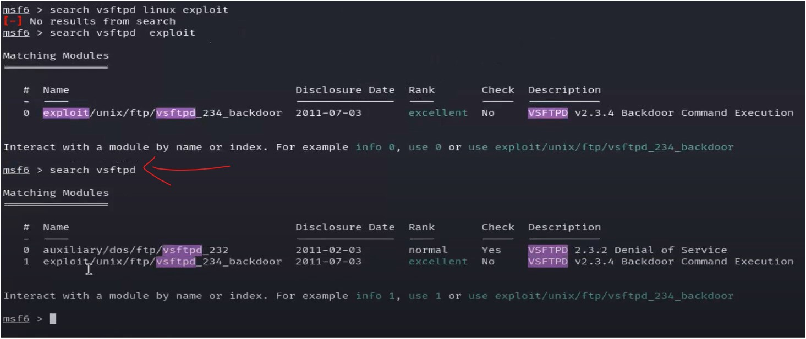

#WsCubeTech-CEH-notes 

---
### What we'll learn 
> Lecture Name : FTP & Telnet enumeration
> 1) Theory : intro of lecture
> 2) Practical Work : FTP connection
> 3) Practical Work : Telnet connection
> 4) Theory : what are exploits , auxiliary , payloads of "msfconsole" tool
> 5) Practical Work : exploits , auxiliary , payloads of "msfconsole" tool
> 6) searching : exploits , auxiliary , payloads for each service/protocol

---
### intro of lecture
- in the lecture , we'll learn exploitation by using those advance information which we got  after doing both type of Enumeration 
- & we'll hack the system i.e Metasploitable2  - so login inside this system - login & password is msfadmin  - & again login as superuser via using "msfadmin" for login & password  otherwise we can't able to run commands like `mkdir` , etc

### Practical work : FTP connection 
> We'll see establishing connection with Victim's system via FTP service/protocol  cuz FTP service/protocol (of Victim's system) - has a vulnerability i.e Anonymous Access 
- Q : which was the 1st port which we scanned via both type of Enumeration  Ans : i.e Port no. 21 i.e FTP service
- Advice : u don't have to know every protocols & what each protocol do  - when u go further u'll learn things along with concepts ✔
- let's see the report i.e Saurabhmanual.html - cuz it contains advance information of FTP service  STEP 1 : `firefox Saurabhmanual.html`  output : report is showing some credentials + Anonymous FTP login allowed  
- STEP 2 : let's do Anonymous login via FTP service
	- Anonymous login : means anyone person can login on that system
	- STEP 2.0 : start KaliOS + metasploitable2
	- STEP 2.1 : `sudo su`
	- STEP 2.2 : we have a tool i.e netcat
		- netcat : used to make direct connection/communication b/w two different systems  & it also used for other work which we'll see later  cuz currently - we want to establish communication b/w two different systems ✔
		- if we don't know about netcat `nc -help` , output : it's syntax is  
		- Q : in network scanning - we talked about , what is "verbose" means `-v` ?  Ans : means it'll show more information in front of us what is going on  instead of doing stuff behind the scene ✔
	- STEP 2.3 : `nc -v 192.168.224.128 21` & hit enter
		- we defined `21` port no. of FTP service/protocol cuz we want to make connection to that system  via using FTP service/protocol & we want files access of that system - cuz FTP means file access ✔
		- output : 
		- it's telling FTP is open & "220 (vsFTPd 2.3.4)" : means that system gave a direct access 👁
	- STEP 2.4 : do `ls` , output : "530 Please login with USER and PASS"  - it's saying to login with user & password
		- Q : where was the user & password when we got the report after doing both type of Enumeration Scan✔ Ans : so there are inside "ftp-brute" section of Saurabhmanual.html report  
		- so login & password are both "user"
	- STEP 2.5 : so write this way `USER user` & enter then `PASS user` , output :  
	- STEP 2.6 : if we try to check IP address `ifconfig` then output : "500 Unknown command"  - cuz work of FTP service/protocol is not about to bring IP address data  - work of FTP is about to bring files ✔
	- STEP 2.7 : let's do `ls` - output : "500 Unknown command"
		- so we don't know what to do , so run command `help` , output :  
		- so it means , we can run only these commands like XMKD  which is like `mkdir` command to make folder/s ✔
	- STEP 2.8 : we need to check path location `pwd` , output  : "257 "/home/user"" 
		- but when we go to Metaexploitable2 & check the path - then output : "/home/msfadmin"  > in Metaexploitable2 , for checking purpose - checking "user" folder , output :  
		- but we can't run `ls` command inside Metaexploitable2 system - which is inside Kali OS  cuz we don't have permission to run`ls` command ✔
	- STEP 2.9 : in Kali OS , for checking , to make directory in Metaexploitable2 - run `xmkd kapil`
		- output : a "kapil" folder will be created inside that location in Metaexploitable2 system (Victim's system)  
		- STEP 2.9.1 : go to Metaexploitable2 system , run `ls` , output : a "Kapil" folder is created
		- STEP 2.9.2 : in kali OS , run `user msfadmin` , output : "530 can't change to another user"  - so "user" command also not working  - cuz we need to go in "home" location of that system being in Kali OS , so if we do `cd ..`  then nothing will work  
		- Conclusion : of that Anonymous Login vulnerability in Victim's system i.e Metaexploitable2 ✔ 1) this system only gave the access of specific folder i.e "user" - where we can only create folder  2) we can't go to different folder & can't go back via `cd ..`  3) we can do further things via those commands which is provided by Metaexploitable2 system being in kali OS  like "dele" 
		- STEP 2.9.3 : let's try "DELE or dele" command , so if we run `dele kapil` , output : "Delete Operation failed"  > so might be "dele" command might be used to delete something else
	- so just under these commands what they do then try by urself  
	- so this all about establishing connection with Victim's system via FTP service/protocol  due to a vulnerability in FTP ✔
	- like XRMD : used for remove directory  , just like `rmdir` command do

### Practical Work : Telnet connection
- Q : on which port no. Telnet service/protocol is running  Ans : 23
- STEP 1 : we need to check firstly "Saurabh.html" report file (which is of "Automation" Enumeration scan) : `firefox Saurabh.html`  - output :  
- so Telnet service/protocol : used for remote access connection of a system
- STEP 2 : `sudo su`
- STEP 3 : `nc -v 192..168.224.128 23` , output : telnet open
	- STEP 3.1 : if we try to do `ls` , `ifconfig` , `help` - then no output/reply coming
	- so it means "netcat" tool not able to work properly for Telnet service/protcol  - means "netcat" tool is not for making remote connection with a system  - this tool can make a connection with FTP , but it can't work with Telnet for remote access of a system
	- so we'll not use netcat
	- Q : now why we'll not use "netcat" tool ✔  Ans : cuz it's making a connection , but we don't want to make connection with a system - we need remote access via Telnet service/protocol - but "netcat" tool not meant to use of this  - also we'll not use `nmap` tool cuz it's used for network scanning , not for getting remote access of a system 
- so Telnet is a service/protocol which gives remote connection &  Telnet is on every system to get the remote connection of that system ✔
- STEP 4 : so let's use `telnet` tool to build connection for Tenet service/protocol : `telnet -v 192..168.224.128 23`
	- output : error cuz "telnet" tool doesn't support `-v` option , so remove it ✔
	- STEP 4.1 : so `telnet 192..168.224.128 23` , output : we'll get complete remote connection of that victim's system  
	- & Victim will not get any idea what we're doing on his/her system i.e "Metasploitable2"
	- STEP 4.2 : write "user" for login & password , don't use "msfadmin" for login & password  - if login inside Victim's system via "msfadmin" for login & password  then we need to login again inside Victim's system as super user via `sudo su` command  - so either use directly "user" for login & password - to enter as superuser OR do "msfadmin" + again login as superuser  - in both cases , login as superuser in Victim's system - in order to perform commands like `mkdir` , etc  - but using Metasploitable2 (victim's system) directly & to login there as superuser - then use "msfadmin" , not "user"
	- STEP 4.3 : when u do `pwd` & then `ls` , output : we'll get output
	- STEP 4.4 : do `ifconfig` - then we'll get IP address , mac-address cuz we have complete access to the system  
	- now we can perform any operation
	- STEP 4.5 : for testing purpose : `rm -r balram`  & then `ls` , output : "balram" folder gets deleted permanently  > STEP 4.5.1 : to check whether this folder actually gets deleted or not , let's go to Victim's system  i.e in Metasploitable2 system , do `ls` , output : that folder also gets deleted from Victim's system too
	- STEP 4.6 : change the directory to check `cd /home` , output : we came inside "home" directory
	- STEP 4.7 : do `ls` & we need access of "msadmin" user : `cd msfadmin` , output : we came inside of it  - so without giving password to the Victim's system , we're able to access admin folder i.e "msfadmin" ✔
	- so this is the power of Telnet service/protocol  - So Telnet give the remote access of the Victim's system ✔
- Advice : do hacking stuff inside this testing machine i.e Metasploitable2 ✔
	- cuz this system contains vulnerabilities that's why we're able to hack  if each system are not vulnerable then those are secure
	- so use this system only for testing hacking stuff
- STEP 5 : now do `exit` , so we used tools i.e `netcat` & `telnet`
	- now let's use more powerful tool i.e `msfconsole` ✔  - it is v good tool & contains many exploits , etc
	- STEP 5.1 : run `msfconsole` & hit enter , output :  - it'll give intro about itself  
	- it's showing version of itself & things which are useful for us in it i.e exploits , auxiliary , payloads ✔ - these are not useful & not gonna helpful for us to learn - post , encoders , nops , evasion
	- files of all these tools i.e exploits , auxiliary , payloads are inside a database (i.e postgresql) of `msfconsole` tool ✔  so we need to connect with that database
	- STEP 5.2 : before connecting with that database , checking whether that database is connected or not  - run command `db_status` , output : "postgresql selected, no connection"
	- STEP 5.3 : before running command `msfconsole` tool , run the command `msfdb init` to connect the database  - Note : & when run `msfdb init` - then don't run this command again cuz ur database will be connected permanently ✔  until u don't exit from terminal  - means if run the "msfconsole" tool then run "msfdb init" inside msfconsole tool   but if "msfdb init" doesn't work inside - then run `exit` from msfconsole & run "msfdb init"  then u can run "msfconsole" tool - & same with `service postgresql start` command of STEP 5.4
	- `msfdb init` : means start/initiate the database of ms
	- STEP 5.4 : after running `msfconsole` , we have to run the command always i.e `service postgresql start` ✔
	- `service postgresql start` : means start the service of the postgresql database ✔
	- now let's check again whether the database is connected or not
	- STEP 5.5 : `db_status` , output : "Connected to msf. Connection Type: postgresql"  - so the database is connected 

### What are exploits , auxiliary , payloads of "msfconsole" tool
- Q : What are Auxiliaries ? ✔ 
	- Auxiliaries are scripts of Metasploit i.e `msfconsole` tool
	- Eg : in previous lecture , we used scripts (i.e Manual & Automation Enumeration Scans) in `nmap` tool  - so these 2 scripts command are of `nmap` tool & both brings extra information Q : what are these two type of scripts doing ?  Ans : they are bringing advance/extra information about of the Victim's System
	- so `msfconsole` tool gave the name of those scripts as Auxiliaries  so these are working as scripts
	- so in "msfconsole" tool , Auxiliaries (which are scripts) brings extra/advance information  just like both Enumeration Scan does
- Q : What are Exploits ? ✔
	- Exploits used to hack the system for short-term  - Eg 1 : we used `netcat` tool to hack the system , so if any internet issue comes then connection will get lost  - Exploits hack the system for short-term  - Eg 2 : let's say we have the Victim's system but if Victim's system switched off  then automatically connection gets lost , then again system can't be connected 
	- so Exploits will hack the system instantly & work instantly  `Note ✅` : but if connection gets lost from that system then can't establish the connection again with that system
- Q : What are payloads ? ✔
	- Payloads are used for long-term hacking the system
	- they get installed inside the system & start running in background/back-end of the system 
	- `Note ✅` : we can make the connection multiple times with that same system if connection gets lost
	- so just define IP & post no. of that system in these payloads & these payloads will give connection of that system
- Conclusion of Auxiliaries , Exploits & payloads
	- Payloads : for long-term hacking 
	- Exploits : for short-term hacking 
	- Auxiliaries : work as scripts (to bring advance info about victim's system)

### Practical Work : exploits , auxiliary , payloads of "msfconsole" tool
- we'll learn how to hack the Victim's system via `msfconsole` tool
- Note : before hacking the system , we need report about that system  which we did already via `nmap` tool - in Lecture 15 ✔
- STEP 1 : we need to add the report (of Victim's system) inside `msfconsole` tool - which we got via `nmap` tool
	- STEP 1.1 : `ls` , msf is a terminal of our system inside msf itself , output  
	- STEP 1.2 : run `pwd`  - within "msfconsole" tool , we'll get location of our main system i.e `pwd` , output : "/home/kali"  - on the location which u open "msfconsole" tool , "msfconsole" tool give the access of those file  of that location i.e "/home/kali" location
	- `Note ✅` : actually we made the "xml" file cuz "msfconsole" tool can understand only ".xml" files  but can't understand ".html" files
- STEP 2 : `db_import Saurabh.xml` : to add that report file i.e "Saurabh.xml" inside the database of "msfconsole" tool
	- Note : we need to add report of Automation Enumeration i.e "Saurabh.xml" ,  not the Manual Enumeration 
	- output : importing process will start & successfully that file get imported  
- STEP 3 : run either `hosts` OR `hosts 192.168.224.128` : to check the report (of host i.e 192.168.224.128) which is been added 
	- hosts : means we want to check whether that IP address is there or not inside database of "msfconsole" tool ✔
	- but run this `hosts` command - means we want to check how many IP-addresses/hosts are connected ✔  `Note ✅` : no need to define IP address after "hosts" command cuz we only added one report of a IP-address   not multiple different IP-addresses
	- output : get all the report lists of  hosts/IP-addresses which are connected with the database  
	- Q : only these much details are inside the report when we did "Automation" Enumeration Scan ?  Ans : No 
- STEP 4 : `services 192.168.224.128` to check further details of that report 
	- "service 192.168.224.128" command : means show the extra services of the report  Q : Which report ?  Ans : 192.168.224.128
	- `Note ✅` :  Q : when to define a specific IP address to check the report of that IP address ?  Ans : when we have multiple IP-addresses/reports added inside the database of "msfconsole" tool  - currently we have one report only i.e ✔ 
	- so if don't put IP address with "services" command like this `services` & hit enter  then we'll get the report of that IP address cuz we only one report added in the database ✔
	- but if we have multiple IP-addresses/reports added inside the database  then we have to define that IP address - to see the report of that IP address ✔
	- so run the command `services` , output :  
	- "info" column : showing each software which are running on each port no.  cuz we're checking services of that report/IP-address

### searching : exploits , auxiliary , payloads for each service/protocol
- we want to search either exploits or auxiliary or payloads or all of them for a particular service/protocol  running on that IP address ✔ 
- STEP 1 : let's say we want to search exploits , auxiliary , payloads for FTP service/protocol
	- run command `search ftp` , output : we'll get exploits , auxiliaries , payloads , etc of all different OS  
	- in output : we got total 312 results for FTP  - we got for windows , linux , multi , unix & mostly we got for windows  but we need only for linux & we don't want this much long output
	- unix : means linux , OXS = macos , multi = all type of OS
- STEP 2 : getting the short output instead of getting long output
	- run command `search ftp linux` & we need only exploits right now  we don't want to show auxiliaries , payloads , post , etc in the output 
	- STEP 2.1 : run `search ftp linux exploit`  - this command means - we're searching only "exploit" based on FTP service/protocol for Linux OS ✔ - output : now we'll get small output - only 13 results 
	- mostly we got for linux OS but only 1 for window OS i.e post - cuz "exploit" word is written in the file
	- now let's say - the output which we got in STEP 2.1 , all are not useful exploit based on FTP  - so we'll search based on a specific software which are inside "info" column ✔ 
	- STEP 2.2 : run `search vsftpd linux exploit` , output : no result  - so we'll remove one thing from the command let's say "linux"  - cuz might be - based on vsftpd software , there's no exploit for linux 
	- STEP 2.3 : run `search vsftpd exploit` , output : only 1 output we'll get  - which is very short output  - Advice : if u're running a command & output is coming very long or very short - then  remove something from command & then try to check ✔
	- STEP 2.4 : run `search vsftpd` , output : 2 results 
- so hope u got the understand how to search , how to make the search in short & long  - so homework is - find only 2 exploits for each service/protocol based only for Linux  & search via both product/software + service/protocol  - & information should be useful , don't just search for crap stuff ✔ - then in next lecture , we'll do exploitation

---
### Homework
1. search 2 exploits for only Linux based - via both product/software & service for each service/protocol of that IP address  - find only useful exploits only

---
### End of the lecture (Doubts) :
- Q : if we have payloads on our system then anti-virus will scan
- Q : `nmap -sS -v -p1-65535 192.168.244.129 -sC -sV -O -oX Saurabh.xml` - this command not working ✔
	- if "Metasploitable2" system is off then it won't work
	- so turn ON the "Metasploitable2" system - means start this system  then do scanning , if machine is off - then scanning can't possible
	- so firstly - ON the "Metasploitable2" system then this command for scanning
	- Note : in process of Network Scanning , in 5goals , 1st goal was - check whether Victim's system is online or offline  & here u didn't even remember the 1st goal
- Advice : don't come in doubt-session , first try by urself  cuz depending on Doubt session completely then doubt-session will make ur skill worst 📃  - mine thought : u should know when to use doubt-session & when not to  repeat the lecture , if u have any doubt

