#WsCubeTech-CEH-notes 

---
### What we'll learn 
> Lecture Name : More About Exploitation & Armitage
> 1) Practical Work : More About Exploitation via msfconsole tool
> 2) Practical Work : Armitage tool

---
### Practical Work : More About Exploitation via msfconsole tool
- STEP 0 : keep the kali & Victim's system ON
- STEP 1 : `service postgresql start` - means start the database of "msfconsole" tool
- STEP 2 : `msfconsole` 
- STEP 3 : `db_status` : means checking whether the database (of "msfconsole" tool) is connected or not
- STEP 4 : `hosts` : to check how many reports of hosts/IP-addresses are added
- STEP 5 : `services`
	- we have did Enumeration scan with ftp , telnet , smtp , rpcbind - which is nfs protocol 
	- now let's so towards Apache Tomcat i.e port no. 8180 & it's protocol = http  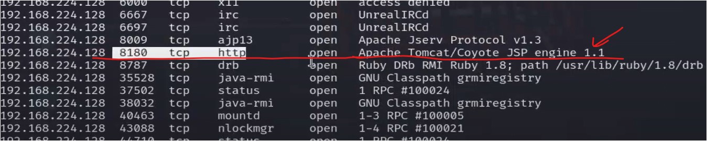
	- "Filtered" Port : means those ports which are not properly neither "close" nor "open" ✔  & these sort of ports are not useful for us 
		- only "Open" ports are useful for us ✔ - Pic of only "Open" ports : like above pic or [Pic of only "Open" status ports](https://nudesystems.com/how-to-use-nmap-to-scan-any-port-udp-tcp-2021/)
		- "filtered" ports are half opened & half closed :  - Pic of Filtered Port :  > [1 Pic of only "filtered" status ports](https://www.hackingarticles.in/nmap-for-pentester-port-status/) > [2 Pic of only "filtered" status ports](https://www.researchgate.net/figure/Figure-Nmap-detects-a-filtered-port_fig1_336838917)  > https://www.blumira.com/wp-content/uploads/2022/12/image2-1.png
		- so "filtered" & "close" status ports aren't useful for us ✔
		- sometimes "filtered" status ports - means someone put the security (like firewall) on that port/s ✔
- STEP 6 : going towards Apache Tomcat i.e port no. 8180 & it's protocol = http
	- STEP 6.1 : run `search tomcat` , output : we'll get Auxiliaries , exploits , payloads for port no. 8180 - apache Tomcat
	- STEP 6.2 : run `search tomcat` , output : we'll get 31 results but useful is 6th 
	- so let's use the 6th i.e  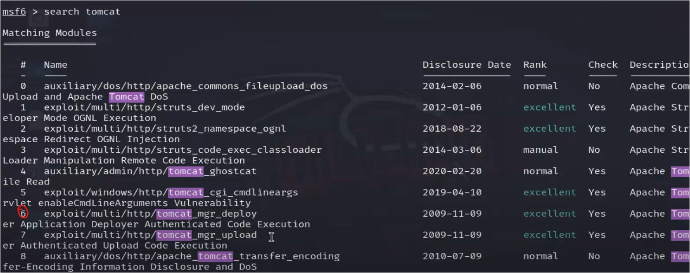
	- Q : how to find useful exploits related to that service ✔ 1st : check the software/product running on that service which we got via command i.e "search tomcat linux"  2nd : & check inside output of "search tomcat" anything which is similar & related to that service 
	- STEP 6.4 : run `use 6` , output : our exploit will be started  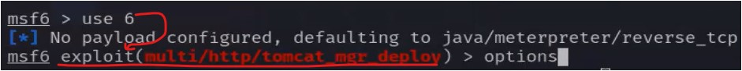
	- now let's see options
	- STEP 6.3 : run `options` : means what things required for that exploit  , output : 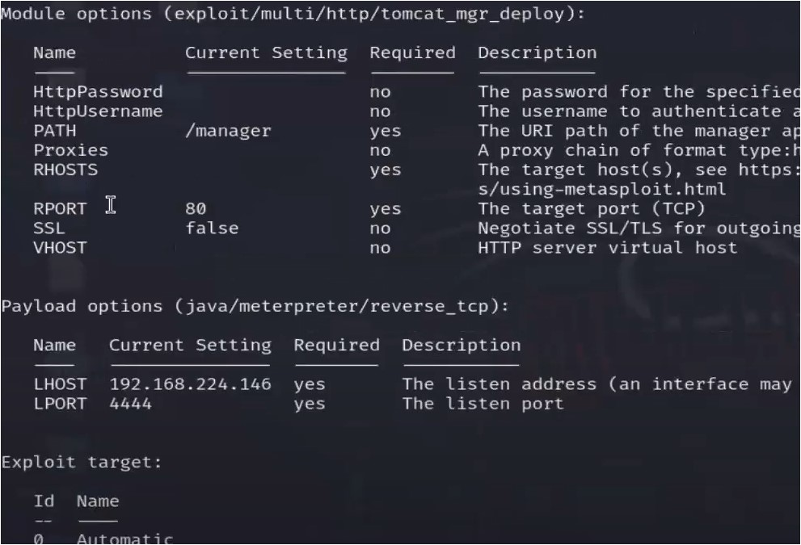
	- this exploit - whatever things it doesn't want marked as "no" in their respective Name  - so it needs RHOSTS , RPORT
	- Q : what RHOSTS should be ?  Ans : i.e address/IP-address of that Victim's system
	- Q : what's the command to set the RHOSTS or change the previous RHOSTS with a new one  Ans : i.e "set rhosts"
	- Q : what does tomcat means  Ans : is a Java application server designed to **deploy Java Servlets and JSPs on your system**  - it is one of the most widely used Java applications and web servers.
- STEP 7 : run `set rhosts 192.168.224.128` , output : now RHOSTS is set/added  STEP 7.1 : changing by-default port no. to port no. of Tomcat i.e 8180 , run `set rport 8180`
- STEP 8 : now check whether RHOSTS & RPORT are added or not 
	- run `options` , output  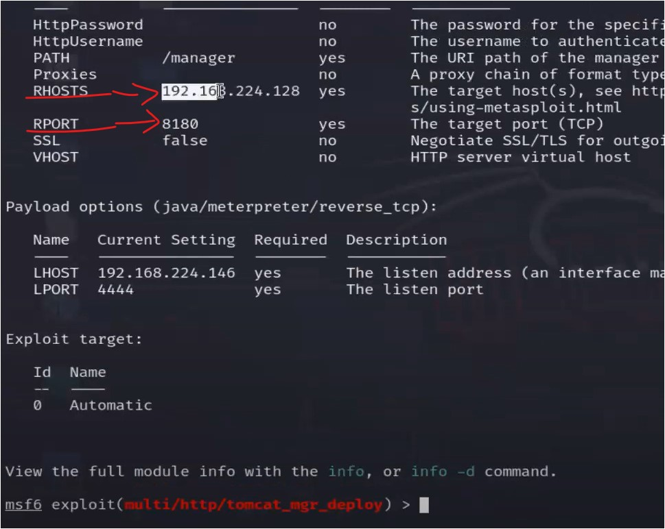
- STEP 9 : run `exploit` , 
	- output :  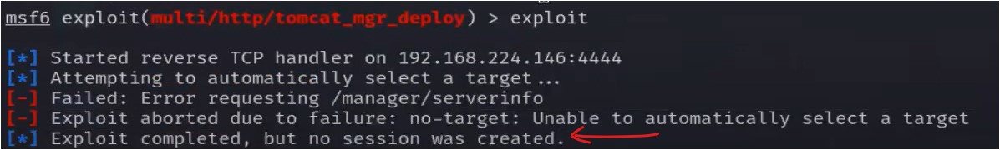
	- in output : "exploit completed, but no session was created" , cuz there's is a reason
	- might be the reason is 
		- Pic :  
		- 1st reason : might be in tomcat , password & username added on HTTP service  - but in pic , "no" is showing for HttpPassword & HttpUsername ✔
		- but sometimes what happens , when we give more powers to exploits  then that/those exploits (of specific service) will work properly ✔
		- Eg : u're going in Amazon website - to find out vulnerabilities - then we have 2 ways/options ✔ 1st way : either create an account inside this website & then find vulnerabilities  2nd way : or finding vulnerabilities without login in the website  Q : in which situation , a person will get more vulnerabilities  Ans : that person will get more vulnerabilities - who login inside the website & finding vulnerabilities  Q : why only after login in a application - then only that person will get more vulnerabilities  Ans : cuz after login inside of it , more extra information/features - we'll get for doing IG  - features like : add-to-cart , login , signout , etc
		- there's a saying that - the more features have in a website/app  then the more vulnerabilities have in a website/app ✔
		- so keeping this in mind & giving more powers i.e password & username (of HTTP service) to that exploit  then the exploit will work properly
		- Now we don't have password & username of HTTP service  Advice : Q : what we'll do  Ans : we'll see more about Tomcat , might be something we'll get ✔
	- STEP 9.1 : getting understanding about more on "Tomcat" for username & password , run `search tomcat`
		- output : we'll not get useful results about username & password
		- Q : Who brings Extra information in "msfconsole" (cuz we're using "msfconsole" tool right now) ✔ Ans : i.e Auxiliaries (which are scripts)
		- so we'll find those Auxiliaries which are related to username , password or login , Eg : i.e 27th  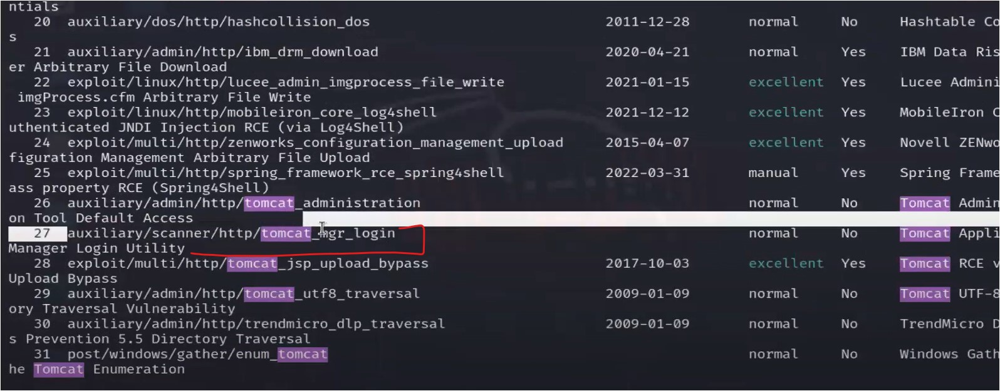
		- so 27th Auxiliaries is tomcat_mgr_login , which is same as both which we saw i.e  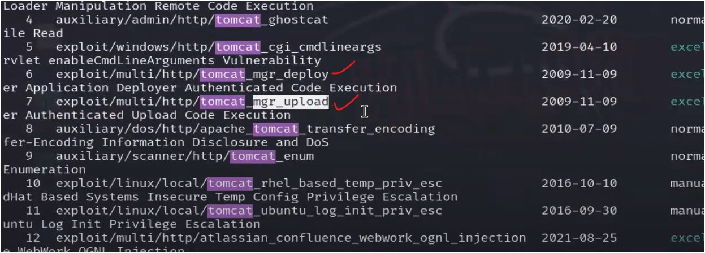
		- so let's use "tomcat_mgr_login" Auxiliary
	- STEP 9.2 : run `use 27` , output : now that Auxiliary is set as Auxiliary  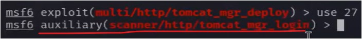
- STEP 10 : now let's check the options are required for that Auxiliary ✔, run `options` 
	- output : 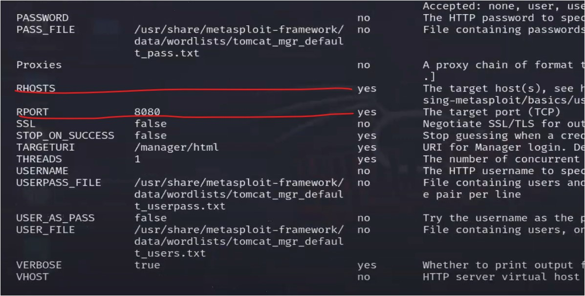
	- & whatever that auxiliary needs , it already filled by itself  so it also need RHOSTS , RPORT - so let's set these 2
	- STEP 10.1 : run `set rport 8180` & then run `set rhosts 192.168.224.128` , output  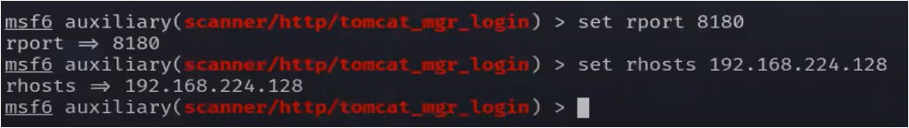
	- STEP 10.2 : checking options again , run `options` , output : now RHOSTS & RPORT are added/set
- STEP 11 : finding login & password , so run either `run` OR `exploit` - but we'll do `run`
	- output :  Pic 1 : 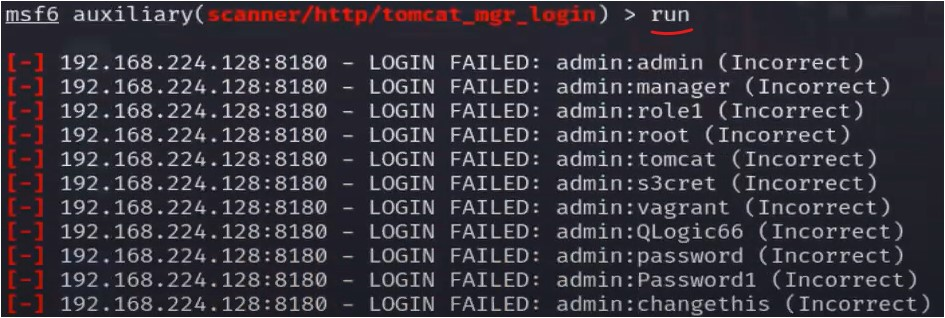  Pic 2 : 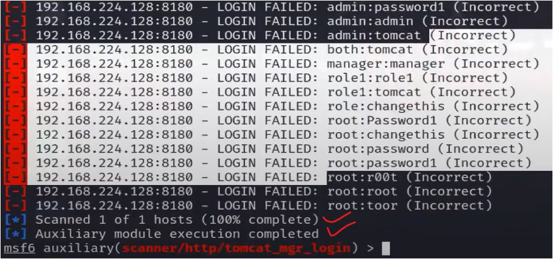
	- now in output , it's doing kindof brute forcing on Victim's system - means it's trying to bring username & password of HTTP ✔
	- in output 100% completed , now find in output - is there any "correct" written or not i.e  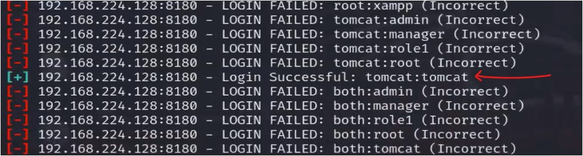
	- so we got the login & password , that's why brute forcing got successful  - so it try different login & password via from it's own word list ✔
- now let's use this login & password i.e "tomcat" - in exploit 6th i.e tomcat_mgr_deploy ✔
- STEP 12 : run `use 6` & then run `options`
	- output : 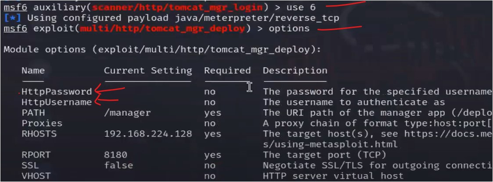
	- now everything is added  now we need to give username & password of http
	- STEP 12.1 : run `set HttpPassword tomcat` - to add the http password   & run `set HttpUsername tomcat` - to add the http username   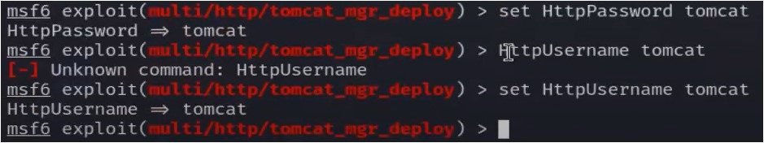
	- STEP 12.2 : let's exploit the "tomcat_mgr_deploy" , run command `run` , output :  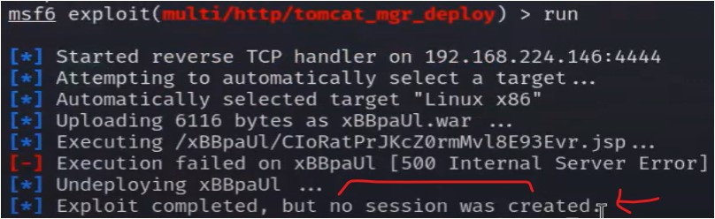
	- STEP 12.3 : let's use "exploit" command , so run `exploit` , output :  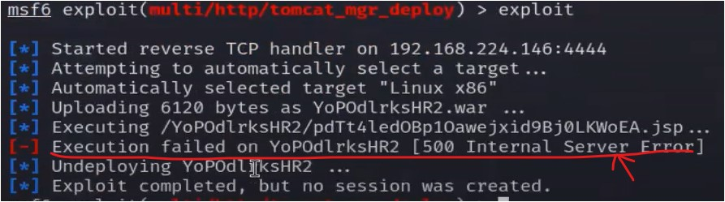
	- in output , exploit completed but session was not created  - so let's see check by running command `options` - to check whether we made a mistake or not ✔
	- STEP 12.4 : run `options` , output : checking whether why exploit didn't worked properly  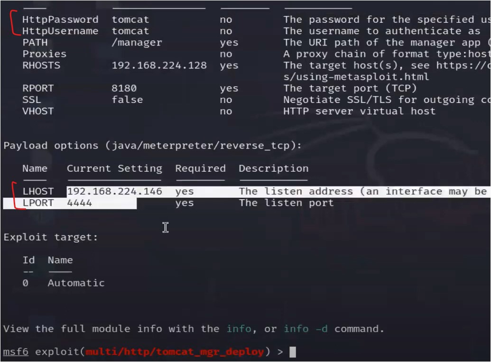
	- in output , it set the our system's LHOST & LPOST by-default , so let's try to `run -j` for exploit
	- STEP 12.5 : run `run -j` , output : still we'll get error output as in STEP 12.3 i.e 500 internal Server Error  - & when we do `ls` then we'll get our system's files & folders  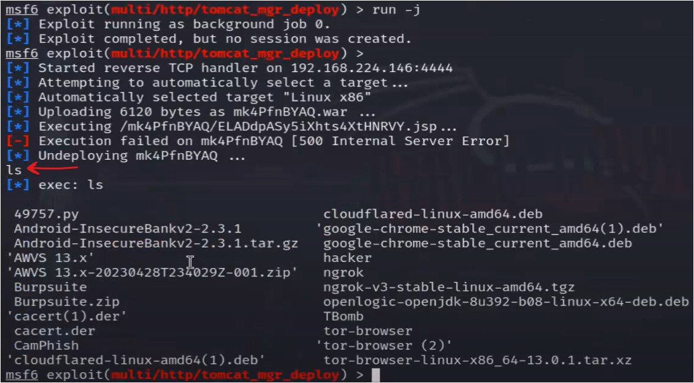
	- STEP 12.6 : checking sessions is open or not , run `sessions -i 1` , output : Invalid session identifier : 1
	- STEP 12.7 : might be the server issue in Victim's system , so restart the Victim system  - in previous output : we're not getting payload error , we're getting Server error - that's why we're starting ✔  > STEP 12.7.1 : login inside the Victim system
	- STEP 12.8 : run `exploit` , output : same as STEP 12.3  - so let's use a another exploit i.e 7th - which is related to tomcat i.e tomcat_mgr_upload
	- STEP 12.9 : run `use 7` & then run `options` , output : so this 7th exploit asking same thing i.e username & password of HTTP  > STEP 12.9.1 : run `set HttpUsername tomcat`  > STEP 12.9.2 : run `set HttpPassword tomcat`  - now we need to add/set RPORT & RHOSTS  > STEP 12.9.3 : run `set rport 8180`  > STEP 12.9.4 : run `set rhosts 192.168.224.128`  - & LHOST & LPORT are already by-default set , output :  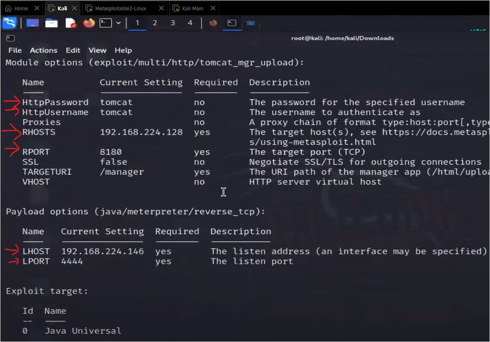
	- STEP 12.10 : run either `run` OR `exploit` , output : both will give same output  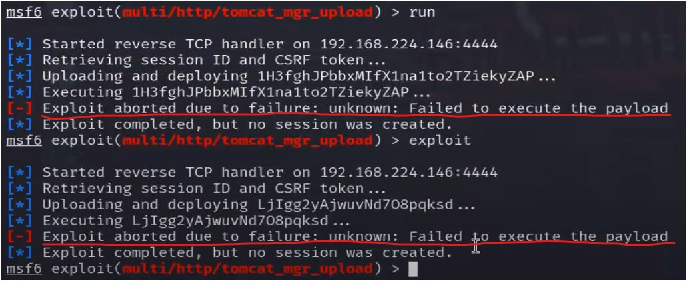
- homework : try to exploit in ur PC , cuz the issue is coming in Victim's system inside Devendra sir PC  - & even the error is server error
- let's see a different tool i.e Armitage

### Practical Work : Armitage tool
- we were using `msfconsole` tool - which is based on CLI  so we have a GUI tool of `msfconsole` tool i.e armitage - is a GUI based tool ✔  - msf : means metasploitable
- STEP 1 : `sudo su`
- STEP 2 : run `armitage` 
	- if it's not installed then run `apt install armitage` command & press `y` means yes to install
	- STEP 2.1 : a pop will come & click on "connect" button & click on "Yes" button  - output : all the services will be started - just like we did to use `msfconsole` tool  - output : once all the services completed - then GUI of Armitage tool will get open  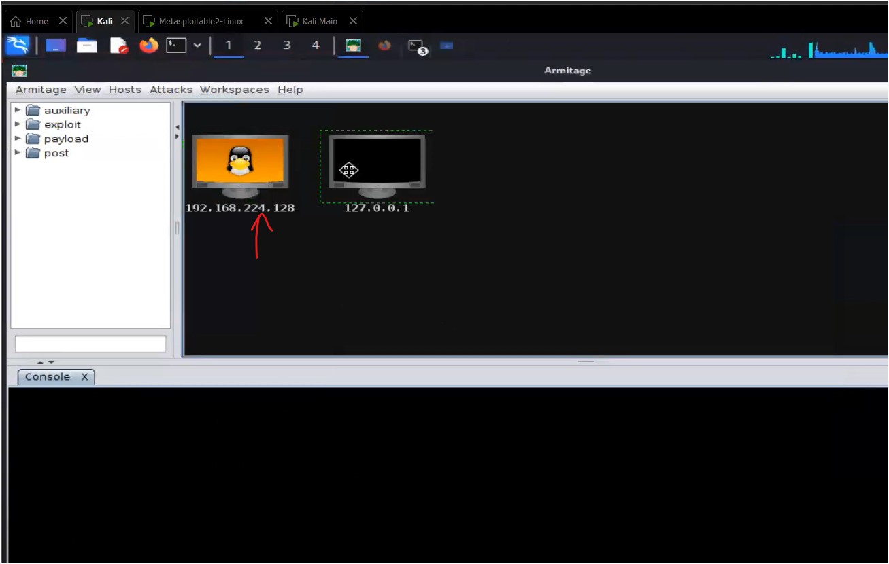
	- so on black screen , reports (of victim's systems) are shown which are added  - here "192.168.224.128" report is of that Victim's system
	- & "127.0.0.1" report which is extra , u can remove , right click on it & go to "Host" & click on remove "host"
	- if Hosts reports are not added then  - go to "Hosts"  tab , click "import hosts" & open that report
- STEP 3 : how to check services : right click on that report & click on "services"
- STEP 4 : to check services for a particular software/product
	- STEP 4.1 : so search on this bar i.e `vsftpd` 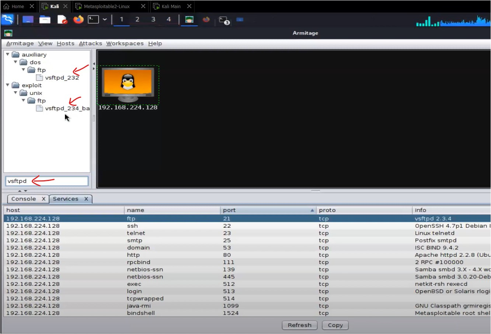
	- output : on file explorer , one auxiliary & one Exploit related to that software  so currently , auxiliary (of that software) is not useful , so exploit is useful for us
- STEP 5 : how to use that exploit of that software
	- STEP 5.1 : just drag the vsftpd of exploit & drop on that machine  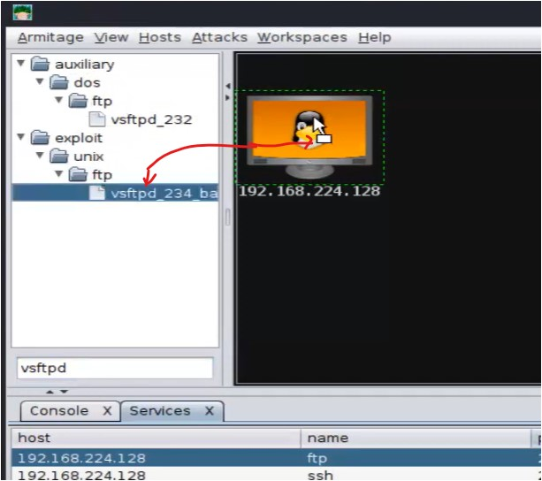
	- output : we'll get a popup  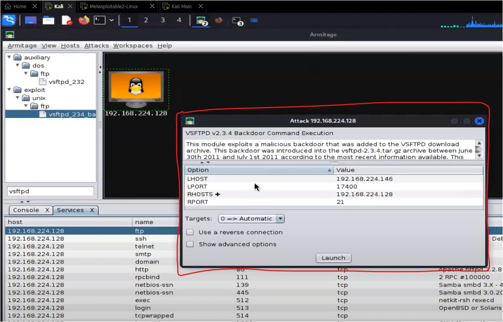
	- & LHOST , LPORT , RHOSTS , RPORT are already added , so we don't need to do anything 
	- Q : we have "show advanced options" , when we use it  Ans : currently we don't need this option , but after launching - if that Victim's system is not hacked - then we this option
	- STEP 5.2 : click on "launch" button , output : now just focus on that machine icon - whether machine changed or not  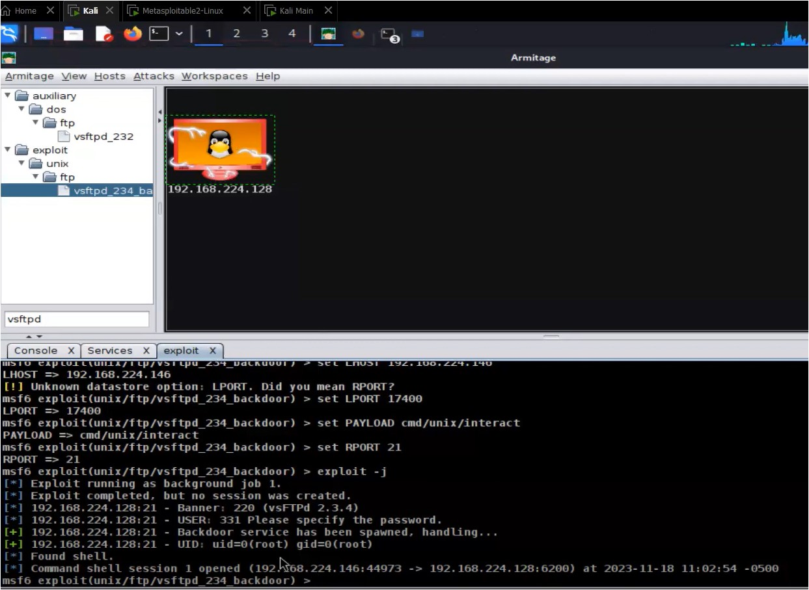
	- so machine icon is changed now , so this machine icon means - machine got hacked
	- now we need to a shell - means we want to run a command on this Victim's system ✔
	- STEP 5.3 : click on that machine icon -> click on "shell 1" -> we have options like interact  - so click on "interact" , output : we'll get a terminal  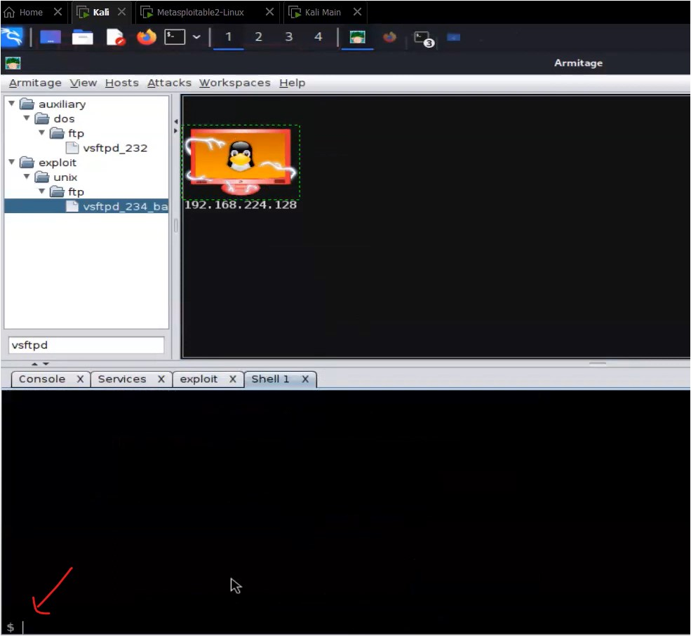
	- STEP 5.4 : inside the terminal , write `ls` , output : all files & folders (of Victim's system) will be shown  even `ifconfig` command also works
- STEP 6 : let's see a different service/software like tomcat
	- STEP 6.1 : on that search bar , search `distccd` , output : in file explorer , we'll get 2 exploit for unix & windows  - so here Unix Exploit is useful for us
	- STEP 6.2 : drag "distcc_exec" exploit on the victim's machine
	- STEP 6.3 : now that pop will come & it check by-default i.e "use a reverse connection"  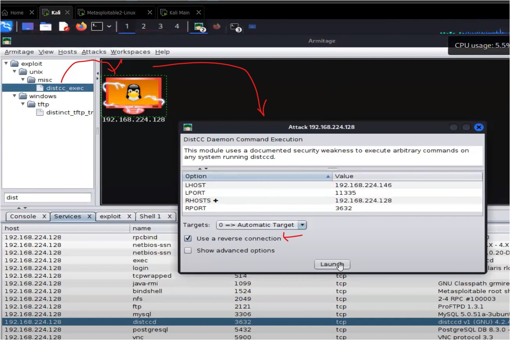
	- check the "use a reverse connection" : when a "session is not created" error comes ✔  reverse connection : means joining/connecting the session again , if that session is not created 
	- STEP 6.4 : click on "launch" button , output : "commend shell" comes - then means Victim's system hacked again  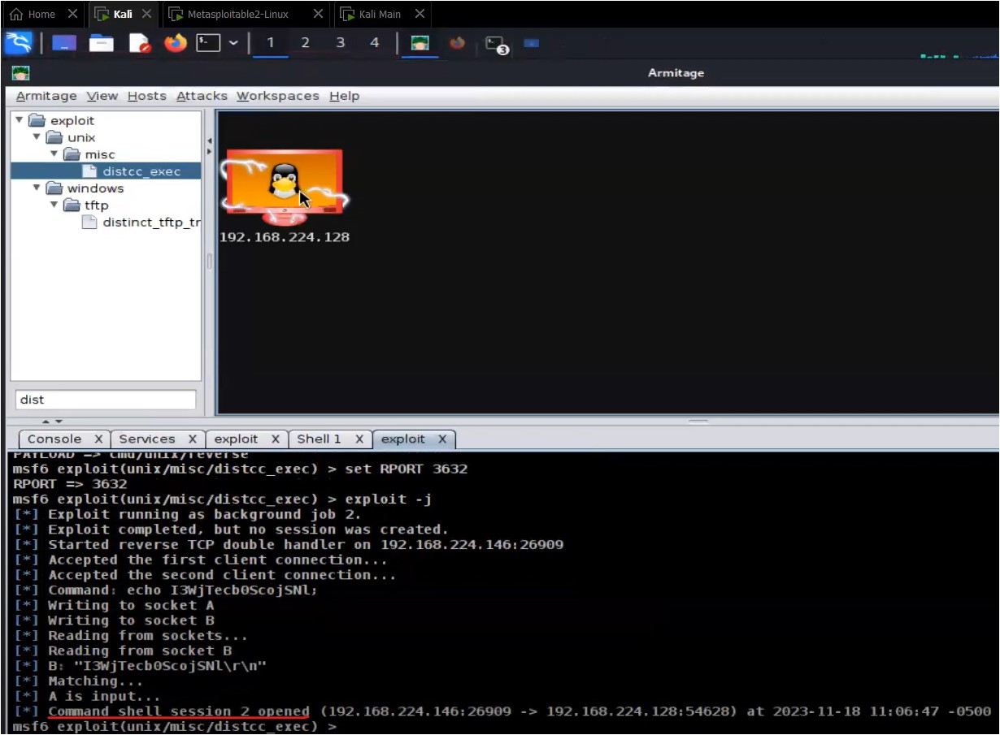
	- STEP 6.5 : right click on Victim's system icon & we'll get "Shell 2" - cuz we hacked the system 2nd times  STEP 6.5.1 : click on "interact" , output : run `ls` - then we'll get a different file cuz due to the service/protocol  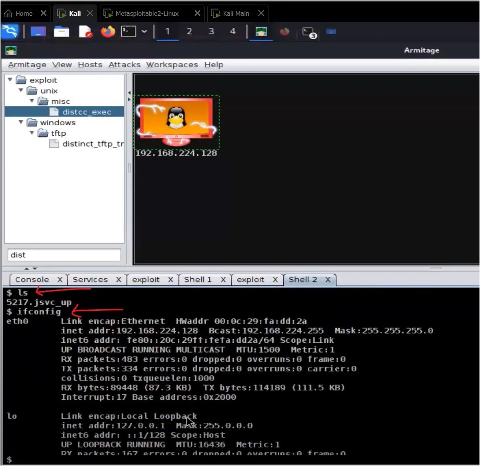
	- we're getting different files & folders based on specific service/protocol  - cuz each protocol has it's own purpose ✔
- Q : why that exploit of tomcat not working & not able to hack the Victim's system  Ans : might be the reason is that exploit of tomcat is not good  - try a different exploit of tomcat except of those 3 exploits which we used already

---
### Homework
1. try "exploit" in ur PC - cuz the issue is coming in Victim's system inside Devendra sir PC  - & even the error is server error
2. use armitage GUI tool for "tomcat" software

---
### End of the lecture (Doubts) :
- Q : different status of ports  1. closed Ports : https://lh5.googleusercontent.com/Lu6RVb_BWhvtlA6mBfCxjIBKTjDJBzMdw7r2PmURvYiff898ZfFPi9pL0QD5WrENBFqRkIjzbM4RJOfc8j-LETkhHds-HarA9naH0KrxUWryXjADAdeUAG--_u0vcEZ44QkubmE  2. unfiltered ports : https://lh6.googleusercontent.com/21YBSZPEdyvcQtu4CXnB_IwMbTlmIXVRT_IgMv_vGNwOwr6BU4tKTVEw616jlrK_zzH-tvZDYtJsoMziyQYgWri2LgEJMKDAUBclcW3RGD-eR6Aj8w4VU5IuiFzZw5Y-L3y5Egw  3. open | Filtered ports : https://miro.medium.com/v2/resize:fit:720/format:webp/1*7LuIDiYGbosYLmBflveVbA.png  4. Open & filtered ports : https://res.cloudinary.com/practicaldev/image/fetch/s--kDlnbHnv--/c_limit%2Cf_auto%2Cfl_progressive%2Cq_auto%2Cw_880/https://dev-to-uploads.s3.amazonaws.com/uploads/articles/zn9thto105mplgsk3xkv.png
- let's say u don't have social Media account of that person then how u can do IG about that person
	- Ans : information gathering is a trick which u just need to use ur mind 
	- if u want to know about that person then go to his social Media  - if u're not getting any info from his social media - then u can go to his friends  - so make his friends as ur friend & make a fake social media account & talk to him
	- u need to understand concept about Social Engineering & IG  are tricks which u can't be done via using tools , u have to use ur mind
- to hack a hacker then it's bit difficult cuz
	- whatever the things u know - he/she also knows that's why
	- & what if he/she knows more than u  
- Q : when we do search then many exploits comes - then how to know useage of each exploits
	- Ans : u have to try each exploits of each service/protocol
	- what u think that everything can be done easily ,  u don't have to learn each exploits - just do practice
	- that's why a Homework was given i.e bring 2 exploits for each service/protocol
	- so try to exploit the system via using exploits of each protocol
- Advice : don't come in Doubt session ✔
	- cuz if u don't practice by urself then u can't resolve ur errors also 
	- like what if that person/trainer goes & he/she not getting time - then what u'll do  so try to solve those issues by urself
	- & coming in doubt session frequently - will make ur skill bad  cuz in doubt session u'll get instant solution & due to this , u'll not learn by urself  & u might not struggle to resolve ur own errors 
	- so give ur 100% & if that error/issues coming then ask

