#WsCubeTech-CEH-notes 

---
### What we'll learn 
> Lecture Name : Privilege Escalation on Linux & windows 
> 1) Practical Work : Exploitation : Tool = exploit database (https://www.exploit-db.com)
> 2) Understanding theoretically - Privilege Escalation on Linux & windows
> 3) Practical Work : Privilege Escalation on Linux & windows
> 4) Security to save the system from Privilege Escalation

---
### Practical Work : Exploitation : Tool = Exploit Database
- STEP 0 : keep the kali & Victim's system ON
- exploit database (https://www.exploit-db.com) : is a website which contains all the exploits of everything  - there are many exploits which are not found anywhere , but it has
> how to use it
- STEP 1 : open the website & search `vsftpd` , output :  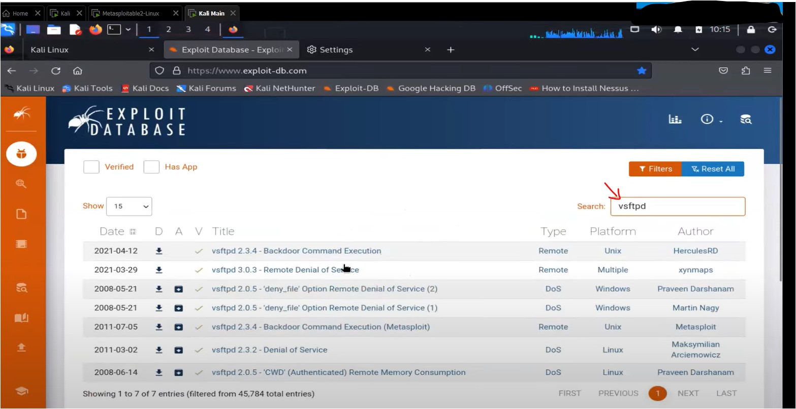
- in output , we're getting many things related to vsftpd ,  so to make the output short - then search it with version ✔
- STEP 2 : `vsftpd 2.3.4` - searching it with it's version , output : only 2 output shown  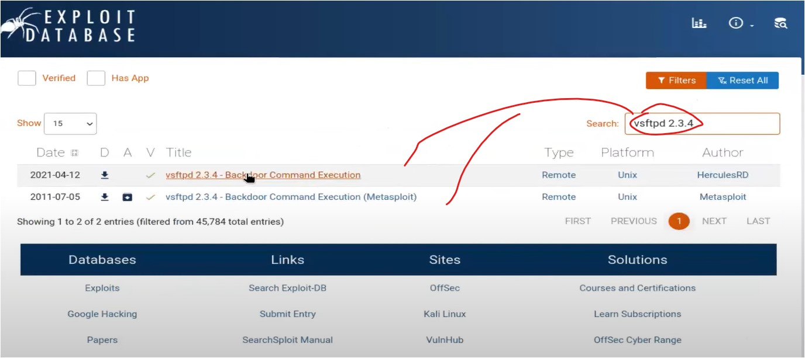
- STEP 3 : click on 2nd one - cuz it's for metasploit ,  - output : all the details will be shown related to this exploit including it's coding
- STEP 4 : come back & click on 1st one , output : we'll get in which language , version , data , etc about the exploit  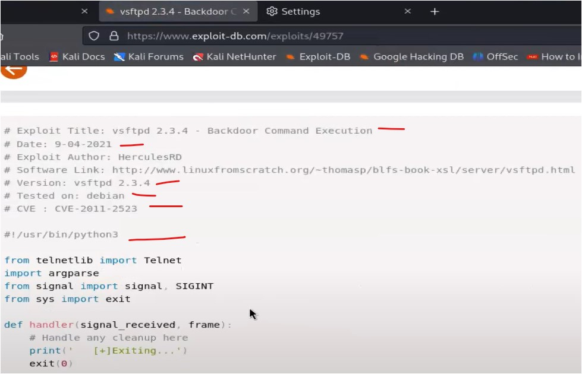
- so the code is written in Python & version of python is 3
- Advice : we just need to know in which language the exploit was written ✔  then nothing we don't need to know about that exploit 
	- mine thought : also see the data , version , who made - cuz if that exploit is very old or very new  then might be that exploit itself has vulnerabilities which is not good & due to this ,  hacking the victim's system with that exploit is not good decision
	- cuz what if that victim is also a hacker then he/she will hack u 
- STEP 5 : open both exploits & download both exploits of vsftpd 2.3.4  - we'll see both to check which one is working
- STEP 6 : in terminal , run `sudo su` then `cd downloads` then `ls`  - so files will be 17491.rb & 49757.py
- first we need to check whether these files have executable permission or not ✔
- STEP 7 : `ls -l` : checking files have executable permission or not  - if that ".py" file doesn't have executable permission then run `chmod +x 49757.py`
- STEP 8 : there are 2 ways to run a executable file 
	- STEP 8.1 : 1st way : run `./49757.py` , 
		- output :  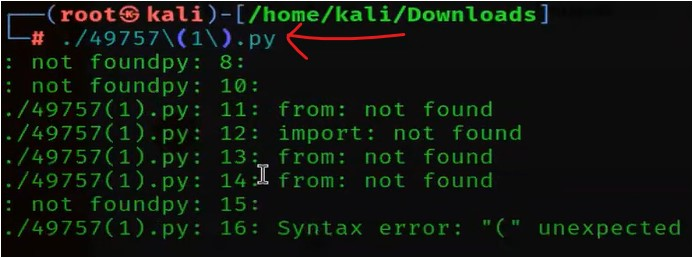
		- in output , syntax error is coming - means we can any executable file via `./`  - but doesn't mean that `./` can run always every executable file ✔  - so 90% times , we use `./`
		- in kali , python pre-installed with 3rd version & this python file also version 3  - now we'll execute it via python3
	- STEP 8.2 : 2nd way : executing the file via it's own extension file name , run `python3 49757.py`
		- output : we'll also get how to usage of the file & the error 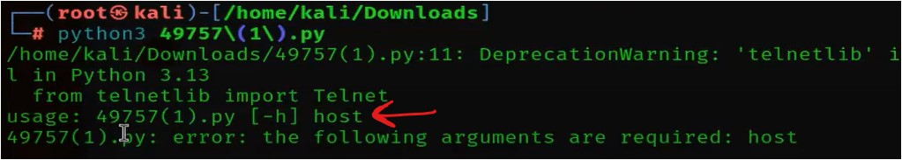
		- in output , error came cuz we didn't define the host  - host : means IP address
	- STEP 8.3 : run `python3 49757.py 192.168.224.128`
		- output :  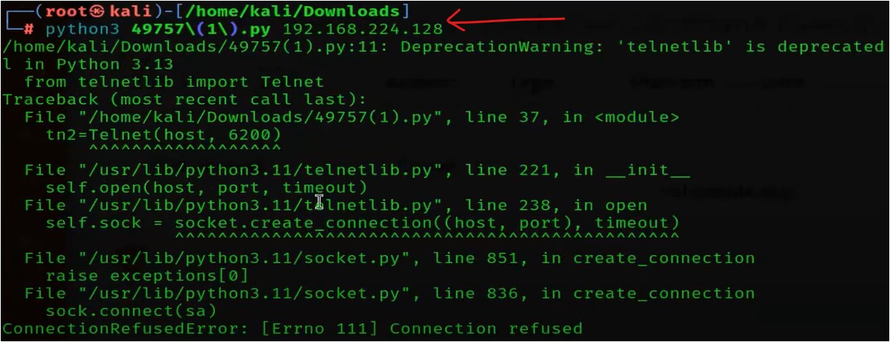
		- in output , this error means sir's switch to python8 , instead of using python3  - let's switch to python3
	- STEP 8.4 : switching to python3 - run `update-alternatives --config java` , output  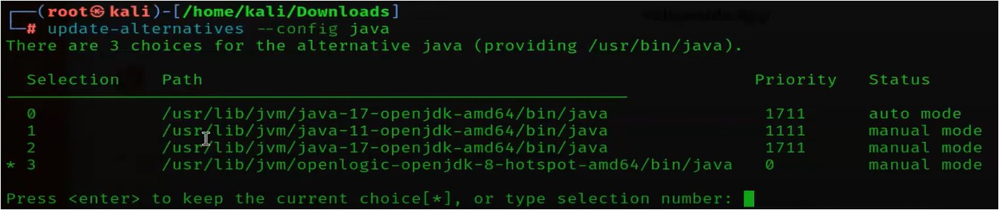
	- STEP 8.4.1 : press `1` - cuz sir's python3 is inside java 11
	- STEP 8.5 : run `python3 49757.py 192.168.224.128` , output   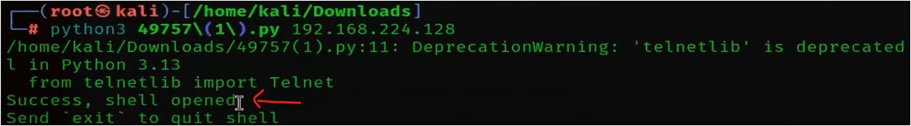  - so execution is successful
	- STEP 8.6 : run `ls` , output : file & folder/directories will be shown of that victim's system  - even `ifconfig` also works
	- so this is also another way to hack the victim's system
- we'll also can get exploits related to google chrome browser in the website 
	- Eg : 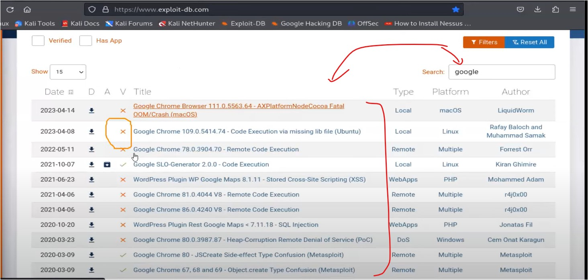
	- here "❌" : means that exploit is not tested & "✔" : means that exploit is tested completely ✔
- till yet , we saw individually how to use auxiliaries & then exploits , upcoming we'll see payloads ✔
	- & we'll try payloads for android cuz payloads are mostly used in android  - but there are many payloads for windows OS also
	- first , we'll see payloads for android then automatically - u can use payloads for windows OS also by urself 
- so Exploitation of Linux is done , let's see more

### Understanding theoretically - Privilege Escalation on Linux & windows
- Q : what is Privilege Escalation ✔
	- Ans : Privilege Escalation : means taking control/access of a Victim's system in unauthorized way
	- Like understanding behavior of a person (who is Victim) & then taking access of his/her system in unauthorized way
	- Eg : there's a system of Shail & he is a admin on his system & u (who is a attacker) are not even a guest user on his system  - but still via unauthorized way - u're taking admin access of his system - this process called Privilege Escalation ✔  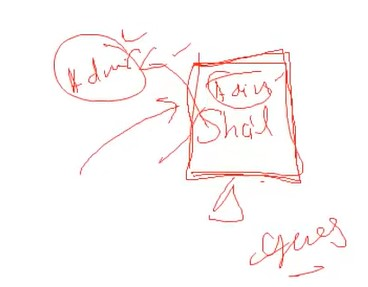
- Q : where Privilege Escalation is being done  Ans : i.e in Linux & windows OS
- first , we'll understand theoretical  1) How Privilege Escalation in Linux & then we'll see  2) How Privilege Escalation in windows
- `imp ⭐` : How Privilege Escalation in Linux
	- in linux , when booting process happen - then there are 2 types of cursor  1) in booting process of linux going on - then cursor color will be white - means cursor is outside of that linux  2) but when u click inside the linux system while the booting process going on - then cursor will be hide  - means cursor is inside the linux system
	- so when booting process going on in that linux system & the cursor is inside the system  - then we press only `E` key continuously - then in that linux system , editing mode will be started  - so when editing mode started - then files & file's locations will be shown  - one of the location will be shown which is very useful for us i.e the location written with "ro"
	- "ro" : means read only , so here we (as a attacker) changed "ro" into "rw"  - so before booting the Victim's linux system , we write "rw init = /bin/bash" ✔ - "rw init = /bin/bash" : means when re-booting process started then initialize & bring this "/bin/bash" location  or open "/bin/bash" location ✔
	- Q : which location is this "/bin/bash" ✔ Ans : this location is of terminal - means when terminal gets open then it opens on this location 
	- so once this command `rw init = /bin/bash` executed  - then we ress F10 or `exit` command to reboot the Victim's system ✔
	- Q : in which line we need to add this command `rw init = /bin/bash`  Ans : we'll see in practical of it
- `imp ⭐` : How Privilege Escalation in Windows OS
	- doing Privilege Escalation in Windows OS , we need a pendrive (shoukd be minimum 4gb)
	- & we make that pendrive - bootable via installed "tails OS" in it ✔  - then once that pendrive becomes bootable - then we'll restart our system 
	- when that system is rebooting then continuously - we press BIOS key i.e F10 or F12 or ESC or ESC+Delete  - so BIOS key depends on the system ✔
		- we'll see more about "Tails OS" - when we go to dark web to host the website ✔ - Tails OS made by a organization who made tor browser
	- so when we press BIOS key continuously then BIOS setting will get open  - in BIOS setting - then select the Boot drive as that pendrive - then we'll restart our system  - so once system restarting done - then Tails OS will be opened ✔
- doing Privilege Escalation in Android - is bit difficult cuz structure of Android OS is different  - cuz most of the things are running on one drive - which makes the issue , but it's not impossible to do ✔
- Pic - Theoretical Process of Privilege Escalation on Linux & on windows 
	- Pic : 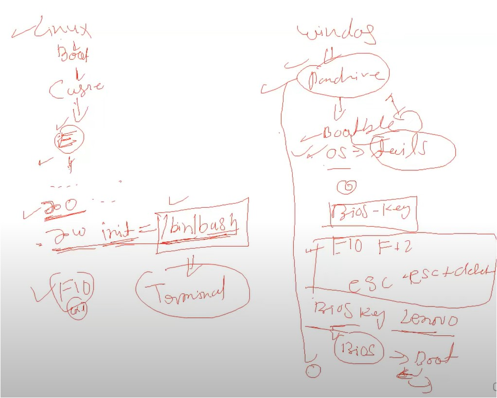

### Practical : Privilege Escalation on Linux & windows
- wscubetech YT vid : [How to Escalate Privileges in Linux and Windows? | System Hacking - Ethical Hacking 🐱‍👤 - YouTube](https://www.youtube.com/watch?v=8sQheqT6HBE&ab_channel=WsCubeTech)
- Practical : Privilege Escalation on Linux
	- STEP 1 : restart the Kali OS & during rebooting/restarting the Kali press the "E" key continuously , output :  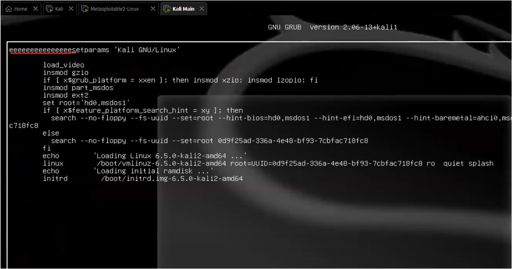
	- this output - means editing mode is ON now
	- STEP 2 : now put the cursor inside the Kali & press "Backspace" key
	- the useful line for us i.e Linux  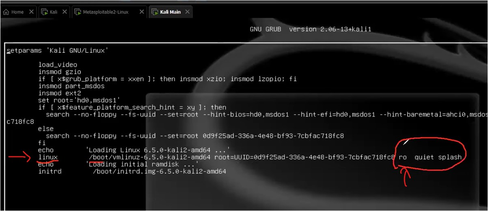
	- STEP 3 : bring the cursor on "Linux" line & remove words "quite splash  STEP 3.1 : change "ro" into "rw"  STEP 3.2 : after "rw" , write this `rw init=/bin/bash` , so rw - means read & write ✔ 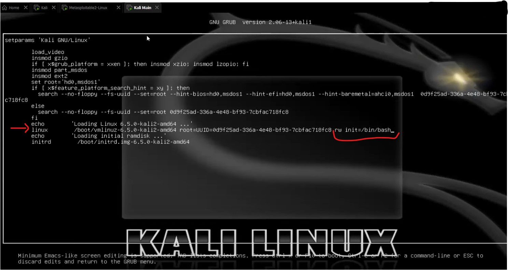
	- Q : `rw init=/bin/bash` - which location is this  Ans : i.e Terminal of ur (attacker) Kali OS
	- STEP 4 : reboot the Kali , press `Ctrl + x` , output : after reboot ,  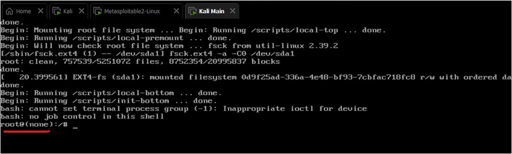
	- in output , we got the by-default root location access on the terminal ✔
	- STEP 5 : run `pwd` , output : `/` - this backslash means root ✔  STEP 5.1 : now any command like `ls` , `cd` , etc will work
	- STEP 6 : now coming in root location via `cd` (if u executed any command)
		- STEP 6.1 : to change the password directly , run `passwd <user-password>` - like here `passwd root` ✔
		- STEP 6.2 : now give password like `1234` & then retype it , output :  00]]
		- in output , new password is updated of "root" without writing previous password of kali ✔
		- STEP 6.3 : by-default password of kali is "kali" , to change the password "kali" - command is `passwd kali`  - but don't run the command ✔
		- to change the username of kali OS - then search on google by urself
	- so here we access the kali system as root/admin user without login inside the Kali system   - means Kali OS didn't asked for login ✔
	- STEP 7 : now shutdown the Kali & start it again
	- STEP 8 : when we login inside Kali  - username we changed into "root"  - by-default root password is kali - but we changed "kali" into "123" & so password is 123 
	- STEP 8.1 : now open terminal & we don't need to type the password to enter as root user in terminal  - cuz we as a user login directly as admin/root user  - output : directly the terminal will get opened as root  00]]
- Practical : Privilege Escalation on Windows OS
	- software which are required 
		- rufus - to make bootable pendrive : [Rufus - Create bootable USB drives the easy way](https://rufus.ie/en/)  - once rufus is downloaded then no need to install it - cuz directly it gets open 
		- Tails OS 
			- About it
				- which is made to stay anonymous cuz this OS change ur proxies too fast  due to which , catch that proxy is difficult  - so for security purpose , all the by-default configuration already built-in - it's made by people who made TOR browser
				- Advantage of it ✔ - u can insert ur bootable pendrive in any system & u can do anything  - & victim won't be able to know that is anybody did something on his/her system  - even that victim not able to know that is any OS inserted or not 
				- Tails OS used in forensics
				- it's Linux based
			- Installation Steps  STEP 1 : go https://tails.net  STEP 2 : scroll down & click on "install tails" button  STEP 3 : click on "download only (for USB sticks)" link  STEP 4 : click on "Download Tails 5.19.1 USB Image (1.3GB)" button
	- STEP 1 : once "rufus" & Tails OS is downloaded 
	- STEP 2 : insert the pendrive (minimum 4GB)  STEP 2.1 : open "rufus" & select the device i.e ur pendrive STEP 2.2 : & then click on "select" button & select "Tails OS" .iso file & click on "start" button  - once the "rufus" done the installation of the Tails OS in ur pendrive - then ur pendrive becomes bootable
	- STEP 3 : restart the PC & during process of restarting press F9 or F12  - so that bootable pendrive OR Boot Device will be shown
	- STEP 4 : select ur pendrive & hit enter & then click on "Tails"
	- STEP 5 : let's do configuration stuff , click on "+" button  STEP 5.1 : click on "Administration Password" & write the password for administration like "123"  - further settings u can do if u want  STEP 5.2 : click on "Start Tails" button
	- STEP 6 : in Tails OS , click on "Home" or file explorer of this OS  STEP 6.1 : click "+ other locations" button - then click on ur pendrive & u'll get files & folders of ur Windows OS  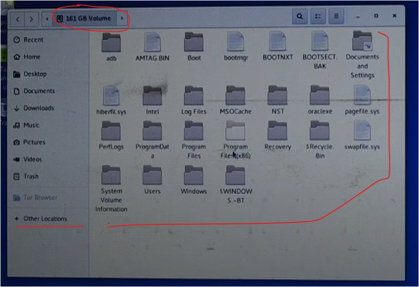  STEP 6.2 : go inside "Users" folder , output  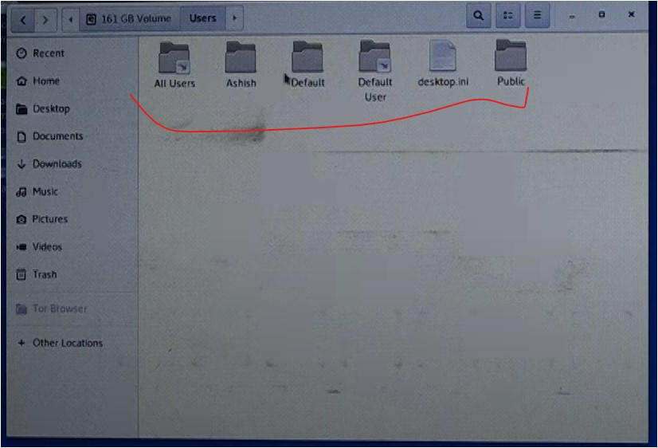
	- u can copy files of ur windows OS - inside Tails OS
	- Advice : ur main system i.e Windows OS will not get affected , while being & doing something in Tails OS

### Security to save the system from Privilege Escalation
- STEP 1 : in Windows OS , open settings 
- STEP 2 : Privacy & security > Device encryption , turn on "Device encryption"
	- then this option will secure our drives (like C Drive , D Drive , etc) + make the data overall secure
	- output : now each drive will become from locked  - Before Pic : 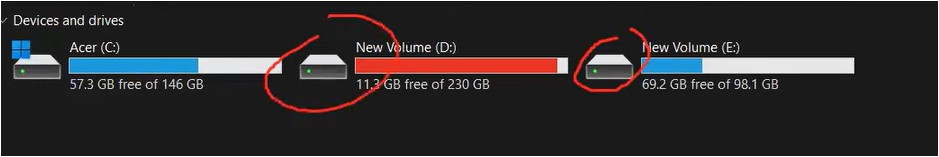  - After Pic : 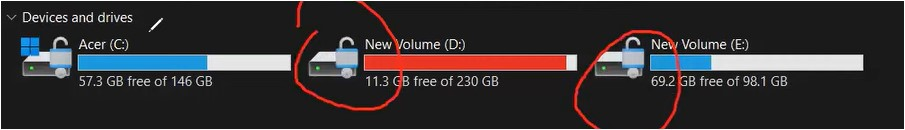
- Conclusion : if this option is turn on in a system , then Privilege Escalation can't be done in that system  - & can't access the data of that system

---
### Homework
1. 

---
### End of the lecture (Doubts) :
1. Q : in which language Python built on  Ans : i.e C , not java
2. Q : if that Victim put the password in BIOS of his/her system ✔ Ans : then we can't access the data of his/her system 
3. Q : in pendrive , we can insert payload or not  Ans : yes , but we can't run the payload in BIOS  - cuz to run it on BIOS , we need to boot the system
4. u can set the password on BIOS , so that nobody can do Privilege Escalation  & u can also reset the password of BIOS also in future ✔ 
- Advice : to become a greater Ethical Hacker
	- till yet , we just saw 2 tools i.e msfconsole & armitage - so both have different exploits for different services
	- so practice what we completed yet - then u'll understand automatically how each exploit is working 
	- we just need to clear concepts & how everything is working  - if ur concepts are strong then u can perform anything doesn't matter what tool is it  - Eg : common things like services/protocol , software/product => these things will come everywhere  & when u can then u'll automatically understand what is that
	- so u just need to understand the process of each concept & then practice of that concept
	- so these are steps which can bring u in good stage of Ethical Hacker
- Advice : in one go , magic will not happen , just do practice & try different ways ✔
	- like try to change port no. or via service or via software/product 
	- Sir also told that first , try script - means on any service u're going - do manual scripting  - then understand it's file & once the report created then understand that report
	- then try to exploit via using that report
	- U must understand what that report is saying like what're vulnerabilities , what commands we can execute , etc
	- so understand that 2 types of Enumeration - Automation Enumeration Scan , Manual Enumeration Scan  - nothing else u need to know extra
	- & if u're not getting understanding then search like "what're vulnerabilities on vsftpd , smtp , etc"  - how to exploit that specific software/product ✔
- Advice : things which important , u have to do practice of them 
	- but things which are small - then u can google those small stuff
- Advice : do searching , it's not bad practice if don't know something
	- but ur fundamentals concepts must be solid ✔