#WsCubeTech-CEH-notes

---
### What we'll learn 
> Lecture Name : System Hacking Using Url ( Camphish)
> 1) Theory : understanding : What is URL
> 2) Theory : understanding tool : System Hacking Using Camphish (URL tool)
> 3) Practical Work : System hacking via URL by using Camphish tool
> 4) Practical Work : combining cloudflared tool with camphish tool

---
### Theory : understanding : What is URL
- Q : do u think a system can be hacked via URL  Ans : a URL is a address of those things - which we access on the internet
	- Q : can we access files & folders of that address which u don't have  Ans : No  - so a URL is a address of files & folders of that address/website
	- Examples of URL : 
		- Eg 1 : wscubetech.com" = will show the main page of wscubetech ✔ - but let's say we want to do ethical hacking course online ,  so URL will be "`https://www.wscubetech.com/online-ethical-hacking-course.html`"  - so behind the scene , here "online-ethical-hacking-course.html" folder is opened ✔
		- Eg 2 : open "ninite.com" website , click on it's feedback page  - output : "`ninite.com/feedback`" , so behind the scene , we came inside "feedback" folder of it ✔
		- conclusion : ✔ - "feedback" page of ninite : is a location - same with wscubetech & other websites  - so if we don't have location then we can't access sub-pages of a website & website itself - so these locations are URL 
		- Pics of URL Structure :  > [What Is a URL: Structure, Examples, Types, and More](https://www.hostinger.in/tutorials/what-is-a-url)  > [601c27acee136f00183aa4f5](https://i.insider.com/601c27acee136f00183aa4f5?width=700&format=jpeg&auto=webp)  > [What Is a URL? The Anatomy of a URL, Permalinks, SEO, and More](https://kinsta.com/knowledgebase/what-is-a-url/)  > [What is the URL? how does it work? - Eng D Tech Info](https://eng.dtechin.com/2020/07/what-is-url-how-does-it-work.html)  > [Difference between URL and Link - GFG](https://www.geeksforgeeks.org/difference-between-url-and-link/) > https://hacktechnow.files.wordpress.com/2019/04/uniform-resource-locators1202514832.jpg  > [URL structure](https://shorturl.at/bkrY5)  > [Absolute vs Relative Paths in URL - YouTube](https://www.youtube.com/watch?v=ephId3mYu9o&ab_channel=Udacity)
- So hacking a system via URL is not possible , a URL is just a address of that thing which is on the server

### Theory : understanding tool : System Hacking Using Camphish
- there are many tools to do hacking via URL like Camphish , etc  - but u'll get many alternative tools for URL hacking  - Advice : u just need to understand the process then u can use any tool for URL hacking ✔
- About Camphish tool for URL hacking ✔
	- Camphish has 2 things i.e Templates & Malicious Programs
		- Templates : means like Eg : a mockup picture of a website  & in Templates of Camphish , there are many templates for different purpose
		- Malicious Programs : means these programs are executable Malicious programs 
	- & after combining both a template & a Malicious Programs (based on our need)  - then we make a program - then Camphish put that program on our localhost ✔
	- Q : the what we (as a attacker) do  Ans : when we give a address (of our localhost) to any person  - & that person will open it on browser - then that malicious program will be started
	- Conclusion Pic :  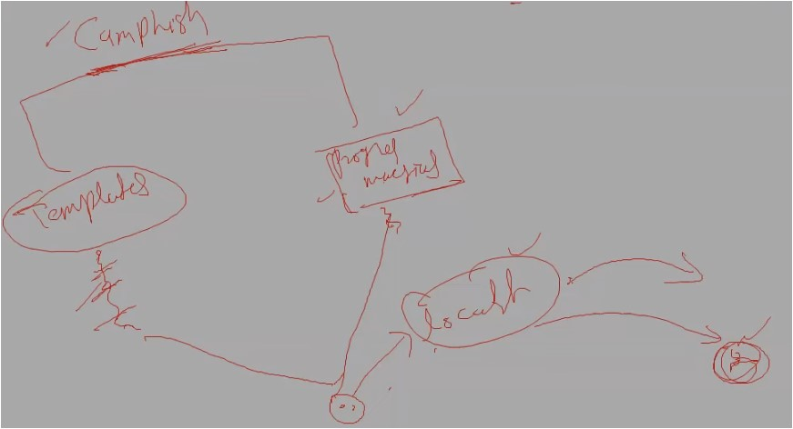
- URL Hacking is not possible - means we're hacking the system not the URL  - we just redirect to that address by clicking on that URL link
- Example (before doing Practical of Camphish) : ✔
	- while using Zoom software , it can access camera , screen-share , mic & we can do file sharing
	- but generally , Zoom software can do access camera , screen-share , mic  but ZOOM using these access legally , but accessing these things can be used as illegally too to hack someone's system✔
	- so all these things like accessing camera , mic , screen-share , etc happening legally as well as illegally  so it depends how u use these things for what purpose
- so Camphish is a camera phishing toolkit - means used for taking control of a Victim's device camera ✔

### Practical Work : System hacking via URL by using Camphish tool
- STEP 0 : `sudo su` in terminal
- STEP 1 : go to [GitHub - techchipnet/CamPhish: Grab cam shots from target's phone front camera or PC webcam just sending a link.](https://github.com/techchipnet/CamPhish)
- STEP 2 : go to Kali Section & copy this command `git clone https://github.com/techchipnet/CamPhish`
- STEP 3 : `cd CamPhish` - then run `ls`
	- output : "camphish.sh" file we'll get  - we need to give execution permission to this file cuz it's color is white
	- STEP 3.1 : run `chmod +x camphish.sh`
- STEP 4 : 2 ways to execute this file , but we'll use "./" , run `./camphish.sh`
	- output :  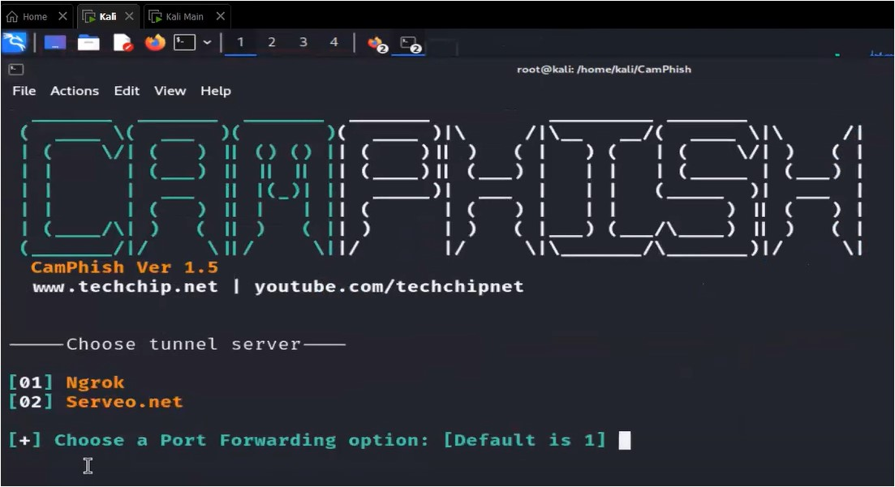
	- in output , we're getting 2 options - means which one server do u want to use to take the localhost to world wide ✔
- STEP 5 : press `1`
	- output  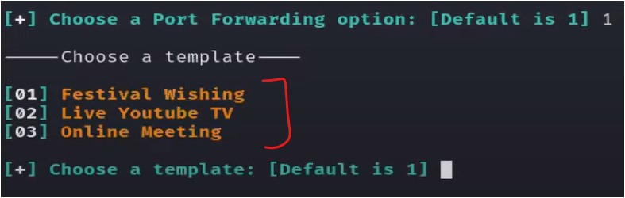
	- in output : we're getting Template  Q : which one have good camera  Ans : Online meeting 
	- STEP 5.1 : press `3` , output :  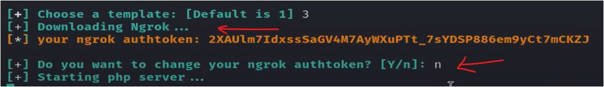 - in STEP 5.1 output : ngrok is checking token ,  Note : if ngrok didn't get the token then paste that ngrok token from it's website
	- STEP 5.2 : press `n` - cuz we don't want to change ngrok-token
	- now php + ngrok server are getting started , output  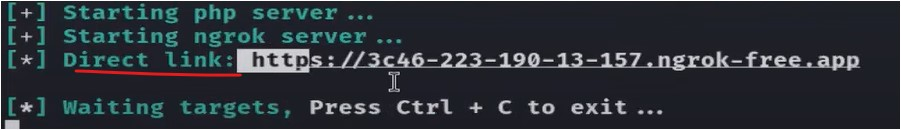
- STEP 6 : copy & share the link with a Victim i.e "https: //3c46-223-190-13-157.ngrok-free.app"  - & say to Victim that open the link in his/her Kali
	- STEP 6.1 : Victim will open the link in his/her browser & say him/her - that allow camera access - just other applications ask for permissions like camera , mic 
	- if someone open the link & join - then output looks like :  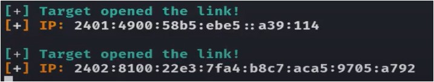
	- in output , at the same time - 2 Victim joined with the link ✔  - so multiple Victim can join with the same link at the same time
	- STEP 6.2 : now consider urself as a Victim & open the link in ur browser . output : 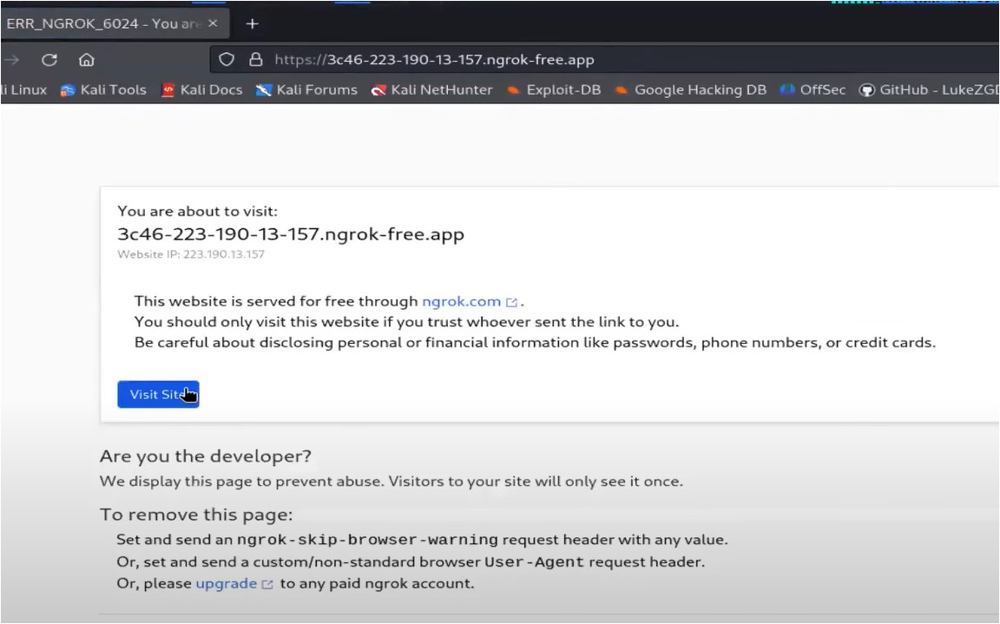
	- STEP 6.3 : click on "Visit Site" button , output  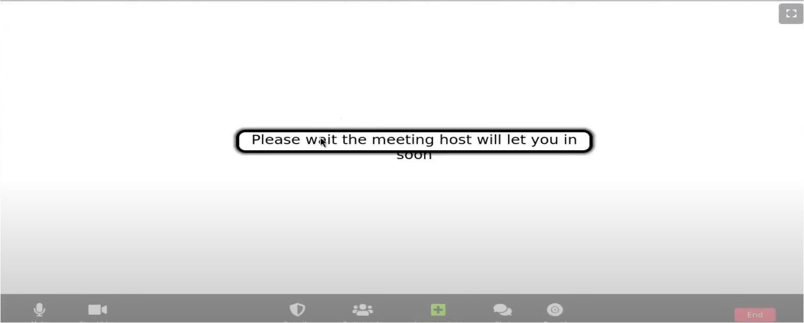
	- in STEP 6.3 output : we're getting complete meeting environment
	- STEP 6.4 : now u're a attacker , open the terminal , output  :  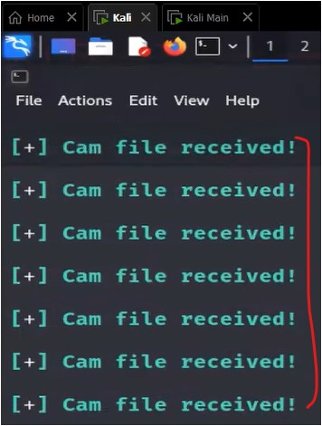
	- in STEP 6.4 output : Cam file received - will come continuously - means we got 7 picture files (of Victim)  in our system 
	- STEP 6.5 : press `Ctrl + C` to terminate - cuz the more Victim stay on that link then the more cam picture will come  - run `ls` - output :  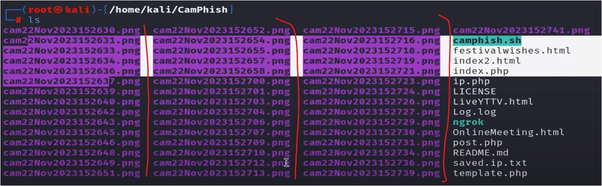
	- STEP 6.6 : go `kali/camphish` folder to check all those pictures of Victim  - if a Victim didn't allow the Camera access or his/her device's camera is off - then no face will come ✔  - Note : if camera is ON - then u can't open same camera in 2 different platforms - otherwise  camphish will not able to capture the face ✔ - output : when Victim click on "Visit site" button  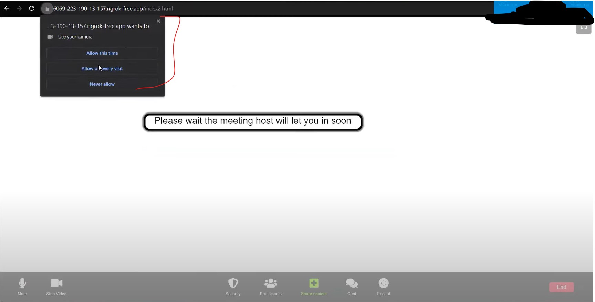
	- Note : after terminating the process of "camphish" tool & when we start again - then new link will be created
	- to remove all those cam pictures , run `rm -r cam*` - but this will delete the folder itself also  - cuz u did "`cam*`" , so run `rm -r cam22Nov2*`
	- `Note ✅` : so when camphish generate the link ✔
		- Eg : "https: //3c46-223-190-13-157.ngrok-free.app"  - so here 1st pair will be different - but after 1st pair , combining all the pairs - is a attacker's Public Static IP address ✔
		- u can even check ur Public Static IP address on - https://whatismyipaddress.com/
		- so if u give this link to a Victim (& what if it's a hacker) - then he/she will able to know ur Public Static IP address ✔
		- so it's a loophole for u as a attacker ✔
	- so we'll use a different tool for making the localhost link world-wide 

### Practical Work : combining cloudflared tool with camphish tool
- Q : why we're using cloudflared tool ✔
	- Ans : cuz when we're using Camphish itself only - then it's leaking our (as a attacker) Public Static IP address  when we're sending the link world-wide
	- so combining cloudflared tool with Camphish tool - then cloudflared will hide our (as a attacker) localhost  when we send the localhost link world-wide
- STEP 1 : to download & install cloudflared tool
	- It's a Open Source Tool & they didn't take ur personal details
	- STEP 1.1 : search either "cloudflare download linux" & go to 1st link STEP 1.2 : OR click on this link [Downloads · Cloudflare Zero Trust docs](https://developers.cloudflare.com/cloudflare-one/connections/connect-networks/downloads/)
	- STEP 1.3 : in linux section , click on download to ".deb" of "amd64 / x86-64"  - cuz kali linux is debian based
	- STEP 1.4 : open kali terminal , run `sudo su`  Q : how .deb file installed  Ans : "dpkg"  command
	- STEP 1.5 : cd Downloads , run `ls` , run `dpkg -i cloudflared-linux amd64.deb` & hit enter
- STEP 2 : how to use cloudflared tool with camphish tool
	- STEP 2.1 : firstly run camphish , run `./camphish.sh`
	- now we'll use "serveo.net" server instead of Ngrok
	- STEP 2.2 : press `2` & then press `3` - then press `n` , output :  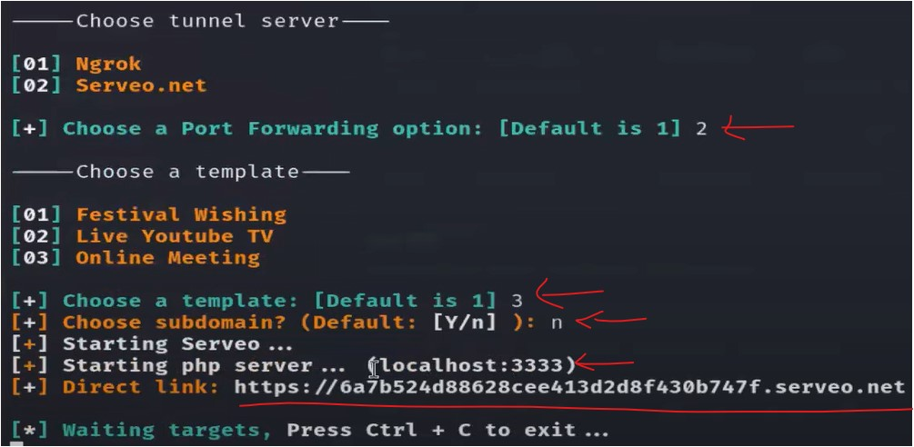
	- in output , server is started &  - camphish put made all the programs & put inside localhost:3333 ✔
	- Now we need to make this "localhost:3333" world-wide via cloudflared ✔
	- Note : we can't give our custom port no. to this localhost - otherwise issue will come
	- STEP 2.3 : open a new terminal , run `sudo su` - then run `cloudflared --url http://localhost:3333`  - Note ✅ : here we added "http://" , not "https://" - cuz https needs SSL or TLS certificate to run ✔  - output :  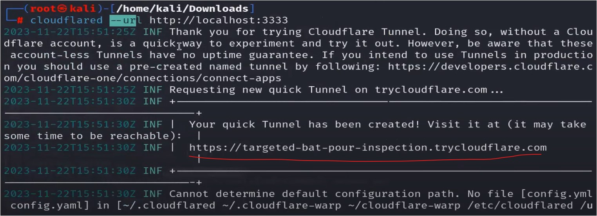
	- in output , we got the link - which is generated by cloudflared  - in this link , our (as a attacker) data is not leaking 
	- STEP 2.4 : send this link to Victim & say him/her to open it on browser & allow camera  - output : once that Victim allow the camera - then camphish will capture the pictures of his/her face
	- output : we'll get Public Static IP addresses & their live cam pictures  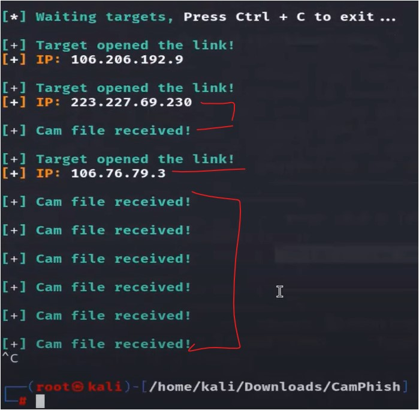
	- STEP 2.5 : close the process , press `CTRL + C`
	- Note ✅ : if we change the complete URL via [Bitly URL Shortener](https://bitly.com/) or any other URL shortener
		- then issues will come - & even if u're able to change the URL from these URL shortener websites  - then redirection problem will come - cuz 3 times redirect will happen behind the scene

---
### Homework
1. 

---
### End of the lecture (Doubts) :
1. 

