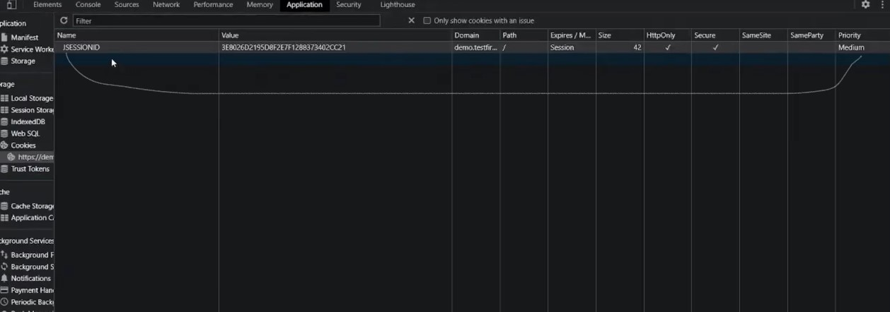

#WAPT-notes  

---
### what we'll learn
> Lecture Name : Web Fundamentals #2 What are cookies? Explained in detail | Practical Demo | HTTPOnly, Secure Flag
> 1) what are cookies
> 2) Purpose/usage of Cookies
> 3) why cookies or importance of it
> 4) for what purpose Using Cookies
> 5) Manipulating Cookies - how u can manipulate cookies
> 6) Alternatives - useful to know
> 7) More on Cookies

### Platform used
- tryhackme.com

### Overview
- This Topic is vv imp for session management ⭐
- whatever attacks are done without cookies are rare
- Cookies most important for session management ⭐

---

### 1. What are Cookies
- Cookies are small bits of data which is stored in the browser
- Different browsers store different cookies - cookies which are stored in all browsers are not same  
	Eg : Chrome will store different cookies , Firefox will store different cookies & so on  
	conclusion : cookies in chrome won't be available in firefox ✔️️

### 2. Purpose/usage of Cookies
- generally, cookies are used for session management
	- Eg of session management 
		- Situation 1 : let's say u're loggedIn on twitter & once u logout from twitter  
			then that session will be removed from the browser
		- Situation 2 : but u're loggedIn already on twitter & u closed the browser & after some point of time ,  
			u came again & open the twitter in ur same browser (which u were using earlier) then twitter will get open  
			without asking login cuz in cookie , time mentioned that the user loggedIn this time & cookies are maintained ✔️️
- used for advertising
	- Eg : when u saw a product on amazon then advertising will shown related to that product 
  	- so due to cookies u are tracked  
		or u'll get pop up from a website (which u're currently on) for accepting cookies like tryhackme.com
- Cookies are information about users that a web server uses them to remember ✔️

### 3. why cookies or importance of it
- Q : why cookies / importance of it
    - cuz `HTTP` protocol is stateless (means we can't track `HTTP` protocol) but cookies are used to track  
		or track user data or to track shopping data of ur browser , we can use cookies to track the user's behavior  
		Eg : what u have done in that webapp or for how much time u stayed logged-in there , etc are managed by cookies  
		but `HTTP` protocol can't be track to know about ur shopping data from ur browser or app ✔️
- parts of cookies
	- generally , cookies divided into 4 parts : 
		- 1st - `the name of the cookie` : used to identify the name of the cookie
		- 2nd - `a value` : tells where data is stored
		- 3rd - `an expiry` : tells when the browser will destroy/remove the cookie automatically
			- Eg : let's say today is Thursday & time in defined that browser will destroy the cookie on Saturday
			- so we can define a expiry with date & time of a cookie
		- 4th - `a path` : tells what requests that the cookie will send with 
            - Eg : Generally , where the cookie is set/defined - then definitely the cookie will be send with that thing
            - Q : Who set/define the cookie in the browser  
				Ans: Generally , a web server define/set the cookies by a `Set-Cookie` header &  
					`Set-Cookie` header comes inside `Response-Headers`  - & we can define/set the cookies via JS inside the browser

### 4. for what purpose Using Cookies
- when u login to a webApp , then u'll get `a Session Token`  
	this Session Token helps/allows the web server to identify that request is done by u
- Eg of importance of a Session Token 
	- let's say u're logged-in in amazon webapp & at this time , on the web server , multiple requests coming simultaneously  
		& many customers also logged-in on amazon webapp
	- so then how a web server will identify that request came from ur side i.e via Cookies ✔️  
		that's why cookies are extremely imp cuz only the cookies helps the web server to identify  
		that the request is send from ur side & other requests are of someone
- Q : what happen if someone steal ur session-token/cookies (which is maintained by ur browser) ✔️
	- Eg : let's say if ur cookies steal by someone (via Man-In-the-middle-attack - burp suite ,  
		so a attacker can intercept if u & someone are on the same internet connection)
	- so if someone steal all of ur cookies via MITM (man in the middle attack) then the web server will think  
		that request has been done by someone (who looks like u) - but actually u didn't done any request
	- so this how u can impersonate (means actually u're not that person but u're showing urself as him - means faking/pretending)  
		to the web server

### 5. Manipulating Cookies - how u can manipulate cookies
- STEP 1 : open the browser dev tool -> application tab -> Storage section
- we can also create our custom cookie

### 6. Alternatives - useful to know
- we have LocalStorage & SessionStorage - both have a similar functionality but not sent with HTTP requests by-default

### 7. More on Cookies
- reference : [Using HTTP cookies - HTTP | MDN](https://developer.mozilla.org/en-US/docs/Web/HTTP/Cookies)
- Cookies are mainly used for 3 purposes:
    1) Session Management : logins , shopping carts , etc
    2) Personalization : user preference , themes , etc
    3) Tracking : Recording & analyzing user behavior
	- Conclusion : anything information which is necessary for the server to remember  
		that's why cookies being made to help the server ✔️
- creating Cookies
    - this is a done by a webdev , not by a cyber security
- Define the lifetime of a cookie
	- `Set-Cookie: id=a3fWa; Expires=Thu, 31 Oct 2021 07:28:00 GMT;`
	- this is define by a web server automatically  
		but if u're deleting cookies manually (like complete history deleting of a browser)  
		then this date & time doesn't mean anything
- Restrict access to cookies (how to protect cookies from unknown access) ✔️
	- majorly , a cookie has 2 attributes to secure the cookie i.e `Secure` & `HttpOnly`
	- if in a cookie , `Secure` attribute flag is defined - then means that cookie will not use `HTTP` protocol ,  
		only `HTTPS` going to be used by that cookie
		- `Note ⭐` : sometimes we send the request via `HTTP` protocol (instead of `HTTPS` protocol) using  
			burp suite or by doing any kindof manipulation in packets.
		- so we can't able to send the request via `HTTP` protocol - if in that `cookie` , a `Secure` attribute flag is defined/set 
			so due to this , MITM , etc attacks can't possible in that cookie
		- However, don't assume that `Secure` prevents all access to sensitive information in cookies
    - if in a cookie , `HttpOnly` attribute flag is define ✔️
		- means attacks which are related to JS like `document.cookie()` (is a payload)  
			so JS & XSS (Cross site scripting) both have a payload that can't be executed 
		- means stealing cookies via XSS is not possible , if u set/define the cookie as `HttpOnly` attribute
- Q : where cookies are sent ✔️
	- there are 2 attributes i.e `Domain` & `Path`
	- Eg of `Domain` attribute : 
		 - if u have an webapp as xyzz.com - then u can define/set the value of `Domain` attribute must be as xyzz.com  
		or u can set the subdomain also 
		 - but if the website is xyzz.com but value of `Domain` attribute set as  
		something else then its insecure configuration
	- Eg of `Path` attribute : 
		 - only define/set the path of ur application like `/docs` or `/docs/web` , etc 
		 - but path is define as empty like this `/` (aka "%x2F") then this also not good which shows insecure configuration
	- `SameSite` attribute of cookies
		- used to prevent CSRF (Cross-Site Request Forgery) attack
		- Eg : if u're logged-in in a webapp & u got the link from somewhere or someone send that &  
			if u open that link in a tab inside the same browser (which u already logged-in in a webapp) ,  
			then that link/attacker might do changes on that webapp which u logged-in
		- so via CSRF attack , attacker can make u to perform unintended actions
		- so if there is `SameSite` attribute defined to the cookie then attacker can't do anything
	
### Homework
- see more on `SameSite` attribute , http cookie

### Practical Work : how to see a cookie of a website via inspect tool

- STEP 1 : open demo.testfire.net -> press F12 -> refresh the page again
- STEP 2 : `application` tab -> inside storage - Cookies 
	- Eg of Cookie : u'll find the cookies of this website as this  
	- in Pic , 
		 - if u see the `Path` is empty which means this webapp is vulnerable , so `Path`  shouldn't be empty
		 - but this webapp set the `HttpOnly` & `Secure` attributes flags inside the cookie which is good ✔️
	- this webapp doesn't define `SameSite` attribute , so we can perform CSRF attack
	- Conclusion : this is how we can see the cookie of a website
- STEP 3 : u can see "Local Storage" & "Session Storage"

---

### End of the lecture (Doubts)
- Practical demo on CSRF : https://www.youtube.com/watch?v=AHV9ThkRT9w&ab_channel=SpinTheHack
