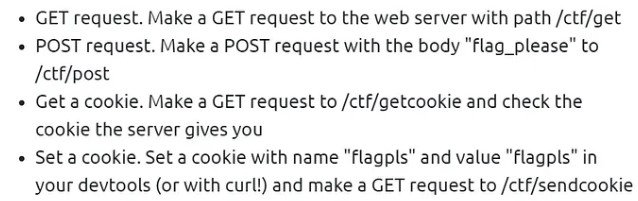
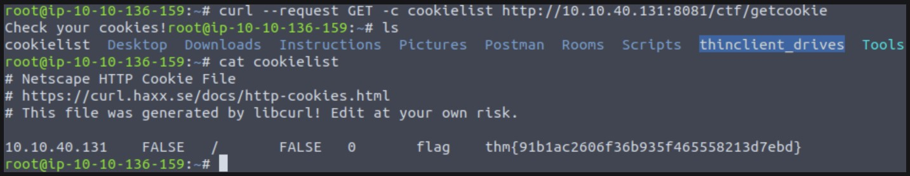
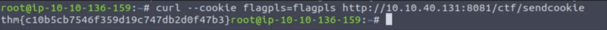

#WAPT-notes  

---
### what we'll learn
> Lecture Name : Web Fundamentals #3 Mini CTF | Tryhackme
> 1) Making HTTP requests
> 2) Intro to cURL
> 3) Practical Work
> 4) Summary

### Platform used
- tryhackme.com

### Overview
- we'll do practical web mini CTF (capture the flag) of this complete webApp fundamentals
- how to do HTTP requests without any browser
- how to create cookies
- how to GET cookies
- how cookies details come when u get cookies
---

### 1. Making HTTP requests
- we can do/make HTTP requests without browsers i.e cURL (a programming lang) ✔
- `cURL` is a small CLI based utility & allows to automate repetitive tasks ✔
- `Note ✅` if u're doing OSCP then "cURL" is v imp & v useful

### 2. Intro to cURL
- By default , cURL will perform GET requests on whatever URL u gave it.  
	Eg : when u type url or anything on URL address bar (of the browser) means we're doing GET request  
		same as in cURL `curl https://tryhackme.com`
	- this command means `curl` making GET request on that URL
- `-X flag` : used to specify the request type are as follows :
	- POST request via curl i.e `-X POST`
	- to specify data to POST i.e `--data` or `-d`
- `Note ✅` : as earlier we talked i.e cookies are not shared b/w different browsers  ✔
	- so when u hit/made the request for cookies via `curl` in Chrome browser  
		then cookies will not shown in different browser ✔
	- Eg : u're creating/getting a cookie on firefox then the same cookie will not shown/open in different browsers except firefox ✔

### 3. Practical Work
- There's a web server running on http://10.10.40.131:8081 - connect to it & get the flags/issues/vulnerable-programs  
	
- STEP 1 : connecting with VPN
- STEP 2 : open kali OS -> terminal 
- Q 1) : what's the GET flag ? 
	- above , to make a GET request , we need to go path -> /ctf/get
	- Ans : `curl http://10.10.40.131:8081/ctf/get`  
		Output : `hm{162520bec925bd7979e9ae65a725f99f}` - this is a GET flag u got
	- here `http://10.10.40.131:8081` - is a web server
- Q 2) : What’s the POST flag?
	- Ans : `curl -X POST -d flag_please http://10.10.40.131:8081/ctf/get`  
		Output : `hm{3517c902e22def9c6e09b99a9040ba09}` - this is POST flag
	- Q : why `-d` comes with a POST request  
		Ans : cuz with a POST request , a body header also come & in `body` must have data , body shouldn't be empty ✔
- Q 3) : What’s the “Get a cookie” flag?
	- we have 2 ways to get a cookie i.e browser way & via curl
	- via Browser way - cuz in browser , easier to check cookies
    	 STEP 1 : paste it `http://10.10.40.131:8081/ctf/getcookie` on URL address bar then u'll get "check ur cookies" message 
		 STEP 2 : press F12 -> storage -> cookies -> u'll get the value (which is a flag of `GET Cookie`) ,  
			so that value is a flag i.e `thm{91b1ac2606f36b935f465558213d7ebd}`
	- via curl   
- Q 4) : What’s the “Set a cookie” flag?
	- via browser way , 
		- STEP 1 : open firefox browser -> run  `http://10.10.40.131:8081/ctf/getcookie`
		- STEP 2 : press F12 -> storage -> cookies 
		- STEP 3 : click on `+` button to add custom cookies
		- STEP 4 : write name as `flagpls` , value as `flagpls`
		- STEP 5 : then change the path of URL as `http://10.10.40.131:8081/ctf/sendcookie`
		- output : we'll get "set a cookie" flag as `thm{c10b5cb7546f359d19c747db2d0f47b3}`
	- via curl way   

### 4. Summary
- this is how we do GET & POST requests via `curl` CLI language
 
---

### End of the lecture (Doubts)
- Q : is bash a programming language or scripting language 
	 Ans : https://www.perplexity.ai/search/is-bash-is-dcTHkUldTui64FUPCt5e7g
