#WAPT-notes  

---

### what we'll learn
> Lecture Name : Burp Suite #1 Introduction | Installation | Configuration | Proxy
> 1) Burp Suite intro
> 2) it's installation
> 3) it's configuration
> 4) how to use it & it's different major components
> 5) it's proxy component intro

### Overview
- BurpSuite intro , installation , configuration
- Burp Suite - most imp tool ✔️️

### Aim of the lecture
- after watching complete lectures of BurpSuite , u don't need to watch anything else for it

### Prerequisite
- must know prev. 5 lectures of Basics of Web Fundamentals 

### References
- [TryHackMe: Burp Suite: Basics— Walkthrough | by Jasper Alblas | Medium](https://medium.com/@JAlblas/tryhackme-burp-suite-basics-walkthrough-209ab703d6a1)
- [TryHackMe- Burp Suite Walkthrough | by Katjah Smith👩🏽‍💻 | System Weakness](https://systemweakness.com/tryhackme-burp-suite-walkthrough-c71e10b1112)

---

### 1. BurpSuite intro
- reference : [TryHackMe | Burp Suite: The Basics](https://tryhackme.com/room/burpsuitebasics)
- it's a framework for WAPT cuz it's a collection of different tools like decoder , etc
- pentesting/penetration testing both means same
- Q : why Burp Suite called as defacto tool  
	Ans : it's a defacto tool means standard tool - means if someone knows WAPT or he/she do bug bounty ,  
	webapp sec/security , etc - those people know already burp suite
	- without burpSuite it's not possible unless a person using scanner 
- it's major components are : `Proxy` , `intruder` , `decoder` , `Sequencer`, `Extender` , `Repeater` , etc

### 2. Installation
- diff. b/w Community Edition vs Pro version of BurpSuite
	 - in Community version : not get webapp scanner (which used to find vulnerabilities automatically)
	 - but community version is fine to do major work
- in kali Linux OS , BurpSuite Community Version + Java JRE already installed  
	& command to run BurpSuite on Kali terminal i.e `burpsuite`
- in winOS 
	- download : [Burp Suite - Application Security Testing Software - PortSwigger](https://portswigger.net/burp)
	- portswigger - is a company who made the BurpSuite software/product
	- STEPS to download : 
		- STEP 1 : go to website [Burp Suite](https://portswigger.net/burp)
		- STEP 2 : Products tab -> Burp Suite Community Edition -> choose OS & download it
		- STEP 3 : download java JRE cuz burp Suite requires [Java JRE](https://www.java.com/en/download/)

### 3. Gettin' CA Certified
- BurpSuite has a SSL Certificate 
    - STEP 1 : like open it -> go to it's `proxy` tab -> in `intercept` tab , output : u'll see `Open Browser` button
    - in BurpSuite , if u get this popup error  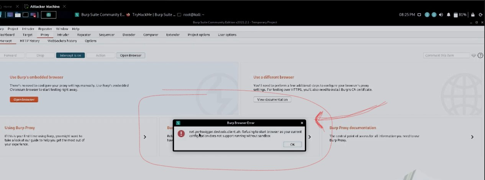  
		to fix it , go to `Project Options` tab -> `Misc` tab -> Embedded Browser ->  
		check the checkbox i.e Allow the embedded browser to run without a sandbox
- intercepting requests via BurpSuite with `Open Browser` burp suite feature
	- STEP 1 : go `Proxy` tab -> intercept tab -> click on `Open Browser` button ✔️
	- STEP 2 : now when u type like `demo.testfire.net` website , then inside BurpSuite  
		output : that website gets intercept , we got the GET request ✔️  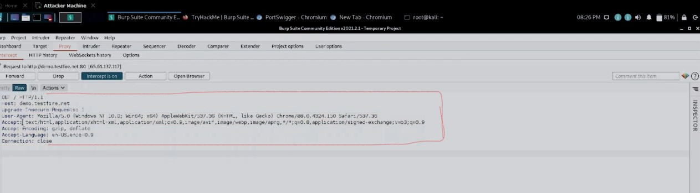  
		which u already seen in web fundamentals
	- Q : how GET request comes inside the client machine (browser) ✔️ 
		Ans : cuz here we didn't setup the proxy stuff cuz we're using embedded browser of BurpSuite  
		& which website is captured/intercept will be shown in `HTTP history` tab 
         - the browser on which proxy is not configured then if searching stuff happen on that browser  
			then we can't intercept any request via burpsuite
- intercepting requests via BurpSuite without using `Open Browser` BurpSuite feature
	- so we can't intercept requests on which we're running browser manually  
		cuz in old version of burp Suite , `open browser` button feature are not there
	- STEP 1 : open firefox -> settings -> preferences , search `xy` -> network settings
	- STEP 2 : click on `settings` button -> select only `manual proxy config` & others should be unchecked  
		& tick the `Also use this proxy for FTP & HTTPS` if u want & keep the HTTP proxy as `127.0.0.1`  
		(which is a localhost) & port as `8080` like this  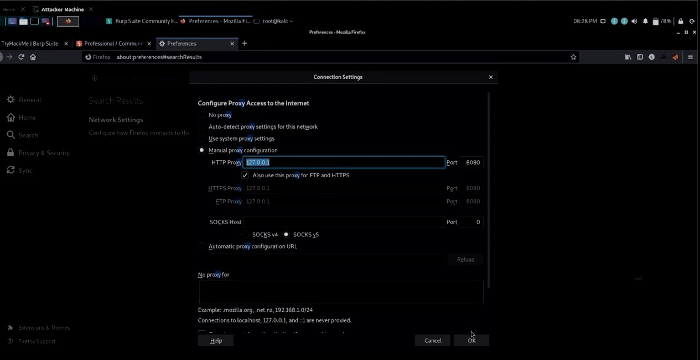
	- STEP 3 : click ok
	- STEP 4 : in BurpSuite -> Proxy tab -> options tab -> localHost must be same as we set/define inside the browser  
		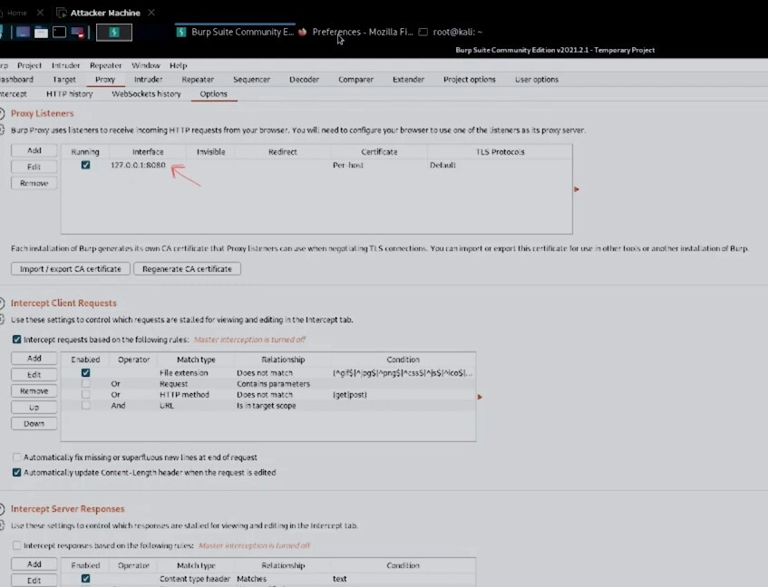
	- STEP 5 : using burpSuite for MITM (man in the middle attack)
		- STEP 5.1 : on the browser , now whatever GET request we type like `test.php.vulnweb.com`  
			& once u enter then GET request will go/hit on the server (as earlier we learned in web-fundamentals)  
			& if the server have that request or IP address of domain name  
			then the response will be send (in the form of data/page) to the client - generally this happens
		- but right now , the request directly goes to burp Suite instead to the server cuz Burp is a `proxy server` ✔️
		- Diagram :  
			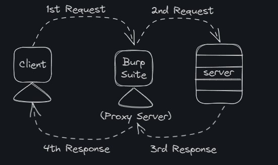
	- when we hit the request for that website then the request will not go directly to the server ,  
		it'll go to the Burp Suite - cuz `Burp Suite` is a `proxy server` ✔️
	- Q : Why this will happen  
		Ans : cuz we gave a port of that localhost ✔️ 
	- `imp Note ✅` : so firstly request will go from Client - to the Burp Suite proxy server - then we'll intercept the request  
		& after intercepting the request , if u (as a hacker) want to forward the request to the server  
		then only request will go the server
		- then the server's response came - to the burpSuite Proxy server - then client  
			so this is MITM attack , Role of the proxy server is to intercept each request & responses also ✔️
		- right now , in Proxy tab -> Intercept -> intercept is off , but if u keep it off then still we'll get  
			that URL in `HTTP history` but on the intercept by clicking on `Intercept is on` button
		- STEP 6 : on firefox -> write `testphp.vulnweb.com` & hit enter
			- once u hit the request then that GET request intercept by burp suite
		- STEP 7 : in burp Suite -> Proxy tab -> Intercept tab 
			- if we click on `forward` button then GET request goes to the server
		- STEP 8 : now , response will come 
			- go Proxy tab -> HTTP history
			- & then double click on that URL , u'll get the response like this 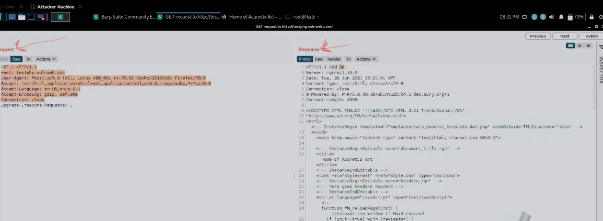
			- output : so as a response as `200 OK` , we got a HTML code which u can render the page there only - click on `render` button
	- intercepting via BurpSuite (setting up SSL Certificate issue with https)
		- `testphp.vulnweb.com` - is a http website 
		- we'll get issues with HTTPS when we intercept cuz each `HTTPS` website need SSL certificate  
			but HTTP websites doesn't need SSL certificate ✔️
		- Eg : in firefox -> write https://demo.testfire.net then we'll get error 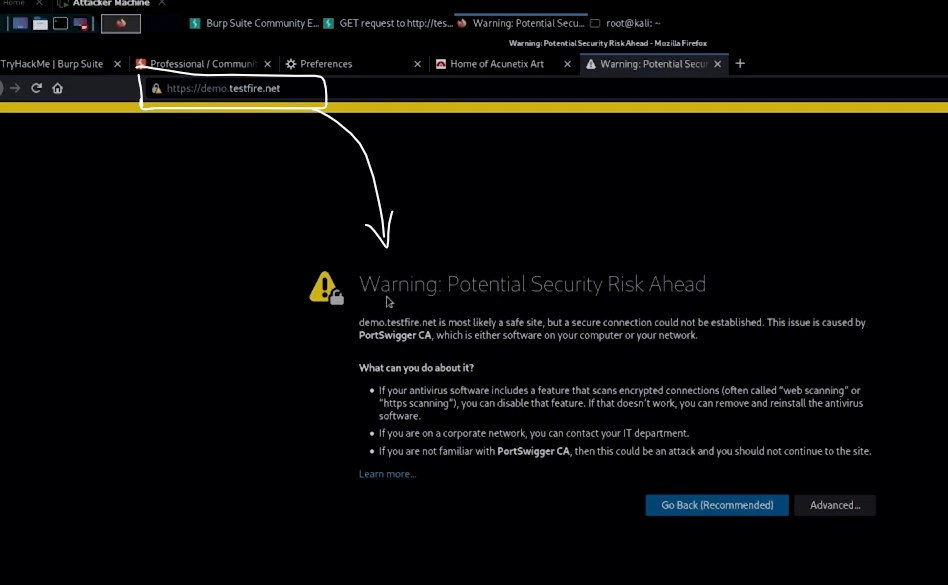
		- to avoid/skip this warning , installing SSL certificate
			- we're running a proxy server on `127.0.0.1:8080` 
			- STEP 1 : so go that browser only which u have done the configuration for localhost  
				& then write http://burp & hit enter
			- now u'll get the page of burp suite  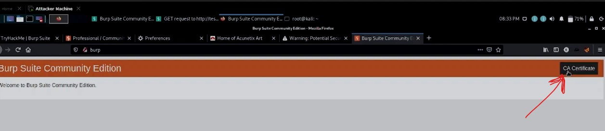
				- this page gives CA (certification authority) , it gives the certificate
			- STEP 2 : click `CA Certificate` button & download it
			- STEP 3 : in firefox -> settings -> references -> search - certificate
			- STEP 4 : click `view certificate` button -> import -> open it
			- STEP 5 : check both the checkboxes -> click ok -> then ok , now CA certificate is configured in that browser
			- STEP 6 : in burp Suite -> Proxy tab -> Intercept tab -> turn off the `intercept`button
			- STEP 7 : reload that page again , so u'll not get the error again & that's HTTPS website
		- role/purpose of SSL certificate in HTTPS ⭐
			- each HTTPs website needs a SSL certificate , so that website/webapp send the request/data to the web server  
				that data/request will be in encrypted ✔️
			- Eg : 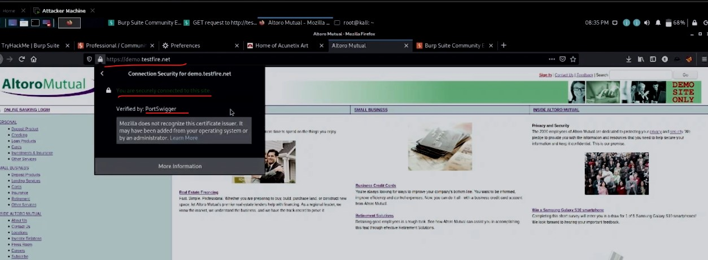
				- u'll get verified by : PortSwigger cuz on firefox , we installed the SSL certificate of PortSwigger ✔️
				- means each HTTPS website will get intercept by BurpSuite & no error will come  
					cuz SSL certificate installed on this browser ✔️
	- u can skip all these last 2 step , if u use `Open Browser` feature of burp Suite
	- so last 2 steps done if u're using old version of burp suite which hasn't have `Open browser` button burp Suite feature
	- we have `foxyProxy` firefox extension - which u can use if u don't wanna do that like  
		going on settings -> preference -> & then searching `proxy` & setup the localhost for the burp Suite proxy browser like this  
		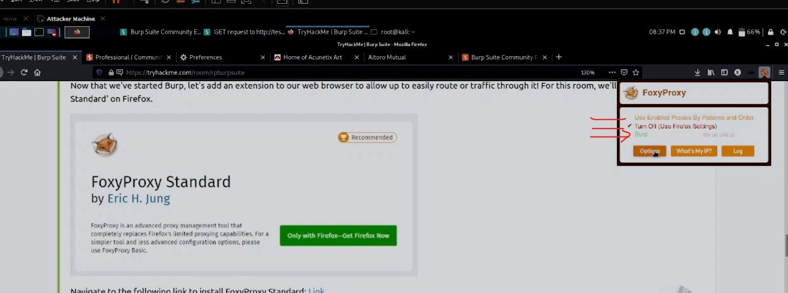
		- click on Option , u can add Proxy server & see Anuj Sir already setup a Burp Proxy server as `127.0.0.1` like this  
			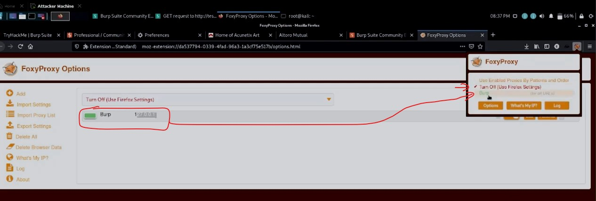
		- the movement he want to use Burp proxy , he'll click on that Burp & if he wants to off the proxy ,  
			we'll click on `Turn Off (user firefox settings)`

---

### End of the lecture (Doubts)

