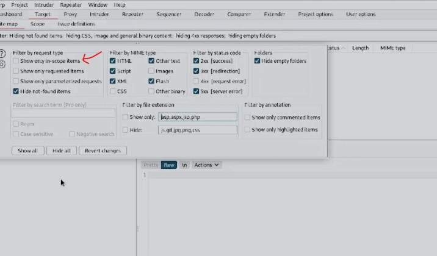

#WAPT-notes  

---
### what we'll learn
> Lecture Name : Burp Suite #2 Features | Proxy | Repeater | Intruder | Extender
> 1) features of BurpSuite
> 2) proxy , Repeater , Intruder , Extender

### Overview
- in this lecture , only high level overview of these features of BurpSuite discussed

### Upcoming lectures
- in upcoming lectures , we'll see these features in depth

### Advice to learn stuff
- we're going slow cuz Anuj sir can make a video on BurpSuite which contain everything about it,  
	but the advantage of learning slow u'll not get 
- that's why firstly see the vid - understand - ask 	doubts if u have - do practice of that vid

---

- Reference : [TryHackMe | Burp Suite: The Basics](https://tryhackme.com/room/burpsuitebasics)

### Proxy
- Definition 
	- means the Burp Proxy allows us to intercept & modify requests/responses when interacting with web applications.
	- means used for funnel traffic analysis 
	- means the data/packets/header-requests/responses which are coming , the Burp Proxy can intercept & modify ✔️️
- Importance of it :  
	without it , BurpSuite app doesn't mean anything cuz BurpSuite is a proxy server ✔️
- Q : in burpSuite app , where we find proxy  
	Ans : inside Proxy tab , 
	 - it has 4 options : Intercept , HTTP history , WebSockets History , Options
	 - in Intercept , it has "Intercept is ON/Off" btn  
	Q : if "Intercept" btn ON - then how packets capturing happen ✔️ 
	Ans : then one by one packet capturing happens  
	Q : if u turn "Intercept" btn OFF - then how packets capturing happen ✔️ 
	Ans : then packets capturing goes inside HTTP history

### Target
- Definition
    - how we set the scope of our project. We can also use this to effectively create a site map of the application we're testing.
- importance of it
	- open Burp Suite -> Target tab -> Site map
	- in firefox , let's say u open "tryhackme.com" or any other websites/webapps u opened.  
		so now inside `target` tab , u'll get those application or websites list
	- Q : but if u want to test only one of them - then why u want to see those others websites report ✔️ 
		Ans : so in `site map` , either do right click or hover then u'll get this popup  
		
		 - check the checkbox `show only in-scope items`
    	 - & those websites/webapps come inside `site map` tab , u can right click on them to put them in `scope` tab ✔️
         - so `Target` tab is good to manage different reports

### Intruder `imp ✅`
- usecase 
	- powerful tool for everything from field fuzzing to credential stuffing & etc
	- mostly it's used for Brute Forcing - Eg : SQL Injection ✔️

### Repeater `imp ✅`
- definition
	- Allows us to `repeat` requests that have previously been made with or without modification.  
  		Often used in a precursor step to fuzzing with the aforementioned intruder
	- means any request which is captured & came inside `Proxy` tab -> `Intercept` tab  
		then right click on that request - then u can send that request to `Repeater` tab  
		& then u can change any parameter of a request ✔️
- Eg : let's say , u got an A/C number of a person inside `Repeater` tab then u can change the A/C number to urs account no.  
	& do the `POST` request & if that banking webapp or website is vulnerable then the money comes into ur account  
	& `reponse` status code will become `200 ok` ✔️

### Sequencer
- Definition
	- Analyzes the 'randomness' present in parts of the web app which are intended to be unpredictable.
	- used to find out how much 'randomness' of that session Cookie ✔️
- usecase : generally , used for testing session cookies ✔️

### Decoder
- definition
	- it allows us to perform various transforms on pieces of data. These transforms vary  
		from decoding/encoding to various bases or URL encoding
- usecase
	- u're decoding or something is encrypted or base64 encoding done or dzip deleted , etc  
		so these are encoding techniques & there are many encoding techniques  
		so for encoding , we also have decoding or decrypting stuff ✔️
	- so whatever the request u capture , so if u send that request to decoder , so that request will get decode ✔️

### Comparer `v imp ✅`
- usercase : 
    - used to compare different responses or other pieces of data  
		such as site maps or proxy histories (awesome for access control issue testing).  
		This is very similar to the linux tool i.e "diff" - means difference.
    - when u see the request on the BurpSuite , then that request contain many parameters ,  
    	so if u want to see/find the difference b/w those 2 requests/responses then use it ✔️

### Extender
- Similar to adding mods to a game like minecraft , it allows to add components  
	such as tool integrations, additional scan definitions & more.
- in BurpSuite -> "Extender" tab -> "BApp Store" tab -> u'll see all the extensions & see rating , popularity ,  
	detail (which shows whether u need professional version or not - like Custom header , AuthMatrix , Auth Analyzer, etc ,  
	so those extensions u can install which are not BurpSuite Professional) 
- use case : u want to add mods/tool/extension with Burp Suite ✔️

### Scanner
- this feature only in BurpSuite Professional Version
- usecase
    - it automatically gives all the web vulnerability , shows the payload that the payload was used like this ,  
		this is how the webapp or website was exploited , etc aka vulnerability assessment
	- means it automates the "vulnerability assessment" task which u were doing manually earlier
	- reference for vulnerability assessment : [EP #17 What is Vulnerability Assessment? Types? Lifecycle? - uTube](https://www.youtube.com/watch?v=orkmeZ-SUsA&t=0s&ab_channel=EthicalSharmaji)

### Ques

- Q1) Which tool in Burp Suite can we use to perform a 'diff' on responses & other pieces of data ? 
	- Ans : Comparer
- Q2) what tool could we use to analyze randomness in different pieces of data such as password reset tokens ? 
	- Ans : Sequencer
	- randomness : means like in password , how much randomness of that password is strong
- Q3) which tool can we use to set the scope of our project ? 
	- Ans : target
- Q4) while only available in the premium versions of Burp Suite, which tool can we use to automatically  
	identify different vulnerabilities in the application we're examining ?
	- Ans : Scanner
- Q5) Encoding or decoding data can be particularly useful when examining URL parameters  
	or protections on a form, which tool allows us to do just that ?
	- Ans : Decoder
- Q6) Which tool allows us to redirect our web traffic into Burp for further examination ? 
	- Ans : Proxy
- Q7) Simple in concept but powerful in execution, which tool allows us to reissue requests ? 
	- Ans : Repeater
- Q8) With four modes , which tool in burp can we use for a variety of purposes such as field fuzzing ?
	- Ans : Intruder
- Q9) which tool allows us to modify Burp Suite via the addition of extensions ? 
	- Ans : Extender

---
### End of the lecture (Doubts)

