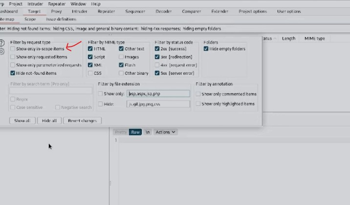

#WAPT-notes  

---
### what we'll learn
> Lecture Name : Burp Suite #3 How Burp Suite Proxy Works? MITM Attack?
> 1) what's proxy
> 2) working of it
> 3) proxy of BurpSuite
> 4) task related to dark mode proxy (not important topic)

---

### Topics - Explanation

### what's Proxy
- Eg of Proxies : in classroom , u said proxy attendance to a friend which mean that friend ill do that work for u ,  
	if you're not going to college ✔

### role/working of proxy
- `1st` : To Filter websites
    - in college/office , some websites won't open like facebook , tiktok , etc.. so they blocked those websites , so `how they block these websites` ✔
    - internet allows every websites , so let's say you're in network team of an organization & u want to block  
    	- `How u gonna block those websites ?`
			- 1) whatever all the traffic/websites are coming , u need to check - means let's say a user writing `tryhackme.com`
			- 2) so this website first will check whether this website defined inside the allowed list or not
			- 3) `how to check whether that website defined in the allowed list or not` - so this done via proxy
	- this shows the first working of it i.e to filter websites means to allow some websites according to requirement & don't allow some which are not needed
	- Diagram explanation of how request/response done with proxy server : ![[WAPT-lecture-7-1.jpg]]
		- in the middle aka proxy server
		1) the request of client first goes to -> the Proxy server -> the main server i.e web server , the response of a web server  -> to the proxy server -> to the client ✔
		2) Eg : if you're accessing `tryhackme.com` , so firstly , GET request of that website goes to the Proxy server , the GET request don't go directly to the main web server (that's why the proxy server acting as MITM attack) ✔
		3) so the GET request will go -> to the proxy server -> now the proxy server will check that website exist or not ✔
		4) Now the proxy server will see whether that website is inside the allowed list or not , so if that website in the allowed list then only the request will go to the web server of `tryhackme.com`  ✔
		5) then the web server will send the response -> goes to the proxy server -> then it goes to the client ✔ 
		6) but if that website is not allowed then the request goes from the client -> to the proxy server -> & the proxy server will check & tell that this website is disallowed , so the response will go to the client directly , the request will not go to the web server ✔ 
		7) & u'll get generic error in u're client machine ✔
- `2nd` : modify the request/response after intercepting
	1) firstly , all the requests going via the proxy server & responses coming on the proxy server
	2) if we want to test one or more websites then we can do changes on them
	3) Eg : means whatever the GET request goes to the proxy server like u need `tryhackme.com` page , so u can do changes on runtime cuz that request didn't send to the web server yet ✔
	4) Eg : let's say on a banking website , u're sending a GET request that bring my account number details & that backing webapp is vulnerable (means no good developer made that)
	5) so generally , the GET request goes directly from client to the web server & the server will bring your account details -> but in the middle , there is a proxy server , so firstly the GET request go from client to the proxy server then we can change the account number in the proxy server via BurpSuite. so we'll change the account number & that modified one will go the web server ✔
    6) & the web server don't even know difference b/w both that the actual account number send from the client & send by the proxy server -> which one is original cuz for the web server , the request came from the proxy server ✔
	7) Eg : it's a 3 people , 1st friend said something to 2nd friend to tell the 3rd friend but 2nd friend changed/modified that chat & told to 3rd friend 
	8) so 3rd friend never going to know that what 1st friend told him , so middle friend is controlling the things like modifying , what to tell & what not to tell , forwarding & dropping ✔
	9) let's say 1st friend was appreciating (about his 3rd friend) with 2nd friend but 2nd friend modified it & said to 3rd friend that 1st friend was saying wrong things about u

### working of it in BurpSuite
- STEP 1 : Now let's on the proxy , so in kali linux , run burpSuite in the terminal as `burpsuite` command
- STEP 2 : so tryhackme.com/room/burpsuitebasics -> in `introduction` section, start the machine & setup the VPN also
- STEP 3 : copy the IP address which is given by tryhackme.com/room/burpsuitebasics
- STEP 4 : to change the localhost & port then either go in BurpSuite , change the localhost proxy -> Proxy tab -> Options & add that IP address OR open firefox -> foxyProxy extension & click on Burp , now this browser got IP address as 10.10.33.100 & hit Enter
- STEP 5 : in burpSuite , on the intercept & in firefox , hit enter & u'll get the GET request of that IP address like this ![[WAPT-lecture-8-0.jpg]]
	- now u can either `forward`  or `Drop` this GET request just like 3 friend situation ✔
	- or u can change/modify the GET request , so right click on empty area & click on `Send to Repeater` option ✔ but click on `forward` button
- STEP 6 : & turnoff the Intercept & all the things will save inside Proxy -> HTTP history ✔
	- output : we'll get Juice shop ![[WAPT-lecture-8-1.jpg]]
	- STEP 6.1 : click let's say on Apple Juice (1000ml) & we'll GET request in Burp Suite , we can check all the request we made according to `time` like this ![[WAPT-lecture-8-2.jpg]]
- STEP 7 : to change this GET request , then right click on left side bottom `Request` section & click `Send to Repeater` (means modifying/changing the GET request & then sending to the server) ✔
	- STEP 7.1  : in Repeater , change the product from `1` as `7` then we'll get 7 product as Response also like this ![[WAPT-lecture-8-3.jpg]]
	- Once u change from 1 to 7 inside the GET request then we'll get response for 7 reviews also ![[WAPT-lecture-8-4.jpg]]
	- so we changed the data & item goes to 7 i.e Green Smoothe
- STEP 8: we can run intruder  
	- STEP 8.1 : in Repeater -> right click on `Request` section & click `Send to Intruder`
	- STEP 8.2 : in burp Suite -> Intruder tab
		- we'll get updated `Target` 
		- in `Positions` tab (it's a main tab where we need to define where we want to do intruder) ✔
	- STEP 8.3 : in `Positions` 
		- click on `clear` button
	- now we did from 1 to 7 but what if we want to run till 100 GET requests step by step automatically ✔
	- STEP 8.4 : select that `7` & click on `Add %` button (which is aka marker) like this ![[WAPT-lecture-8-5.jpg]]
		- which means left & right numbers of 7 will change ✔
	- STEP 8.5 : Intruder have 4 Attack modes/types : but select it as `Sniper`
	- STEP 8.6 : `Payloads` tab -> Payload type as `Numbers` 
		- in `Payload Options [numbers]` -> from as `1` , `To` as 10 & Step as `1` (which means steps will increase by 1 like 1 , 2 , 3 , 4 etc...)
    - STEP 8.7 : click `Start Attack` button, now intruder will start & u'll get all those 10 items with 200 ok status code ![[WAPT-lecture-8-6.jpg]]
- if we do these 10 GET requests send via `repeater` then time taking increase , even thou currently there are 10 GET requests only but what if we have 1000 requests , so `intruder` will do automatically fast ✔

### Ques

1) By default , the Burp Suite Proxy listens on only one interface. what is it ? use the format of IP:PORT 
	- Ans : `127.0.0.1:8080`
2) Shortcut which allows to forward the request to Repeater ?
	- Ans : `Ctrl + R`
3) Shortcut to forward our request to intruder ? if we wanted
	- Ans : `Ctrl + I`
4) Burp Suite saves the history of requests sent through the proxy along with their varying details. This can be especially useful when we need to have proof of our actions throughout a penetration test or we want to modify and resend a request we sent a while back. What is the name of the first section wherein general web requests (GET/POST) are saved? 
	- Ans : `HTTP History` tab
5) Defined in RFC 6455 as a low-latency communication protocol that doesn't require HTTP encapsulation, what is the name of the second section of our saved history in Burp Suite? These are commonly used in collaborate application which require real-time updates (Google Docs is an excellent example here). 
	- Ans : in `proxy` , one we have `HTTP History` but another we have WebSocket history
	- so server & client request & response shown/captured inside `webSocket History` tab, `Socket`  -> used to make/build connection
6) Before we move onto exploring our target definition, let's take a took at some of the advanced customization we can utilize in the Burp proxy. Move over to the options section of the Proxy tab and scroll down to Intercept Client Requests. Here we an apply further fine-grained rules to define which requests we would like to intercept. Perhaps the most useful out of the default rules is our only AND rule. What is it's match type? 
	- Ans : URL
	- Proxy -> options -> in Intercept Client Requests , in `And` , what's the `Match Type` i.e URL
7) How about it's 'Re la tionship'? In this situation, enabling this match rule can be incredibly useful following target definition as we can effectively leave intercept on permanently (unless we need to navigate without intercept) as it won't disturb sites which are outside of our scope - something which is particularly nice if we need to Google something in the same browser. 
	- Ans : is in `target scope`
	- in `Target` tab -> `site map` -> you see that services , etc stuff are running of firefox which are intercept by BurpSuite
	- but if i want to look at this only for testing i.e ![[WAPT-lecture-8-7.jpg]]
	- cuz let's say u're typing something on google research work then all the stuff , whatsapp running & messages are coming frequently will be intercept by Burp Suite 
	- so this section gets long , right click on that localhost -> Add to Scope -> click No , click on that filter tab -> check `Show only in-scope items` like this ![[WAPT-lecture-8-8.jpg]]
	- so all those unnecessary things go away & only targeted thing will get visible for testing

---
### End of the lecture (Doubts)
- Turn On the Dark Mode in Burp Suite : user options -> Display -> there u go
