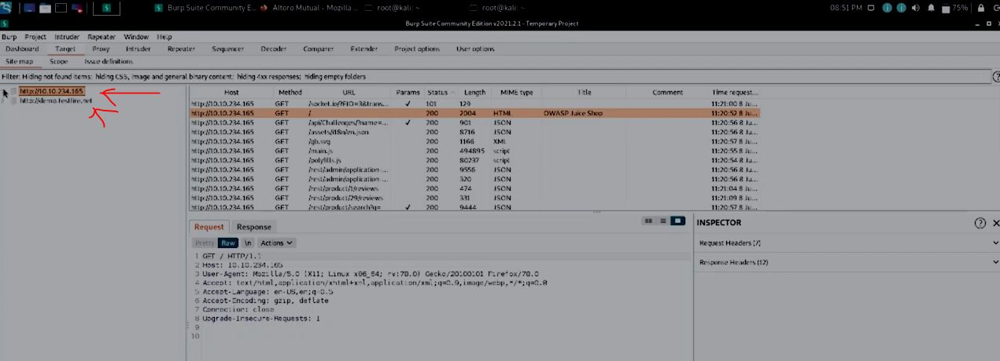
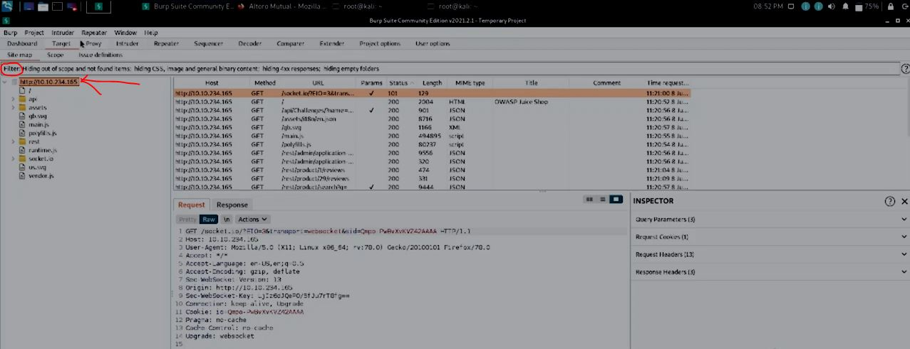
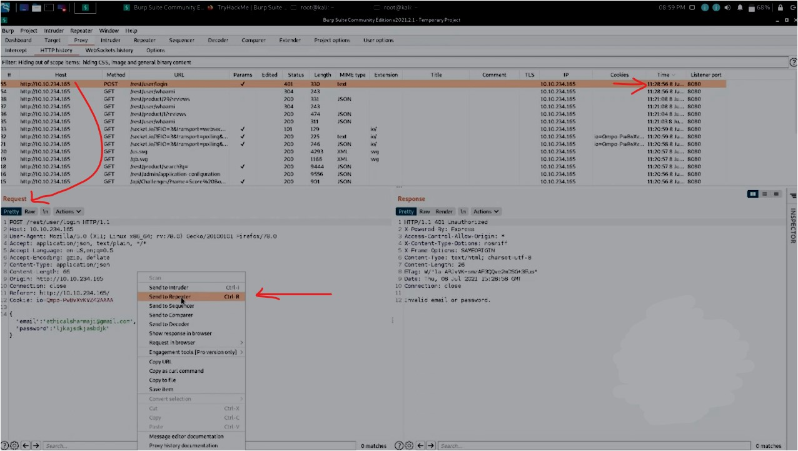
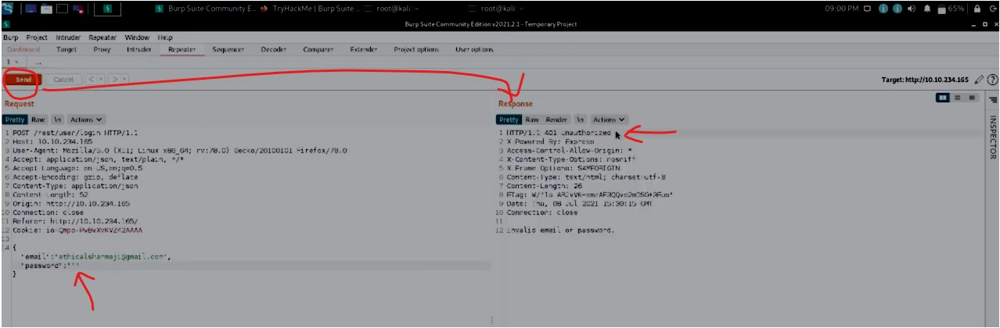
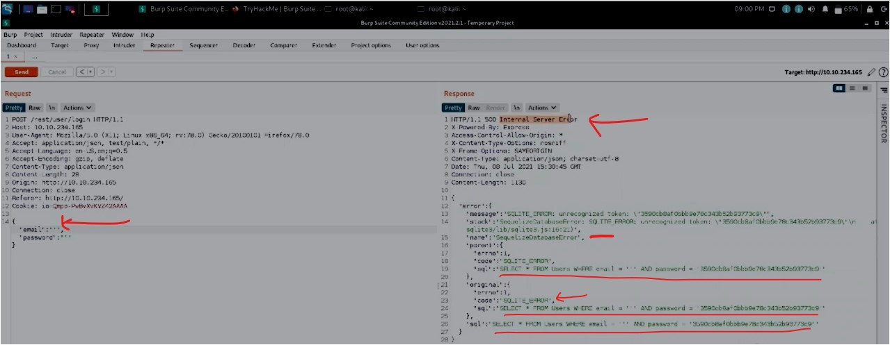
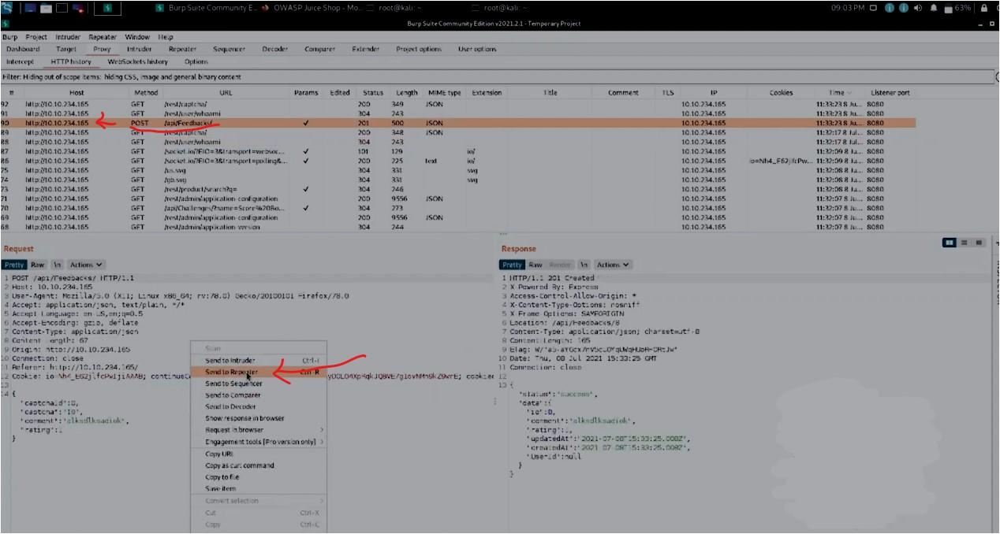
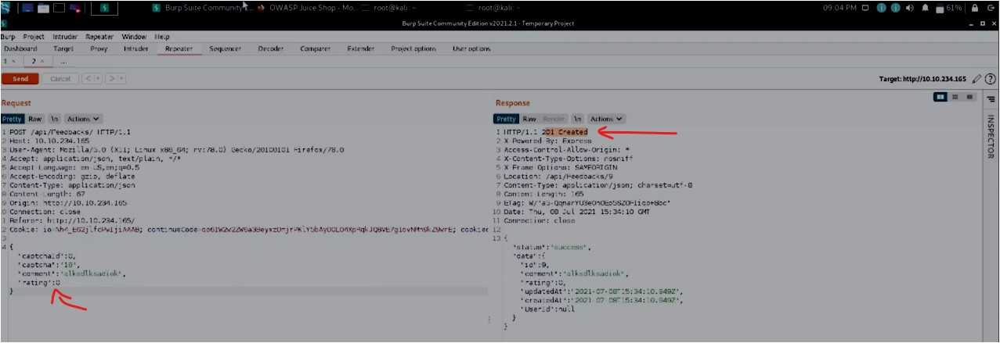
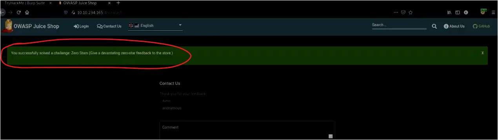

#WAPT-notes

---
### what we'll learn
> Lecture Name : Burp Suite #4 Sql Injection on OWASP Juice Shop | Repeater | Target
> 1) Target Definition - Process of doing WAPT : Target , Scope , Site Map & issues definitions - tabs `most imp ⭐`
> 2) Q : Practical Work of Target Definition/tab
> 3) Ques
> 4) Repeater + Practical Work of it
> 5) Juice Shop webapp - SQL Injection via Repeater

---

### Target Definition `most imp ⭐`
- contains some of the most imp. parts of a webapp penetration test
- `Imp Note ⭐` : while doing penetration test , u must know on which thing u're testing (means what is in the `Scope` tab) ,  
	so whatever comes in the `Scope` tab , only those test will be tested , not something else ✔️
    - it's imp cuz when u're testing an webapp then issues (related to that application) will be submitted to that team ✔️  
		no issues of other apps will be submitted
	- so `Scope` tab most imp ✔️
- `Scope` tab
    - it's most imp tab cuz when u're doing test & if u get issues in that webapp  
		then `Scope` tab used for a reporting page to submit to the webapp dev team
- `Site Map` tab `most imp ⭐`
    - means Eg : when u open the google map then it shows stuff around ur locality or  
		where u are currently such as shopping mall , Park , etc
    - same as `Site Map` tab tells the resources/contents/files&folders/etc related to that webapp ✔️ 
		eg : resources like html , css , js , etc files & folders - so these are complete sitemap  
	- conclusion : a complete map of a site = aka sitemap = means information about the resources ✔️
- `v most Imp stuff ⭐` : when starting a webapp penetration testing , u need to provide a few stuff
	1) the application URL 
    	- always a WAPT person do testing on dev/test/pre-live environment ,  
			a WAPT never do testing on production/prod	 environment ✔️
    	- cuz when u're testing an webapp in order to find the issues/vulnerabilities ,  
			so that we can prevent those issues before webapp goes into production environment ✔️
    	- but if u update the webapp & push it into production environment  
			then those issues will be find out via other hackers/WAPT ✔️
	2) A list of the different user roles within the webapp
		- Eg : in some cases we do `privilege escalation` test on a application ,  
			so we must know what're the different roles given in a webapp
	3) Various test accounts & associated credentials for those accounts
		- means that webapp must have accounts , authorization (login/signup), etc  
			so that a WAPT can do testing like `privilege escalation` ,  
			we have testcases for `authorization` - these comes in OWASP
	4) A list of pieces/forms in the application which are out-of-scope for testing & should be avoided
		- in many webapps , mostly , there are stuff that the organization/team don't wanna test those components
		- so u as a WAPT need to keep those components out of the `Scope` tab
		- so generally Team will specify/tell like this is component that u don't need to test or not need to include it in the `scope` tab
- `v imp note ⭐` : So this is how u as WAPT start to build our scope within Burp &  
	if u're doing automating testing like via using `Scanner` ,
     then we must know always that (what's in & what're not) in the `Scope` tab ✔️
    - Typically this is done in a "tiered approach" - means we start our work from the `Lowest Priviledged account`  
		(means we don't have any permissions like u don't have authentication credentials - then we have to start test as unauthenticated  
		aka lowest Privileged access - which means we don't have any access to test that webapp) ✔️
    	- via this way , we do normal browsing in the webapp as a normal user & we try to discover the full content/extent
    	- so actually , we got to know what normal user & attacker can do aka `Happy Path`  
			(means a road/jungle where u're just figuring out & u don't know specific task to do) ✔️
    - after `Happy Path` , slowly we remove the components from the `Scope` tab like :-
    	1) the item (page, form, etc) - which need to keep out of the `Scope` as devteam  
			or organization told u or like written in the documentation from the client
    	2) if u do Automated Exploitation of the item (especially in a credentialed manner) via Scanner  
			then would cause a huge mess (like the webapp has a "password reset emails" feature/functionality  
			& u run the "Automated Scanner" on that feature - then "Automated Scanner" will generate a lot of GET requests in  
			small span of time , so let's say that feature contain customer emails  
			then Customer will get 100 or 1000 of emails generated , so u don't wanna do that , remove it)
    	3) mostly Automated Exploitation of the item (especially in a credentialed manner) via Scanner  
			then it would lead to damaging & crash the webapp
    	- so these are things u need to keep in mind while doing as WAPT

### Q : Practical Work of Target Definition/tab ✔️
- STEP 1 : in tryhackme.com , turn ON the Machine & copy the IP address
- STEP 2 : in firefox -> FoxyProxy -> set the Burp Proxy - just click on "Burp" & automatically IP address will be updated ,  
		in new firefox tab , run that copied IP address i.e `10.10.234.165` & hit enter 
    - STEP 2.1 : now `OWASP juice Shop` will get open (which is a vulnerable webapp) ,  
			click on `Apple Juice (1000ml)` & `Carrot Juice (1000ml)` items
    - STEP 2.2 : in new firefox tab , open "demo.testfire.net" website
- STEP 3 : In burpSuite -> proxy -> Intercept -> "intercept" is off right now  
	output : & in `HTTP History` tab , we'll get GET requests of that IP address as well as "demo.testfire.net"
- STEP 4 : go to `target` tab -> `Site map` , output : u'll see both webapps like this 
	 
	- STEP 4.1 : let's say u want to test only that IP address webapp , so right click on it & click "Add to Scope"
	- STEP 4.2 : popup will come out & if u `yes` - then others data will not shown in the Target tab 
    	 - this will be done when we have only 1 webapp , but if `No` - then we need to show each of them individually
	- STEP 4.3 : let's click on `No` & click on "filter" bar of sitemap & click on Show only `in-scope items` ,  
		output : now only that IP address webapp showing like this  
	- STEP 4.4 : in Proxy -> Http History , here u can also do filter for `only in-scope items` ,  
		so click on the "filter" bar & check `Show only in-scope items` &  
		output : only those items will be shown related to that IP address webapp
	- so Anuj sir also do this when he works for an organization , so that when u're testing 1 item  
		then focus on it & leave the rest of things at that time ✔️
- STEP 5 : if u want to remove a particular folder/file from that IP address webapp  
	then let's say right click on "api" folder -> click on "Remove from scope" &  
	output : then when we run scanner on that IP address webapp - then the `scanner` will not run on that `API` folder  
	cuz `Api` folder removed from the scope ✔️

### Ques
1) Browser around the rest of the application to build out our page structure in the target tab.  
	Once u've visited most of the page of the site return to Burp Suite and expand the various levels  
	of the application directory. What do we call this representation of the collective web application ? 
	- Ans : Site map
	- so in Target -> Site map -> if u open any webapp folder then whatever the stuff inside that webapp aka `page structure` ,  
		so a complete map of that webapp aka `site map` eg : "google map - webapp"
2) What is the term for browsing the application as a normal user prior to examining it further ? 
	- Ans : happy path
3) Within the target tab , a sub-tab for issue definitions `vv most imp ⭐`
	- Ans : go Target -> `Issue definitions` tab  
		output : so u'll see this  
	- whenever u make a Penetration Testing Report ,  
		u must have to give "Description" , "Remediation" , "References" , "Vulnerability classifications" , etc.
    - so `Issue Definitions` tab contains tons of issues (detected by Burp Scanner) ,  
		so from here u can give a PT (penetration testing) report like on "SQL Injection" issue ✔️
4) Which poisoning issue arises when an application behind a cache process input that is not included in the cache key
	- Ans : Web Cache Poisoning
	- STEP 0 : click on Hint button , so check issue definitions & refer items poisoning
	- STEP 1 : in Target -> Issue Definitions
	- STEP 2 : see web cache poisoning , u'll get the answer

### Repeater + Practical Work of it
- used to modify the GET Request before sending to the server cuz once we modify the GET request  
	then sending to the server then the response will might get different - this is done by u as a attacker
- Practical Work : Q : How Juice Shop webapp is vulnerable via SQL injection
	- STEP 1: run the machine from tryhackme.com - burpsuite -> copy the IP address i.e `10.10.234.165`
	- STEP 2: in firefox , run the IP address (Juice Shop webapp) & click on `login`
	- STEP 3: when u try to login then u'll get error & then 
		- STEP 3.1: go in BurpSuite -> proxy -> HTTP history -> click on time column to sort it & go & click on the latest request 
		- STEP 3.2 : right click on `Request` section -> click `Send to Repeater` like this 
			 
		- STEP 3.3: in Repeater tab & this is vulnerable application that's why email & password coming
		- STEP 3.4: the GET request already gone to the server ,  
			so modify the GET request let's say change the password - inside double quotes put single quote  
			& click on `send` & u'll get a response as 401 unauthorized & invalid email or password like this 
			 
		- STEP 3.5: now let's say make email as single quote like we did for password & click on `send` ,  
			so we'll get `500 internal server error` ✔️ like this
			 
		- even in value of `message` property/key is giving error i.e SQLITE ERROR & even we're getting sqlite file i.e sqlite.js file 
		- & SQL command also coming , so this webapp is too vulnerable that's why we're getting too much information  
			about the GET request cuz this webapp is vulnerable via SQL injection ✔️ 
	- STEP 4: so we got to know this webapp is vulnerable via SQL injection
		- STEP 4.1: go to that webapp -> click on customer feedback
		- Q : now find the POST request in ur HTTP History in Burp & send it to Repeater
		- STEP 4.2: in Burp -> Proxy -> HTTP History , now currently we don't have the customer feedback request ,  
			so go to the webapp & fill the customer feedback form
		- STEP 4.3: in Burp , we'll get the POST request of customer feedback like this . Select that POST request  
			& right click on Request section & click `Send to Repeater` 
			 
    	- Q : What field do we have to modify in order to submit a zero-star review
		- STEP 4.4: so now we need to modify the request to give the 0-star review (cuz no 0-star functionality webapp have) 
    		 - in burp -> Repeater , make the `rating` property as `0` & click on `Send` , we'll get response as `201 created`  
			which means we can 0-star can be given but the webapp has functionality from 1 to 5 ✔️ 
			 
		- we got success message for completing the challenge 
			 

---
### End of the Lecture (Doubts)

