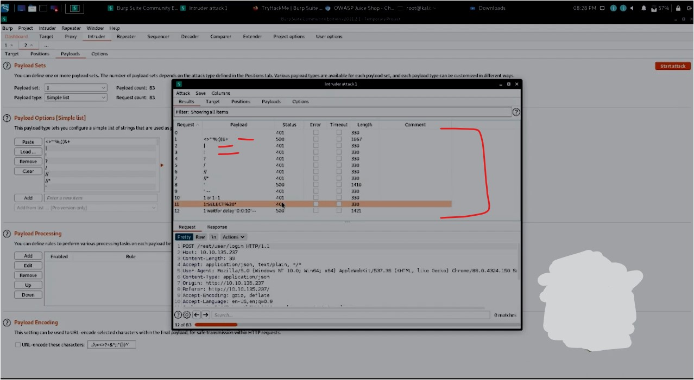
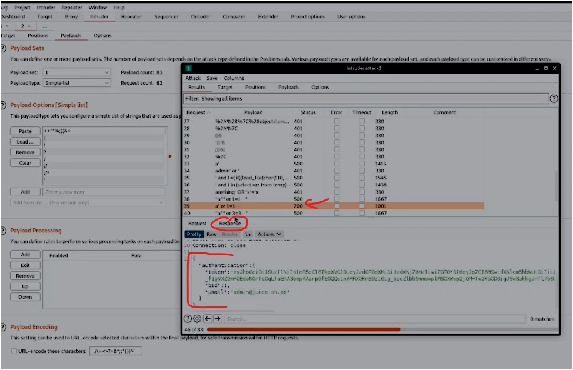
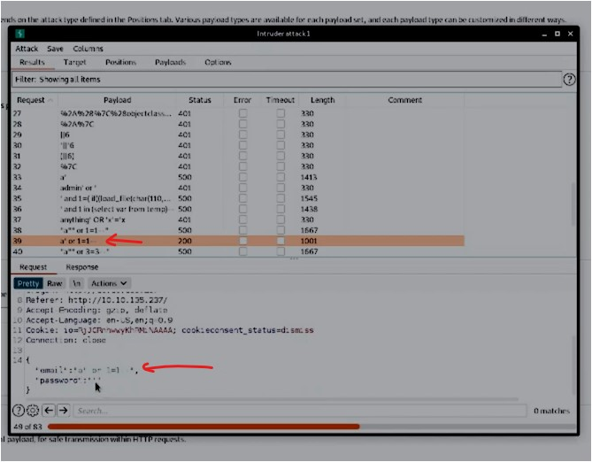
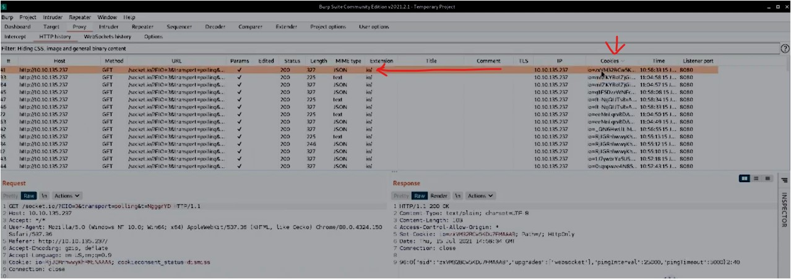
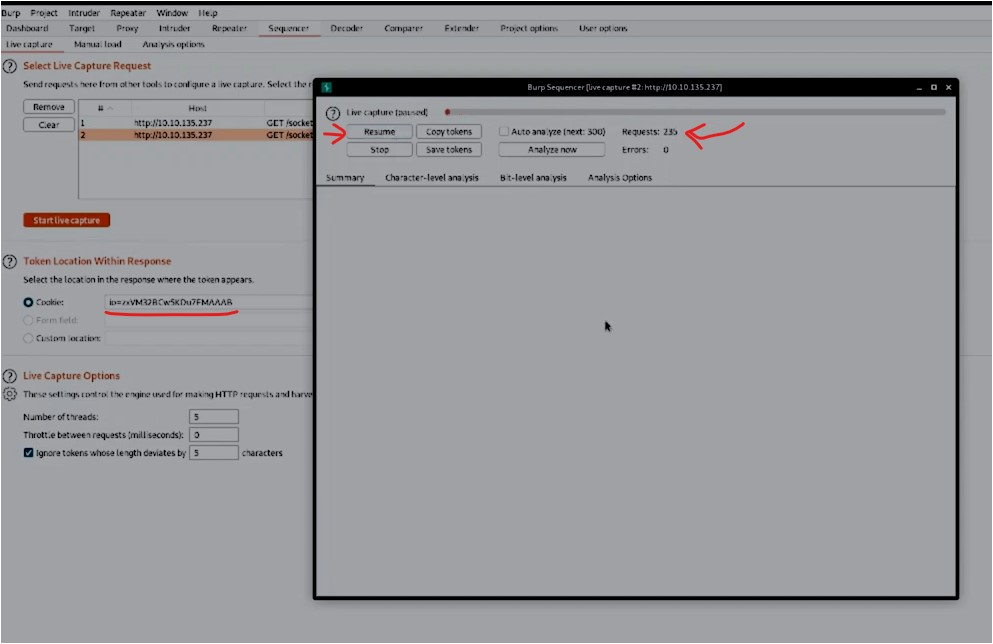
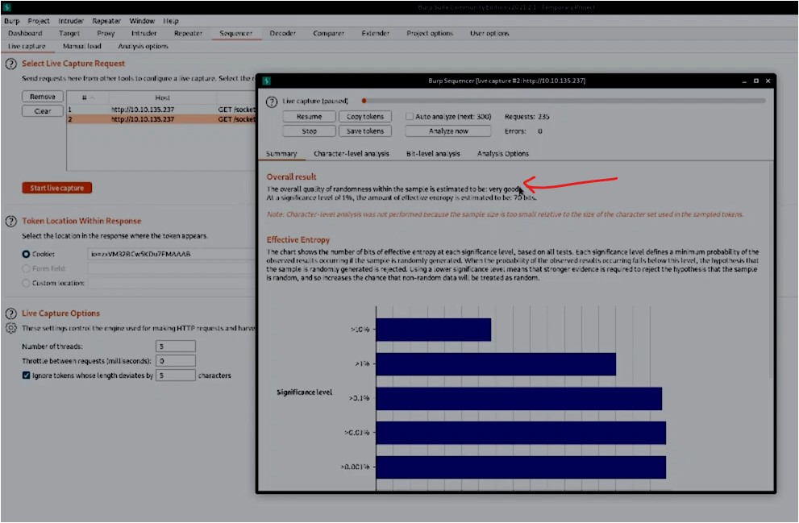
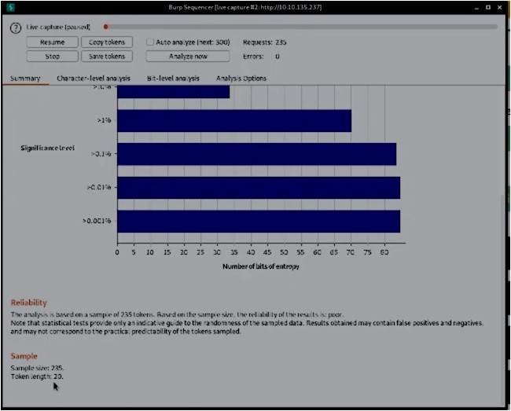

#WAPT-notes  

---
### what we'll learn
> Lecture Name : Burp Suite #5 Intruder | Sequencer | Bruteforce attack | Sqli Authentication
> 1) Intruder
> 2) Sequencer

### Overview
- Lecture name : BurpSuite - Intruder , Sequencer , Bruteforce attack , Sqli Authentication Bypass
---

### 1. Intruder
- a most powerful tool in Burp Suite cuz many attacks can be done via it like fuzzing , Bruteforce , etc
- Q : when to use Intruder ✔️
	- Ans : "Repeater" handles experimentation like u took a one request & modify it then  hit it to the server 
	- but to do repeatedly testing , let's say 1000 of requests or need to test tons of payloads  
		then "repeater" is not good (cuz we can't test each requests one by one) , so we need to automate
	- so "Intruder" will be used to automate the task of testing tons of payloads or requests 
- usecase + scenarios of intruder ✔️
	1) Enumerating identifies : u want to identify usernames , u have predictable session/password recovery tokens 
		 - u want to cycle them , want to guess simple/default password 
	2) Harvesting/take out useful data from user profiles or other pages of interest via grepping our responses
	3) Fuzzing for vulnerabilities like SQL injection, XSS & file path traversal
	- all these used via intruder
- to achieve these various use cases of it , intruder has 4 different attack types `v imp ⭐`
	- Note : it's v imp to know cuz these 3 different attack types used according to a situation/need ✔️
	1) `Sniper` : 
		- most commonly used attack type
		- used for only if u want one wordlist there ✔️
		- Eg : in form , there is a username field & a password field , u know username already (let's username is Admin)  
			& u want to know it's password & u're doing bruteForce attack , so in this case we'll use `sniper`  
			cuz we want only password via bruteForce - but if u want to know both (username & password)  
			then u'll use `Cluster Bomb` ✔️
		- in sniper , cycles through our selected positions - means one payload put on 1st position  
			then another one payload put on 2nd position & so on one by one  
			but in "Battering Ram" , single payloads will be run on every positions (which are selected) ✔️
	2) `Battering Ram` : 
		- it's same as `Sniper` , it uses only one set of payloads
		- in `Battering Ram` , puts ur every payload will be inside every selected position 
    		 - means putting every payload in one go , means just one payload runs on every selected positions ✔️
		- so it makes contact across a large surface with a single surface that's why called "Battering Ram" ✔️
    3) `Pitchfork` : 
		- if u want multiple payload sets but one per position selected (means u need one by one)
		- Eg : u have a list of (usernames in 1st column , passwords in 2nd column)  
			& u want to run one by one row-wise (like username - then its password  
			then same with 2nd row's username & password , so on) ✔️
		- in it , the iteration/loop goes like both payload sets/put run simultaneously , here 1 payload doesn't run simultaneously ✔️
	4) `Cluster Bomb`  : 
		- Eg : if u want to know both someone else username & password then u'll use `Cluster Bomb` ✔️
		- used to use multiple payload sets (one per position selected) & iterate through  
			all combinations of the payload lists we provide 
		- means if u want to know 2 things then use attack type
		- Eg : if we selected two positions (let's say a username field & password field) ,  
			we can provide a username & password payload list & then `intruder` will cycle through  
			the combinations of usernames & password , resulting in a total number of combination equaling usernames x passwords
		- `Note` : this get pretty long if u're using the community edition of Burp
- Ques
	- Q 1) Which Attack type allows us to select multiple payload sets (one per position) & iterate via them simultaneously ?
		- Ans : Pitchfork
	- Q 2) How about the attack type which allows us to use one payload set in every single position we've selected simultaneously ? 
		- Ans : Battering Ram
	- Q 3) which attack type allows us to select multiple payload sets (one per position) and iterate through all possible combinations ?
		- Ans : Cluster Bomb
	- Q 4) most commonly used , which attack type allows us to cycle through our payload set ,  
		putting the next available payload in each position in turn ?
		- Ans : Sniper
- we'll be returning to the SQL injection vulnerability we previously discovered through using repeater
- Ques : Practical Work - Intruder
    0) Download the wordlist attached to this room, this is a shortened version of the "fuzzdb SQLI platform detection list".
       - STEP 0 : in tryhackme , in this lab , click on "Download Task Files" btn
	1) Return to the intruder in Burp. In our previous task, we passed our failed attempt to both repeater  
		& intruder for further examination. Open up the Positions sub-tab in the intruder tab with this request now  
		& verify that 'Sniper' is selected as our attack type
		- STEP 1 : in kali linux , run `burpsuite` command & open burp suite website on firefox
		- STEP 2 : in tryhackme.com - intruder , run the machine & copy IP address i.e `10.10.135.237` ,  
			keep the "intercept" off of burpSuite , open the IP address on firefox
		- STEP 3: in BurpSuite -> in "Proxy" -> in "intercept" -> turn ON "intercep"  
			& go to login page of the IP address ("OWASP Juice Shop") -> fill the login page & press `login` btn
		- STEP 4: in burpSuite -> proxy -> intercept , output : u'll get the Request 
    		- STEP 4.0 : click on `forward` btn -> in the request -> right click -> click "send to intruder"
	2) Burp attempts to automatically highlight possible fields of interest for Intruder, however,  
		it doesn't have it quite right for what we'll be looking at in this instance.  
		Hit 'Clear' on the right-hand side to clear all selected Fields. 
		- STEP 4.1: in burpSuite -> intruder -> Positions -> click "clear" btn
		- STEP 4.2: keep the Attack type as `Sniper` , select the email (which is inside the double quotes) & click on `Add` btn
	3) Next, let's switch to the payloads sub-tab of intruder. Once there, hit 'Load' and select the wordlist  
		u previously downloaded in question five that is attached to this task. 
		- STEP 4.3: open that payload file & copy all the stuff in it & in BurpSuite -> in "intruder" tab -> Payloads ,  
			in `Payload Options [simple list]` section , click on `paste` btn
	4) Almost there! Scroll down and uncheck 'URL-encode these characters'. We don't want to have the characters sent  
		in our payloads to be encoded as the otherwise won't be recognized by SQL. 
		- STEP 4.4: in intruder -> Payloads , "Payload Encoding" section -> uncheck the "URL-encode these characters"
	5) Finally , click 'Start attack'. what is the first payload that returns a 200 status code ,  
		showing that we have successfully bypassed authentication ? 
		- purpose of using Intruder - means the payload file (which we downloaded) contains too many stuff,  
			so if we check each payloads (which is inside that payload file) one by one on that email  
			then it would take too much time via `repeater` that's why `intruder` is best ✔️
		- so `intruder` will try to run those different payloads (from payload file) simultaneously in less time like seconds ✔️
		- STEP 4.5: in burpsuite -> Proxy -> turn off the proxy `intercept` -> go to "intruder" -> payloads ->  
			click on `start attack` btn , click "ok" btn  
			output : requests of different payloads via intruder looks like this 
			 
    		 - so GET request going with different payloads , select any request , in `response` tab ,  
				u'll see mostly "unauthorized" or "internal server error"
    		 - so in `request` tab , `intruder` is trying to match with that email address & `intruder` did 24 requests in lesser time ,  
				so that's why "intruder" used for sending 1000 or lakhs requests at a time
    	- in `response` tab , select the `200` status request (which means server is saying u're credentials are correct)  
			& authentication done  
    	- so this way we've done BruteForce attack , so in Request tab , if u use that email only 
			 
        	- then no need to give anything in password - cuz it'll bypass the password  
				cuz here `a' or 1=1--` means "a'" : will break the execution & this statement is OR statement  
				means if anyone gets true then allow me to login in that webapp , so that `a'` or `1=1--` will break the execution ,  
				so `1=1--` , `2=2--` & so on.. will always be true - cuz these are True Statement (just like in programming) ✔️
    		- Q : & why we didn't need to write the password we don't need to type password ✔️  
				Ans : cuz email address i.e "1=1--" (means after 1=1 , we used "--" hyphens to commented out)  
				due to this , password is commented out 
    			 - means whatever we write/written after the email address will get commented out & if anyone gets True  
				then means bypass
			- so this is a basic example of `SQL Injection` & we have done basic "brute force" via intruder
    		- u can see one request that's have `' or 0=0` which is also same
    		- u can filter the payload via status code column
	6) which is first payload who return a 200 status code
        - Ans : Q : why question saying 1st 200 status code - cuz there are many 200 status code & we need to tell 1st one 
        - STEP 5 : click on "status" column (in order to filter the status) -> scroll down & u'll see 1st one  
          	which is 200 Status code i.e `a' or 1=1--`
	- Now close the Intruder Popup window & click "ok" btn

### 2. Sequencer
- v imp tool in WAPT - cuz without session management , test cases , etc. , we can't do Penetration testing,  
	that's why "Sequencer" important to do testing of session management or session cookies ✔️
- used for analyzing/checking the quality of randomness in an application's session tokens
- randomness - means session tokens always keep changing &  
	Q : why session tokens keep changing ✔️ 
	Ans : cuz let's say a person know about ur one token - then that person could see via changing it  
	in order to know whether that modified session token is valid or not
     - Eg of the session token : let's say ur session token is xxxsomething.. & at the end there is a `3` ,  
	so he/she change that `3` into `4` to know whether that modified token is valid or not ✔️
     - Eg : OTPs which came to ur phone are also random , so that nobody can intercept & modify it  
	that's why OTP doesn't come like `1234` , it always comes in randomness ✔️
- To check the quality of this randomness - we have `sequencer` ✔️
- usecase of sequencer (where it's use to check randomness) ✔️
	1) session tokens
	2) Anti-CSRF (Cross Site Request Forgery) tokens
	3) password reset tokens (sent with password resets that is theory uniquely tie users with their password reset requests)
- Ques
	1) Switch over to the HTTP History sub-tab of proxy.
		- Ans : Proxy -> Http History
	2) We're going to dig for a response which issues a cookie. Parse through the various responses  
		we've received from juice shop until u find one that includes a 'Set-Cookie' header. 
		- means we need a response which contain a cookie
		- STEP 1: in burpSuite , Proxy -> HTTP History , sort the responses according to "Cookies" column
	3) Once u've found a request response that issues a cookie, right-click on the request & select 'send to sequence'
		- STEP 2: select that response which has a cookie  
		- STEP 3: in Request section , right click -> click "Send to Sequencer"
	4) Change over sequencer & select 'star live capture'
		- STEP 4: in sequencer tab , in `Token Location within Response` section ,  
			cookie automatically gets highlighted/inserted , so click "Start live capture" btn
		- output : in Sequence popup window , now sequencer will start generating multiple requests
	5) let sequencer run & collect ~10,000 requests. Once it hits roughly that amount hit 'Pause' and then 'Analyze now'
		- it's saying we need to collect 10,000 requests but we'll learn 200 only cuz that much is not required
		- STEP 5: now sequencer will capture the requests , so once either 200 or more than 200 requests goes  
			then click on `pause` btn (cuz 200 is a good spot) like this  
		- STEP 6: click on `Analyze now` btn , so u'll get this output of randomness of session cookie 
			 
	6) Parse through the results. What is the effective estimated entropy measured/unit in ?
		- in 5th pic , u can see quality of randomness of that session cookie is : very good &  
			entropy is 70bits (which is good) ✔️
		- Ans : bits
	7) In order to find the usable bits of entropy we often have to make some adjustments to have a normalized dataset.  
		What item is converted in this process?
		- Ans: i.e token - where conversion happen
	8) Read through the remaining results of the token analysis
		- Ans:   & 
			 
		- we got sample size & token length (which u can see in the pic)

### References Resources - Session Token
- [Using Burp to Test Session Token Generation - PortSwigger](https://portswigger.net/support/using-burp-to-test-session-token-generation) ✔️
- [Session-based authentication vs token-based authentication](https://www.educative.io/answers/session-based-authentication-vs-token-based-authentication)
- [Diff. b/w cookies, session and tokens - YT](https://www.utube.com/watch?v=GhrvZ5nUWNg&ab_channel=ValentinDespa)
- [Session vs Token Authentication in 100 Seconds - Fireship YT](https://www.utube.com/watch?v=UBUNrFtufWo&ab_channel=Fireship)
- [Session vs Token Based Authentication - GFG](https://www.geeksforgeeks.org/session-vs-token-based-authentication/)

