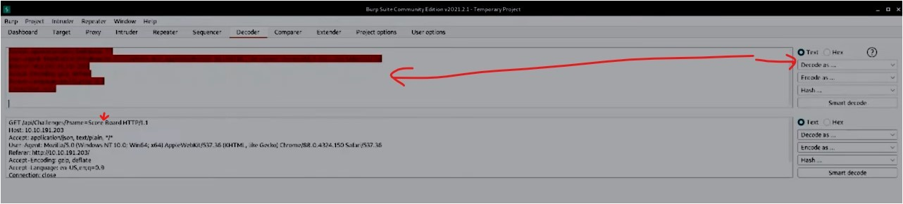
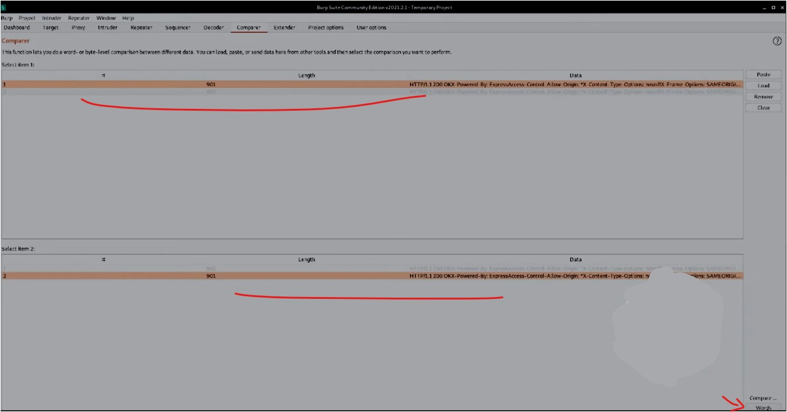
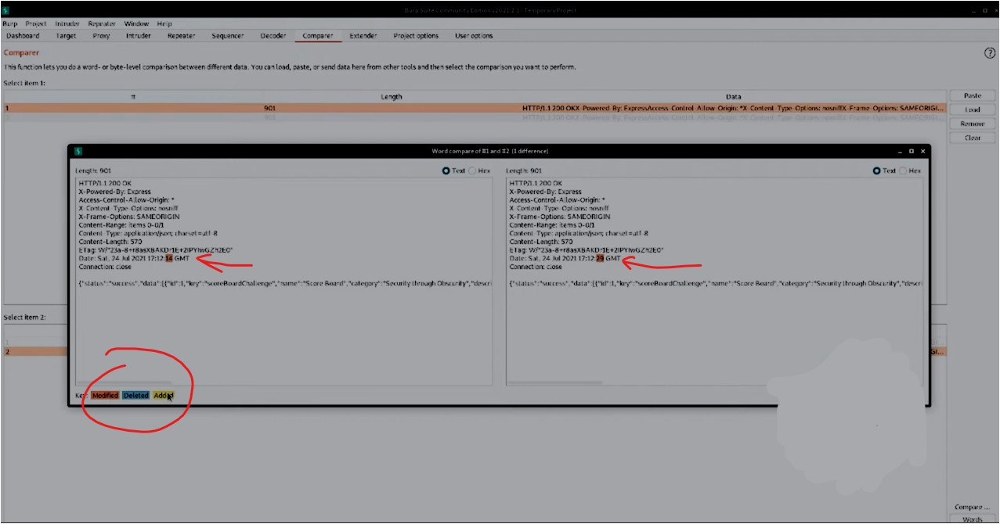

#WAPT-notes  

---
### what we'll learn
> Lecture Name : Burp Suite #6 Decoder, Comparer and Extender | Final Video
> 1) Decoder & Comparer
> 2) Extender

### Overview
- Lecture name : BurpSuite - Decoder, Comparer & extender

---

### 1. Decoder & Comparer
- less imp tools with they are essential to know as a proficient webapp tester
- Decoder
	- allows us to perform us to perform various transforms on pieces of data - means we can do both encoding & decoding ✔️
	- mostly people don't use encoding tool within burpSuite
	- we chain these transforms together & decoder will automatically spawn an additional tier each time  
		when we select a decoder, encoder or hash
	- `CyberChef` is also a like decoder but less powerfull
- Comparer
	- used to compare different responses or other pieces of data
	- it may reveal possible access control issues in the application wherein lower privileged  
		users can access pages they really shouldn't be able to
	- use case examples of it
		- Eg 1 : When an Intruder attack has resulted in some very large responses with different lengths  
			than the base response, u can compare these to quickly see where the differences lie via `comparer`
		- Eg 2 : u got 2 big responses & u want to compare them to check  
			what's the difference b/w them , so comparer will highlight that ✔️
		- Eg 3 : session id might came inside an response & u want to check in session id that is there any 1bit changing or not , 
			so to check these kind of tiny details - comparer use a lot ✔️
		- Eg 4 : we can use it in When testing for blind SQL injection bugs using Boolean condition injection & other similar tests,  
			U can compare two responses to see whether injecting different conditions has resulted in a relevant difference in responses. 
			 - means we can use it on blind SQL injection in order check after using different conditions ,  
			what's different responses we got ✔️
- Ques
	1) Let's first take a look at decoder by revisiting an old friend. Previously we discovered the scoreboard  
		within the site JavaScript. Return to our target tab and find the API endpoint highlighted in the following request :
		- STEP 1: go to tryhackme.com proxy module & connect with a VPN & start the machine  
			& copy the IP address i.e `10.10.191.203`
		- STEP 2: in burpSuite > Target > Site Map ,  
			in `http://10.10.191.203` IP address folder > api > challenges > `score%20Board` file ,  
			so right click on that file & click `send to repeater`
		- STEP 3: in repeater tab , in request section , right click & `send to Decoder`
	2) Copy the first line of that request & paste it into decoder. Next, select 'Decode as ...' URL
		- so we need to "Decode as URL"
		- STEP 4: in Decoder tab , select the `%20` portion of the URL & on right , select `Decode as URL` like this 
			 
		- previously , scoreboard was `Score%20Board` , now that `%20` become a empty space
	3) what character does the %20 in the request we copied in decoder decode as ? 
		- Ans : Space
	4) Similar to cyberChef, Decoder also has a 'Magic' Mode where it will automatically attempt  
		to decode the input it is provided. What is this mode called ?
		- here click on `Smart Mode` button , so automatically we'll get the same result 
			 
		- Ans: Smart Decode - means we don't need to select the portion of the URL which thing we want to decode ,  
			it'll automatically decode the URL without selecting the URL
	5) What can we load into Comparer td see differences in what various user roles can access?  
		This is very useful to check for access control issues. 
		- means in access control , sometimes we can compare that one user is non-admin & another user is admin ,  
			so the non-admin user can access the stuff (that also accessed by a admin user) ✔️
		- but the admin user accessing something critical/sensitive that can't be accessed by non-admin user ✔️
		- so we can see this in `comparer`  
	6) Comparer can perform a diff against two different metrics, which one allows us to examine the data loaded  
		in as-is rather than breaking it down into bytes? 
		- STEP 1: in burpSuite > repeater , let's say click on `send` button
		- STEP 2: right click on Response section (which we got) & `send to comparer` & in Request section ,  
			change the Host as `google.com` & then again click on `send` btn & again right click on Response section  
			& click `send to comparer`
		- STEP 3: in comparer tab, u'll get those 2 different response in compare wise 
			 
		- STEP 4: click on `words` btn , u'll see only time different b/w those 2 responses like this  
		- below we can see Key: as modified color, so comparer automatically tells everything 

### 2. Extender
- means to increase the functionality , we have mods - means in burpSuite,  
	we have specific extension that we can install (which as for community version)
- in Extender tab > BApp Store - contains tons of extensions/mods &  
	those are professional (we can't use them cuz we're in community version)
- Ques (do it by urself)
	1) Scroll down until u reach the 'Python Environment' section. Note, Burp requires the standalone edition of python. 
	2) Download the standalone version of jython from here: link -/ Suggest saving this or moving it to ur documents folder
	3) Return back to Burp & hit 'Select file' under the python environment subsection for jython standalone.  
		Navigate to where u just downloaded this file and select it.
	4) Burp is now set to go for installing extensions. switch to the BApp store sub-tab of extender  
		& look through the various extensions offered
	5) Which Extension allows us too bookmark various requests ?
		- Ans : Bookmarks
- Other modules
	- features of BurpSuite Professional offers : the BurpSuite Scanner & collaborator client
	- STEP 1: in tryhackme.com intruder , `TASK 13 - But wait, there's more!` - download the task files
	- STEP 2: examine that file & Questions are : 
		- Q 1 : Download the report attached to this task. What is the only critical issue ?
			- Ans Q 1: Cross-Origin resource sharing: arbitrary origin trusted
		- Q 2 : How many 'Certain' low issues did Burp find ?
			- Ans Q 2: 12
- resource to learn web security : [Web Security Academy: Free Online Training from PortSwigger](https://portswigger.net/web-security)  
	via this u can learn web security & different types of attacks ✔️

