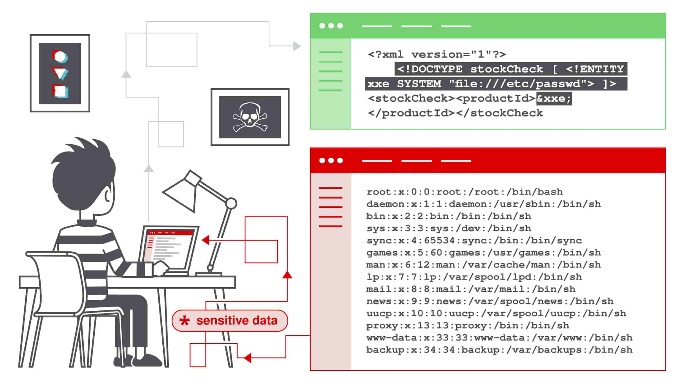

#WAPT-notes  

---
### what we'll learn
> Lecture Name : [HINDI] XML External Entity (XXE) Injection | Types of Attacks | Prevention
> 1) About XXE (XML External Entity) Injection
> 2) How do XXE vulnerabilities arise ?
> 3) XML entities
> 4) What are XML custom entities ?
> 5) What are XML external entities ?
> 6) Different types of XXE attacks
> 7) Exploiting XXE to retrieve files - Example 1st XXE attack
> 8) Remediation / how to prevent XXE vulnerabilities

### Overview
- what is XXE
- how XXE vulnerabilities arise
- XML entities
- XML custom entities & external entities
- Overview : how SSRF attacks can be done
- types of XXE attacks

### reference 
- in this module , we're following PortSwigger academy - web security
---

### 1. About XXE (XML External Entity) Injection
- Reference : [What is XXE ? Tutorial & Examples | Web Security Academy](https://portswigger.net/web-security/xxe)
- When the data (of an application) process via XML (markup language) - then a attacker interfere/intercept that "processing" <br>
	& from the web server , attacker could do such things like read the file , attack can be done like SSRF , <br>
	compromise the backend server , so this web security vulnerability aka XXE injection ✔️
    - Conclusion : those applications which use XML to transferring data , so mostly XML has those features enabled via which <br>
    	attacker can define/declare custom entity , we can intercept in the middle of process of transferring data <br>
    	& we can read the files , types of attacks of XXE like SSRF can be done ✔️
- Q : in XXE injection , why we're saying "injection" ✔️<br>
	Ans : cuz payload is inserted/used & due to payload , everything done 

### 2. How do XXE vulnerabilities arise/happen ? `imp ⭐`
- Q : When this XXE attack possible ✔️
    - Ans : cuz if specification (of the document of XML) is not done properly - then XXE attack can be possible <br>
		or if XML's standard partials potentially support those dangerous features <br>
		via which these kind of payloads possible to execute 

### 3. XML entities
- Q : what is XML ? ✔️
    - Ans : XML stands for "extensible markup language"
	- it is a language designed for storing & transporting data & it's Like HTML , <br>
		XML uses a tree-like structure of tags & data & unlike HTML , it doesn't have predefined tags 
- Q : what are XML entities ? ✔️
	- Define : XML entities are a way of representing an item of data within an XML document, instead of using the data itself
	- Eg of XML Entities : `&lt;` & `&gt;` represent the characters `<` & `>`
	- These are metacharacters used to denote XML tags
- Q : What is document type definition (DTD) ? ✔️
	- Ans : The XML DTD contains declarations that can define the structure of an XML document

### 4. What are XML custom entities ? `v imp ⭐`
- XML allows us to define/declare our own custom entities
- Eg : of Format/syntax to define `<!DOCTYPE foo [ <!ENTITY myentity "my entity value" > ]>` <br>
  	means name of the entity u want to give & inside double quotes contain the value of that entity

### 5. What are XML external entities ? 
- XML external entities looks like `<!DOCTYPE foo [ <!ENTITY ext SYSTEM "http://normal-website.com" > ]>` <br>
	`ext` - means it's communicating with ur external resource i.e the URL in the syntax
- Eg : `<!DOCTYPE foo [ <!ENTITY ext SYSTEM "file:///path/to/file" > ]>`
- Q : how different attacks can be done in XXE ✔️
	- so we can define XML custom entities & external entities <br>
	- Example : <br> <br>
		`"file:///etc/passwd"` : here we're able to retrieve the file cuz we define the `file` <br>
		which is stored on the server i.e `etc/passwd` ✔️
	- but SSRF attack can also be done
    	- Q : how SSRF attack can be done ✔️ <br>
			Ans : here `"file:///etc/passwd"` , we'll give the address (on this file path) of malicious server <br>
			or where we can get the user control ✔️

### 6. Different types of XXE attacks 
1) Exploiting XXE to retrieve files
2) Exploiting XXE to perform SSRF attacks
3) Exploiting blind XXE exfiltrate data out-of-band
4) Exploiting blind XXE to retrieve data via error messages
- to know more about them : https://portswigger.net/web-security/xxe

### 7. Exploiting XXE to retrieve files - Example 1st XXE attack
- Reference : [Exploiting XXE to retrieve files | portswigger](https://portswigger.net/web-security/xxe#exploiting-xxe-to-retrieve-files)
- STEP 1 : For example, suppose a shopping application checks for the stock level of a product <br>
	by submitting the following XML to the server:
    ```xml
    <?xml version="1.0" encoding="UTF-8"?> 
    <stockCheck><productId>381</productId></stockCheck>
    ```
- STEP 2: so we changed the above XMl code into this 
	- The application performs no particular defenses against XXE attacks, so u can exploit the XXE vulnerability <br>
		to retrieve the `/etc/passwd` file by submitting the following XXE payload:
		```xml
		<?xml version="1.0" encoding="UTF-8"?> 
		<!DOCTYPE foo [ <!ENTITY xxe SYSTEM "file:///etc/passwd"> ]> 
		<stockCheck><productId>&xxe;</productId></stockCheck>
		```
	- to exploit that above code , we took `DOCTYPE foo` then `!ENTITY xxe` entity we declared/define (what ENTITY xxe doing?) <br>
		which is retrieving `"file:///etc/passwd"`
	- & then for "productId" we define `&xxe;` - here we put `&` to tell it's a entity
- STEP 3: the code of STEP 2 
	- This XXE payload defines an external entity `&xxe;` whose value is the contents of the `/etc/passwd` file and <br>
		uses the entity within the `productId` value. This causes the application's response to include the contents of the file:
        ```xml
        Invalid product ID: root:x:0:0:root:/root:/bin/bash 
        daemon:x:1:1:daemon:/usr/sbin:/usr/sbin/nologin 
        bin:x:2:2:bin:/bin:/usr/sbin/nologin ...
        ```
		- Above xml code means :  
        	- now it'll retrieve the contents of the `/etc/password` & show the contents
        	- so we got `invalid product ID` - cuz in `productId` , we define `&xxe;` <br>
    			& then we got the content of `/etc/password` i.e 
          	```xml
          	root:x:0:0:root:/root:/bin/bash daemon 
          	1:1:daemon:/usr/sbin:/usr/sbin/nologin 
          	bin:x:2:2:bin:/bin:/usr/sbin/nologin
          	```

### 8. Remediation / how to prevent XXE vulnerabilities
- all XXE vulnerabilities arise/come - cuz XML parsing library supports dangerous XML features
- easiest & most effective way to protect/prevent XXE attacks is to disable those features <br>
	(cuz those features not useful + increasing issues) <br>
	such as `XInclude` - disable it but if u can't disable then overwrite the default behavior of it <br>
	(like u can write the code for it - then u'll be safe) ✔️

### Conclusion
- Tip : u can read the documentation for more
- we'll understand more about it - when we do Lab - when we exploit

