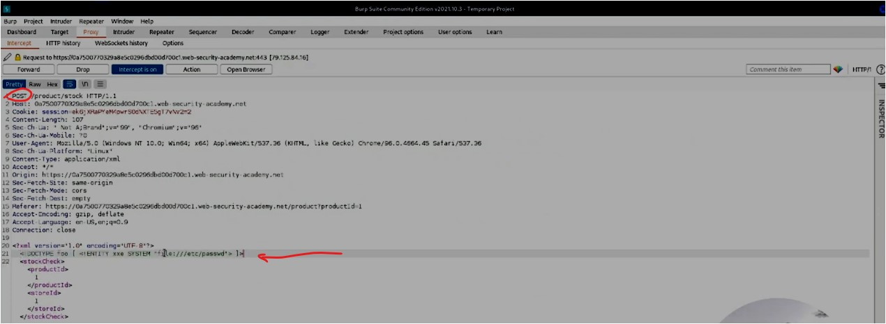
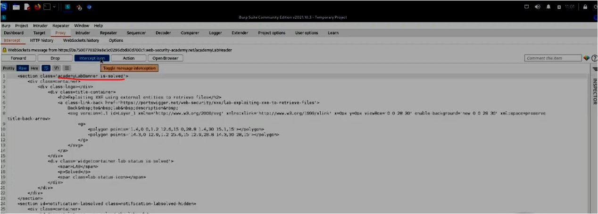
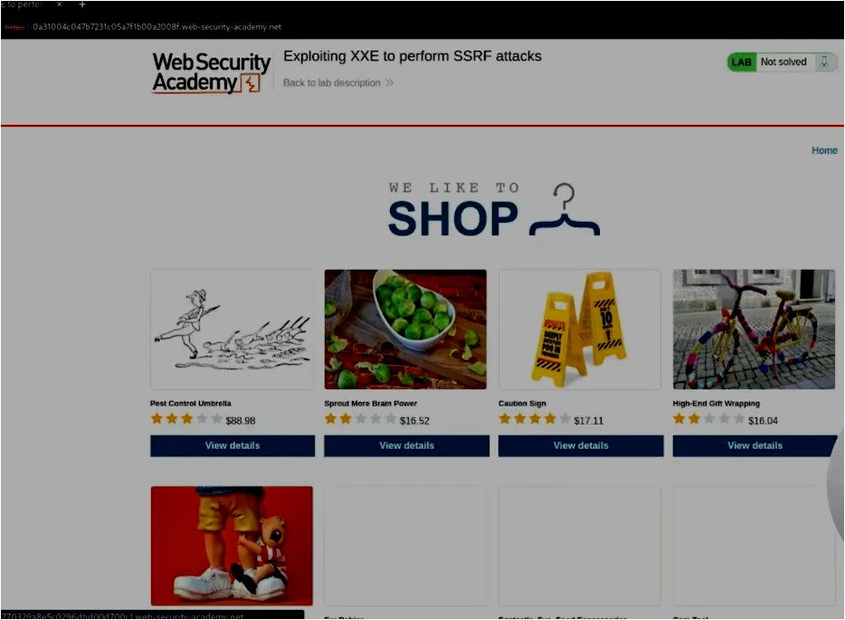
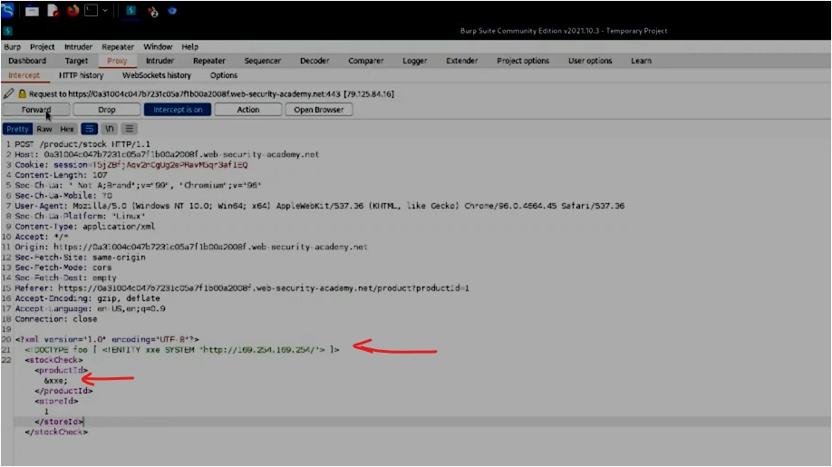
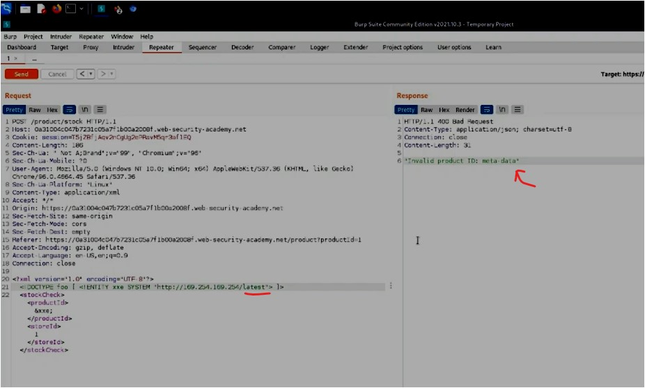

#WAPT-notes  

---
### what we'll learn
> Lecture Name : [HINDI] XXE Injection Labs | Retrieve Files, SSRF Attack | Web Security Academy
> 1) Practical Work : Exploiting XXE to retrieve files
> 2) Practical Work : Exploiting XXE to perform SSRF attacks

### Overview
- doing practical work : different types of exploiting attacks of XXE in XML file
- This Topic imp for interview ⭐

### reference 
- in this module , we're following PortSwigger academy - web security
---

- Lab Reference : [What is XXE (XML external entity) injection? Tutorial & Examples | Web Security Academy](https://portswigger.net/web-security/xxe#what-is-xml-external-entity-injection)

### 1. Exploiting XXE to retrieve files
- Lab : [Lab: Exploiting XXE using external entities to retrieve files | Web Security Academy](https://portswigger.net/web-security/xxe/lab-exploiting-xxe-to-retrieve-files)
- This lab has a "Check stock" feature that parses XML input and returns any unexpected values in the response.
- For this vulnerability , XML is very imp ✔️
- Practical Task - Lab
	- STEP 1: Copy the link of the lab & in burp Suite , Proxy > intercept , close the `Intercept` &  
		click on "open browser" button & paste the lab link inside the Burp Suite browser
	- STEP 2: on the `intercept`
	- STEP 3: in Burp Suite Browser , click on "Check Stock" button cuz ques is saying  
		that feature of "Check Stock" button which parse XML input
	- STEP 4: in burpSuite , Proxy > Intercept , we'll get `POST` request & in the bottom , XML code which has productId -> 1
	- STEP 5: so we have payload to exploit & retrieve files from the `XML`  
		i.e `<!DOCTYPE foo [ <!ENTITY xxe SYSTEM "file:///etc/passwd"> ]>` , copy it & paste inside the XML code like this  
		  
    	- STEP 5.1: make that productId `1` as `&xxe;` cuz we declared the entity as `xxe` in that payload ,  
			so `&xxe;` will call the `xxe` entity & from there , `xxe` will call the file i.e `etc/passwd`  
			cuz the parameter of `productId` which accepts only numeric value  
			but we'll get error also (in ques : also mention that returns any unexpected values as a response) ✔️
	- so here `xxe` payload calling system file i.e `"file:///etc/passwd"` i.e `etc/passwd`  
		means it's very important file which has user-information ✔️
	- STEP 6: in burp Suite , proxy > intercept , click on `forward` button , we'll get output as "this lab solved"  
		  
    	- STEP 6.1: if u off the intercept & in burpSuite browser , refresh the lab page then we'll get "you solved the lab" message
- Summary - Practical task - Lab
	- we used `DOCTYPE` payload inside which we declared a entity as `XXE` (which is calling system file i.e `etc/passwd`)  
		& inside `productId` tag , we defined `&xxe;` ✔️
	- why do we use `&xxe;` - cuz via `&xxe;` , we can call entity which we declared just like function calling in programming ✔️
	- & the parameter was vulnerable means it should accept the numeric value instead of accepting any type of value ,  
		so it should throw the generic error if any type of value comes. But it is not validated &  
		not programmed the parameter syntax properly that's why it throws unexpected value &  
		it throws unexpected value i.e complete contents of `etc/passwd` file ✔️

### 2. Exploiting XXE to perform SSRF attacks `v imp ⭐`
- Lab : [Lab: Exploiting XXE to perform SSRF attacks | Web Security Academy](https://portswigger.net/web-security/xxe/lab-exploiting-xxe-to-perform-ssrf)
- Q : In the following XXE example, the external entity will cause the server to make a back-end HTTP request to an internal system  
	within the organization's infrastructure:  
	`<!DOCTYPE foo [ <!ENTITY xxe SYSTEM "http://internal.vulnerable-website.com/"> ]>` - is a payload to perform SSRF attacks  
	in XML file ✔️
- SSRF attack means make a communication from a resource with user that he/she doesn't want ,  
	means send the user to that server resource where we as a attacker can control the user's action ✔️
- so here we gave the URL , just like we gave `etc/passwd` there
- Practical Task - Lab
	- Ques
		- This lab has a "Check stock" feature that parses XML input and returns any unexpected values in the response.
		- The lab server is running a (simulated) EC2 (Elastic Compute Cloud & might be the website on the AWS) metadata  
			endpoint at the default URL, which is `http://169.254.169.254/`. This endpoint can be used to retrieve data about  
			the instance, some of which might be sensitive.
		- To solve the lab, exploit the [XXE](https://portswigger.net/web-security/xxe) vulnerability  
			to perform an [SSRF attack](https://portswigger.net/web-security/ssrf) that obtains the server's IAM secret  
			access key from the EC2 metadata endpoint.
	- understanding Ques
		- so `http://169.254.169.254/` - this is a attacker controlled server that we need to communicate with user 
		- This endpoint can be used to retrieve data about the instance, some of which might be sensitive.  
			means attacker retrieving data from instance i.e EC2 of AWS & we need to find out any sensitive info
		- So GOAL is to get the server's IAM (my) secret access key 
		- so ultimately , we need to generate a SSRF attack via that URL server &  
  			get the the server's IAM secret access key from the EC2 metadata endpoint.
	- STEP 1: close the `Intercept` & click on "open browser" button & paste the lab link inside the Burp Suite browser ,  
		u'll get this website   
	- STEP 2: on the `intercept` & then go to this webapp & click on "View Details" button for first product card
	- STEP 3: in burpSuite , proxy > intercept , "forward" the request (cuz we don't want this request ,  
		we need request of "check Stock") , so in burpSuite browser , click on "Check Stock" button of first product card
    - STEP 4: in burpSuite , proxy > intercept , click on "forward" button , we'll get xml code ,  
		so copy the payload i.e `<!DOCTYPE foo [ <!ENTITY xxe SYSTEM "http://internal.vulnerable-website.com/"> ]>` &  
		change the URL into IP address i.e `<!DOCTYPE foo [ <!ENTITY xxe SYSTEM "http://169.254.169.254/"> ]>` &  
		productId as `&xxe;` , so `xxe` will use system resource of that IP address ✔️
	- so changes will look like this   
	- STEP 5: click on "forward" button & turn off the intercept , let's see the request of it , so Target > site map ,  
		if u're not able to find the request 
		- STEP 5.1: then go turn on intercept & in burpSuite browser , click on "check stock" , now in Proxy > intercept ,  
			we'll get response , so right click & `send to repeater` & turn off the intercept
		- STEP 5.2: inside the XML code , paste the payload `<!DOCTYPE foo [ <!ENTITY xxe SYSTEM "http://169.254.169.254/"> ]>`  
			& in productId , put `&xxe;` like this   
		- STEP 5.3: click on "send" button , in Response section , 400 bad request & `invalid product id latest`  
			means the product id i.e `&xxe;` is invalid & here `latest` means `xxe` making connection with that IP address server  
			& from there , we're getting `latest` as response , means might be `latest` is a directory ✔️
	- STEP 6: how we can check is `latest` is a directory or not ? , so copy the `latest` as a word &  
		paste in that payload like this `<!DOCTYPE foo [ <!ENTITY xxe SYSTEM "http://internal.vulnerable-website.com/latest"> ]>`  
		& click on `send` button
		- STEP 6.1: we're getting this output "Invalid product ID: meta-data"   
		- STEP 6.2: so might be meta-data can also be a directory , so follow the same process & click on `send` button  
			& we'll get a directory as `iam`   
		- STEP 6.3: same process again & click on "send" , u'll get "security credentials" as a response ,  
			so again follow same process & click on "send" , u'll get "admin" as response  
			& (good thing is we're doing in "repeater" which is good otherwise it come long process if u use different tool)  
			click on "send"
		- STEP 6.4: u'll get the final output   
		- so we got SecretAccessKey , AccessKeyId , Token , type as AWS HMAC signature
		- STEP 6.5: in burpSuite browser , refresh the page & lab is solved
- Summary : Practical Task - Lab
	- here we're directly communicating with that IP address (server) instead of `etc/passwd` (which was local file)
	- & once the communication happen with the server then the server gave a directory as `latest`  
		(cuz productId parameter is vulnerable product id) , so from `latest` directory to  
		`credentials` directory we got aka SSRF attack ✔️

