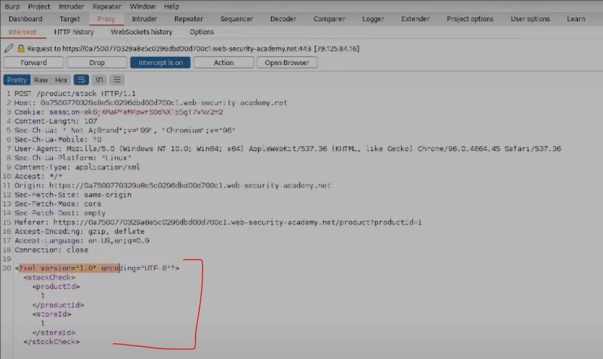
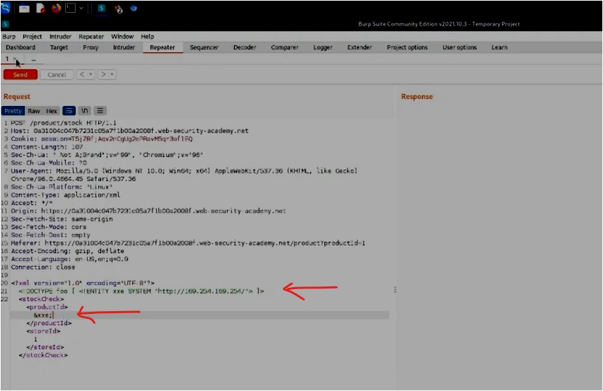

#WAPT-notes  

---
### what we'll learn
> Lecture Name : [HINDI] XXE Injection Labs | Retrieve Files, SSRF Attack | Web Security Academy
> 1) Practical Work : Exploiting XXE to retrieve files
> 2) Practical Work : Exploiting XXE to perform SSRF attacks

### Overview
- doing practical work : different types of exploiting attacks of XXE in XML file
- This Topic imp for interview ⭐

### prerequisite
- go through with Theory vid of XXE Injection before doing Practical of it

### reference 
- in this module , we're following PortSwigger academy - web security
---

- Lab Reference : [What is XXE (XML external entity) injection? Tutorial & Examples | Web Security Academy](https://portswigger.net/web-security/xxe#what-is-xml-external-entity-injection)

### 1. Exploiting XXE to retrieve files
- Exploiting XXE to retrieve files : means we'll how to exploit via XXE to retrieve files  
	Q : which files to retrieve ✔️ 
	Ans : mostly Sensitive Files
- Practical Work : Lab
    - Apprentice Lab : [Lab: Exploiting XXE using external entities to retrieve files | Web Security Academy](https://portswigger.net/web-security/xxe/lab-exploiting-xxe-to-retrieve-files)
    	 - This lab has a "Check stock" feature that parses XML input & returns any unexpected values in the response.
    	 - For this vulnerability , an application must be using XML  
    		(if an application not using XML - then we can't consider that app has XXE vulnerabilities)
	- STEP 1: Copy the link of the lab & in burp Suite , Proxy -> intercept , OFF the `Intercept` &  
		click on "open browser" btn & paste the lab link inside the Burp Suite browser
	- STEP 2: ON the `intercept`
	- STEP 3: in Burp Suite Browser , at the bottom , click on "Check Stock" btn  
		cuz ques is saying that feature of "Check Stock" btn which parse XML input
	- STEP 4: in burpSuite , Proxy -> Intercept ,  
		output : we'll get `POST` request & in the bottom , XML code which has "productId" as 1 (cuz we selected 1st product)
		 xml code also showing version + encoding
		 
	- STEP 5: go to "https://portswigger.net/web-security/xxe#what-is-xml-external-entity-injection"  
		so there's a payload to exploit & retrieve files from the `XML` i.e `<!DOCTYPE foo [ <!ENTITY xxe SYSTEM "file:///etc/passwd"> ]>` ,  
		copy it -> paste inside the XML code like this  
		  
    	- STEP 5.1: make that productId `1` as `&xxe;` - cuz we declared the entity as `xxe` in that payload ,  
			so `&xxe;` will call the `xxe` entity & from there , `xxe` will call the file i.e `etc/passwd`  
			cuz the parameter of `productId` which accepts only numeric value  
			but we'll get error also (in ques : also mention that returns any unexpected values as a response) ✔️
    	- so here `xxe` payload calling system file `"file:///etc/passwd"` i.e `etc/passwd`  
    		means it's very important file in Linux which has user-info ✔️
	- STEP 6: in burpSuite , proxy -> intercept tab , click "forward" btn ,  
		output : in BurpSuite , we'll get output as "this lab solved"  
		  
    	- STEP 6.1: if u off the "intercept" & in burpSuite browser , refresh the lab page then we'll get "you solved the lab" message
- Summary : Practical Work : Lab
	- we used `DOCTYPE` payload inside which we declared a entity as `XXE` (which is calling system file i.e `etc/passwd`)  
		& inside `productId` tag , we defined `&xxe;` ✔️
	- Q : why do we use `&xxe;` ✔️ 
		Ans : cuz via `&xxe;` , we can call entity which we declared just like function calling in programming
	- & the parameter was vulnerable - means the parameter should accept the numeric value instead of accepting any type of value ,  
		so the parameter should throw the generic error if any type of value comes except numeric value .  
		But the parameter is (not validated & not code syntax properly) - that's why it throws unexpected value &  
		Q : what that parameter return the unexpected value ✔️ 
		Ans : it throws unexpected value as complete contents of `etc/passwd` file

### 2. Exploiting XXE to perform SSRF attacks `v imp ⭐`
- Lab : [Lab: Exploiting XXE to perform SSRF attacks | Web Security Academy](https://portswigger.net/web-security/xxe/lab-exploiting-xxe-to-perform-ssrf)
- Q : In the following XXE example, the external entity will cause the server to make a back-end HTTP request to an internal system  
	within the organization's infrastructure: ✔️ 
	`<!DOCTYPE foo [ <!ENTITY xxe SYSTEM "http://internal.vulnerable-website.com/"> ]>` - is a payload to perform SSRF attacks  
	in XML file
    - Q : what's SSRF attack ✔️ 
		Ans : SSRF attack means makes a communication from that resource with user that user doesn't want ,  
		means send the user to that server resource where we (as a attacker) can control the user's action ✔️
		- Eg : `<!DOCTYPE foo [ <!ENTITY xxe SYSTEM "http://internal.vulnerable-website.com/"> ]>` 
			 - earlier , we gave "file:///etc/passwd" as a URL , now we'll give a URL (which is controlled by a attacker)
			 - like here eg given as "`http://internal.vulnerable-website.com`"
- Practical Work : Lab
	- Ques :
		- as earlier , this lab has same feature a "Check stock" feature that parses XML input  
			and returns any unexpected values in the response.
		- The lab server is running a (simulated) EC2 metadata endpoint at the default URL , which is `http://169.254.169.254/`.  
			This endpoint can be used to retrieve data about the instance, some of which might be sensitive.
			- Conclusion : 
				 - might be the website on the AWS that's why EC2 instance (Elastic Compute Cloud)  
				& above IP is the "attacker controlled server" which we need to make the user's communicate connection with this IP
				 - "This endpoint can be used to retrieve data about the instance" : means data will be retrieve by EC2 instance (of AWS)
				 - some of which might be sensitive : means we need to find out sensitive info
		- To solve the lab, exploit the [XXE](https://portswigger.net/web-security/xxe) vulnerability  
			to perform an [SSRF attack](https://portswigger.net/web-security/ssrf) that obtains the server's IAM secret  
			access key from the EC2 metadata endpoint.
			- Conclusion : we need to obtain IAM secret key - this is the goal
  	- Conclusion of Ques / understanding Ques
		- from "check stack" feature , from this "`http://169.254.169.254/`" server - we need to generate a SSRF request  
			Q : what we need to obtain  
			Ans : IAM Secret access key
		- so `http://169.254.169.254/` - this is a "attacker controlled server" that we need to communicate with user 
		- "This endpoint can be used to retrieve data about the instance, some of which might be sensitive." : means attacker retrieving  
			data from instance i.e EC2 of AWS & we need to find out any sensitive info
		- So GOAL is to get the server's IAM secret access key 
		- so ultimately , we need to generate a SSRF attack via that URL server &  
  			get the server's IAM secret access key from the EC2 metadata endpoint.
	- STEP 1: OFF the `Intercept` & click on "open browser" btn & paste the lab link inside the BurpSuite browser ,  
		output : u'll get this website  
		
	- STEP 2: ON the `intercept` & then go to this webapp & click on "View Details" btn for first product card
	- STEP 3: in burpSuite , proxy -> intercept , click "forward" btn - to forward the request (cuz we don't want this request ,  
		we need request of "check Stock") , so in burpSuite browser , click on "Check Stock" btn of first product card
    - STEP 4: in burpSuite , proxy -> intercept , click on "forward" btn , output : we'll get xml code  
		- STEP 4.1 : so copy the payload from https://portswigger.net/web-security/xxe#what-is-xml-external-entity-injection  
			i.e `<!DOCTYPE foo [ <!ENTITY xxe SYSTEM "http://internal.vulnerable-website.com/"> ]>` &  
			change the URL into IP address i.e `<!DOCTYPE foo [ <!ENTITY xxe SYSTEM "http://169.254.169.254/"> ]>`
		- STEP 4.2 : productId as `&xxe;` , so `xxe` will use system resource of that IP address  
			output : so changes will look like this  
    		
			- Conclusion : "`&xxe;`" will go the xxe - then xxe will use system resources of that IP address (which we defined) ✔️
	- STEP 5: click on "forward" btn & off the "intercept" , let's see the request of it , so Target -> site map ,  
		output : if u're not able to find the request
		- STEP 5.0 : then turn ON "intercept" & in burpSuite browser -> click on "check stock" , now in Proxy -> intercept ,  
			output : we'll get response
		- STEP 5.1 : right click on the "response" section & `send to repeater` & OFF the "intercept"
		- STEP 5.2 : inside the XML code ,  
			paste the payload again `<!DOCTYPE foo [ <!ENTITY xxe SYSTEM "http://169.254.169.254/"> ]>`  
			& in productId , put `&xxe;` on "1" like this  
			
		- STEP 5.3: click on "send" btn , in Response section , output : 400 bad request & `invalid product id latest`  
			means the product id i.e `&xxe;` is invalid & here `latest` means `xxe` making connection with that IP address server  
			& from there , we're getting `latest` as response - means might be `latest` is a directory ✔️  
			
	- STEP 6: Q : how we can check whether `latest` is a directory or not ? 
    	- STEP 6.0 : so copy the `latest` as a word & paste in that payload  
			like this `<!DOCTYPE foo [ <!ENTITY xxe SYSTEM "http://internal.vulnerable-website.com/latest"> ]>` & click on `send` btn  
			output : we're getting this output "Invalid product ID: meta-data"  
			
		- STEP 6.1: so might be meta-data can also be a directory , so follow the same process as STEP 6.0 & click on `send` btn , 
			output : we'll get a directory as `iam`  
			
		- STEP 6.2 : same process again as STEP 6.1 & click on "send" , output : u'll get "security credentials" as a response ,  
		- STEP 6.3 : so again follow same process as STEP 6.2 & click on "send" , output : u'll get "admin" as response  
			& (good thing is we're doing this in "repeater" otherwise it'll be long process if u use different tool) & click on "send"  
			output : u'll get the final output  
			
		- so we got SecretAccessKey , AccessKeyId , Token , type as AWS HMAC signature
		- STEP 6.4: in burpSuite browser , refresh the page & lab is solved
- Summary : Practical Work : Lab
	- here we're directly communicating with that IP address (server) instead of `etc/passwd` (which was local file)
	- & once the communication happen with the server then the server gave a directory as `latest`  
		(cuz productId parameter is vulnerable product id) , so from `latest` directory to  
		`credentials` directory we got aka SSRF attack ✔️

