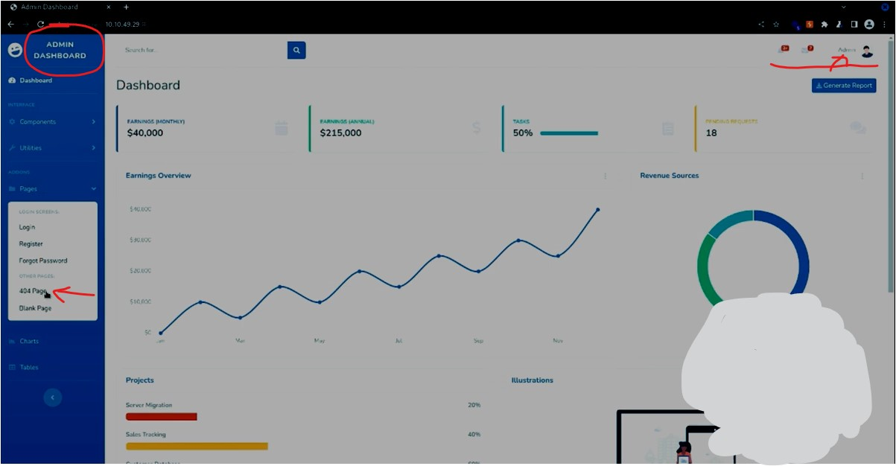
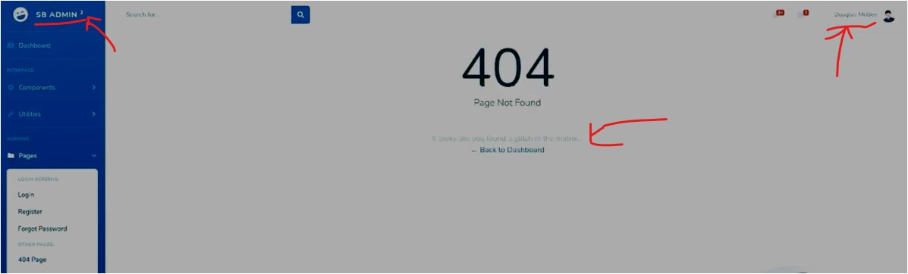

#WAPT-notes

---
### what we'll learn
> Lecture Name : Crack Zip File Password in Kali Linux | Fcrackzip
> 1) how to crack the zip file password via `fcrackzip` using BruteForce , directory methods
> 2) how to recover the zip file password
> 3) 

### Overview
- [How to Crack ZIP File Password Using Kali Linux? - YT](https://www.youtube.com/watch?v=1FfTQaFs6Hw&ab_channel=EthicalSharmaji) - but this lecture contain very simpler solution
- `fcrackzip` - is a utility for crack password protected zip files with brute force or dictionary based attacks ✔️

---

- Problem statement : is that happen with u , where u put very important documents , files , images , etc  
	& u want that thing must be password protected & u put the password via Zip feature & u forgot that password ✔️

### 1. Cracking Zip file password via fcrackzip with dictionary method
- STEP 1: make a txt file (which contain `MYSQL password is ethicalsharmaji`) & save it as secret.txt
- STEP 2: right click on the file -> 7-zip -> add to archive , keep the password as `admin` & 7zip is using `ZipCrypto` encryption method
- STEP 3: in terminal, run `apt-get install fcrackzip` command to install fcrackzip
- few commands in fcrackzip ✔️
	- `-v , --verbose` : mode tells how much passwords are cracked & which one are in progress
	- `-b, --brute-force` : let's say u know the string (like how much length of the password is , then u can use different combinations)
	- `-D, --dictionary` : 
		- mode used like when u have word list (like generally , word list used rockyou.txt) ,  
			so if u have kinda rockyou.txt file , u can use that. if u use word list for password like football , password , system , etc  
			then u can use `--dictionary` mode
		- About `rockyou wordlist` : rockyou wordlist is a password dictionary used to help to perform  
			different types of password cracking attacks. It is the collection of the most used and potential passwords.  
			Many Password cracking tools are used dictionary attack method to retrieve the password.
	- `-c , --charset characterset-specification` : in bruteForce mode , if u know that starting few first characters  
  		or length then u can use it
- STEP 4: now cracking via dictionary mode/method
	- STEP 4.1: `man fcrackzip` command to check the man page of it which tells about fcrackzip
	- STEP 4.2: run `cd desktop` & now let's crack run `fcrackzip -u -v -D -p /usr/share/wordlists/rockyou.txt /Desktop/secret.zip`
	- `-u` : means password could be multiple
	- `-v` : verbose mode , `-D` : dictionary & `-p` : means which word lists we're giving i.e rockyou.txt ✔️
	- now we'll got the password  

### 2. Cracking Zip file password via fcrackzip with bruteForce method/mode
- STEP 1: run `man fcrackzip` command & now check which commands u're gonna use
- general commands used in bruteForce mode via frackzip
	- `-b` : for brute force mode
	- `-c` : for character & we know that password is in lower case ,  
		so we'll use `a` lowercase character cuz we didn't use any uppercase , symbols ,etc
	- `-u` & `-l` for length
- STEP 2: run `cd desktop` & run `fcrackzip -u -v -b -c a -l 5 5 secret.zip` ✔️
- here `5 5` : is a length , so  

