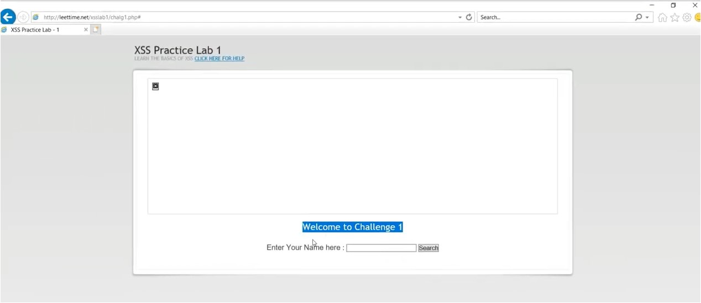
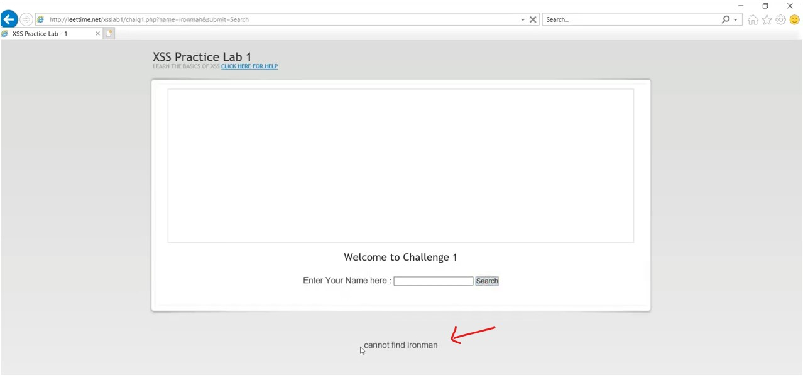
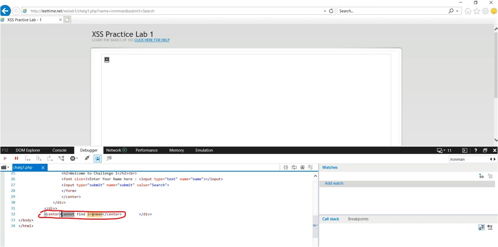

#WAPT-notes

---
### what we'll learn
> Lecture Name : Cross Site Scripting Complete Tutorial | XSS Challenges
> 1) XSS Challenge 1
> 2) XSS Challenge 2
> 3) XSS Challenge 3
> 4) XSS Challenge 4
> 5) XSS Challenge 5
> 6) XSS Challenge 6
> 7) XSS Challenge 7
> 8) XSS Challenge 8
> - Summary / Payloads of Challenges

### Overview
- most imp topic ⭐
- we'll do reflected XSS type & 8 challenges of it
- XSS reflected - generally , u can exploit this vulnerability in bug bounty but if u're doing WAPT <br>
	then u have to focus on XSS especially `XSS reflected` cuz this vulnerability comes in "OWASP TOP 10" <br>
	but this vulnerability is easy to exploit & still many applications have this vulnerability
- how to exploit this vulnerability
- if some part is already sanitized or if they put encoding on their application to secure it , so how to break/crack it

### Others 
- in bug bounty , people earn good amount of money for doing this XSS & finding these sort of issues
- websites where buy bounty done : 
	<br>1) [HackerOne](https://www.hackerone.com/)
	<br>2) [bugcrowd](https://www.bugcrowd.com/)
- Bug Bounty are those people who don't want to work in offices but it's like freelancing

---

- link for all XSS challenges : http://leettime.net/xsslab1/chalg1.php# (but it's not opening)

### 1. XSS Challenge 1
- website looks like <br>
- usecase of XSS reflected / where we can use it ✔️
	1) it can be applied on a input field
	2) or it can be applied on any parameter of a URL
- STEP 1 : this input field is for searching , so search "ironman" or anything as ur wish - to know search input field is working or not <br>-> click "search" btn , output : <br>
    - now u can see that the way we wrote the "ironman" , this webapp shows same thing
    - so first thing to remember i.e input reflecting as a output or not , <br>
		so currently , input field is showing output
- STEP 2 : to check more clearly -> right click & click "view source" OR do inspect
	- `Note ✅` : we're testing in internet explorer cuz modern browsers (like chrome) don't allow to execute XSS
	- STEP 2.1 : in output , find the tag (which contain "ironman") of the like this 
		<br>
    	<br>- so there's no encoding used - means we're getting "ironman" word as it is - the way we wrote in search input field
- STEP 3 : to exploit , in "search input field" , write the payload `<script>alert(1)</script>` <br>
	& click "search" btn , output : <br>
        <br>- so we got the `1` which means we did XSS & we'll get a alert message <br>
		i.e "Nice Try..... But use alert(document.URL) to pass this challenge!!"
    	<br>- so it's giving a hint that we try well but when we need to do `document.URL` then we can pass the challenge
    - STEP 3.1 : click "ok" btn
- STEP 4 : in "search input field" , write this payload `<script>alert(document.URL)</script>` -> & click "search" , <br>
	output : get got a "alert message" box (which has "Good Work!! You are welcome to next round") & click "ok" btn ✔️

### 2. XSS Challenge 2
- STEP 1 : the search input field , write again "ironman" -> click "search" btn
	- Now check whether any encoding or sanitize
	- output : in website , "cannot find your query" message coming <br>
		& in inspect tool , now "ironman" word coming inside "value" attribute of text "input" field 
		<br>
    	<br>- after "ironman" word , a close angle bracket i.e ">"
	- STEP 1.1 : put the "challenge 1" payload i.e `<script>alert(alert.(document.URL)</script>` <br>
		& just to check it's working or not & click "search" btn
    	- so it's not working - cuz that complete payload stored inside "value" attribute "text input field" <br>
			output : <br>
      	- in output , a close angle bracket coming at the end i.e ">" 
- `v imp Note ⭐` : 
    - in XSS , the thumb rule is here `<script>alert(alert.(document.URL)</script>>` 
    - we need to "balance" i.e whatever thing is ending with like here extra "close angle bracket" , <br>
		put that same thing at the starting also like this `><script>alert(alert.(document.URL)</script>>` <br>
		but we're getting "close angle bracket" at the end - so remove it cuz it'll automatically comes (we don't need to add manually)
- STEP 2 : so payload will be `><script>alert(alert.(document.URL)</script>`
	- inside "search input field" -> paste it -> click "search" btn , output : u came to next round

### 3. XSS Challenge 3
- STEP 1 : inside "search input field" -> write "ironman" -> click "search" btn
	- output : in website , "cannot find your query" message coming & <br>
		in inspect window , now "ironman" word coming inside double quotes <br>
		(in "value" attribute of "text input field") with a closing angle bracket i.e ">"
		<br>
	- for checking purpose , <br>
		put that same "challenge 1" payload to check which thing is getting sanitize & what's the output coming <br>
		& this payload will be our based line payload
	- STEP 1.1 : in "search input field" -> `<script>alert(alert.(document.URL)</script>` put it --> click "search" btn, <br>
  		so we'll get the payload as it is inside double quotes
		<br>
- so we need to balance the thing
- STEP 2 : so payload will be `"><script>alert(alert.(document.URL)</script>">` <br>
	but at the end , we're getting 2 things extra <br>
	i.e a double quotes & "close angle bracket" - so remove them cuz those will come automatically at the end, <br>
	so ultimately `"><script>alert(alert.(document.URL)</script>`
- STEP 3 : inside "search input field" -> put this payload -> click "search" btn

### 4. XSS Challenge 4
- STEP 1 : inside "search input field" -> write "ironman" -> click "search" btn
	- output : "cannot find your query" message showing & "ironman" word coming inside single quotes <br>
		(in "value" attribute of text "input" field) with closing angle bracket
	- STEP 1.1 : so for testing purpose in order to know what's happening behind the scene, <br>
		use that base line payload of Challenge 1 i.e `<script>alert(alert.(document.URL)</script>` -> click "search" btn
	- we're getting output inside value attribute with single quotes & a close angle bracket
- STEP 2 : so to balance the payload , remove the 2 things from the end i.e single quote & close angle bracket
- STEP 3 : so payload will be `'><script>alert(alert.(document.URL)</script>`

### 5. XSS Challenge 5
- STEP 1 : inside "search input field" -> write "ironman" -> click "search" btn
	- output : "cannot find your query" message showing & "ironman" word coming inside double quotes of a variable i.e
		<br>
	- STEP 1.1 : so in order to understand & for testing purpose , we'll use that base line payload of Challenge 1 i.e <br>
		inside "search input field" -> write `<script>alert(alert.(document.URL)</script>` -> click "search" btn
	- we're getting the payload inside double quotes , semi colon & script tag
- so to balance the payload , here at the end , 3 things extra i.e a (double quote , semi colon & script tag) 
	<br>
- STEP 2 : so payload will be `";</script><script>alert(alert.(document.URL)</script>`

### 6. XSS Challenge 6
- STEP 1 : inside "search input field" -> write "ironman" -> click "search" btn
	- output : "cannot find your query" message showing <br>
		& "ironman" word coming inside single quotes of a variable same as Challenge 5
	- STEP 1.1 : we'll check via our base line payload i.e `<script>alert(alert.(document.URL)</script>` , <br>
		so put it inside the input field -> click "search" btn , same output coming as in Challenge 5 but in single quotes
- STEP 2 : so ultimately payload is `';</script><script>alert(document.URL)</script>` & <br>
	remove these 3 things from the end i.e `';</script>`
- STEP 3 : paste the payload -> click "search" btn

### 7. XSS Challenge 7 `imp ⭐`
- STEP 1 : inside "search input field" -> write "ironman" -> click "search" btn
	- output : "cannot find your query" message showing <br>
		& "ironman" word coming inside single quotes value of "value` attribute of input field
	- STEP 1.1 : in order to make sure , we'll check via our base line payload i.e <br>
		`<script>alert(alert.(document.URL)</script>` , so put it inside the input field -> click "search" btn , 
		<br>output : the payload inside single quotes 
		<br>
	- here to balance the payload , we're getting 2 things extra at the end i.e <br>
		a single quote is coming before a closing angle bracket of the ending script tag & <br>
		a close angle bracket of a starting `script` tag is missing ✔️
	- so here sanitized done like this 
		<br>
	- STEP 1.2 : for a 2nd test , let's put the double closing arrow bracket like this <br>
		`<script>>alert(document.URL)</script>` inside the input field cuz it might remove 1st one <br>
		but 2nd one will remain as it is , cuz mostly happens -> click "search" btn , output :
		<br>
	- so it remove 2 of them closing angle brackets
- so in these cases , close angle bracket is sanitized (means escaping - means even if u give the parameter <br>
	i.e close angle bracket , it's escaping - means it won't take it) aka character escaping <br>
	which is also a remediation of XSS ✔️
	- Conclusion : doesn't matter how much we define ">" (even for 10 times) - it'll be escaped
- STEP 2 : so we can try payloads which doesn't require close-angle-bracket & greater-than-symbol i.e <br>
	`onmouseover=alert(document.URL)` -> click "search" btn <br>
	output : `'onmouseover=alert(document.URL)'>` <br>
	remove those 2 extra things coming at the end i.e a single quote & close angle bracket
- STEP 3 : so the payload is `'>onmouseover=alert(document.URL)` goes inside input field -> click "search" btn , output : 
	<br>
	<br>- here before `onmouseover` , it took a string , the payload is not closed cuz we're getting in red & <br>
		if we want to balance the payload then we need to put a single quote before `alert` word
- STEP 4 : ultimately the payload is `'>onmouseover='alert(document.URL)` -> click "search" btn -> now hover on "search" btn <br>
	output : challenge is completed
- `Tip💡` : that's why we're running base line payload to check what's happening ✔️
```
Conclusion : STEPS 

STEP 1 : <script>alert(alert.(document.URL)</script> -> output : '<scriptalert(alert.(document.URL)</script>'>

STEP 2 : <script>>alert(document.URL)</script> -> output : '<scriptalert(alert.(document.URL)</script>'>

STEP 3 : onmouseover=alert(document.URL) -> output : 'onmouseover=alert(document.URL)'>

STEP 4 : '>onmouseover=alert(document.URL) -> output : ''onmouseover=alert(document.URL)'>

STEP 5 : '>onmouseover='alert(document.URL) -> output : done
```

### 8. XSS Challenge 8 `imp ⭐`
- STEP 1 : inside "search input field" -> write "ironman" -> click "search" btn
	- output : "cannot find your query" message showing <br>
		& "ironman" word coming inside single quotes value of "value" attribute of input field
	- STEP 1.1 : in order to make sure , we'll check via our base line payload i.e <br>
		`<script>alert(alert.(document.URL)</script>` , so put it inside "search input field" -> click "search" btn <br>
		output : <br>
	- so here greater-&-less-than-symbols is shown as HTML entities , so here encoding used , <br>
		so in this cases where these kind of encoding happens then use `onmouseover` payload <br>
		cuz this payload doesn't contain greater-&-less-than-symbols ✔️
- STEP 2 : so `onmouseover=alert(document.URL)` -> click "search" btn , output :
	<br>
	- STEP 2.1 : so to balance the payload , we need to use same trick i.e put the greater-than-symbol <br>
		after the starting single quote & a single quote before the `alert` like this `'>onmouseover='alert(document.URL)` , <br>
		& if u do mouse hover on `search` button then nothing happens . output :
		<br>
	- so the way we're doing XSS , that way is not possible
	- so we have 2nd way also to do XSS
- STEP 3 : 2nd way to do XSS
	- STEP 3.1 : on URL address bar , u'll see `submit=search` & search button also has search text , <br>
		so on address bar , remove `search` word & write "ironman" & press enter , <br>
		output : u'll get "ironman" text on the search button also like this 
		<br>
	- which means that's reflecting means , whatever u write on that address bar , it'll reflect on the `search` button also
	- STEP 3.2 : "ironman" word of button is coming inside `value` attribute with double quotes i.e
		<br>
	- so payload will be `ironman"onmouseover="alert(document.URL)` , to balance the payload , <br>
		we put a double quote before `alert` & we want "ironman" as a text on button , so behind the scene <br>
		that payload will look like `<input type="submit" name="submit" value="ironman" onmouseover="alert(document.URL)">` ✔️
- STEP 4 : so paste this payload on URL address bar after `submit=` i.e `ironman"onmouseover="alert(document.URL)` & <br>
	hit enter & now we'll get a pop i.e "Internet Explorer has modified this page to help prevent XSS" cuz 
	- we're before this way , we're trying all the things inside input field , so at that time , the browser was not preventing ✔️
	- but the moment , we run a query on `submit=` (aka submit parameter) URL address bar & it gets executed <br>
		but the browser prevented that ✔️
- so challenge is completed but the browser is stopping
```
Conclusion : STEPS 

STEP 1 : <script>alert(alert.(document.URL)</script> -> output : '&alt;script&gt;alert(document.URL)&alt;/script&gt;'>

STEP 2 : onmouseover=alert(document.URL) -> output : 'onmouseover=alert(document.URL)'>

STEP 3 : '>onmouseover='alert(document.URL) -> output : '&gt;onmouseover=alert(document.URL)&gt;'>

STEP 4 : <input type="submit" name="submit" value="ironman" onmouseover="alert(document.URL)"> -> output : done
```

### summary / Payloads of challenges
- Challenge 1 : `<script>alert(alert.(document.URL)</script>`
- Challenge 2 : `><script>alert(alert.(document.URL)</script>`
- Challenge 3 : `"><script>alert(alert.(document.URL)</script>`
- Challenge 4 : `'><script>alert(alert.(document.URL)</script>`
- Challenge 5 : `";</script><script>alert(alert.(document.URL)</script>`
- Challenge 6 : `';</script><script>alert(document.URL)</script>`
- Challenge 7 : `'>onmouseover='alert(document.URL)`
- Challenge 8 : on browser URL address bar , apply the payload after "submit" parameter i.e `ironman"onmouseover="alert(document.URL)` 

---
### End of the lecture (Doubts)
- Types of XSS attack : https://www.perplexity.ai/search/Types-of-XSS-SUP6Le2DQueKOTgPhUqrlQ
- for more [What is Reflected XSS attack in Hindi? Practical Demo](https://www.youtube.com/watch?v=nXxj6JgFxzw&ab_channel=EthicalSharmaji)
