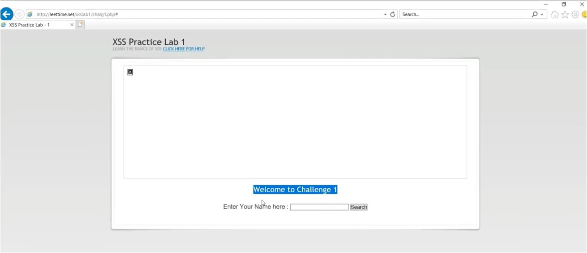
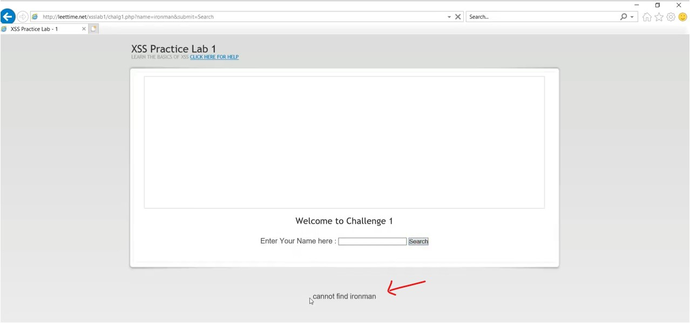
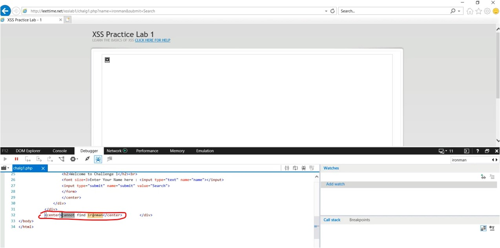
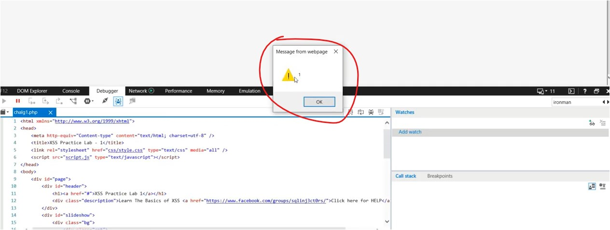
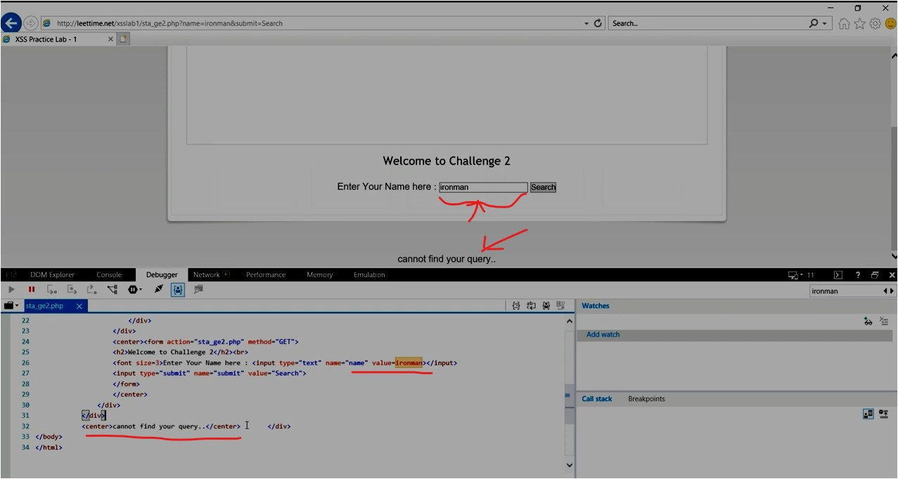

#WAPT-notes

---
### what we'll learn
> Lecture Name : What is CSRF Attack ? Practical Demo?
> 1) what's CSRF
> 2) CSRF Practical Demo on DVWA application (vulnerable app)
> 3) Prevention/Remediation of it
> 4) Summary - CSRF Practical Demo

### Overview
- Cross-Site Request Forgery aka CSRF

---

### 1. What's CSRF attack
- u can understand any attack , just look at it's name
- it comes under OWASP Top 10 attacks 
- reference : [Cross Site Request Forgery (CSRF) | OWASP Foundation](https://owasp.org/www-community/attacks/csrf)
- understanding CSRF
	- in CSRF , the `cross-site` word means the end user & he/she is using an application <br>
		& the request is not coming from that application which he/she is using , <br>
		means that request (is coming from an attacker) wants the user to make/follow unextend behavior/actions ✔️
	- Eg : Let's say you're in xyz website (it's social media webapp) & u're already authenticated/logged-in <br>
		then attacker wants to make u to execute unwanted actions <br>
		like changing password via forging that request (`forgery` : means fake request ) aka CSRF ✔️ 
- Define : CSRF is an attack that forces an end user to execute unwanted actions <br>
	on a web application in which they’re currently authenticated ✔️
- this attack is not used for data theft , it's for to change the data or change the state <br>
	like a attacker take advantage of those users who are authenticated in a application <br>
	such as u're transferring money from someone to yours banking application , <br>
	then attacker can change the bank A/C number & he/she will transfer those amount in his/her own bank A/C ✔️
- it's severity/damage is very critical & high ✔️
- To avoid/prevent it
	- we use Token , so that attacker not able to know cuz the token require special validate/update , <br>
		in order to protect/save/defend from this attack
	- we can use POST method also to prevent it 
- XSS & CRSF are both different attacks 

### 2. CSRF Practical Demo on DVWA application (vulnerable app)
- OSBoxses - is a virtual machine
- STEP 1: open Ubuntu OS & `ctrl + alt + T` to open terminal
- STEP 2: command run `sudo -i` : means to come in root user directory
- STEP 3: command run `docker ps --all` : in order to check is any container running or not
- STEP 4: so no container running right now , so to run the container of DVWA , <br>
	command run `docker run --rm -it -p 80:80 vulnerables/web-dvwa` 
    - & hit enter & we'll get output <br>
- STEP 5: in firefox , write URL `localhost:80` & hit enter , u'll get DVWA login page & default both username & password is `admin`
- STEP 6: after login , scroll down & click on `create/Reset database` button & then scroll down & click on `Login` button
- STEP 7: now login credentials are : username is `admin`  & password is `password` , so we logged-in 
- STEP 8: now let's do CSRF attack , 
	- so click on `CSRF` menu i.e <br>
	- STEP 8.1: it's a page where we can change the password , so for testing purpose , write `ethical` as a password <br>
		& click on `change` button & click on `logout` button
	- STEP 8.2: now username as `admin` & password is `ethical` & click `login` button
	- so password is `ethical`
- STEP 9: so click on `CSRF` menu tab & copy the URL i.e `localhost/vulnerabilities/csrf/`
	- STEP 9.1: open the terminal & run command `gedit`
	- STEP 9.2: paste the URL in notepad & save it on Home as `notes.txt`
	- STEP 9.3: now we need `form` code of this webpage `localhost/vulnerabilities/csrf/` , <br>
		so right click on the webpage & click `view page source`
	- STEP 9.4: copy the `form` code as it is like this <br>
	- STEP 9.5: open terminal & run command `gedit` & paste the code & do some changes inside the `form` code like this
    	```html
    	<form action="http://localhost/vulnerabilities/csrf" method="GET">
    		<p>Click here to change your password </p>
    		<input type="hidden" AUTOCOMPLETE="off" name="password_new" 
    			value="hacked">
    		<input type="hidden" AUTOCOMPLETE="off" name="password_conf" 
    			value="hacked">
    		<input type="submit" value="Change" name="Change">
    	</form>
    	```
		- understanding password update code
			- `value="hacked"` : means value for "password" & "password confirmation" is `hacked` , <br>
				in order to update or change the password ✔️
			- URL value of `action` attribute : is to cross the request & send the user on this URL website <br>
				which contain password update ✔️
		- so this is our goal as a attacker to send the user on that URL
	- STEP 9.6: save the file in Home as `csrf_poc.html`
- STEP 10: run command `ls` in terminal & run command to open firefox i.e firefox `csrf_poc.html`
	- & hit enter , output : <br>
- now let's say there is a end user & he/she is using "dvwa" & he/she got the different link <br>
	to change the password (like attacker send the link to that end user via social engineering attack <br>
	OR via inserted image OR via Ads & u clicked on it) ✔️
- as a attacker can write "click the below button to get 1M euro or dollars" ✔️
- STEP 11: once u clicked on that `change` button , now password is changed now , 
	- so output <br>
- means once that end user clicked on that `change` button then the attacker kept that password <br>
	which he/she (attacker) wants & u as a end user don't know what's the password ✔️
- so click on `logout` tab & try to login this credentials i.e username `admin` & password `ethical` & login will failed
- so password is `hacked` 

### 3. Summary - CSRF Practical Demo
- so the end user intended action was not to change the password but to login on that website
- but the attacker take a advantage for that end user (when that end user was logged-in with his/her credentials <br>
	on that website - means authenticated) & the attacker send the link (which could be Ads , image , etc)
- & once that end user clicked on that & the password has been changed into that password <br>
  	which was created/made by the attacker
- Eg : let's say this website as banking application & on that application CSRF attack might be possible <br>
	& u're authenticated on it then the attacker can take the advantage of it & then the attacker might do fraud things like stealing , etc

