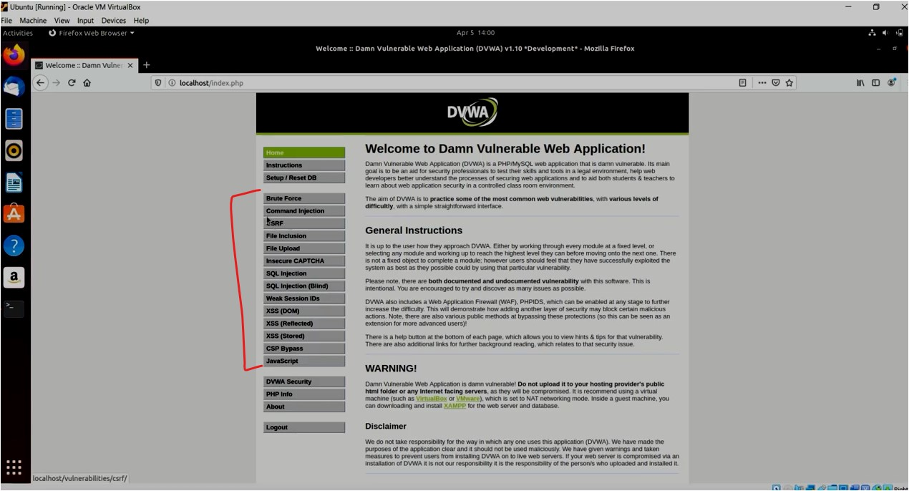

#WAPT-notes

---
### what we'll learn
> Lecture Name : How To Setup Damn Vulnerable Web Application(DVWA) In Ubuntu Using Docker
> 1) how to setup Damn Vulnerable Web App
> 2) what is Docker & why it's useful for an application

---

### 1. Steps - to setup Damn vulnerable Web App in Ubuntu
- we'll setup in Ubuntu & u can also setup it on kali Linux also but we want to setup in Ubuntu  
	cuz to separate the attacker machine & victim machine
- STEP 1: on google -> search `ubuntu ova` -> click `osboxes.org` url to download Ubuntu Virtual Machine
- STEP 2: scroll down -> download `virtualBox` format of latest version of ubuntu 
- STEP 3: download & install oracle VM (virtualBox manager)
- STEP 4: in oracle VM -> click "file" tab -> select `import appliance` option & import  
  	that ubuntu virtual machine -> run ubuntu & username + password both is `osboxes.org`
- STEP 5: in Ubuntu -> run commands
	- `Note` : in terminal , no commands will run cuz "osboxes@osboxes" won't give route permission ,  
	- STEP 5.0 : so run command `sudo -i` -> write the password i.e `osboxes.org` , output : now in terminal , we're on root directory
	- STEP 5.1: install docker `apt-get install docker.io` 
	- Q : Define Docker ✔️ 
		Ans : Docker is used to make the task easy so that application can be deploy , create , configure , etc  
    	becomes easier for developers . So it's a tool & inside of it , there are containers.  
    	Containers are like packages where all the important configurations are made in order  
    	to run an application like webservers , etc. So an application is published as a container on Docker
	- STEP 5.2: run `systemctl enable docker`  
		don't run `sudo systemctl enable docker` cuz we don't need `sudo` command - mean we're already in root directory 
    	- so this command used to enable the docker & `systemctl` used to enable the services ✔️
	- STEP 5.3: `sudo systemctl docker start` OR if u're already in root directory then run `systemctl docker start`
	- STEP 5.4: run `docker run --rm -it -p 80:80 vulnerables/web-dvwa` 
		  about the command : this command used to run the container , so we're taking the container of dvwa  
		& name of the container is `vulnerables/web-dvwa`
	- Q : Why Docker is useful ✔️ 
		Ans : cuz it makes the process easier otherwise to host an application take too much time  
    	cuz firstly "damn vulnerable application" needs to setup/configure in apache , etc.. configuration requires  
		& we can follow the same steps to setup an application
- STEP 6: in firefox , write `localhost/setup.php` & dvwa webpage comes , so scroll down & click on `create / reset databases`
- STEP 7: now login page will come , so it's a Damn Vulnerable WebApp , 
	- so username is `admin` & password is `password` & click `login` , output : 
		 
	- u can practice these attacks & u can setup dvwa security from "low" to "impossible" according to that , dvwa configure itself

### Summary
- STEP 1 : `apt-get install docker.io`
- STEP 2 : `sudo systemctl enable docker` OR `systemctl enable docker`
- STEP 3 : `sudo systemctl docker start` OR `systemctl docker start`
- STEP 4 : `docker run --rm -it -p 80:80 vulnerables/web-dvwa`
- STEP 5 : open localhost/setup.php on browser
- STEP 6 : click on `create/reset databases`
- STEP 7 : login using username - `admin` & password - `password`
- STEP 8 : u can do any attackers which are on dvwa like `http://xyz/vulnerabilities/sqli/`

