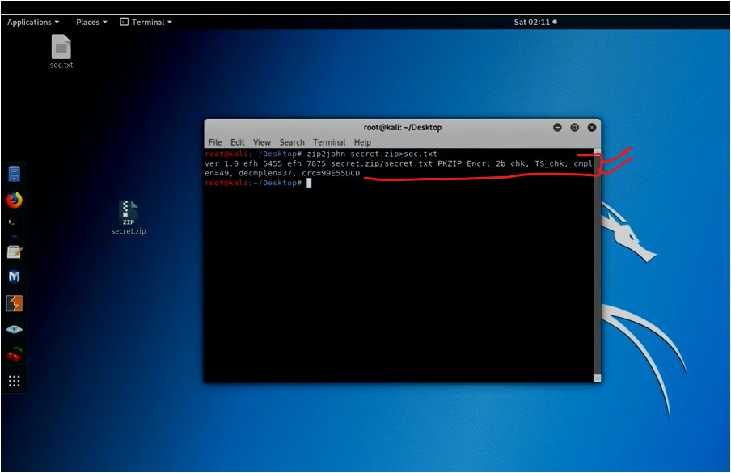
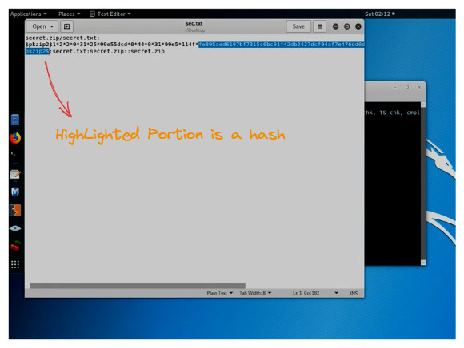
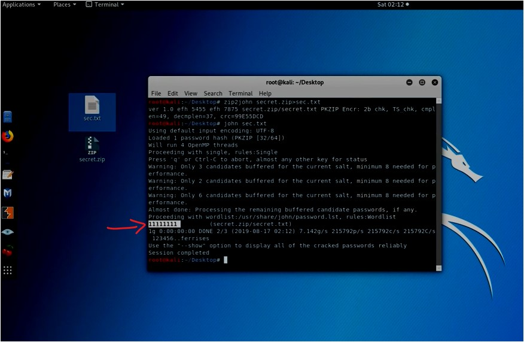

#WAPT-notes

---
### what we'll learn
> Lecture Name : How to Crack ZIP File Password Using Kali Linux?
> 1) Practical Work : how to crack password of ZIP file via "john the ripper" password cracker tool

### Overview
- `zip2John` is a utility of "John the ripper" tool

### Other Resources
- what's Hash Value ? reference :  
	[Hash Value || All About Hash Values - YouTube](https://www.youtube.com/watch?v=ZNw7Kv76nAw&ab_channel=MastersInEthicalHacking) ✔️
- Password Storage Tier List :  
	[Password Storage Tier List: encryption, hashing, salting, bcrypt, and beyond - YouTube](https://www.youtube.com/watch?v=qgpsIBLvrGY&ab_channel=StudyingWithAlex)

---

### 1. Practical Work : Steps to crack zip file password in kali Linux via "john the ripper"
- STEP 1: in WinOS -> open "oracle VM" -> right click on kali linux 2019 vbox -> start -> normal start
- in Kali Linux , there are tons of tools like wireshark (for network monitoring) ,  
	pre-installed burp Suite Community Edition , all important tools  
	from 1st phase (i.e enumeration , foot-printing) til last phase (i.e for penetration testing), etc
- STEP 2: in terminal -> run `pwd` to check directory path -> run `cd desktop/`
- STEP 3: run `nano secret.txt` (nano is a text editor)
	- STEP 3.1: write password `Password:My name is ethical sharmaji` -> save it
	- STEP 3.2: `zip --password 11111111 secret.zip secret.txt`
		- means `zip` means zip the file , `secret.zip secret.txt` means make a zip file & embedded the "secret.txt" file in it ✔️
	- STEP 3.3: & delete the secret.txt file from desktop
- STEP 4: now if u open the secret.zip file -> open the secret.txt file then it'll ask for password &  
	if u write a different password then it'll show an error popup
- STEP 5: run `clear` to clear the terminal 
    - `zip2john` : used to generate the hash value of secret.zip file ✔️
	- STEP 5.1: run `zip2john secret.zip>sec.txt` ,  
		output : got the hash value like this 
		 
		 
	- STEP 5.2: now sec.txt is a hash file -> run `john sec.txt`  
		   
		output : got the password

---
### End of the lecture (Doubts)
- `Tip` : if you know how to attack then only u can know how to defend ✔️
