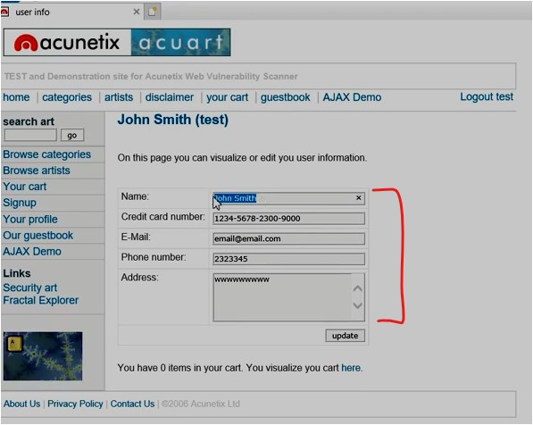

#WAPT-notes

---
### what we'll learn
> Lecture Name : What is Stored XSS attack in Hindi? Practical Demo?
> 1) define stored XSS attack
> 2) what it does OR when it comes
> 3) practical - how it stores data

### Overview
- About stored XSS attack + practical on a lab website

### Other Resources
- [What is Reflected XSS attack in Hindi? Practical Demo - YouTube](https://www.youtube.com/watch?v=nXxj6JgFxzw&ab_channel=EthicalSharmaji)
- [[HINDI] DOM XSS attack | The Concept - YouTube](https://www.youtube.com/watch?v=biMtIOR8UAI&ab_channel=BittenTech)

---

### 1. what is Stored XSS (Cross-site scripting)
- Stored XSS is the most dangerous type of XSS. 
- Web Apps that allow users to have data are potentially exposed to this type of attack

### 2. what it does OR When it comes
- stored XSS occurs when a web app gathers input from a user which might be malicious,  
    and then stores that input in a data store for later use
- means in stored XSS , WebApps which gather/store input data from user for later use ,  
    those data can be vulnerable in later stage for this attack & then stores data in a data store & for later use too

### 3. Practical - Stored XSS
- STEP 1 : open internet explorer (cuz in it, we can execute types of XSS attacks) -> open `http://demo.testfire.net`
- STEP 2 : inside the webapp -> click feedback menu tab -> "your name" input field is vulnerable
	- STEP 2.1 : inside "your name:" input field -> write ``
	- STEP 2.2 : & in other fields -> write any thing random -> click "submit" btn
	- output : got a alert popup
- STEP 3 : but in `stored XSS` , it stores data/js code for later use , so to demonstrate this line ,  
	use this website `testphp.vulnweb.com/` -> click "signup" menu tab
	- STEP 3.1 : login via username `test` & password `test` ,  
		output : input fields will get already filled with data like this  
		
	- STEP 3.2 : in "name" input field -> write `` -> click "update" btn ,  
		output : alert popup will come & `123` data also stored 
	- to check that `123` data -> click "logout test"
	- STEP 3.3 : now if anyone goes/try to visit this website right now only `http://testphp.vulnweb.com/` ,  
		click "signup" btn -> login with same credentials -> click "login" btn ,  
		output : `123` alert popup will come always only right now after login again & again ✔️
    - Eg : if u login again then in `Name` input field , u'll see a different thing cuz many beginners using this website for login
- means Stored XSS attack stored that script
- STEP 4 : login again -> in "name" input field , write a random text -> then click "update" -> click "logout" ,  
	for just to keep yourself in safer side ✔️

