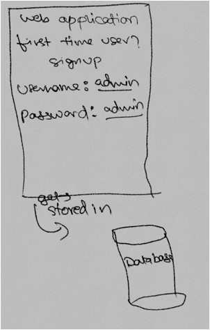
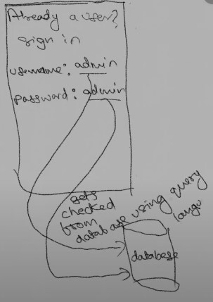
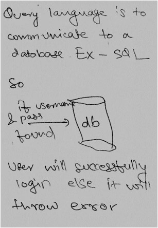
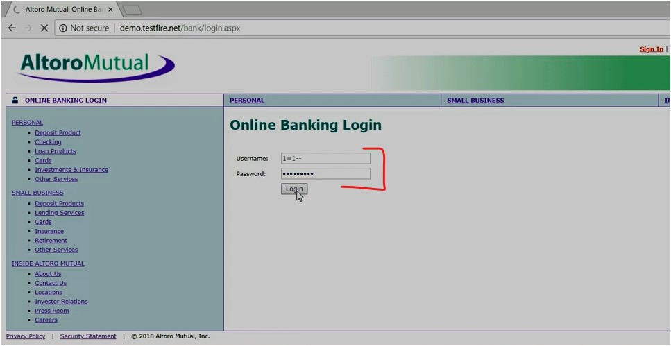
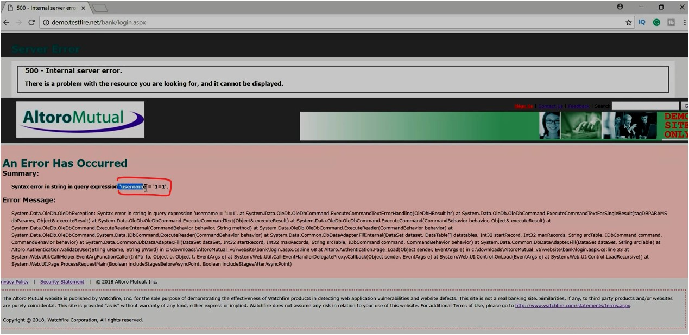
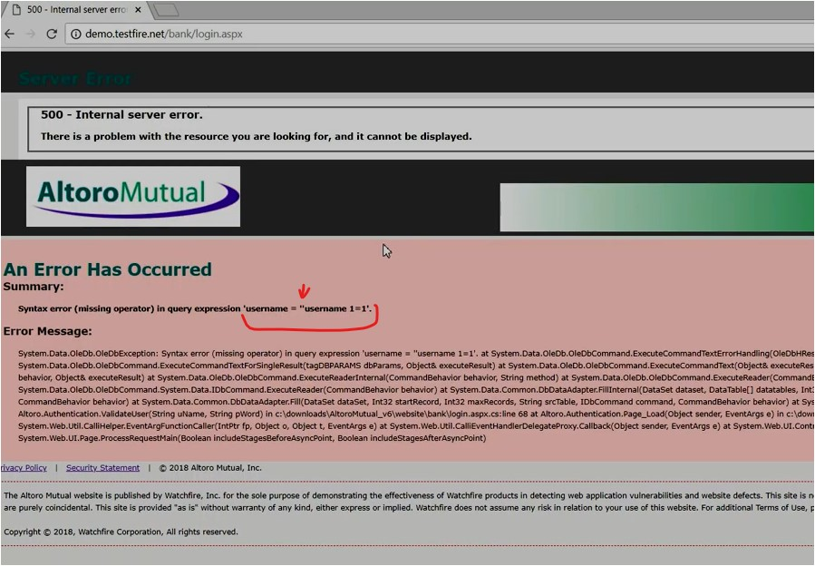
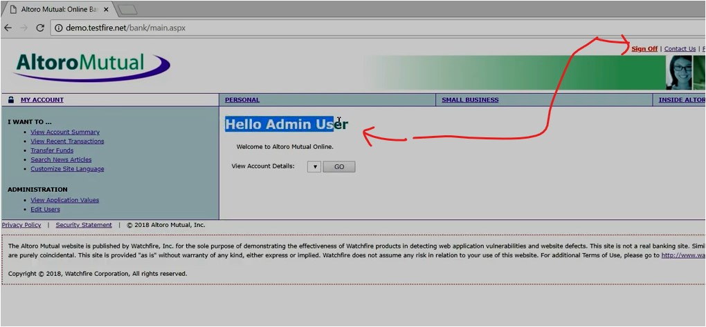

#WAPT-notes

---
### what we'll learn
> Lecture Name : Sql injection attack in hindi? Practical Demo
> 1) about SQLi
> 2) How auth page (i.e login page) works for (a new user & existing user)
> 3) Practical Demo

---

### 1. About SQLi
- it refers to an injection attack wherein an attacker execute malicious SQL statements (aka malicious payload)  
  	that control a web app's database server (aka generally RDMS)
- & since an SQL injection vulnerability could possibly affect any website/webapp that use an SQL-based database ,  
	this vulnerability/issue is one of the oldest & most dangerous of webapp vulnerabilities
- via an SQL injection vulnerability , an attacker can use it to bypass a web app's authentication &  
	authorization mechanisms (means if a attacker doesn't have username & password of the user then still that attacker can login)  
	& retrieve/fetch the contents of an entire database.
- SQL injection can also be used to add, modify & delete records in a database & affect data integrity

### 2. How auth page (i.e login page) works for (a new user & existing user)
- let's consider the webapp/website i.e http://demo.testfire.net
- Situation 1 : authentication page if u're a new user
	- if u're a 1st time user & for "signup" , we have fields i.e username & password & once filling those details ,  
		those details will get stored in database (that database could be SQL or NoSQL based).
	- Diagram of explanation  
- Situation 2 : login page if u already a user 
	- once u fill the "login page" then those details will check i.e are those details exists in the database or not using a SQL language ,  
		Diagram Explanation 
		 
		  
	- Q : Define "Query language" ✔️  
		Ans : used to communicate to a database for different operations like add, delete records , etc
	- so if those details exists in the database then the user logged-in otherwise throw error
	- "true" boolean value comes when details exists (of the user) in the database ,  
		so as a hacker , if we do something like database always return true value like 1=1 (1 always equal to 1) , 2=2 & so on.  
		so if we use these in the SQL statement then we'll able to login ✔️

### 3. Practical Demo - SQL injection attack
- STEP 1: in `http://demo.testfire.net` -> click "sign in" menu tab ,  
	output : login page opened (which contain 2 fields i.e username & password)
- STEP 2: so in "username" input field , so we'll choose/write a username or a SQL statement which always go to the database  
	& the database always return true value.  
	so in "username" input field -> write `1=1--` & in "password input field" -> write any random password 
	- Q : why we put double hyphen after `1=1`  
		Ans : which means we can put any random password in "password input field"
		so password value will not be checked in database cuz behind the scene , password value will get commented,  
		so ultimately 
		 
    - output : got an error i.e `'username = '1=1'`  
- STEP 3: for testing purpose , let's write something else to check whether we're getting same error or a different error,  
	so in "username" input field -> write `ethical sharmaji--` (we again put double hyphen to comment the password ✔️)  
	& in password input field , write any random -> click "login"
	- output : so again same error coming
- so we need to give that format as same as we're getting error
- STEP 4: in "username" input field -> write `'username 1=1--` & in password input field , write any random -> click "login" ,  
	output : we're getting in double initial single quote  
	- means we need to give something else instead of `username`
	- STEP 2.3: in "username" input field as `' or 1=1--`  
		(means either a empty space or 1=1 , anyone of them is true then we'll get true)  
		& in password input field , write any random -> click login , output : we'll logged-in 
		 
    	 - so as a Admin user , we logged-in via SQL injection attack , think about banking website

