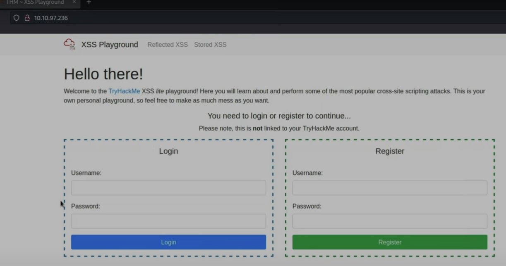

#WAPT-notes

---
### what we'll learn
> Lecture Name : [Hindi] Cross-Site Scripting(XSS) | Deface website | Owasp Top 10
> 1) what's XSS
> 2) Types of it
> 3) XSS Payloads
> 4) Practical Work : How to deface a website via XSS

### Overview
- we'll see how to deface the website/webapp via XSS (if that webapp/website has XSS vulnerabilities)

### Reference
- Task 20 [Severity 7] | https://tryhackme.com/r/room/owasptop10

---

### 1. what's XSS
- in Cross Site Scripting (XSS) , "Scripting" word is coming - means in a webapp , anywhere "input" field is coming  
    where a user can write/type (means a input can come from a user)
- Eg of Input Field : searchBox , CommentBox , etc 
    - so if any input field is not validated/sanitized properly (eg : in Covid , we sanitize our body to germs , viruses , etc)
    - so same way , when a malicious JS scripts (like in alertBox input field , let's say u're writing a script to print "hacked"  
        & got a output "hacked" popup - like we did in Lecture 17 XSS Challenge 1)  
    - so when we give a input i.e a JS script - inside any "input" box & if that JS script going as it is  
        & no sanitization happening (means left bracket ">" , right bracket "<" of script tag - so these symbols also going as it is)  
        & that JS script is executing - then this attack aka XSS
    - means that input field is not properly validated/sanitize/encoded/ & no (whitelisting & blacklisting)  
        means nothing done to protect the input field 
        Q : then in this situation , what will happen ✔️ 
        Ans : in that input field , when a user giving a input - then as it is output is coming aka XSS

### 2. Types of it
- 3 types of it 
     1) Stored XSS
     2) Reflected XSS
     3) DOM-Based XSS
- in Stored XSS : 
    - Eg : we have a Name input field & we gave input i.e `` (instead of writing ur own name)  
        so that JS script/payload get stored in the server
    - Now in that webapp , after login - there's a page where it shows the name of the user  
        so earlier , we wrote the JS payload instead of writing the name + there's no validation/sanitization in that input field  
        so due to this , that JS payload will be stored inside the website's database
    - so whenever that page comes (which shows the name of the user) ,  
        so that JS payload will come (instead of showing the name of the user) & executed
    - so once this JS payload executed - then this payload will execute again & again (whenever the user - login & comes on that page)
    - so this attack is vv dangerous
- in Reflected XSS : 
    - Eg : a searchBox input , so whenever u search something - then u'll get results related to that searched stuff
    - Now u're a attacker , so u'll put a JS payload on that search input field - let's say ``  
        Q : Now in this is situation , what'll happen ✔️ 
        Ans : if that "search input field" is not sanitize properly + no protection mechanism , due to this , that JS payload will be executed
- in DOM-Based XSS : 
    - Eg : at home , we have a water sink , so we open the tap-water & water goes directly inside sink  
        so tap-water is a source (means from where water is running) & sink is a sink (means where water is going) ✔️
    - these 2 stuff sometimes vulnerable (like eval() function in js ,  
        document.location is not sanitize - due to this as it is any input can be given) - due to this ,  
        that stuff becomes attacker controlled - means whenever we (as a attacker) send a payload to the sink - then it could be XSS
    - Q : why we say this attack as DOM-based ✔️ 
        Ans : cuz it's Document Object Model - means it's a representation of HTML elements of HTML page  
        means HTML page is like tree-structure (eg : 1st root i.e html tag & so on..)  
        so a attacker manipulate that structure aka DOM-based XSS

### 3. XSS Payloads
- some common payloads based on types of XSS
1. Popup's (``) - Creates a Hello World message popup on a users browser.
2. Writing HTML (`document.write`) - Override the website's HTML to add ur own (essentially defacing the entire page).
3. XSS Keylogger (http://www.xss-payloads.com/payloads/scripts/simplekeylogger.js.html)
   - u can log all keystrokes of a user, capturing their password & other sensitive information they type into the webpage.
   - Q : via XSS , u can make keylogger ✔️ 
        Ans : if that input field is not sanitize properly & no protection mechanism - then we can use "simplekeylogger.js.html" payload  
        due to this payload , we can log all keystrokes of a user
    - log : means what are they keys clicked by a user
4. Port scanning (http://www.xss-payloads.com/payloads/scripts/portscanapi.js.html) 
    - A mini local port scanner (more information on this is covered in the TryHackMe XSS room).
    - on this link , we'll get port scanner
- Extra Resource : http://www.xss-payloads.com/ - is a best websites that has XSS related payloads ✔️

### 4. Practical Work : How to deface a website via XSS
- STEP 1 : connect to openvpn , run `openvpn EthicalSharmaji.ovpn`
- STEP 2 : in tryhackme -> Task 20 -> click "Star machine" -> copy the IP-address i.e 10.10.97.236
- STEP 3 : in firefox -> paste & open the IP-address , output : login page & Register page  
    
- STEP 4 : click "Reflected XSS" menu , we'll get 2 Ques
    - Ques 
         1) Craft a reflected XSS payload that will cause a popup saying "Hello"
         2) Craft a reflected XSS payload that will cause a popup with your machines IP address
    - STEP 4.0 : in search bar -> write xyz , output : we'll get `xyz` as it is
    - STEP 4.1 : in search bar -> write batman , output : u'll get `batman` as it is
    - so in search input bar , no validation implemented cuz we're getting results as same as we searched  
        so to test whether there's validation applied or not - we'll make a JS payload
    - STEP 4.2 : finding answer of Q1 of Reflected XSS
        - STEP 4.2.0 : in search bar -> write `` -> hit enter  
            output : alert popup shown with "Hello" message
        - STEP 4.2.1 : in popup -> click ok , output : ThereIsMoreToXssThanYouThink - answer of Q1 of Reflected XSS
        - STEP 4.2.2 : in tryhackme -> paste `ThereIsMoreToXssThanYouThink` answer in Q2
    - STEP 4.3 : finding answer of Q2 of Reflected XSS
        - Q2 of Reflected XSS - means show the name of the IP-Address in alert popup
        - STEP 4.3.0 : in search bar -> write `` -> click "search" btn or hit enter  
            output : IP-address i.e 10.10.97.236 in alert popup
        - STEP 4.3.1 : in alert popup -> click ok , output : ReflectiveXss4TheWin - answer of Q2 of Reflected XSS
    - STEP 4.4 : click "Why does this work?" toggle  
        Ans : in reflected Xss ur payload - once u giving ur input as same we're getting output & no sanitization/encoding happening
         - `<h6>You Searched for: [Your input will be input directly in here]</h6>` : means whatever u give input  
            that input will come as it is as a output
    - STEP 4.5 : click "Disable your browsers XSS protection" toggle  
        Ans : some browsers have in-built XSS protection
         - if these XSS payloads are not working in ur browser , then u can disable the XSS protection from that browser
- STEP 5 : click "Stored XSS" menu , we'll get 3 Ques
    - Ques
         1) Add a comment and see if you can insert some of your own HTML.
         2) Create an alert popup box appear on the page with your document cookies.
         3) Change "XS Playground to "I am a hacker” by adding a comment and using Javascript.
    - STEP 5.1 : in "register" form -> fill username & password as "test" -> click "don't save"
    - STEP 5.2 : finding answer of Q1 of Stored XSS
        - STEP 5.2.1 : in comment box -> write `<h1><b>Ethical Sharmaji</b></h1>` , output : it's coming as heading + in bold
            - which means the html is working , if the html wasn't working - then we'll get the html code in string form
            - answer is HTML_T4gs
        - STEP 5.2.2 : in tryhackme -> in Task 20 module -> paste the answer in Q3
    - STEP 5.3 : finding answer of Q2 of Stored XSS
        - Q : what we need to do  
            Ans : in firefox -> in 10.10.97.236/stored website -> press "ctrl + shift + i" -> storage tab ->  
                Cookies section -> click http://10.10.97.236 -> we need to show connect.sid cookie as a alert popup
        - STEP 5.3.1 : in comment box -> write `` -> hit enter ,  
            output : sessionId cookie got printed in alert popup
        - STEP 5.3.2 : click ok -> W3LL_DON3_LVL2 (is a flag) -> click ok
        - STEP 5.3.3 : in tryhackme -> in Task 20 module -> paste the answer in Q4 -> paste the flag
    - STEP 5.4 : finding answer of Q2 of Stored XSS
        - Q : what we need to do  
            Ans : the website name coming as "XSS playground" , so change it to "I am a hacker"  
            - means deface this webapp , Eg : change "XSS playground" to "I am a hacker"  
                same way we can deface this webapp completely via XSS ✔️
        - STEP 5.4.1 : open inspect tool -> select that element , output : `XSS Playground`
        - STEP 5.4.2 : close inspect tool -> in comment box ->  
            write a JS payload `` ,  
            output : got the answer i.e websites_can_be_easily_defaced_with_XSS
        - STEP 5.4.3 : in tryhackme -> in Task 20 module -> paste the answer in Q4 -> paste the answer

### Conclusion
- we'll see how to deface the website/webapp via XSS by using HTML (if that webapp/website has XSS vulnerabilities)
- we saw reflected XSS , stored XSS (means how to store a payload completely in the database of the website)
- Done the Ques of TASK 20 module of TryHackMe

