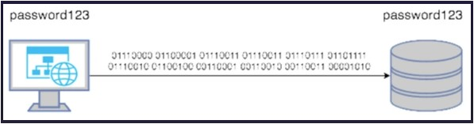
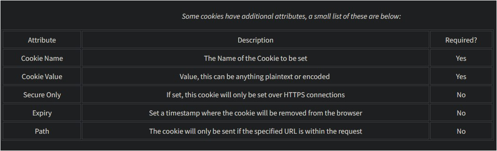
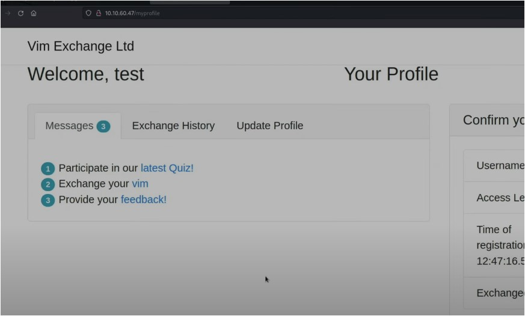
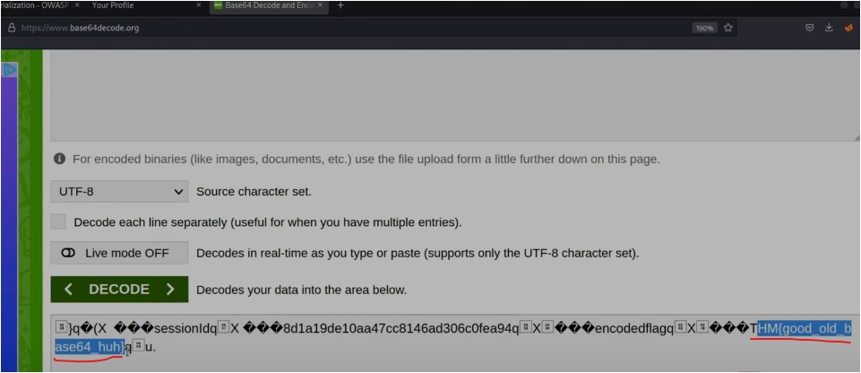
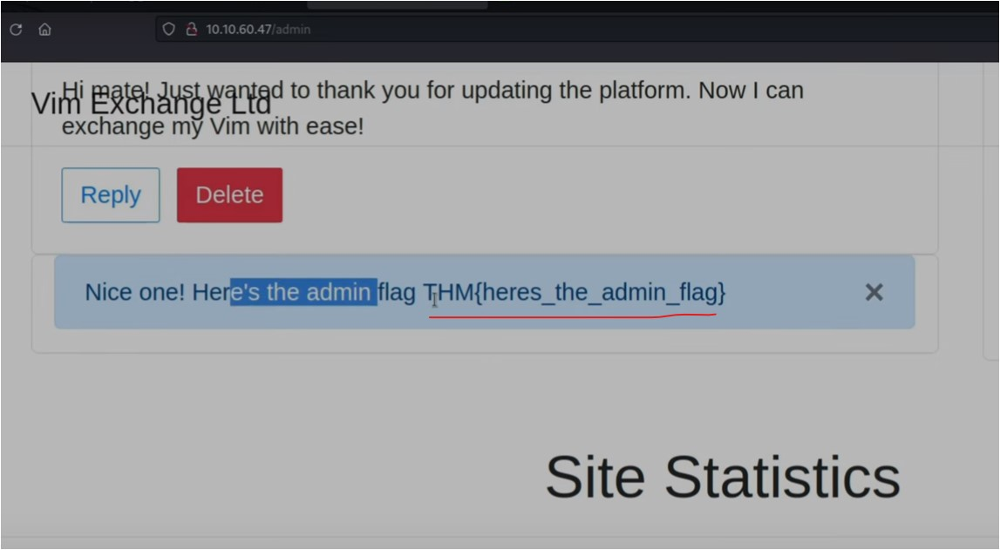
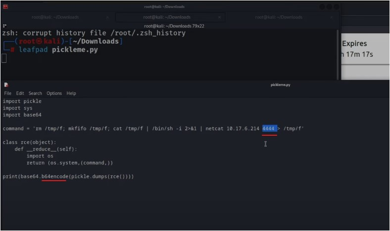
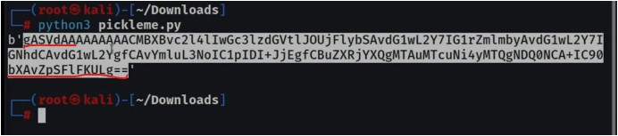
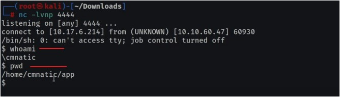
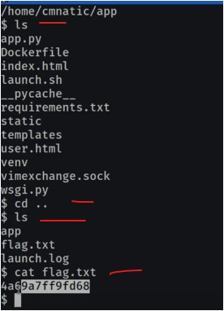

#WAPT-notes

---
### what we'll learn
> Lecture Name : [Hindi] Insecure Deserialization | Practical Demo | RCE | Owasp Top 10
> 1) what's Insecure Deserialization
> 2) reasons why this vulnerability comes 8 out of 10 in OWASP
> 3) what's Vulnerable
> 4) Ques
> 5) what's Objects
> 6) Ques
> 7) what's De(Serialization)
> 8) Ques
> 9) Cookies
> 10) Ques
> 11) Cookies Practical
> 12) Practical Work : Code Execution or remote code execution & take shell via Insecure Deserialization

### Overview

### Reference
- https://tryhackme.com/r/room/owasptop10
    - Task 21 [Severity 8] Insecure Deserialization 
    - Task 22 [Severity 8] Insecure Deserialization - Objects
    - Task 23 [Severity 8] Insecure Deserialization - Deserialization
    - Task 24 [Severity 8] Insecure Deserialization - Cookies
    - Task 25 [Severity 8] Insecure Deserialization - Cookies Practical
    - Task 26 [Severity 8] Insecure Deserialization - Code Execution

---

### 1. what's Insecure Deserialization
- Serialization vs Deserialization
    - reference to understand Serialization vs Deserialization :  
        https://cheatsheetseries.owasp.org/cheatsheets/Deserialization_Cheat_Sheet.html
    - Advice : we need to understand "Serialization" in order to understand "Deserialization"
    - Serialization vs Deserialization ✔️
         - is a process where converting any object into a data format , so that data can be restored later
         - Eg : let's say a particular object & u're converting that object into XML format  
            & Deserialization means converting that XML data format into that same object form
    - Conclusion : Serialization vs Deserialization
        - Serialization : means a process where converting any object into a particular data format (like XML or JSON)
        - Deserialization : means a process where converting that data format into original object form
- Q : when Deserialization becomes Insecure ✔️
    - Ans : when converting/going from one data form (like JSON) to object  
        so if u're validating this process via insecure way aka insecure Deserialization
    - when we're doing Deserialization - so during the process of Deserialization , when the data process (of an app) happen  
        then if a attacker replace that data via malicious code - then the attacker can do any attacks (like DoS , RCE , gain a shell etc)

### 2. reasons why this vulnerability comes 8 out of 10 in OWASP
- Q : reasons why this vulnerability comes 8 out of 10 in OWASP
     Ans : 
     1) Low Exploitability : cuz for This vulnerability , there is no reliable tool/framework for it.  
        cuz of its nature, attackers need to have a good understanding of the inner-workings of the ToE.
     2) The exploit is only as dangerous as the attacker's skill permits + it's impact of Severity is more

### 3. what's Vulnerable
- ultimately, any app that stores or fetches data where there are no validations/integrity-checks in place for the data queried or retained.
- A few examples of applications of this nature are:
     1) E-Commerce Sites
     2) Forums
     3) API's
     4) Application Runtimes (Tomcat, Jenkins, Jboss, etc)

### 4. Ques
- Q 1 : Who developed the Tomcat application?  
    Ans : The Apache Software Foundation
- Q 2 : What type of attack that crashes services can be performed with insecure deserialization?  
    Ans : Denial of Service  
    - "service crash" : means those services won't be available after they got crashes

### 5. What's Objects
- in Programming , in OOP , Objects are made of 2 things 
     1) State
     2) Behaviour
- Eg : a lamp is a object.
     Lamps can have of different types of bulbs = their state
     either their're ON/OFF = their behaviour

### 6. Ques
- Q 1 : if a dog was sleeping , would this be :
     A) A state
     B) A Behaviour
     Ans : A Behaviour
    - Conclusion : 
         - types of dogs = state
         - actions = Behaviour

### 7. what's De(Serialization)
- Eg of Serialization vs De(Serialization) :
    - A Tourist approaches you & he's street asking for street directions cuz he got lost & he's looking for a local landmark &  
        he didn't understand English + nor u can't understand his language (let's say Spanish)  
        Q : what do u do ?  
        Ans : u'll draw a map of the route to the landmark (i.e he wants to go) cuz Pictures cross language barriers  
        then he'll be able to find the landmark  
    - Q : from this situation , what did u understood ?  
        Ans : when u serialized some info 
        - means u don't understand his language + he don't know ur language  
            so u converted the language from one form to another to make him understand  
            via gestures + pictures (cuz it's also another form of language)
        - then that tourist try to understand the drawing (i.e made by u) reach the landmark - means  
            he did De(Serialization) it to find the landmarks
- Serialization : is the process of converting objects into simpler & compatible formatting (like JSON , etc)
- Eg of Serialization vs De(Serialization) :
    - pic : 
    - password is password123 (which going to be store in a database)  
        so travel across a network this string/output needs to be converted to binary notation
    - once the password reaches to the database  
        then the password is converted/deserialized back into "password123" - so it can be stored
- Q : how can we leverage this ? OR how we can take advantage of it ✔️
    - Ans : insecure deserialization happens when data comes/taken from an untrusted party (i.e a hacker) then we execute it
    - Eg : u have a data & u converted into base64 (cuz assume that data accept Base64 only)  
        then hacker got to know that (we're using Base64 & whatever data in Base64 will get execute)  
        Q : what hacker will do  
        Ans : the hacker will put a payload during the process & when the app do deserialize - then the hacker will get Shell
    - we'll see in Practical

### 8. Ques
- Q 1 : What is the name of the base-2 formatting that data is sent across a network as ?  
    Ans : binary  
    Q : base-2 means  
    Ans : here 2 means binary = 0 or 1

### 9. Cookies
- purpose of Cookies in browser : 
    - used to maintain the state of sessionID
    - Tiny pieces of data, these are created by a website and stored on the user's computer.
    - Eg : if u're login again & again in a webapp - then cookies maintain the login state until u don't logout
- Cookies additional attributes/Flags
    - Pic :  
    - "Cookie Name" & "Cookie Value" is a imp attribute which is required in Cookie
    - Q : purpose of "Secure Only" attribute ✔️  
        Ans : it'll set only for HTTPS connections - otherwise it'll not set for other protocols (like HTTP , etc)
    - Q : define "Expiry" attribute ✔️ 
        Ans : it tells when (means time) the cookie will be removed from the browser
    - Q: purpose of "Path" attribute ✔️ 
        Ans : the cookie will only be sent to the server - if when the specified URL is mentioned
- Cookies can be set via different website programming lang

### 10. Ques
- Q 1 : If a cookie had the path of webapp.com/login , what would the URL that the user has to visit be?  
    Ans : webapp.com/login
    - u have to set the same URL - only then cookie will be sent
- Q 2 : What is the acronym for the web technology that Secure cookies work over?  
    Ans : https

### 11. Cookies Practical
- STEP 1 : connect to openvpn , run `openvpn EthicalSharmaji.ovpn`
- STEP 2 : in tryhackme -> Task 21 module -> click "Star machine" -> copy the IP-address i.e 10.10.60.47
- STEP 3 : in tryhackme -> Task 25 module , output : we already connected to the VPN
- STEP 4 : in tryhackme -> in Task 25 module
    - Q 1) 1st Flag (cookie value) ✔️
        - means we need to find out 1st flag & to find it out - we need to do changes in "userType"
        - STEP 4.1 : in firefox -> open 10.10.60.47 -> click "Exchange today" , output : SignUp will get open
        - STEP 4.2 : write username & password as "test" -> click "don't save" , output :  
            
        - STEP 4.3 : in this webapp -> open inspect tool -> storage tab -> Cookies section -> select the URL
        - u will see that there are cookies are both plaintext encoded and base64 encoded.  
            The first flag will be found in one of these cookies.
        - STEP 4.4 : copy the value of sessionId -> in new tab of firefox -> open https://www.base64decode.org  
            -> paste the value -> click "decode" , output : got the flag  
            
        - Ans : so 1st Flag = THM{good_old_base64_huh}
    - Q 2) 2nd Flag (admin dashboard)
        - Q : what we need to do to find 2nd Flag  
            Ans : Double left-click the "value" column of "userType" to modify the contents.  
            let's change our userType to "admin" and navigate to **http://MACHINE_IP/admin** to answer the second flag
        - STEP 4.5 : same as STEP 4.3 -> change "userType" into "admin" -> then in firefox URL address bar ->  
            change 10.10.60.47/myprofile into 10.10.60.47/admin -> hit enter -> scroll down , output : got the flag  
            
        - Ans : THM{heres_the_admin_flag}

### 12. Practical Work : Code Execution or remote code execution & take shell via Insecure Deserialization
- STEP 0 : connect to openvpn , run `openvpn EthicalSharmaji.ovpn`
- STEP 1 : in tryhackme -> open "Task 26 [Severity 8] Insecure Deserialization - Code Execution"
- STEP 2 : in firefox -> go to 10.10.60.47 -> open inspect tool -> storage -> cookies -> click IP
    - output : there's a encoded payload i.e value of encoded & that payload is base64
    - if we put a different type of payload (which can spawn ur system's shell) = eg of Insecure Deserialization  
        due to this , we can do RCS
- STEP 3 : in "Task 26 [Severity 8] Insecure Deserialization - Code Execution" -> click to download "pickleme.py" file
- STEP 4 : run `leafpad pickleme.py` to open -> paste the VPN IP-address over the place where IP-address mentioned
    - Q : how to check the IP-address got after turning ON VPN ✔️ 
        Ans : run `ifconfig tun0` , output : u got the tryhackme IP after connecting to the VPN
- understanding code / what we're gonna do
    - Pic :  
    - importing libraries i.e pickle , sys , base64 & once all these libraries got imported  
        then that command : means it'll open the shell on 4444 portno. on that IP-address (i.e of our system)  
        & that complete process will be encoded via base64
    - & once we got that encoded value  
        then we'll store that value inside "encoded" payload cookie then hit enter then refresh the page
- STEP 5 : save the file -> run `python3 pickleme.py` , output : got the payload
- STEP 6 : copy the payload that much  
    
    - STEP 6.1 : in firefox -> go to 10.10.60.47 -> open inspect tool -> storage -> cookies -> click IP  
        -> remove the value of "encoded" & paste the payload as value of "encoded" -> hit enter
    - STEP 6.2 : before executing that payload , open the shell - means listener , run `nc -lvnp 4444`  
        Q : why we're running listener ✔️ 
        Ans : cuz when we execute the payload - then we need to have a listener - so that shell can be spawn  
        if we don't open the listener on that portno. (which we mentioned in the file) then listener won't work
    - STEP 6.3 : reload the page of that website ,  
        output : in terminal , shell got spawn. Now RCS can be done  
        
- Ques
    - STEP 7 : in "Task 26 [Severity 8] Insecure Deserialization - Code Execution" module , we need to find "flag.txt"
    - STEP 8 : in terminal , run `cd ..` -> `ls` , output : got the flag.txt
    - STEP 9 : run `cat flag.txt` , output : got the flag  
        
    - STEP 10 : past the flag in Q

---
### End of the Lecture (Doubts)
- Advice for learning : Learning is the best done through analogies ✔️

