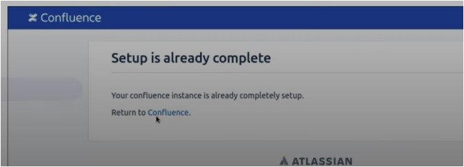
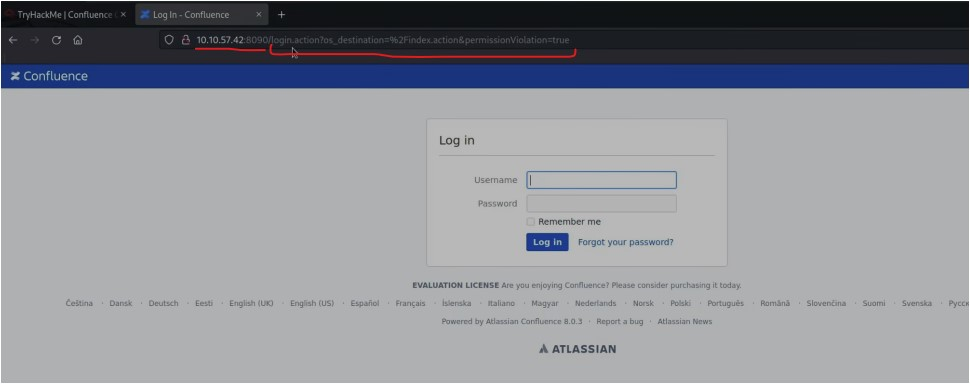
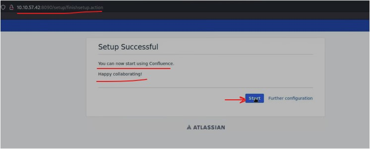

#WAPT-notes

---
### what we'll learn
> Lecture Name : [hindi] Do not miss this CRITICAL vulnerability!
> 1) Intro of the vulnerability
> 2) understanding the vulnerability
> 3) Practical Work : "Broken Access Control" vulnerability
> 4) 

### Overview
- ATLASSIAN is a product-based company & it's some softwares are popular like Jira , Confluence  
    so a vulnerability found in "Confluence" software which is generated as Advisory i.e 4th October  
    due to this we got to know , it has "Broken Access Control" vulnerability via which any person can register as admin account  
    & that person can set the password
- we'll see about the vulnerability + how it's possible + in this big company , how this vulnerability founded  
    + we'll understand attacker's mindset 

### Reference
- https://tryhackme.com/r/room/confluence
    - Task 1 Intro
    - Task 2 Understanding the Vulnerability
    - Task 3 Automating Exploitation
    - Task 4 Detection and Patching
    - Task 5 Conclusion

---

### 1. Intro of the vulnerability
- On October 4th, 2023, Atlassian released a security advisory regarding CVE-2023-22515,  
    Q : for which vulnerability Atlassian released a security advisory ✔️  
    Ans : i.e a broken access control vulnerability & it's CVSS score of 10 (which means max score - means most critical vulnerability)
- this vulnerability was introduced in version 8.0.0 of Confluence Server & Data Center editions
- it's present in versions <8.8.3, <8.4.3, <8.5.2 . According to Atlassian, the vulnerability has already been exploited in the wild.
- Advice : if a person who's using this software of around this versions  
    then check in ur organization + ur security teams must know about it

### 2. understanding the vulnerability
- when u run "Confluence" for the 1st time - then u need to do the initial setup (like configure some basic parameters &  
    create an administrative account)
    - once that initial setup done then u'll get this page  
    - but we got the vulnerability due to which admin login page comes instead of that page (which is in pic 0) like this  
        
    - after just putting the URL i.e "10.10.57.42:8090" - then that vulnerability redirect u to that URL i.e login.action (which is in pic 1)  
        & in URL , os_destination is a parameter
- CVE-2023-22515
    - This vulnerability allows an attacker to reenable the initial setup process.  
        so, the attacker can go through the step of creating a new administrator all
    - this's all possible cuz Confluence is built using the Apache Struts framework (which depends on the XWork package)
    - means whenever u write "http://10.10.57.42:8090/" then it'll redirect to the "http://10.10.57.42:8090/login.action"  
        Q : why it doest that  
        Ans : cuz "action" method always gets invoked through its URL (which u wrote)
    - so this comes in working of "Apache Struts framework" - which call Getters/Setters methods
- Q : what's the problem here ✔️
    - http://10.10.57.42:8090/setup/setupadninistrator-start.action is a page - which is saying to setup the administrator's account
    - STEP 1 : in firefox -> paste the URL , output :  
    - so generally , we need always the same output of STEP 1 , but the output is coming via using "Apache Struts framework"  
        so that's why , we can control Getters/Setters
    - Q : how we can control Getters/Setters ✔️ 
        Ans : via id parameter
    - Q : as a hacker , what we'll do ✔️ 
        Ans : we'll craft/create a URL
    - Q : how we'll craft a URL ✔️ 
        Ans : like this http://10.10.57.42:8090/server-info.action?bootstrapStatusProvider.applicationConfig.setupComplete=false
        - means Q : what action we need ✔️ 
            Ans : we need action from the server
        - bootstrapStatusProvider.applicationConfig.setupComplete : means the variable which set as true  
            due to which we're able to find whether that account already setup/created or not - we set it as false
        - means like "Apache Struts framework" redirect to login.action same way actions get called  
            Eg : the moment u called this page i.e http://10.10.57.42:8090/setup/setupadministrator-start.action  
            then it checks whether this account already setup or not , so this account already setup that's why  
            we got the page i.e "your Confluence instance is already completely setup"
        - Q : how it's able to check whether the account is already setup or not ✔️ 
            Ans : cuz earlier it was set as true i.e server-info.action?bootstrapStatusProvider.applicationConfig.setupComplete=true
        - now understand the attacker's mindset
             - attacker tries to understand the logic like "1stly the attacker understand how logic is running"
             Q : how the attacker able to know whether the admin account is setup or not ✔️ 
                Ans : so the attacker set it as false - then the attacker start watching "what's gonna happen"
        - so if u're able to understand the attacker's mindset then u can become the better

### 3. Practical Work : "Broken Access Control" vulnerability
- STEP 1 : in https://tryhackme.com/r/room/confluence -> in Task 1 intro -> click "start machine" -> copy the IP address i.e 10.10.57.42
- STEP 2 : in terminal -> run `openvpn EthicalSharmaji.ovpn`
- STEP 3 : in firefox -> in new tab -> paste the URL of admin account & set it as false i.e  
    http://10.10.57.42:8090/server-info.action?bootstrapStatusProvider.applicationConfig.setupComplete=false ,  
    output : Success page - which means it's set as false
- STEP 4 : in firefox -> in new tab -> paste the URL of admin account i.e http://10.10.57.42:8090/setup/setupadministrator-start.action  
    output : got the Configure account of system administrator  
    Q : why we got page of Configure system admin account ✔️ 
    Ans : cuz it was set as false that's why we (as a attacker) can create a "system admin account" again
    - i.e aka Broken Access Control
    - Q : why it's considered as Broken Access Control ✔️  
        Ans : cuz they already setup the Access Control , How ✔️  
        Ans : just setting as true i.e bootstrapStatusProvider.applicationConfig.setupComplete=true  
        but any user can set it as false - which means it's broken , so it's not working properly
- STEP 5 : fill the form completely -> click Next , output :  
    - STEP 5.1 : click start ,  
        output : got the URL as `http://10.10.57.42:8090/dashboard.action#all-updates` 
         - so it's showing dashboard.action & admin acc. is created
         - now we're a part of admin & we can also see posts  
         - got the flag i.e THM(who_needs_keys_anyway)
- Ques
    - Q 1 : Log into Confluence with ur new credentials. What is the value of the flag posted by admin?  
        Ans : THM(who_needs_keys_anyway)

### 4. Automating Exploitation
- Q : can we automate those above steps of Practical Work
- there's a script to make the process automate i.e Chocapikk i.e https://github.com/Chocapikk/CVE-2023-22515
- STEP 1 : go to https://github.com/Chocapikk/CVE-2023-22515 -> open exploit.py
